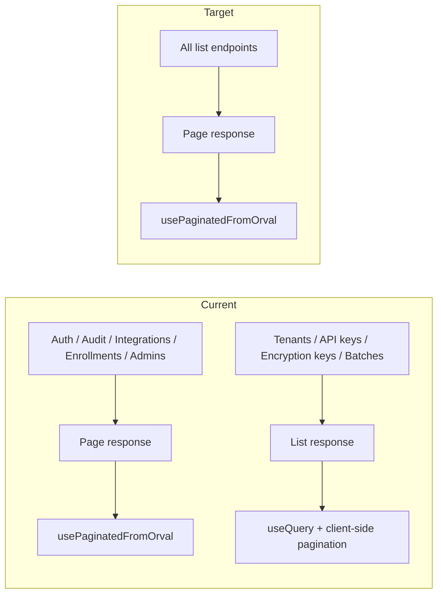

# Admin API Pagination Uniformity — Analysis and Plan

## Current state (summary)

**Backend (Admin API):**

| Endpoint / resource                 | Response type                     | UI pattern                          |
| ----------------------------------- | --------------------------------- | ----------------------------------- |
| Auth attempts search                | `Page<AuthAttemptDto>`            | Server-side (usePaginatedFromOrval) |
| Audit logs                          | `Page<AuditLogResponseDto>`       | Server-side                         |
| Integrations search                 | `Page<IntegrationResponseDto>`    | Server-side                         |
| Enrollments search                  | `Page<EnrollmentResponseDto>`     | Server-side                         |
| Admins list                         | `Page<AdminResponseDto>`          | Server-side                         |
| **Tenants list**                    | `List<TenantResponseDto>`         | Client-side filter + pagination     |
| **API keys** (all / by integration) | `List<ApiKeyResponseDto>`         | Client-side                         |
| **Encryption keys**                 | `List<EncryptionKeyResponse>`     | Client-side                         |
| **Re-encryption batches**           | `List<ReencryptionBatchResponse>` | Client-side                         |

**UI impact:** Pages using `List` APIs ([tenants.tsx](ezkey-admin-ui/src/pages/tenants.tsx), [api-keys.tsx](ezkey-admin-ui/src/pages/api-keys.tsx), [encryption-keys.tsx](ezkey-admin-ui/src/pages/encryption-keys.tsx)) implement client-side filtering, client-side sort simulation (tenants have `sortKey` but sort is applied in-memory after fetch), and client-side pagination. This creates a different UX and code pattern than auth-attempts, audit-logs, integrations, enrollments, and admins.

---

## Industry and similar projects

**1. Admin / directory APIs often mandate pagination**

- **Google Admin Directory API** (users, etc.): Pagination is required; max 500 per request, `nextPageToken` for more. There is no “return all” option.
- **Shopify Admin REST API**: Paginated list endpoints with `limit` and cursor/offset; consistent structure across list resources.
- **SCAYLE Admin API**: Documents pagination as the standard for list endpoints.

**2. Standards (OData, JSON:API, Spring Data REST)**

- **OData / JSON:API**: List responses use a consistent envelope (e.g. `value` + metadata, or `data` + `links`). Pagination is a first-class concept; “small” collections are still exposed with the same shape (e.g. one page of 20).
- **Spring Data REST**: Exposes collections with `page`, `size`, `sort`; pagination is the default for collections; metadata (`totalElements`, `totalPages`, etc.) is always present.
- **Google AIP-158**: Recommends pagination for list methods with a uniform request/response contract.

**3. What is valued**

- **Uniform contract**: Same request parameters (`page`, `size`, `sort`) and same response shape (`content` + `page` metadata) for every list/search endpoint. Clients and UI can reuse one pattern (e.g. [usePaginatedFromOrval](ezkey-admin-ui/src/hooks/use-paginated-orval.ts)).
- **Future-proofing**: If tenants or API keys grow (e.g. many tenants, many keys per integration), the API does not need a breaking change; the UI already uses server-side pagination.
- **Operability**: At scale or during heavy testing, “fetch all” lists can be slow and memory-heavy; pagination caps load and improves predictability.
- **Less tech debt**: One paradigm (server-side list = always paginated) avoids maintaining two code paths in the UI (server-side vs client-side tables) and two API styles in the backend.

**4. Is mixed (some paginated, some not) accepted?**

- Mixed approaches exist in the wild, but they are usually legacy or resource-specific (e.g. “dropdown options” vs “searchable list”). For **admin console list screens** (tenants, integrations, keys, etc.), the trend in modern APIs and in the projects cited above is **consistent pagination** for list endpoints.
- A clear rule (“in EZKey, every list/search API is paginated”) is easier to document, generate (OpenAPI → Orval), and consume than a per-resource exception list.

**5. Overhead and “small data”**

- Pagination adds a few query params and a wrapper (`content` + `page`). For small result sets, the backend still returns e.g. one page of 20 items and `totalElements: 5`; the extra bytes are negligible.
- The cost is mainly one-time: implementing pagination on the few endpoints that today return `List`. After that, the API and UI are simpler and uniform.

**Conclusion (judgment):** Uniform pagination for all Admin list/search APIs is **reasonable, aligned with common practice, and reduces long-term complexity**. It is not over-engineering; it removes accidental complexity (two paradigms) and avoids future breaking changes if datasets grow.

---

## Recommendation

**Adopt the rule:** In the Admin API, every endpoint that returns a **list** or **search result** is paginated (same contract: `page`, `size`, `sort`, response `Page<T>` with `content` + `page` metadata). No “return full list” for tenants, API keys, encryption keys, or re-encryption batches.

**Benefits:**

- Single UX: server-side sort and pagination everywhere; optional server-side filters where useful.
- Single UI pattern: all list screens use `usePaginatedFromOrval` + `DataTable` + `Pagination`.
- OpenAPI/Orval: one response type for list endpoints; no special-casing “list vs page”.
- Docs and onboarding: one sentence — “list endpoints are paginated” — instead of per-resource rules.
- EZKey is still in development; changing these endpoints now is cheaper than after production.

**If we keep the status quo:** Document clearly which endpoints are paginated and which return full lists; accept that the UI will keep two patterns (server-side vs client-side) and that, if tenants/keys grow, we may need breaking changes later. This is acceptable only if we explicitly value “no change” higher than uniformity and future-proofing.

---

## Implementation plan (if we go 100% paginated)

Phased approach: **backend first** (add pagination and optional filters), then **UI realignment** (switch list screens to `usePaginatedFromOrval` and remove client-side pagination/filtering). OpenAPI spec is regenerated after backend changes (maintainer runs update-specs after clean Docker start; no manual spec edits).

### Phase 1 — Backend: paginate list endpoints

**1.1 Tenants**

- **Controller:** [TenantController](ezkey-admin-api/src/main/java/org/ezkey/admin/controller/TenantController.java) — add `GET /api/v1/tenants` with `Pageable` (and optional filters e.g. `tenantName`, `active` if desired). Return `ResponseEntity<Page<TenantResponseDto>>`.
- **Service / repository:** Use `TenantRepository` (already `JpaRepository<Tenant, Integer>`). Add a `Specification<Tenant>` for optional name/active filter, then `findAll(spec, pageable)`; or simple `findAll(Pageable)` and filter in a follow-up if you prefer minimal first step.
- **Docs:** Update [ENDPOINT.md](docs/ENDPOINT.md) “List tenants” to describe `page`, `size`, `sort` and paginated response.

**1.2 API keys**

- **Endpoints:**
  - `GET /api/v1/api-keys` (list all for current admin)
  - `GET /api/v1/api-keys/integration/{integrationId}` (list by integration)
- **Controller:** Accept `Pageable`; return `Page<ApiKeyResponseDto>`.
- **Service:** [ApiKeyService](ezkey-core/src/main/java/org/ezkey/integration/service/ApiKeyService.java) — add methods that take `Pageable` and use `ApiKeyRepository.findAll(Pageable)` or a spec (e.g. by tenant, by integration, active-only). Repository may need `Page<ApiKey> findByIntegration_IntegrationId(Integer integrationId, Pageable p)` (or equivalent).
- **Docs:** Update ENDPOINT.md for both API key list endpoints.

**1.3 Encryption keys and re-encryption batches**

- **Controller:** [EncryptionKeyController](ezkey-admin-api/src/main/java/org/ezkey/admin/controller/EncryptionKeyController.java) — `listKeys()` and `listBatches()` to accept `Pageable` and return `Page<...>`.
- **Repository / service:** Use existing repositories with `findAll(Pageable)` (JPA provides this). If ordering matters, use `Sort` in `Pageable`.
- **Docs:** Update ENDPOINT.md for list keys and list batches.

**1.4 Tests and spec**

- Add or adjust controller/service tests for new paginated signatures and response shape.
- Run tests, then clean Docker start and **maintainer** runs `scripts/update-specs.sh` (or `.bat`) so `specs/admin-api/openapi-spec.json` reflects the new contract. Regenerate Orval client (if applicable) so UI gets new types and list functions.

### Phase 2 — Admin UI: realign list screens

**2.1 Tenants**

- Replace `useListTenants` with a generated paginated list (e.g. `searchTenants` or `listTenants` with `page`, `size`, `sort`). Use `usePaginatedFromOrval` with the same pattern as [integrations.tsx](ezkey-admin-ui/src/pages/integrations.tsx) or [admins.tsx](ezkey-admin-ui/src/pages/admins.tsx).
- Remove client-side filtering state and `useMemo` for `filtered`; move name/status filters into `baseParams` and pass to the API if the backend supports them (Phase 1.1).
- Keep `DataTable` + `Pagination` but drive them from `pagination` and `data` from the hook (server-side sort via `sortKey` and `onSort`).

**2.2 API keys**

- Replace `listAllApiKeys` / `listApiKeys` with the new paginated API. Use `usePaginatedFromOrval`; pass `integrationId` in `baseParams` when on the integration-scoped list.
- Remove any client-side sorting/pagination; use server-side only.

**2.3 Encryption keys**

- Replace `useListKeys` and `useListBatches` with paginated list endpoints. Use `usePaginatedFromOrval` for both tables (or two hooks, one per resource).
- Remove client-side-only handling; rely on server-side pagination and sort.

**2.4 Shared**

- Ensure [DataTable](ezkey-admin-ui/src/components/data-table/data-table.tsx) and [Pagination](ezkey-admin-ui/src/components/data-table/pagination.tsx) are used consistently with the hook’s `pagination` (no local `page`/`pageSize` state for data).
- Optional: add a short note in [AGENTS.md](ezkey-admin-ui/AGENTS.md) that all list screens use server-side pagination and `usePaginatedFromOrval`.

### Phase 3 — Documentation and policy

- **ENDPOINT.md:** Add a short “Admin API list endpoints” section stating that all list/search responses are paginated (`page`, `size`, `sort`, response with `content` and `page` metadata).
- **PRD or architecture doc:** State that Admin list APIs are uniformly paginated for consistency and scalability.

---

## Alternative: keep status quo

If the decision is to **not** unify now:

- **Document** in ENDPOINT.md and AGENTS.md which Admin endpoints return `List` (tenants, API keys, encryption keys, batches) and which return `Page` (auth attempts, audit logs, integrations, enrollments, admins).
- **Accept** that the UI will keep two patterns: server-side tables (paginated APIs) and client-side tables (list APIs). As a result, sort/filter/pagination behavior and code paths will differ by screen.
- **Revisit** pagination for tenants/keys/batches if, later, dataset size or operability becomes an issue (with the understanding that adding pagination later may be a breaking change for clients that assume “full list”).

---

## Priority order (if implementing)

| Priority | Scope                                    | Rationale                                                                                                                                                   |
| -------- | ---------------------------------------- | ----------------------------------------------------------------------------------------------------------------------------------------------------------- |
| 1        | Tenants (backend + UI)                   | High visibility; tenants list already has client-side sort/filter/pagination; moving to server-side gives immediate UX consistency with other list screens. |
| 2        | API keys (backend + UI)                  | Two endpoints (all keys, by integration); used in api-keys and integration/tenant context; same uniformity benefit.                                         |
| 3        | Encryption keys + batches (backend + UI) | Lower frequency of use but same principle; completes uniformity.                                                                                            |
| 4        | Docs and policy                          | ENDPOINT.md + one-line rule; optional PRD/architecture sentence.                                                                                            |

---

## Mermaid: current vs target

---

## Summary

- **Industry / similar projects:** Admin and directory-style APIs (Google, Shopify, SCAYLE) and standards (OData, JSON:API, Spring Data REST, AIP-158) favor **consistent pagination** for list endpoints. Uniform contract reduces client and UI complexity and avoids future breaking changes.
- **Recommendation:** Treat “every Admin list/search API is paginated” as the rule. It is pragmatic, reduces accidental complexity, and aligns with EZKey’s existing paginated endpoints.
- **If adopted:** Implement in two phases (backend pagination for tenants, API keys, encryption keys, batches; then UI migration to `usePaginatedFromOrval`), with priorities as above. If not adopted, document the split and accept two UI paradigms and possible future breaking changes.

