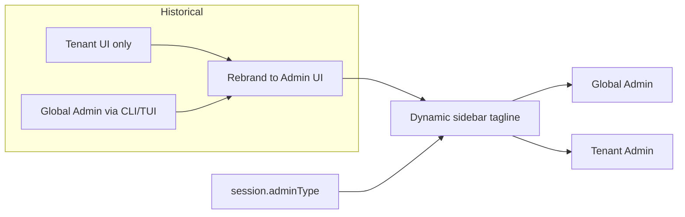

# Admin UI — Tagline and global vs tenant positioning

## Overview

Analysis of the admin UI tagline/description origin (tenant UI heritage), conceptual validation for both Global and Tenant admin contexts, and a screen-by-screen review of global vs tenant positioning. Includes one **agreed correction**: role-aware hint on the Auth attempts page.

---

## 1. Which "description" and why it was chosen

Two user-facing strings act as "descriptions" of the interface:

| Location | Key | EN value | When shown |
|----------|-----|----------|------------|
| **Sidebar** (under brand) | `layout.tagline.globalAdmin` / `tenantAdmin` / `adminConsole` | "Global Admin", "Tenant Admin", "Admin Console" | After login, based on `session.adminType` |
| **Login page** | `login.tagline` | "Passwordless · Secure · Simple" | Before auth (same for everyone) |

**Origin of the sidebar tagline**

The UI started as **tenant-only**; global admin was intended for the **CLI/TUI**. The folder was later renamed from `ezkey-tenant-ui` to `ezkey-admin-ui` and the console was unified. During rebranding, the sidebar had a **hardcoded** "Tenant Admin" tagline; it was replaced by a **dynamic** label from `session.adminType`.

**Login tagline** is product-level and role-agnostic; no change needed.

---

## 2. Conceptual validation of the sidebar tagline

Current behaviour: `getAdminTaglineKey(session?.adminType)` in [sidebar.tsx](ezkey-admin-ui/src/components/layout/sidebar.tsx). Locales in [layout.json](ezkey-admin-ui/src/locales/en/layout.json).

**Verdict**: "Global Admin" / "Tenant Admin" / "Admin Console" adequately cover both operational contexts. No change required.

---

## 3. Screen-by-screen alignment (summary)

- **Navigation**: Tenants and Encryption Keys are GLOBAL_ADMIN only; rest shared. Correct.
- **Dashboard**: Quick action "Add a tenant admin" is tenant-centric; optional refinement: neutral or role-aware description.
- **Tenants**: Global-only; copy appropriate.
- **Integrations**: Tenant column shown for all; optional: hide for Tenant Admin.
- **Enrollments, API keys**: Neutral; OK.
- **Auth attempts**: See **Action (below)** — hint must be role-aware.
- **Audit logs**: Optional: role-aware hint (similar to auth-attempts).
- **Admins**: Create dialog already dual (Global / Tenant admin); OK.
- **Encryption keys**: Global-only; OK.
- **Login**: OK.

---

## 4. Agreed action: Auth attempts hint (role-aware)

**Current string (FR)**  
"Lecture seule — vue des tentatives d'authentification dans le périmètre du tenant."

**Key**: `list.hintReadOnly` in [auth-attempts.json](ezkey-admin-ui/src/locales/en/auth-attempts.json) (EN) and [auth-attempts.json](ezkey-admin-ui/src/locales/fr/auth-attempts.json) (FR).

**Problem**: For **Tenant Admin** the text is accurate (tenant-scoped view). For **Global Admin** the view can be instance-wide or filtered by tenant, so "dans le périmètre du tenant" is incorrect and misleading.

**Correction to implement**:

1. **Locales**: Add a second key for Global Admin and keep the current one for Tenant Admin (or use a single key with a parameter). Recommended: two keys for clarity.
   - **EN** ([ezkey-admin-ui/src/locales/en/auth-attempts.json](ezkey-admin-ui/src/locales/en/auth-attempts.json)):
     - Keep `list.hintReadOnly` for Tenant Admin: "Read-only — tenant-scoped view of authentication attempts."
     - Add `list.hintReadOnlyGlobal`: "Read-only — view of authentication attempts (instance-wide or by tenant)."
   - **FR** ([ezkey-admin-ui/src/locales/fr/auth-attempts.json](ezkey-admin-ui/src/locales/fr/auth-attempts.json)):
     - Keep `list.hintReadOnly` for Tenant Admin: "Lecture seule — vue des tentatives d'authentification dans le périmètre du tenant."
     - Add `list.hintReadOnlyGlobal`: "Lecture seule — vue des tentatives d'authentification (instance ou par tenant)."

2. **Page** ([ezkey-admin-ui/src/pages/auth-attempts.tsx](ezkey-admin-ui/src/pages/auth-attempts.tsx)): Where the hint is rendered (around line 192), use `session?.adminType === 'GLOBAL_ADMIN' ? t('list.hintReadOnlyGlobal') : t('list.hintReadOnly')` (with `useAuth()` and the same `useTranslation('auth-attempts')` namespace already in use).

**Verification**: Log in as Tenant Admin → hint shows tenant-scoped wording. Log in as Global Admin → hint shows instance-wide wording.

---

## 5. Other optional refinements (not in scope for this action)

- Dashboard quick action description (neutral or role-aware).
- Integrations list: hide Tenant column for Tenant Admin.
- Audit logs: role-aware hint similar to auth-attempts.

---

## 6. Diagram — Tagline origin

