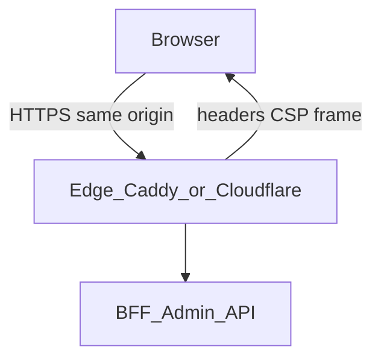

# Admin UI — token storage, transport, and HTTP hardening

## Current behavior (code)


| Area                                | Reality                                                                                                                                                                |
| ----------------------------------- | ---------------------------------------------------------------------------------------------------------------------------------------------------------------------- |
| **Admin token storage**             | `[ezkey-admin-ui/src/lib/auth.ts](ezkey-admin-ui/src/lib/auth.ts)` — key `ezkey_admin_auth`, **sessionStorage** (JSON: `token`, `username`, `adminType`, `expiresAt`). |
| **localStorage**                    | **Not** used for auth — only **i18n** language preference (`[I18N_STORAGE_KEY](ezkey-admin-ui/src/i18n.ts)`).                                                          |
| **Transport**                       | `[ezkey-admin-ui/src/lib/api-client.ts](ezkey-admin-ui/src/lib/api-client.ts)` — `Authorization: Bearer` via `fetch` / Orval mutator.                                  |
| **Auth cookies**                    | None in the frontend; Admin API issues token in **JSON** for this flow.                                                                                                |
| **Reverse proxy (UI Docker image)** | `[Caddyfile](ezkey-admin-ui/docker/Caddyfile)` — proxies `/api/`*, no security headers yet.                                                                            |


**OWASP-oriented summary**

- **sessionStorage vs localStorage**: Token is not persisted after the tab closes; better than localStorage on shared machines.
- **XSS**: sessionStorage and localStorage are **equivalent** for token theft by script. **HttpOnly** cookies reduce session theft via XSS only if deployment and cookie policy are correct.
- **CSRF**: Bearer injected by JS is not sent cross-site like a session cookie; moving to cookies raises CSRF design work (SameSite, CSRF tokens, BFF patterns).

---

## Architecture decisions (locked in)

### Multi-environment deployment

Production may place the Admin UI on **Cloudflare** (or another CDN/edge) and APIs on **AWS**, hybrid, or on-prem.

- **Distinct origins**: Admin API (and BFF) CORS must allow real UI origins; **CSP** must include `connect-src` for the API origin (and WebSockets if added later).
- **HttpOnly cookies** (if adopted): `SameSite` and cross-site behavior depend on hostname layout; a **BFF behind one browser origin** simplifies cookies and CSP.

### Iframe policy

**Decision: Ezkey Admin UI is not embedded in iframes** (unless product revisits this).

- **Technical alignment**: `Content-Security-Policy: frame-ancestors 'none'` and/or `X-Frame-Options: DENY` on UI responses (and optionally duplicated on Cloudflare).

### Reverse proxy and BFF

**Long term: always a reverse proxy between the UI and the backend (BFF / Admin API).**

- Apply security headers on the **layer that serves the UI** (Caddy, Cloudflare, ALB, etc.) consistently across environments.
- Advanced auth (cookies, CSRF) fits naturally at the **BFF** or shared TLS termination.

### Dev/prod parity (Caddy) — two intentional paths (solo / small team)

Daily development and QA do **not** need to use the same process. **That is reconciliable** and recommended to preserve velocity.

#### Path A — Solo developer: velocity (default)

- `**[ezkey-tests/clean-start.sh](ezkey-tests/clean-start.sh)`** starts **backend** services (DB, Admin API, etc.) — **no** Admin UI container required for this workflow.
- `**npm run dev`** in `[ezkey-admin-ui](ezkey-admin-ui)` — **Vite** on `http://localhost:5173` (typical), **hot module reload**, `[vite.config.ts](ezkey-admin-ui/vite.config.ts)` proxy of `/api/v1` to the API on the host (e.g. `localhost:9080`).
- **Security headers**: Vite’s dev server does **not** apply the same response headers as Caddy/production unless you add middleware/plugins. **Accept** that Path A optimizes **feature speed**; browser security headers are **not** the source of truth in this loop.

#### Path B — QA / prod-like: `[ezkey-admin-ui/start.sh](ezkey-admin-ui/start.sh)`

- Builds the **static SPA in Docker** and serves it with **Caddy** (see `[docker-compose.admin-ui.yml](ezkey-admin-ui/docker-compose.admin-ui.yml)`), default **HTTP** on host port **3080** (per script comments).
- This is the **right place** to add **CSP, frame-ancestors, Referrer-Policy**, and later **HTTPS + HSTS** (e.g. mkcert-mounted certs in the Admin UI Caddyfile) so QA exercises **the same surface** as production **without** running Vite.

#### Relationship between paths


| Concern                  | Path A (`npm run dev`) | Path B (`start.sh`)            |
| ------------------------ | ---------------------- | ------------------------------ |
| HMR / iteration speed    | **Yes**                | No (rebuild)                   |
| Static build + Caddy     | No                     | **Yes**                        |
| Security headers on HTML | Only if extra tooling  | **Natural fit** (Caddyfile)    |
| HTTPS / mkcert           | Optional extra         | **Natural fit** (TLS in Caddy) |


**Conclusion**: You do **not** need to put Vite inside `clean-start` or run Caddy in front of Vite **by default**. **clean-start** supplies APIs; **Vite** supplies the UI in dev. `**start.sh`** supplies **prod-like UI + Caddy** for QA (and for you when validating headers).

#### Optional Path A+ — Caddy + mkcert in front of Vite (only if needed)

If you must test **HSTS**, **Secure cookies**, or strict **CSP** while keeping HMR:

1. Run `**npm run dev`** as today (backend from clean-start).
2. Run **Caddy on the host** (or a small sidecar) terminating **HTTPS** with **mkcert** certs and `reverse_proxy` to `http://127.0.0.1:5173`.
3. Configure Vite `**server.hmr`** for HTTPS (`wss`) when the browser loads the app from `https://…` — see [Vite server.hmr](https://vite.dev/config/server-options.html#server-hmr).

This is **more moving parts**; treat it as **optional** for security-focused work, not daily default.

#### `clean-start.sh` and Caddy (ezkey-tests stack)

The todo `**caddy-default-dev-stack`** remains about **parity for the integrated Docker test stack** (headers where a reverse proxy already exists, e.g. trusted-proxy scenarios). It does **not** require replacing Path A with Docker-served UI for solo dev.

- **Documentation**: Record where headers live (versioned Admin UI `[Caddyfile](ezkey-admin-ui/docker/Caddyfile)`, `start.sh` path, future Cloudflare) so Path B stays aligned with production.

---

## Prioritized recommendations

### Critical (foundation)

1. **Treat XSS as the main risk** while the token is readable from JS — CSP, dependency hygiene, no unsafe HTML.
2. **HttpOnly + Secure + SameSite cookies** (structural change) — BFF, CORS, `credentials`, logout revocation, **CSRF** when using session cookies.

### High (quick wins + product alignment)

1. **Headers on the UI-serving layer**: CSP (report-only → enforce), `frame-ancestors 'none'`, Referrer-Policy, **HSTS only** behind stable HTTPS.
2. **Header parity**: Implement headers in **Admin UI Caddy** (Path B / `start.sh`) first; extend **clean-start** Docker stack where a proxy already exists (todo `caddy-default-dev-stack`).
3. **Split UI/API**: Document `connect-src` and CORS for separate origins (todo `split-deploy-docs`).

### Medium

- Defense in depth: `npm audit`, SRI if third-party scripts are introduced.
- HTML title still says “Tenant Admin” vs global+tenant scope (product consistency, not core security).

---

## Diagram (single origin via edge)




If UI and API stay on **different origins** without a unifying BFF, `fetch` stays cross-origin with explicit CORS; CSP `connect-src` must list the API.

---

## Quick wins (summary)

- Keep the token out of **localStorage** (already true); guard against regressions.
- Enforce **no iframe** with `frame-ancestors 'none'` once headers are enabled.
- Use the **same header baseline** on **Path B** (`start.sh` / Docker Caddy) and production (edge); Path A (Vite) stays fast without requiring identical headers.

---

## TLS and HTTPS in local development

This section answers: *Is local HTTPS worth the usual self-signed pain, or is HTTP enough?*

### Why teams often skip HTTPS locally

Classic **openssl self-signed** certificates cause browser warnings, broken `fetch` until you click through, mixed-content surprises, and “works on my machine” issues. That **accidental complexity** is a fair reason to avoid HTTPS in dev **if** you accept a narrower parity with production.

### Baseline that is valid without local HTTPS (recommended default)

Run the stack on **plain HTTP** (e.g. `http://localhost:…`). You can still apply, test, and iterate on:

- **Content-Security-Policy** (including `default-src`, `script-src`, `connect-src` to your API)
- **frame-ancestors 'none'**
- **Referrer-Policy**
- **X-Content-Type-Options**, **Permissions-Policy** (as needed)

These behave the same over HTTP and HTTPS for typical same-origin / localhost setups.

**What you do *not* realistically test on HTTP:**

- **Strict-Transport-Security** — must not be sent meaningfully over HTTP; browsers expect it only on HTTPS responses.
- **Cookie `Secure`** — the browser will not send/store them as intended for HTTPS-only flows.
- Some **SameSite** edge cases that only show up on HTTPS or cross-site HTTPS.

**Pragmatic rule for Ezkey**: Treat **HTTP + full header set minus HSTS** as the **default daily dev** contract. Document explicitly that **HSTS and Secure cookies** are validated in **staging/production-like** environments (or optional local HTTPS below).

That matches the goal: **maximum security header coverage without cert friction**.

### When you want closer prod parity locally

If you add **HttpOnly session cookies** with `**Secure`**, or you need to reproduce **HSTS** behavior, you need **HTTPS** somewhere. The lowest-friction approach for developers:

#### mkcert (recommended when HTTPS is required)

[mkcert](https://github.com/FiloSottile/mkcert) creates a **local CA** and registers it in the system trust store (**one-time** `mkcert -install`). Then:

```bash
mkcert localhost 127.0.0.1 ::1
```

Produces `localhost+2.pem` / `localhost+2-key.pem` (names may vary) that **Chrome, Firefox, and OS trust without warnings** — unlike ad-hoc self-signed certs.

- **Caddy** (or nginx) mounts these files for `tls /path/to/cert.pem /path/to/key.pem`.
- **Cost**: One small tool install per developer; minutes to document; **no** per-request browser exceptions.

This is **not** the same class of problem as unmanaged self-signed certs.

#### Alternatives (usually heavier)

- **Caddy `tls internal`**: Built-in CA; still requires trusting that CA in the browser/OS — workable but often clunkier for teams than mkcert.
- **Staging-only HTTPS**: No local TLS at all; all HTTPS/HSTS/Secure cookie checks happen in a **single shared staging** environment. **Zero** local cert complexity; slightly slower feedback loop.

### Recommendation summary


| Approach                                        | Parity                                 | Complexity                                 |
| ----------------------------------------------- | -------------------------------------- | ------------------------------------------ |
| **HTTP localhost + security headers (no HSTS)** | High for CSP / clickjacking / referrer | **Low** — default for `clean-start.sh`     |
| **Staging HTTPS**                               | Full (HSTS, Secure cookies)            | **Low** locally; relies on pipeline access |
| **mkcert + Caddy in dev**                       | Full locally                           | **Low–medium** — one-time mkcert install   |


**Conclusion**: Excluding “random self-signed HTTPS” is reasonable. **Excluding HTTPS entirely as a hard rule is not required** if you standardize on **mkcert** when someone needs prod-like TLS locally. The **default** Ezkey dev path can remain **HTTP** without sacrificing most header hardening; optional documented **mkcert** path covers the remainder.

---

## Canonical location

This file is the **versioned** plan under the repository: `[.cursor/plans/admin_ui_token_security.plan.md](admin_ui_token_security.plan.md)`.
