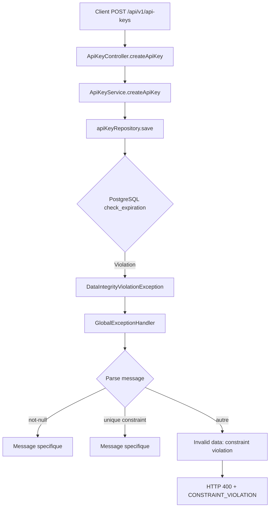

# Analyse de la Gestion des Exceptions pour API Keys - check_expiration

## Contexte du Probleme

Lors de la creation d'une cle API avec une date d'expiration dans le passe (`2025-12-31`), la contrainte PostgreSQL `check_expiration` rejette l'insertion:

```sql
CONSTRAINT check_expiration CHECK (expires_at IS NULL OR expires_at > created_at)
```

L'erreur remontee au client est:

```json
{
  "code": "CONSTRAINT_VIOLATION",
  "message": "Invalid data: constraint violation",
  "timestamp": "2026-01-20T00:42:00.047Z",
  "path": "/api/v1/api-keys"
}
```

---

## Analyse du Flux Actuel



### Code du Handler Actuel

Le `GlobalExceptionHandler` dans [ezkey-admin-api/.../GlobalExceptionHandler.java](ezkey-admin-api/src/main/java/org/ezkey/exception/GlobalExceptionHandler.java) traite `DataIntegrityViolationException` (lignes 232-283):

```232:283:ezkey-admin-api/src/main/java/org/ezkey/exception/GlobalExceptionHandler.java
  @ExceptionHandler(DataIntegrityViolationException.class)
  public ResponseEntity<ErrorResponseDto> handleDataIntegrityViolationException(
      DataIntegrityViolationException ex, WebRequest request) {
    // ... parsing pour not-null et unique constraints
    // Fallback generique pour autres cas:
    } else {
      message = "Invalid data: constraint violation";
    }
```

---

## Evaluation de Conformite

### 1. Conformite aux Pratiques du Projet Ezkey

| Critere | Status | Observation |

|---------|--------|-------------|

| HTTP 400 pour erreur client | OK | Conforme au `.cursorrules` et `DEVELOPMENT.md` |

| Format ErrorResponseDto standardise | OK | Code, message, timestamp, path presents |

| Securite (pas de fuite schema DB) | OK | Message generique, pas d'exposition de details internes |

| Documentation API via OpenAPI | OK | Schemas definis pour erreurs |

**Verdict**: Le comportement actuel est **conforme** aux regles du projet.

### 2. Conformite aux Bonnes Pratiques REST API

| Principe | Status | Analyse |

|----------|--------|---------|

| HTTP 400 Bad Request | OK | Correct pour donnees invalides du client |

| Message actionnable | Ameliorable | "constraint violation" ne dit pas quel champ ni pourquoi |

| Securite vs UX | Acceptable | Balance securite/utilisabilite correcte |

| Idempotence du message | OK | Reproductible |

**Standards de reference:**

- **RFC 9110 (HTTP Semantics)**: 400 = "client error, malformed request"
- **RFC 7807 (Problem Details)**: Recommande `detail` specifique sans exposer internals
- **OWASP API Security**: Ne pas exposer la structure DB, mais fournir un feedback utile

---

## Points d'Amelioration Identifies

### Probleme Principal: Message Non-Actionnable

Le message `"Invalid data: constraint violation"` ne permet pas au developpeur de comprendre:

1. **Quel champ** est en cause (`expiresAt`)
2. **Quelle regle** est violee (date doit etre dans le futur)
3. **Comment corriger** (fournir une date future ou null)

### Comparaison avec Autres Contraintes

Le handler parse deja certaines contraintes specifiques:

- `violates not-null constraint` -> "Required field 'X' is missing or null"
- `violates unique constraint` -> "Username already exists" / "Email already exists"

Mais pour `check_expiration`, on tombe dans le fallback generique.

---

## Recommandations

### Option A: Validation en Amont (Recommande - Best Practice)

Valider `expiresAt` dans le DTO ou le service **avant** l'insertion en base:

**Avantages:**

- Message d'erreur precis et localise
- Echec rapide (fail-fast)
- Pas de requete DB inutile
- Conforme au pattern "defense in depth" du projet

**Implementation:**

1. Ajouter validation Bean Validation dans `ApiKeyCreateRequestDto`
2. Ou valider dans `ApiKeyService.createApiKey()` avant le save

### Option B: Enrichir le GlobalExceptionHandler

Ajouter parsing pour la contrainte `check_expiration`:

```java
} else if (message != null && message.contains("check_expiration")) {
    message = "Expiration date must be in the future or null";
}
```

**Avantages:**

- Filet de securite (defense in depth)
- Couvre les cas edge

**Inconvenients:**

- Couplage au nom de contrainte DB
- Moins explicite que validation en amont

### Option C: Les Deux (Defense in Depth)

Combiner A et B pour une robustesse maximale - c'est l'approche recommandee par le `DEVELOPMENT.md` du projet.

---

## Conclusion

**Le comportement actuel est conforme** aux regles du projet et aux bonnes pratiques de securite API (pas d'exposition de schema DB, HTTP 400 correct).

**Cependant, il est ameliorable** en termes d'experience developpeur (DX). Un message plus precis comme `"Expiration date must be in the future"` serait plus utile sans compromettre la securite.

**Priorite suggeree**: Low/Medium - C'est une amelioration de qualite, pas un bug critique.

---

## Fichiers Concernes

- [ezkey-admin-api/.../GlobalExceptionHandler.java](ezkey-admin-api/src/main/java/org/ezkey/exception/GlobalExceptionHandler.java) - Handler actuel
- [ezkey-admin-api/.../ApiKeyCreateRequestDto.java](ezkey-admin-api/src/main/java/org/ezkey/admin/dto/request/ApiKeyCreateRequestDto.java) - DTO sans validation de date
- [ezkey-core/.../ApiKeyService.java](ezkey-core/src/main/java/org/ezkey/integration/service/ApiKeyService.java) - Service sans validation de date
- [ezkey-core/.../V7__add_api_keys.sql](ezkey-core/src/main/resources/db/migration/V7__add_api_keys.sql) - Definition contrainte DB
