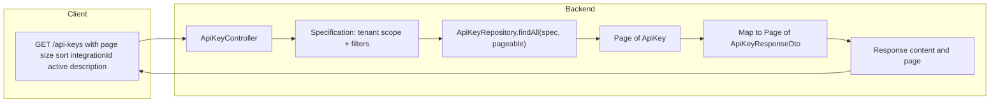

# API Keys list: paginated backend (priority 2)

Scope: **Backend only** for API Keys list endpoints. After execution, the maintainer will run tests and `scripts/update-specs.sh` (or `.bat`); UI migration to `usePaginatedFromOrval` is a separate plan.

---

## 1. Target contract (align with existing paginated endpoints)

Two endpoints to paginate (both currently return `List<ApiKeyResponseDto>`):

- `**GET /api/v1/api-keys`** (main list, admin-scoped): `?page=0&size=20&sort=createdAt,DESC` plus optional filters.
- `**GET /api/v1/api-keys/integration/{integrationId}**` (integration-scoped): same pagination params.

**Response shape:** Same as other Admin list endpoints: `{ "content": [...], "page": { "size", "number", "totalElements", "totalPages" } }`. The project uses `PageSerializationMode.VIA_DTO` in [AdminJpaConfig](ezkey-admin-api/src/main/java/org/ezkey/admin/AdminJpaConfig.java), so returning `ResponseEntity<Page<ApiKeyResponseDto>>` produces this format automatically.

**Sort:** Spring `Pageable` with `sort=property,direction`. Sortable JPA property names from [ApiKey](ezkey-core/src/main/java/org/ezkey/integration/domain/entity/ApiKey.java): `apiKeyId`, `integrationKey`, `description`, `active`, `createdAt`, `expiresAt`, `lastUsedAt`, `revokedAt`.

---

## 2. UI criteria to support (conformity)

From [api-keys.tsx](ezkey-admin-ui/src/pages/api-keys.tsx):

- **Integration filter** (dropdown): Optional `integrationId` query param (Integer; omit = all visible)
- **Status filter**: All / Active / Revoked / Expired: Optional `active` query param (Boolean; omit = all). The finer-grained "revoked vs expired" distinction can remain client-side or be extended later.
- **Description search** (if desired): Optional `description` query param (substring, case-insensitive) -- nice-to-have for future UI search bar
- **Sortable columns**: `apiKeyId`, `integrationKey`, `description`, `active`, `createdAt`, `expiresAt`, `lastUsedAt`, `revokedAt` (asc/desc)
- **Page size** (10/20/50/100): `page`, `size` (default 20)
- **Pagination**: Response `content` + `page` metadata

No UI code changes in this plan; the backend will be ready so a future UI plan can switch to `usePaginatedFromOrval` and pass filters in `baseParams`.

---

## 3. Backend implementation

### 3.1 Repository

- **File:** [ApiKeyRepository](ezkey-core/src/main/java/org/ezkey/integration/domain/repository/ApiKeyRepository.java)
- Add `JpaSpecificationExecutor<ApiKey>` (same pattern as [IntegrationRepository](ezkey-core/src/main/java/org/ezkey/integration/domain/repository/IntegrationRepository.java) and [TenantRepository](ezkey-core/src/main/java/org/ezkey/integration/domain/repository/TenantRepository.java)).
- No new method signatures needed: uses `findAll(Specification, Pageable)` from the interface.

### 3.2 Controller

- **File:** [ApiKeyController](ezkey-admin-api/src/main/java/org/ezkey/admin/controller/ApiKeyController.java)

#### `GET /api/v1/api-keys` (main list)

Replace `listAllApiKeys()` returning `ResponseEntity<List<ApiKeyResponseDto>>` with a paginated method that:

- Accepts `@RequestParam(required = false) Integer integrationId`, `@RequestParam(required = false) Boolean active`, `@RequestParam(required = false) String description`, and `@ParameterObject @PageableDefault(size = 20, sort = "createdAt", direction = Sort.Direction.DESC) Pageable pageable`.
- Accepts `Authentication auth` to determine admin type.
- Keeps current permission: `@PreAuthorize("hasRole('ADMIN')")`.
- **Multi-tenancy scoping** (same logic as current code):
  - **GlobalAdmin:** sees all API keys. If `integrationId` provided, filter by it.
  - **TenantAdmin:** sees only keys for their tenant's integrations. Specification adds `root.get("integration").get("tenant").get("tenantId").in(tenantId)`. If `integrationId` provided, additionally filter by it.
- Builds a `Specification<ApiKey>` that applies:
  - Tenant scoping (for TenantAdmin)
  - Optional `integrationId` filter: `cb.equal(root.get("integration").get("id"), integrationId)`
  - Optional `active` filter: `cb.equal(root.get("active"), value)`
  - Optional `description` filter: `cb.like(cb.lower(root.get("description")), "%" + lower + "%")`
- Calls `apiKeyRepository.findAll(spec, pageable)`, maps with `.map(this::mapToResponseDto)`.
- Returns `ResponseEntity<Page<ApiKeyResponseDto>>`.

#### `GET /api/v1/api-keys/integration/{integrationId}` (integration-scoped)

Replace `listApiKeys(integrationId)` returning `ResponseEntity<List<ApiKeyResponseDto>>` with a paginated method that:

- Keeps `@PathVariable("integrationId") Integer integrationId`.
- Adds `@RequestParam(required = false) Boolean active`, `@ParameterObject @PageableDefault(size = 20, sort = "createdAt", direction = Sort.Direction.DESC) Pageable pageable`.
- Builds a `Specification<ApiKey>`: filter by `integration.id = integrationId`. If `active` is not explicitly provided, default to `active = true` (preserving current behavior of returning active-only). If `active` is explicitly provided, use that value.
- Calls `apiKeyRepository.findAll(spec, pageable).map(this::mapToResponseDto)`.
- Returns `ResponseEntity<Page<ApiKeyResponseDto>>`.

### 3.3 Multi-tenancy and access control

Current behavior preserved:

- `GET /api/v1/api-keys`: GlobalAdmin sees all, TenantAdmin sees their tenant's. No access control check on `integrationId` filter beyond tenant scoping.
- `GET /api/v1/api-keys/integration/{integrationId}`: Any `ADMIN` can call. Currently does not check if the admin has access to the integration's tenant. This behavior is preserved; access control validation could be added later if needed.

### 3.4 Imports and annotations

The controller will need new imports:

- `org.springframework.data.domain.Page`, `Pageable`, `Sort`
- `org.springframework.data.web.PageableDefault`
- `org.springdoc.core.annotations.ParameterObject`
- `org.springframework.data.jpa.domain.Specification`
- `jakarta.persistence.criteria.Predicate`
- `java.util.ArrayList`

Inject `ApiKeyRepository` directly into the controller (like TenantController injects `TenantRepository`) for `findAll(spec, pageable)`, or route through `ApiKeyService` with new paginated methods. Following the TenantController pattern (repository directly in controller for the list), inject `ApiKeyRepository`.

### 3.5 OpenAPI annotations

Update `@Operation` / `@ApiResponse` on both list methods to document query params (`page`, `size`, `sort`, `integrationId`, `active`, `description`). Do not edit `specs/admin-api/openapi-spec.json` by hand.

---

## 4. Documentation

- **File:** [docs/ENDPOINT.md](docs/ENDPOINT.md) -- Section "API Keys Authentication"
  - Update "List API Keys for Integration" (`GET /api/v1/api-keys/integration/{integrationId}`) with `page`, `size`, `sort`, optional `active` and paginated response.
  - Add or update "List all API keys" (`GET /api/v1/api-keys`) with `page`, `size`, `sort`, optional `integrationId`, `active`, `description` and paginated response.

---

## 5. Postman collection

- **File:** [postman/collections/v2.1/EZ Key API Keys admin.postman_collection.json](postman/collections/v2.1/EZ Key API Keys admin.postman_collection.json)
- **Request "list all keys":**
  - Add query params: `page`, `size`, `sort` (e.g. default `page=0`, `size=20`, `sort=createdAt,desc`). Optionally add `integrationId` and `active` for filter examples.
  - Update test script: Replace "Response is an array" with assertions on paginated shape: `pm.expect(jsonData).to.have.property('content'); pm.expect(jsonData).to.have.property('page'); pm.expect(jsonData.content).to.be.an('array');`. Get `apiKeyId`/`integrationKey` from `jsonData.content[0]` instead of `jsonData[0]`.
- **Request "list keys for integration":**
  - Add query params: `page`, `size`, `sort`.
  - Update test script similarly.

---

## 6. Tests

### 6.1 Unit tests (ezkey-admin-api)

- **File:** [ApiKeyControllerTest](ezkey-admin-api/src/test/java/org/ezkey/admin/controller/ApiKeyControllerTest.java)
- Update `ListApiKeysTests`: mock the repository's `findAll(Specification, Pageable)` returning a `PageImpl<ApiKey>`. Assert response is `Page<ApiKeyResponseDto>` with `content` and metadata.
- Add `ListAllApiKeysTests` (currently missing): test the main `GET /api/v1/api-keys` method for GlobalAdmin (sees all) and TenantAdmin (scoped by tenant). Mock repository with `PageImpl`.

### 6.2 Functional tests (ezkey-tests)

- **[TenantCrossIsolationSecurityTest](ezkey-tests/src/test/java/org/ezkey/tests/security/multitenant/TenantCrossIsolationSecurityTest.java):**
  - `testTenantAdminACanListOnlyOwnApiKeys()` (line ~428): Currently parses `response.jsonPath().getList("$")`. Change to `response.jsonPath().getList("content")`. Assert all API keys belong to Tenant A integrations from `content`.
  - `testGlobalAdminCanListAllApiKeys()` (line ~644): Same change -- parse from `content` instead of root array. Add `page=0&size=100` to ensure all keys are on one page.
- **Other tests** (`ApiKeySecurityTest`, `ApiKeyUpdateSecurityTest`): These test create/revoke/PATCH, not list endpoints, so they should not need changes.
- **TestDataFactory**: Currently has `createApiKeyForIntegration()` which does POST, no list usage. No changes needed.

---

## 7. Order of work and checklist

1. **Repository:** Add `JpaSpecificationExecutor<ApiKey>` to `ApiKeyRepository`.
2. **Controller:** Inject `ApiKeyRepository`. Rewrite `listAllApiKeys()` and `listApiKeys()` with `Pageable`, optional filters, `Specification`, return `Page<ApiKeyResponseDto>`.
3. **ENDPOINT.md:** Update both API key list endpoint descriptions with query params and paginated response shape.
4. **Postman:** Update both list requests (query params + description) and test scripts (content + page).
5. **Unit tests:** Update `ListApiKeysTests`, add `ListAllApiKeysTests` for paginated signatures.
6. **Functional tests:** Adjust `TenantCrossIsolationSecurityTest` to parse from `content` instead of root array.
7. Run unit tests and functional tests; fix any failures.
8. **Maintainer:** After a clean Docker start, run `scripts/update-specs.sh` (or `.bat`) to regenerate `specs/admin-api/openapi-spec.json`. No manual spec edits.

---

## 8. Out of scope (future plans)

- **UI:** Switching api-keys page to `usePaginatedFromOrval`, removing client-side filter/pagination/sort, and wiring filters and sort to the new API -- separate plan.
- **OpenAPI spec:** Agents do not run update-specs; the maintainer does after validation.
- **Other list endpoints:** Encryption keys, re-encryption batches (priority 3 in the original plan).

---

## 9. Diagram (flow)

