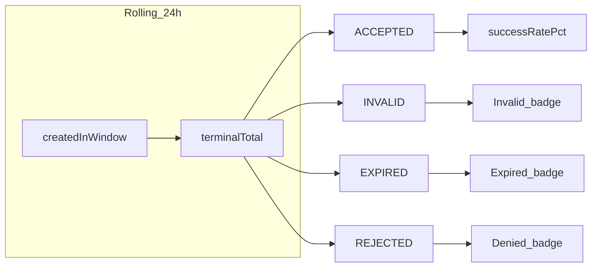

# Dashboard widget: strategic redesign (auth outcomes / health)

## Contexte projet (important)

**Mode développement uniquement — pas de déploiement production.** Aucune obligation de compatibilité ascendante ni de période de transition sur l’API. **Carte blanche pour rectifier proprement :** remplacer le contrat `auth24h` en une seule passe (DTO, consommateurs internes, tests), sans dupliquer des champs « legacy » ni maintenir deux formes en parallèle.

---

## Problem statement (validated in code)

Today, `[DashboardService.buildAuth24hStats](ezkey-admin-api/src/main/java/org/ezkey/admin/service/DashboardService.java)` computes `failureRatePct = rejected / total`, where `total` is **all** attempts created in 24h (any status) and `rejected` is only `AuthAttemptStatus.REJECTED` (explicit user deny). That is neither a generic "failure rate" nor intuitive; `**INVALID` and `EXPIRED` are security/ops signals but do not drive the headline number**, while `PENDING`/`READ` dilute the denominator.

The enrollment widget pattern (`[dashboard.tsx](ezkey-admin-ui/src/pages/dashboard.tsx)`): **one primary count + color-coded badges for breakdown** maps well to "what should I worry about?" without hiding meaning behind one percentage.

---

## What operators actually need (Ezkey-specific)

Authentication in Ezkey is device-centric (`AuthAttempt` lifecycle in `[AuthAttemptStatus](ezkey-core/src/main/java/org/ezkey/authattempt/domain/AuthAttemptStatus.java)`). Actionable categories for admins:

| Signal                                | Status     | Why it matters                                                                        |
| ------------------------------------- | ---------- | ------------------------------------------------------------------------------------- |
| **Cryptographic / integrity failure** | `INVALID`  | Wrong keys, tampering, mis-integrated clients—**investigate security/config**         |
| **Timeout / superseded**              | `EXPIRED`  | Slow UX, polling issues, abandoned flows—**investigate integration or user friction** |
| **Explicit user deny**                | `REJECTED` | Normal MFA behavior vs abuse—**usually lower urgency** than `INVALID` spikes          |
| **Success**                           | `ACCEPTED` | Baseline health                                                                       |

**Global Admin vs Tenant Admin:** Same *shape* of metrics; scope already differs via `tenantId` in `findByFilters` (tenant-scoped vs instance-wide). No need for a second widget type—only **copy/help** may stress instance-wide vs tenant-wide interpretation.

**Out of scope for this tile (v1):** Aggregating `[API_KEY_AUTH_FAILED](ezkey-core/src/main/java/org/ezkey/audit/domain/EventType.java)` from audit logs—that is a **different surface** (integration API / keys) and would add query complexity and overlap with the "auth attempts" entity story. Mention as a **future** enhancement or separate row if product wants "API key health."

**Already covered elsewhere:** `[AUDIT_CHAIN_GAP_PENDING](ezkey-admin-api/src/main/java/org/ezkey/admin/service/DashboardService.java)` alerts for Global Admin—normative integrity; do not duplicate in this widget.

---

## Time window: keep 24h rolling (recommended)

- **Keep** `since24h = now - 24h` aligned with existing `auth24h` semantics for attempts created in the window and `[DashboardOverviewElectiveTest](ezkey-tests/src/test/java/org/ezkey/tests/security/dashboard/DashboardOverviewElectiveTest.java)` DB spot-check for the created-in-window count (field name may change—update test accordingly).
- **Document** in API schema/help: window is **rolling**, server clock, UTC storage.
- **Alternative (not recommended for v1):** calendar-day bucket—harder to align with "last 24h" counts and more surprising for operators.

---

## Denominator: fix the intuition bug

**Recommendation:** define **terminalTotal** in the DTO as:

`terminalTotal = accepted + rejected + invalid + expired`

- **Rates** for badges use **terminal outcomes** as denominator (industry-standard "completed auth outcomes" framing).
- **Exclude** `PENDING` and `READ` from rate denominators—they are not outcomes yet.
- Optionally expose **pending** / **read** counts as informational, or rely on existing `[/auth-attempts/pending-count](ezkey-admin-ui/src/pages/dashboard.tsx)` for pending-only (already refreshed every 10s).

This matches how products like **Duo / Okta / Microsoft Authenticator admin views** often split **push denied** vs **timeout** vs **fraud/invalid**—separate actionable channels rather than one blended "failure %."

---

## API shape — breaking replace, no transition

**Remove** `failureRatePct` and the misleading semantics entirely. **Do not** keep parallel old fields for compatibility.

**Replace** `[DashboardAuth24hStatsDto](ezkey-admin-api/src/main/java/org/ezkey/admin/dto/response/DashboardAuth24hStatsDto.java)` with a clean contract, for example:

- `createdInWindow` — all attempts whose `createdAt` falls in the 24h window (or keep name `total` with clear JavaDoc/OpenAPI description).
- Counts: `accepted`, `rejected`, `invalid`, `expired` (optional: `pending`, `read` if cheap).
- `terminalTotal` — server-computed sum of terminal statuses.
- Integer percentages 0–100 (or `null` when `terminalTotal == 0`): `successRatePct`, `invalidRatePct`, `expiredRatePct`, `rejectedRatePct` — **each relative to `terminalTotal`**.

**Implementation:** extend `[AuthAttemptService](ezkey-core/src/main/java/org/ezkey/authattempt/service/AuthAttemptService.java)` with a **single aggregation query** (GROUP BY status or conditional COUNT) for the 24h + tenant filter—avoid six sequential `findByFilters` total-element calls for performance and consistency (single snapshot).

Update `[DashboardController](ezkey-admin-api/src/main/java/org/ezkey/admin/controller/DashboardController.java)` / Springdoc annotations as needed; **do not hand-edit** `[specs/admin-api/openapi-spec.json](specs/admin-api/openapi-spec.json)` (maintainer runs `update-specs.sh` after Docker).

**Tests:** `[DashboardService](ezkey-admin-api)` unit tests (if present) or focused tests for aggregation; extend elective test only if JSON assertions for new fields are stable on clean DB (optional counts).

**Consumers to update in the same change set (no shims):**

- Admin UI: `[dashboard.tsx](ezkey-admin-ui/src/pages/dashboard.tsx)`, types/Orval if generated from spec.
- `[ezkey-cli-python](ezkey-cli-python)` TUI / any client reading `auth24h`.
- Postman collection snippets if they assert `failureRatePct`.
- Embedded copies of OpenAPI in repo: **not** edited by hand per project rules—maintainer regenerates via `update-specs.sh` after implementation.

---

## Phase 2 UI (uniform with other stat cards)

In `[dashboard.tsx](ezkey-admin-ui/src/pages/dashboard.tsx)`:

- **Rename** the fourth card from vague "Failure Rate (24h)" to something outcome-oriented, e.g. **"Authentication health (24h)"** / **"Auth outcomes (24h)"** (i18n EN+FR).
- **Primary number:** `**successRatePct`** among terminal outcomes (large headline)—matches intuition "are logins succeeding?"
- **Badges** (parallel to enrollment): **Accepted**, **Invalid**, **Expired**, **Denied**—with severity colors: success / error / warning / muted (exact mapping in implementation).
- **Remove** misleading green "healthy" copy tied to the old single metric; replace with **thresholds per badge** (e.g. `invalidRatePct` high → error styling).
- Optional: **help topic** in `[help-topics](ezkey-admin-ui/src/lib/help-topics.ts)` + `help.json` (EN+FR) explaining terminal denominator and scopes.

Regenerate Orval types if the project uses generated clients from OpenAPI after spec refresh.

---

## Blind spots and later enhancements

- **API key / Integration API failures** (`API_KEY_AUTH_FAILED`, IP blocks): valuable for Global Admin; consider a **separate** small stat or future dashboard row sourced from audit aggregation.
- **Baseline / anomaly detection** (spike vs 7-day average): powerful but **not** 80/20—defer.
- **Correlation with `ENROLLMENT_AUTH_ATTEMPT_BLOCKED`:** audit-only; could surface as a small count if product wants "policy blocks" visible on dashboard—defer unless requested.

---

## Suggested decision (single recommendation)

**Adopt a terminal-outcome–based "authentication health" card:** headline **success rate among completed attempts**, badges for **Invalid**, **Expired**, and **Denied** (counts or %), keep **24h rolling window**, same DTO for Global and Tenant with existing scoping, implement via **one aggregated query** in core and **replace `DashboardAuth24hStatsDto`**.

This directly answers: "Is MFA succeeding?" and "If not, **why**—crypto, timeout, or user deny?"—which is what admins intuitively expect from a fourth tile next to integrations, enrollments, and raw attempt volume.

---

## Diagram

