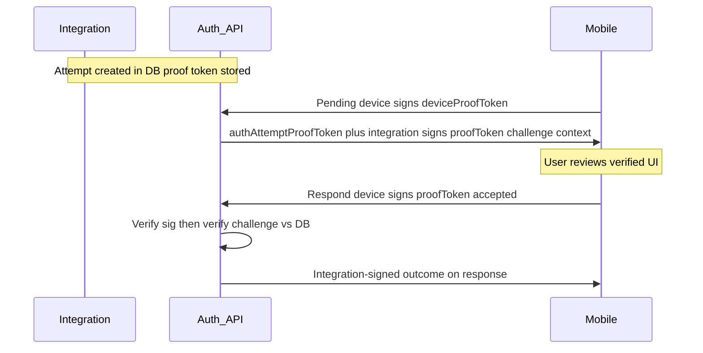
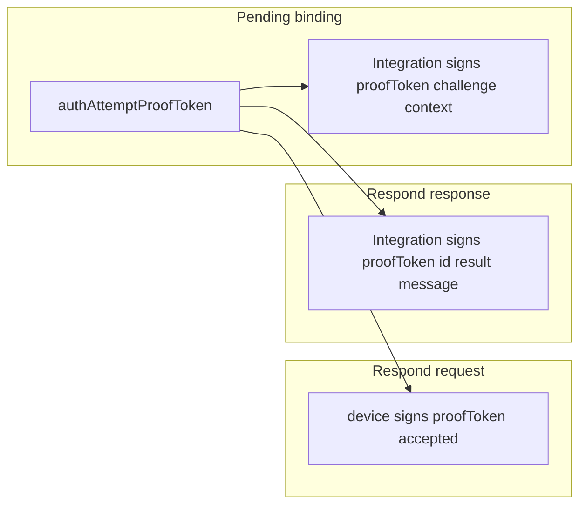

# Strong cryptographic chain — consolidated plan (ARCHIVED)

> **Status:** **Fully implemented** (phase 1). This file is kept under `.cursor/plans/archive/` for history only. Deferred items from the original plan (UUID, optional challenge-in-signature, separate mobile app) remain optional follow-ups.

## Alignment with the two reference plans

The workspace plans are authoritative:

- [`.cursor/plans/proof_token_payload_binding_6384e23a.plan.md`](../proof_token_payload_binding_6384e23a.plan.md) — Pending integration signature + Respond device signature over canonical payloads (pipes, NFC, UTF-8).
- [`.cursor/plans/signed_respond_response_analysis_369c4bb7.plan.md`](../signed_respond_response_analysis_369c4bb7.plan.md) — Sign the **Respond HTTP response** with the integration key; rename fields for consistency; payload includes proof token + attempt id + result + message.

Implementation references: [`AuthAttemptSignaturePayload`](../../ezkey-core/src/main/java/org/ezkey/authattempt/service/AuthAttemptSignaturePayload.java), [`AuthAttemptPendingService`](../../ezkey-core/src/main/java/org/ezkey/authattempt/service/AuthAttemptPendingService.java), [`AuthAttemptRespondService`](../../ezkey-core/src/main/java/org/ezkey/authattempt/service/AuthAttemptRespondService.java), [`AuthAttemptRespondResponseDto`](../../ezkey-auth-api/src/main/java/org/ezkey/authattempt/dto/AuthAttemptRespondResponseDto.java), [`docs/AUTH_ATTEMPT_SIGNATURE_PAYLOAD.md`](../../docs/AUTH_ATTEMPT_SIGNATURE_PAYLOAD.md).

---

## Expert security validation (summary)

- **Pending**: Integration signs `proofToken|challengeRequired|contextTitle|contextMessage` — implemented; clients must verify.
- **Respond request**: Device signature is over **`proofToken|accepted`**, not the raw token alone; **`authAttemptAccepted` is bound**. **`authAttemptChallengeResponse`** is enforced server-side against the stored challenge, not in the device signature (optional future: extend payload to include challenge for cryptographic user commitment).
- **Respond response**: Integration-signed outcome (`authAttemptProofTokenResultSignedByIntegration` over canonical result payload) — **implemented** at the Auth API boundary; Postman step 7, demo device, and ezkey_mobile verify as applicable.

---

## Cryptographic chain (conceptual)

---

## Phase 1 (this iteration) — scope

1. **Signed Respond response (backend)**  
   - Implement in [`AuthAttemptRespondService`](../../ezkey-core/src/main/java/org/ezkey/authattempt/service/AuthAttemptRespondService.java) (success and **failed** paths with consistent `authAttemptId` / payload where applicable).  
   - Extend domain + [`AuthAttemptRespondResponseDto`](../../ezkey-auth-api/src/main/java/org/ezkey/authattempt/dto/AuthAttemptRespondResponseDto.java): `authAttemptId`, `authAttemptResult`, `authAttemptMessage`, `authAttemptProofTokenResultSignedByIntegration` (per signed-respond plan).

2. **Documentation**  
   - Extend [`docs/AUTH_ATTEMPT_SIGNATURE_PAYLOAD.md`](../../docs/AUTH_ATTEMPT_SIGNATURE_PAYLOAD.md) with Respond **response** canonical line.  
   - Update [`docs/ENDPOINT.md`](../../docs/ENDPOINT.md) after Java/OpenAPI annotations (maintainer runs `update-specs`; do not hand-edit `specs/`).

3. **Postman (project collection)**  
   - Update [`postman/collections/v2.1/EZ Key Auth Attempts auth.postman_collection.json`](../../postman/collections/v2.1/EZ%20Key%20Auth%20Attempts%20auth.postman_collection.json):  
     - Document the new Respond response body (`authAttemptResult`, `authAttemptMessage`, `authAttemptId`, `authAttemptProofTokenResultSignedByIntegration`).  
     - Adjust **6 respond** / **6b respond with context** folder descriptions and any **Tests** tab scripts that assert on `result` / `message` so they match the new field names.  
     - Optionally add a short collection-level note that the mobile should verify the integration signature on the Respond response (same public key as Pending).  
   - Keep collection descriptions and Tests scripts consistent (historical note: legacy `docs/testing/POSTMAN_COLLECTIONS_UPDATE_PLAN.md` was removed as superseded).

4. **Demo device (ezkey-demo-device)**  
   - Consume new response fields; verify integration signature on Respond response before showing outcome (end-to-end without mobile in phase 1).

5. **Tests**  
   - Unit tests for payload + signature; functional/security tests as appropriate; keep [`DemoMitmSignatureTamper`](../../ezkey-core/src/main/java/org/ezkey/authattempt/service/DemoMitmSignatureTamper.java) aligned if needed.

## Phase 2 — deferred

- **ezkey_mobile** and **ezkey_mobile_app**: consume new fields + verify signature.  
- **UUID** for `enrollmentId` / `authAttemptId`: separate migration.  
- **Optional**: include challenge in device-signed Respond payload — separate spec change.

---

## Key files

| Area | Files |
|------|--------|
| Canonical payloads | [`AuthAttemptSignaturePayload`](../../ezkey-core/src/main/java/org/ezkey/authattempt/service/AuthAttemptSignaturePayload.java), [`docs/AUTH_ATTEMPT_SIGNATURE_PAYLOAD.md`](../../docs/AUTH_ATTEMPT_SIGNATURE_PAYLOAD.md) |
| Respond flow | [`AuthAttemptRespondService`](../../ezkey-core/src/main/java/org/ezkey/authattempt/service/AuthAttemptRespondService.java), domain `AuthAttemptRespondResponse`, auth-api DTO + mapper |
| Postman | [`EZ Key Auth Attempts auth.postman_collection.json`](../../postman/collections/v2.1/EZ%20Key%20Auth%20Attempts%20auth.postman_collection.json) |
| Demo | ezkey-demo-device |
