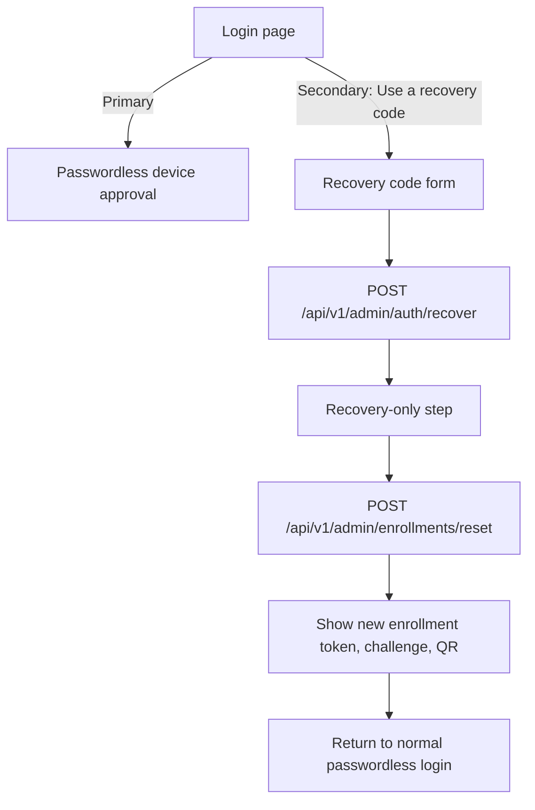

## Status

**Implemented and tested** (March 2026). This plan has been fully implemented in the repository and validated; the sections below are kept as historical design and scope reference.

---

# Admin UI Recovery Codes Plan

## Current State

- The login UI in [ezkey-admin-ui/src/pages/login.tsx](ezkey-admin-ui/src/pages/login.tsx) only supports passwordless device approval plus optional challenge.
- The frontend session model in [ezkey-admin-ui/src/lib/auth.ts](ezkey-admin-ui/src/lib/auth.ts) only represents a full admin session (`token`, `username`, `adminType`, `expiresAt`); there is no recovery-only session concept.
- The generated client already exposes `recover()` in [ezkey-admin-ui/src/generated/admin-api/admin-authentication/admin-authentication.ts](ezkey-admin-ui/src/generated/admin-api/admin-authentication/admin-authentication.ts), but it is unused.
- Admin provisioning UI in [ezkey-admin-ui/src/pages/admins.tsx](ezkey-admin-ui/src/pages/admins.tsx) shows onboarding token, challenge, and QR only. The API contract behind [ezkey-admin-api/src/main/java/org/ezkey/admin/controller/AdminProvisioningController.java](ezkey-admin-api/src/main/java/org/ezkey/admin/controller/AdminProvisioningController.java) deliberately does not return recovery codes on create, and `GET /admins/{id}/onboarding` returns `recoveryCodes: null`.
- Bootstrap recovery codes are surfaced only in startup logging/export via [ezkey-admin-api/src/main/java/org/ezkey/admin/service/AdminBootstrapService.java](ezkey-admin-api/src/main/java/org/ezkey/admin/service/AdminBootstrapService.java); there is no Admin UI bootstrap screen today.

## Product Conclusions

- Recovery code entry should be a secondary, discreet path on the login screen, following GitHub/Google/Dropbox patterns: not the default CTA, but easy to discover under a calm “Use a recovery code” action.
- With the current backend, recovery is **not** an emergency full admin session. `POST /api/v1/admin/auth/recover` returns a temporary `recoveryToken`, and the intended next step is `POST /api/v1/admin/enrollments/reset` to rebind MFA. The UI should therefore model recovery as a **recovery funnel**, not as a parallel login completion path.
- Immediate rebind should be strongly guided, but the analysis should not assume the user must complete the full rebind in one sitting. The current API allows recovery and reset, then the user can bind later within the temporary recovery window; the UI should support a clear handoff rather than a forced monolith.
- Full support for “show recovery codes when creating a new admin” is a valid product goal, but it is a **backend contract dependency** because the current create + onboarding APIs do not expose plain recovery codes to the SPA.

## Target Workflow

## UX Strategy

- Add an inline secondary recovery path on [ezkey-admin-ui/src/pages/login.tsx](ezkey-admin-ui/src/pages/login.tsx) rather than a separate heavy screen.
- Treat post-recovery state as a limited recovery mode with dedicated copy, countdown, and only the actions needed to reset/rebind MFA.
- Reuse the existing onboarding visual language from [ezkey-admin-ui/src/pages/admins.tsx](ezkey-admin-ui/src/pages/admins.tsx) for reset output: proof token, challenge, QR, copy/download affordances, and “shown once/save now” messaging.
- Add discreet but explicit operator guidance: one code per use, codes are shown only once at generation time, remaining-code awareness after successful recovery, and a clear note that old device access is revoked after reset.
- Keep Global Admin and Tenant Admin UX identical for recovery entry and reset; role differences are not meaningful in this flow.

## Scope Boundaries And Dependencies

- **In scope for Admin UI planning:** login entry point, recovery-code form, recovery-only state handling, reset/rebind handoff, copy/help/audit visibility, and the operator workflow implications.
- **Dependency to call out:** displaying recovery codes during admin creation likely requires extending [ezkey-admin-api/src/main/java/org/ezkey/admin/controller/AdminProvisioningController.java](ezkey-admin-api/src/main/java/org/ezkey/admin/controller/AdminProvisioningController.java) or adding a dedicated one-time retrieval contract. The current documented API is insufficient for the SPA to do this.
- **Out of scope unless product changes:** “log in with a recovery code and keep using the console without resetting MFA.” That behavior is not the intended backend contract today.

## Implementation Areas

- Login and auth state: [ezkey-admin-ui/src/pages/login.tsx](ezkey-admin-ui/src/pages/login.tsx), [ezkey-admin-ui/src/context/auth-context.tsx](ezkey-admin-ui/src/context/auth-context.tsx), [ezkey-admin-ui/src/lib/auth.ts](ezkey-admin-ui/src/lib/auth.ts).
- API usage: [ezkey-admin-ui/src/generated/admin-api/admin-authentication/admin-authentication.ts](ezkey-admin-ui/src/generated/admin-api/admin-authentication/admin-authentication.ts).
- Reset/rebind presentation: reuse patterns from [ezkey-admin-ui/src/pages/admins.tsx](ezkey-admin-ui/src/pages/admins.tsx).
- Copy and help: [ezkey-admin-ui/src/locales/en/login.json](ezkey-admin-ui/src/locales/en/login.json) plus FR parity, and help topics if we add guided recovery help.
- Reference behavior/docs: [docs/ENDPOINT.md](docs/ENDPOINT.md), [postman/collections/v2.1/EZ Key Authentication Login admin.postman_collection.json](postman/collections/v2.1/EZ%20Key%20Authentication%20Login%20admin.postman_collection.json), [ezkey-admin-api/src/main/java/org/ezkey/admin/service/AdminRecoveryService.java](ezkey-admin-api/src/main/java/org/ezkey/admin/service/AdminRecoveryService.java), [ezkey-admin-api/src/main/java/org/ezkey/admin/controller/AdminEnrollmentController.java](ezkey-admin-api/src/main/java/org/ezkey/admin/controller/AdminEnrollmentController.java).

## Comparables To Follow

- GitHub and Google: backup-code entry is behind a secondary action, not the main login path.
- Dropbox: simple backup-code entry plus strong nudges to save/regenerate codes and avoid transcription mistakes.
- Okta/Duo/Auth0: enterprise break-glass flows tend to separate emergency access from normal MFA management.

## Deliverables

- A discreet recovery-code entry on login.
- A recovery-only reset/rebind funnel consistent with current backend semantics.
- A concrete recommendation on whether to keep reset and rebind in one guided flow or two linked steps.
- A backend dependency note for one-time recovery-code display during admin creation/bootstrap in the UI.
- UI copy and help guidance aligned with sober admin-console UX.

