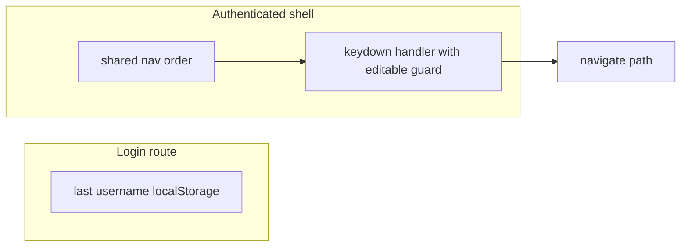

**Archived — status:** This plan is **fully implemented** and **validated** (remember username on the login screen, including Pin control, on/off tooltip copy, i18n, and `docs/admin-ui-security.md`). Keyboard accelerators from the original exploration were **not** implemented (explicitly out of scope).

# Admin UI: remembered username, security posture, and keyboard accelerators

## Context (current codebase)

- **Login** is implemented in `[ezkey-admin-ui/src/pages/login.tsx](ezkey-admin-ui/src/pages/login.tsx)`: React Hook Form, username + challenge checkbox, no persisted default for `username` (`defaultValues` only sets `challengeRequested: false`).
- **Secrets**: Bearer token stays in `**sessionStorage`** only (`[ezkey-admin-ui/src/lib/auth.ts](ezkey-admin-ui/src/lib/auth.ts)`); `[docs/admin-ui-security.md](docs/admin-ui-security.md)` documents why.
- **Non-secret prefs**: Language already uses `**localStorage`** (`I18N_STORAGE_KEY` in `[ezkey-admin-ui/src/i18n.ts](ezkey-admin-ui/src/i18n.ts)`) — precedent for "UX preference, not credential."
- **Help shortcut**: `[ezkey-admin-ui/src/context/help-context.tsx](ezkey-admin-ui/src/context/help-context.tsx)` binds `**?`** (no modifiers) when focus is **not** in an editable field — any new global shortcuts must reuse the same `isEditableTarget` guard (or stricter) to avoid breaking forms.
- **Navigation**: Single source of truth for items is `[ezkey-admin-ui/src/components/layout/sidebar.tsx](ezkey-admin-ui/src/components/layout/sidebar.tsx)` (`navItems` + role filter). Tenant vs Global admin differs by **two** entries (tenants + encryption keys).

---

## 1. "Remember username" — comparables and recommendation

**What comparables do**

- **Enterprise / cloud consoles** (AWS IAM sign-in, Azure, Okta-style flows) commonly offer **"Remember username"** or a **login hint** stored on the client. This is **not** the same as **"Remember me"** that keeps a **session** alive (often cookie-based and higher risk).
- **Password managers** rely on `autocomplete="username"` (already present on the login field) and stable `name`/`id`; they do not remove the need for an explicit "remember username" when operators reuse one account on a **dedicated** workstation and want zero typing without relying on the browser vault.

**What is proportionate for Ezkey**

| Approach                                            | Risk                                                                                                                                      | Fit                                                 |
| --------------------------------------------------- | ----------------------------------------------------------------------------------------------------------------------------------------- | --------------------------------------------------- |
| **localStorage: last username + optional checkbox** | Low — username is an **identifier**, not a secret; MFA/passkey flow still required                                                        | High — matches your clean-start / repeat-login pain |
| **sessionStorage for username**                     | Lower disclosure than localStorage (tab lifetime) but **does not survive** new sessions after restart — **weak** for your stated use case | Low                                                 |
| **Full "remember me" session in localStorage**      | **Out of scope** — contradicts current token model and raises XSS/SOC2 discussion surface                                                 | Do not do                                           |

**SOC2 / audit framing (high level)**

- Storing **only** a username does **not** substitute for authentication; it does not weaken **logical access** controls enforced by the Admin API and device approval.
- Auditors typically care about **protection of credentials and sessions**; a **non-secret identifier** on a managed workstation is in the same class as **display name in logs** or **remembered email** on many IdP pages. Document the choice briefly in `[docs/admin-ui-security.md](docs/admin-ui-security.md)` (one short subsection: "Last username preference") so security reviews see intent: **no tokens in localStorage**, username optional and user-controlled.

**UX details (keep it simple)**

- **Checkbox** (default **off** is the safest default for shared machines; default **on** is friendlier for your personal dev loop — product choice): label like **"Remember username on this device"** / **"Mémoriser le nom d’utilisateur sur cet appareil"** (i18n in `login` namespace, EN+FR parity).
- On successful **Start login** (when transitioning to `waiting`), if checked: save **trimmed** username under a single key, e.g. `ezkey_admin_last_username` (mirror naming of `ezkey_admin_auth` / `ezkey-admin-ui-lang`).
- On mount: if a value exists and user had opted in, set **defaultValues** / `reset()` so the field is prefilled.
- **Logout** (elsewhere): do **not** clear remembered username — standard expectation for "remember username."
- Optional **"Clear"** is unnecessary for v1; unchecking + empty field on next successful login can overwrite, or user clears field manually.

**Implementation surface**

- Small helper in `[ezkey-admin-ui/src/lib/](ezkey-admin-ui/src/lib/)` (e.g. `last-username-pref.ts`) — get/set/clear + typed key constant — keeps `[login.tsx](ezkey-admin-ui/src/pages/login.tsx)` readable.
- Wire checkbox to `react-hook-form` (`rememberUsername: z.boolean()`).

---

## 2. Other comfort / acceleration opportunities (lightweight)

- **Autofill**: Keep `autoComplete="username"`; optionally add explicit `name="username"` on `Input` if not already emitted (RHF usually does). Ensures password managers and browser autofill behave consistently.
- **Focus**: `autoFocus` is already on the username field when idle — good for clean start.
- **Post-login**: No change required for "acceleration" beyond navigation shortcuts below.

---

## 3. Keyboard shortcuts — pragmatic scope

**Constraints**

- `**?`** is reserved for Help.
- Shortcuts should **not** fire while typing in inputs (reuse `[isEditableTarget](ezkey-admin-ui/src/context/help-context.tsx)` logic — extract to `@/lib/focus-utils.ts` or similar to avoid duplication).
- **Tenant vs Global**: Any nav shortcut must use the **same filtered list** as the sidebar (ideally **one** shared definition: paths + order + optional shortcut key), so Tenant admins do not jump to hidden routes.

**Reasonable "80/20" patterns**

1. **Two-key "go to" chords (GitHub-style)**
  - Example: press `g`, then within ~1s press a second key mapped to a **stable** route (`d` → dashboard, `i` → integrations, …).
  - **Pros**: Few collisions with browser defaults if first key uses `**g`** (many apps use `g` as leader).
  - **Cons**: Requires a tiny state machine, user education; must list bindings in Help.
2. **Modifier + number (`Alt+Shift+1` … `9`)** for **1st–9th visible** nav item
  - **Pros**: Mirrors "first nine items" without inventing letters.
  - **Cons**: Browser/OS differences — must be tested on Windows + Chrome/Edge; may conflict with some locales or browser UI.
3. **Command palette (`Ctrl+K` / `Cmd+K`)**
  - **Pros**: Scales to many routes and future search.
  - **Cons**: Clearly **not** a quick win — defer.

**Recommendation for a first slice**

- **Phase 1 (this initiative)**: Ship **remember username** only; add a **Help** subsection listing **existing** `?` and (if you add shortcuts in the same release) the chosen bindings.
- **Phase 2 (optional follow-up)**: Implement **one** scheme only — either `**g` chords** with a **small fixed map** (dashboard + integrations + enrollments + audit logs as highest-traffic) **or** **modifier + number** for visible nav indices — registered in `**AppShell`** (or a `KeyboardShortcutsProvider` under authenticated layout only), not on `/login`.

Architecture sketch:

---

## 4. Files likely touched

| Area                   | Files                                                                                                                                                                                                                                   |
| ---------------------- | --------------------------------------------------------------------------------------------------------------------------------------------------------------------------------------------------------------------------------------- |
| Remember username      | `[ezkey-admin-ui/src/pages/login.tsx](ezkey-admin-ui/src/pages/login.tsx)`, new `src/lib/last-username-pref.ts` (or similar), `[ezkey-admin-ui/src/locales/en/login.json](ezkey-admin-ui/src/locales/en/login.json)` + `fr`             |
| Security doc           | `[docs/admin-ui-security.md](docs/admin-ui-security.md)` — short "Last username" note                                                                                                                                                   |
| Shortcuts (if Phase 2) | `[ezkey-admin-ui/src/components/layout/app-shell.tsx](ezkey-admin-ui/src/components/layout/app-shell.tsx)` (or new provider), optional extract of editable-target helper, `[help.json](ezkey-admin-ui/src/locales/en/help.json)` topics |

---

## 5. What we are explicitly not doing (scope control)

- No **session** or **refresh token** in `localStorage`.
- No new dependencies for shortcuts unless justified (plain `keydown` + React state is enough for chords).
- No full command palette unless you later prioritize it.

