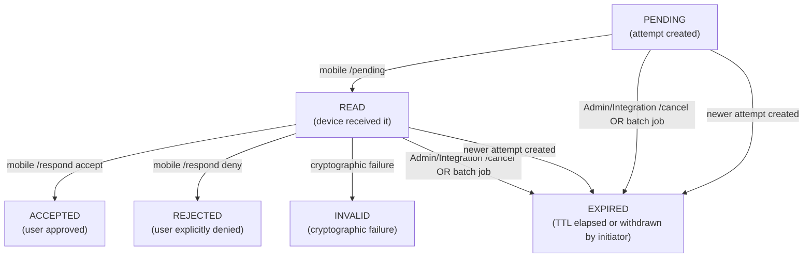

> **Implementation status:** **Implemented and validated** in-repo (batch job persisting `EXPIRED` for attempts past `expires_at`, repository bulk update, `AuthAttemptStatus.READ` javadoc, demo-device pending-auth screen without misleading Cancel, mobile lab copy clarifying Approve/Deny-only UX, Admin API config for `ezkey.auth-attempt.expiry-scheduler.*`). The optional Admin UI rename to “Withdraw” was **not** applied (kept aligned with `cancel` API/audit naming).

# Auth attempt lifecycle — product review and recommendations

## 1. Verified current state

### Status enum and transitions

```46:79:ezkey-core/src/main/java/org/ezkey/authattempt/domain/AuthAttemptStatus.java
PENDING → READ → ACCEPTED | REJECTED | INVALID
Any → EXPIRED (supersession or cancel)
```

### How each status is written to DB today


| Trigger                                         | DB change                 |
| ----------------------------------------------- | ------------------------- |
| Admin/Integration API creates attempt           | New row: `PENDING`        |
| Mobile calls `POST /pending`                    | `PENDING → READ`          |
| Mobile calls `POST /respond` (accept)           | `READ → ACCEPTED`         |
| Mobile calls `POST /respond` (deny)             | `READ → REJECTED`         |
| Admin/Integration API calls `POST /{id}/cancel` | `PENDING                  |
| New attempt created for same enrollment         | Older `PENDING            |
| **TTL clock runs out**                          | **Nothing written to DB** |


### The gap: no batch job

Confirmed: there is **no `@Scheduled` job** that flips timed-out rows to `EXPIRED`. `[AuthAttemptWaitService.calculateStatus()](ezkey-core/src/main/java/org/ezkey/authattempt/service/AuthAttemptWaitService.java)` calculates `EXPIRED` at query time (from `expiresAt`) but **does not persist it**. A row that reaches its TTL while in `PENDING` or `READ` stays in that status in the DB indefinitely.

### What "mobile Cancel = do nothing" means today

When the mobile user reads the attempt (calls `/pending` → DB = `READ`) and then:

- Taps **Approve** → `ACCEPTED`
- Taps **Deny** → `REJECTED`
- Taps **Cancel / closes the screen** → **nothing is called**, DB stays `READ`

The row stays `READ` forever unless the admin cancels it, a new attempt supersedes it, or the wait poll happens to reach the TTL. The DB never self-corrects.

---

## 2. Product issues

### Issue A — DB state is inconsistent with real-world state

An attempt that expired at TTL while in `READ` will show as `READ` in the database and in audit logs — not `EXPIRED`. This misrepresents the timeline: the audit trail says "device received it" with no resolution, which is inaccurate and confusing for investigations.

### Issue B — "READ forever" is semantically wrong

`READ` is an intermediate state, not a terminal one. Leaving it permanent pollutes dashboards, stats, and audit queries. Every genuine resolution (the user simply did not authenticate in time) should produce a terminal `EXPIRED` record.

### Issue C — "Cancel from mobile" adds accidental complexity

The question is: should the Auth API expose a `POST /auth-attempts/cancel` endpoint usable by the mobile device? The analysis below shows this adds no real value.

---

## 3. Comparison — Duo and equivalent push-MFA systems

Duo, Microsoft Authenticator, and similar systems:

- The mobile user sees **Approve** and **Deny** only.
- Closing/ignoring the push → request expires at its TTL (server-side timer).
- There is **no mobile-initiated "cancel"** concept. "Cancel" belongs only to the initiating system (the app, admin, or policy engine), not to the approver.
- Deny is explicit: "I was asked to authenticate and I refused." It carries security weight (fraud signal, lockout trigger in Duo Fraud Detection).
- Expired means: "nobody acted within the allowed window." This is a distinct, meaningful state for audit and anomaly detection.

The reason push-MFA products do not offer a mobile "cancel" is precisely the overlap problem: a cancel is semantically indistinguishable from ignoring the request, which is indistinguishable from missing the notification. The batch expiry already covers all three.

---

## 4. Recommended model

### Decision 1 — Add a batch job to flush stale rows

A simple scheduled task, running every minute (or on a configurable interval), executes:

```sql
UPDATE ezkey_auth_attempt
SET auth_attempt_status = 'EXPIRED'
WHERE auth_attempt_status IN ('PENDING', 'READ')
  AND expires_at < NOW()
```

This closes the DB inconsistency permanently. Every attempt that runs out of time will eventually (within one scheduling interval) carry `EXPIRED` in the audit log. No code path changes are required; no new status values are needed.

- Suggested class: `AuthAttemptExpiryScheduler` in `ezkey-core` (or `ezkey-admin-api`), annotated `@Scheduled(fixedDelayString = "${ezkey.core.auth-attempt.expiry-scheduler-interval-ms:60000}")`.
- Log count of rows updated at `INFO` level for operational monitoring.

### Decision 2 — Do NOT add a mobile-side cancel endpoint

Reasoning:

- It adds zero operational value over letting the batch expiry run.
- It creates semantic confusion: **Cancel** vs **Deny** are already two distinct concepts from the user's perspective ("I don't want to log in" vs "I explicitly refuse this request I didn't initiate"). Adding a third path ("I am explicitly saying I am closing this screen") serves no real security or audit purpose.
- Duo and comparable products agree: the mobile device approves or denies. Expiry is managed server-side.
- The initiating side (Admin UI, Integration API) already has `/cancel` for the case where the operator wants to withdraw the request. That asymmetry is intentional and correct.

### Decision 3 — Keep the Admin/Integration-side cancel as-is

The Admin UI "Cancel" button → `POST /{id}/cancel` → `EXPIRED` is correct semantically: the initiator (not the approver) withdraws the request. This is the mirror of the Integration API's cancel. Keep it.

### Decision 4 — Rename "Cancel" in Admin UI copy to "Withdraw"

Minor but worth doing. "Cancel" in the Admin UI means "I, as the operator who triggered this MFA challenge, withdraw it." The clearer label is **Withdraw**. This avoids conceptual collision with "Cancel = close the screen" on the mobile side, and aligns with the language used by comparable systems (Okta calls it "Withdraw push notification").

---

## 5. Final lifecycle (clean)




- `**READ**` is now always a truly transient state: it resolves to a terminal status within at most one scheduler interval.
- **Audit story** for "user saw it but walked away": `PENDING` → `READ` → `EXPIRED` (batch). Accurate, readable, auditable.
- **Audit story** for "user explicitly refused": `PENDING` → `READ` → `REJECTED`. Security-meaningful.
- **Audit story** for "operator withdrew the request**: `PENDING` or `READ` → `EXPIRED` (cancel endpoint). Initiator's intent is captured.

---

## 6. Implementation scope

**Minimal required change (closes both issues):**

- [`AuthAttemptExpiryScheduler`] — new `@Scheduled` bean in `ezkey-core` or `ezkey-admin-api`
- One repository method: `updateExpiredAttempts(OffsetDateTime now)` with `@Modifying @Query`

**Remove Cancel button from the mobile lab app:**

- The lab app's Cancel button currently calls no API — it just closes the screen, leaving the DB in `READ` indefinitely.
- This is the exact antipattern the batch job fixes. Keeping the button misrepresents the intended UX and risks reproducing it in the final mobile app.
- The correct mobile UX is **Approve / Deny only**. Closing the screen is a navigation gesture, not an action; the server handles expiry.
- Remove the button and any related navigation/handler code in the lab mobile app.

**Low-value optional change (javadoc):**

- Update `AuthAttemptStatus.READ` javadoc to explicitly say "transient; resolved to EXPIRED by scheduler if no response"

**Not doing:**

- Mobile-side cancel endpoint (Auth API) — no value, adds complexity
- Rename Admin UI "Cancel" to "Withdraw" — the endpoint, audit log, and service all say `cancel`; renaming only the UI label creates a divergence between UI copy and code terminology without any benefit

