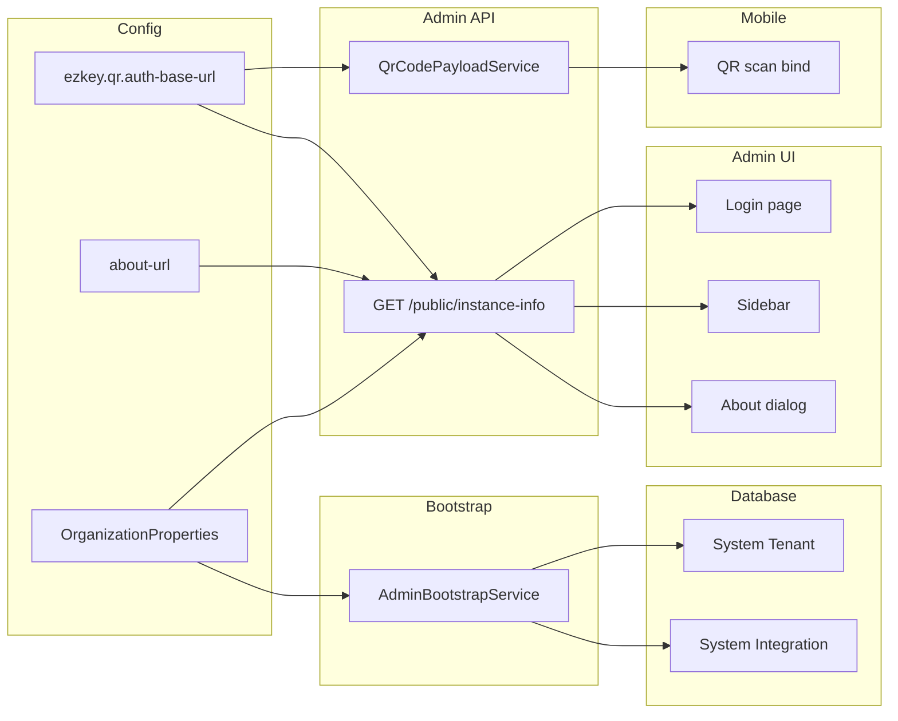

# Ezkey Instance Initialization and Instance Branding — Strategic Plan

> **Statut / status:** Ce plan est **entièrement à implémenter et à tester** dans le dépôt. Aucune phase ni section ci-dessous n’est considérée comme livrée tant que le code, la config et les vérifications manuelles (QE / lab) ne sont pas faits. Les cases à cocher des livrables Phase 1 / Phase 2 servent de feuille de route, pas d’état « fait ».

## Context: Three canonical deployment families

| Family                      | Example                                    | Characteristics                                                     |
| --------------------------- | ------------------------------------------ | ------------------------------------------------------------------- |
| **Reference (ezkey.org)**   | Author’s showcase, demo, GitHub visibility | Docker clean start, Cloudflare, rate limit, production-quality      |
| **On-prem (own equipment)** | Enterprise or individual, self-hosted      | Same software, instance name = organization (e.g. "Garage Du Coin") |
| **On-prem (own cloud)**     | Same org, cloud VPS/tenant                 | Same as above, branding identifies the instance                     |

Product positioning: **dev-first, on-prem, unattached, independent, open source, customizable**. Instance naming and branding must be externalized so that "Garage Du Coin" can see their admin console and login as their instance, not a generic "Ezkey System".

---

## Execution: two phases

| Phase       | Goal                                                                                                                         | Scope                                                                                                                                                                                                                                                                           |
| ----------- | ---------------------------------------------------------------------------------------------------------------------------- | ------------------------------------------------------------------------------------------------------------------------------------------------------------------------------------------------------------------------------------------------------------------------------- |
| **Phase 1** | Unblock QA / lab: **no hard-coded tunnel URL on mobile**; QR and operators can rely on **server-driven** public Auth API URL | Part 2A (QR + Docker + mobile + Admin UI `VITE_QR_AUTH_BASE_URL`) **and** minimal `**GET /api/v1/public/instance-info`** with `**authApiPublicBaseUrl`** (required field when implementing the endpoint in Phase 1; other branding fields can be omitted or null until Phase 2) |
| **Phase 2** | Instance identity in Admin UI + bootstrap cleanup                                                                            | Part 1 (system tenant/integration literals), Part 2 branding (extend instance-info with `instanceName`, `instanceDescription`, `aboutUrl`; login/sidebar/About; `ezkey.organization.about-url`), polish                                                                         |

**Phase 1 deliverable checklist (concise) — à implémenter et tester:**

- [ ] Admin API: `ezkey.qr.auth-base-url` set in Docker/lab (env var mapping, docs).
- [ ] Admin API: unauthenticated `GET /api/v1/public/instance-info` returning JSON that includes `**authApiPublicBaseUrl`** (same string as `QrCodeProperties.getAuthBaseUrl()`, or omitted/null when unset). Spring Security: `permitAll` for this path only.
- [ ] `ezkey_mobile`: remove ngrok from `env.ts` / `.env.example`; explicit fallback UX for bind without `authUrl` and without `EZKEY_API_BASE_URL`.
- [ ] Admin UI / docs: `VITE_QR_AUTH_BASE_URL` aligned with server where client-generated QR is used ([ADMIN_UI_RECOVERY.md](docs/ADMIN_UI_RECOVERY.md)).
- [ ] Document Phase 1 in ENDPOINT.md (instance-info + QR property). Maintainer runs `update-specs` after Docker start (per repo rules).

**Phase 2** follows the existing Part 1, Part 2 (full), and Part 3 polish items below; extend the same instance-info DTO rather than adding a second public endpoint.

---

## Part 1 — Remove hard-coded dependencies (foundation)

### 1.1 Current state: what is hard-coded

- **Backend bootstrap**
  - [AdminBootstrapService.java](ezkey-admin-api/src/main/java/org/ezkey/admin/service/AdminBootstrapService.java): sets `systemIntegration.setCode("ezkey-system")` and `systemIntegration.setName("Ezkey System")`. **OrganizationProperties is injected but never used.**
  - Lookup is correctly by **flag** (`findByIsSystemIntegrationAndActiveTrue(true)` and `findByIsSystemTenantTrue()`), not by string — so runtime logic is already flag-based. The problem is **display names and test expectations** tied to literals.
- **Migrations (do not change past migrations)**
  - [V3](ezkey-core/src/main/resources/db/migration/V3__create_system_tenant_and_admin_zero.sql): inserts system tenant with `tenant_name = 'Ezkey System'` and references it by that string.
  - [V27](ezkey-core/src/main/resources/db/migration/V27__add_system_tenant_flag.sql): sets `is_system_tenant = TRUE` where `tenant_name = 'Ezkey System'`.
  - [V43](ezkey-core/src/main/resources/db/migration/V43__flatten_integration_i18n.sql): sets `integration_name = 'Ezkey System'` for system integration when null.
  These are one-time migration steps; after they run, **runtime must never depend on the literal "Ezkey System"**. No migration edits — leave as-is.
- **Tests**
  - [IntegrationServiceTest.java](ezkey-core/src/test/java/org/ezkey/integration/service/IntegrationServiceTest.java): `new Tenant("Ezkey System", "System tenant")` and `createSystemTenant()` — tests assume a display name.
  - [TenantServiceTest.java](ezkey-admin-api/src/test/java/org/ezkey/admin/service/TenantServiceTest.java): `systemTenant.setTenantName("Ezkey System")`.
  Prefer a **shared constant** (e.g. in a test fixture or `BootstrapConstants`) for the default system tenant/integration display name so tests do not assert on a magic string and can be overridden by config in integration tests if needed.
- **Demo device**
  - [EzkeyAppController.java](ezkey-demo-device/src/main/java/org/ezkey/demo/device/controller/EzkeyAppController.java): `UNKNOWN_TENANT_NAME = "Ezkey System"` used when grouping enrollments by tenant. Prefer resolving tenant name from backend (e.g. from integration/tenant API) or from a shared config constant rather than a literal.
- **Documentation**
  - Many docs (OPERATIONAL.md, MULTI_TENANT_OBSERVATIONS.md, Postman, etc.) mention "Ezkey System" as the default name. Where they imply **runtime dependency** on that string, clarify that the system tenant/integration are identified by **flags** and that the **display name** is configurable via `ezkey.organization.name`. No need to remove every occurrence; avoid implying that code compares by string.

### 1.2 Actions (foundation)

1. **AdminBootstrapService**
  - Use **OrganizationProperties** for **display names** only:
    - When **creating** the system integration: set `systemIntegration.setName(organizationProperties.getName())` (and optionally set integration description from `organizationProperties.getDescription()` if the entity supports it).
    - Keep system integration **code** as a stable constant (e.g. `"ezkey-system"`) for the single system integration — it is not used for lookup (lookup is by `isSystemIntegration`). If you prefer zero literal, introduce a constant in a bootstrap/constants class and use it only for the code field.
  - Optionally, when the system tenant already exists (e.g. from V3): **update** the system tenant’s `tenantName` and `tenantDescription` from `OrganizationProperties` so that existing DBs reflect config after restart (idempotent, run after fetching system tenant). This makes "Ezkey System" the migration default and the first bootstrap run (or any run) can overwrite it with `ezkey.organization.name` / description.
  - Ensure **log messages** (e.g. "System Integration created: Ezkey System Admin") use the actual name from config (e.g. `organizationProperties.getName()`) instead of the literal "Ezkey System".
2. **Tests**
  - Introduce a **single constant** for the default system tenant/integration display name used in unit tests (e.g. `"Ezkey System"` in a test-constants class or fixture). Use it in IntegrationServiceTest and TenantServiceTest so that (a) there is no scattered literal, and (b) if we ever change the default, one place changes. Do **not** assert on that string in a way that would break when an integration test runs with a custom `ezkey.organization.name`; assert on behaviour (e.g. system tenant exists, is_system_tenant true) or on the constant.
3. **Demo device**
  - Replace `UNKNOWN_TENANT_NAME = "Ezkey System"` with tenant name resolved from API or a config property (e.g. from Admin API or a small config endpoint). If that’s out of scope for this plan, at least use a named constant (e.g. from a shared module or config) so the literal lives in one place.
4. **Docs**
  - In OPERATIONAL.md and any bootstrap/tenant docs: state explicitly that the **system tenant and system integration are identified by DB flags** (`is_system_tenant`, `is_system_integration`), and that the **display name** is configurable via `ezkey.organization.name` and applied at bootstrap. Update OPERATIONAL.md "Default name: Ezkey System (configurable)" to mention that bootstrap applies `ezkey.organization.name` to the system tenant and system integration display names.

---

## Part 2 — Instance branding (product positioning)

### 2.1 Single source of truth: OrganizationProperties

- **Existing:** [OrganizationProperties](ezkey-admin-api/src/main/java/org/ezkey/admin/config/OrganizationProperties.java) already has `name` (default `"Ezkey System"`) and `description`.
- **Use:** This is the **instance display name** (and optional description) for the installation. For "Garage Du Coin", set `ezkey.organization.name=Garage Du Coin` (or e.g. "Ezkey — Garage Du Coin" if desired). No new "instance" table needed — the system tenant and system integration **display names** are updated from this config at bootstrap (Part 1).

### 2.2 Optional: About URL

- Add an optional property, e.g. `ezkey.organization.about-url` (or `ezkey.instance.about-url`), so the Admin UI "About / Learn more" link can point to a custom page (e.g. company page describing this instance). Default: leave empty or point to project/docs (e.g. GitHub or ezkey.org).

### 2.3 Exposing instance info to the Admin UI

- **Single unauthenticated endpoint:** `GET /api/v1/public/instance-info` (path name indicative; adjust if routing conventions differ).
- **Phase 1 response (minimum):** include `**authApiPublicBaseUrl`** (string or null) sourced from [QrCodeProperties](ezkey-admin-api/src/main/java/org/ezkey/admin/config/QrCodeProperties.java) — same value embedded in QR as `authUrl`. Lets operators and tooling verify “what URL phones get” without reading config files. Not a substitute for `authUrl` inside the scanned QR.
- **Phase 2 extension:** add `instanceName`, `instanceDescription`, `aboutUrl` from OrganizationProperties (+ new `ezkey.organization.about-url`) for login/sidebar/About. One DTO, versioned or additive fields only.
- **Security:** read-only, no DB, no secrets; permitAll for this path only in Spring Security configuration.

### 2.4 Admin UI changes

- **Login page** ([login.tsx](ezkey-admin-ui/src/pages/login.tsx))
  - Call `GET /api/v1/public/instance-info` (or chosen path) on load (or once per session).
  - Below the existing brand/tagline (or in the footer), display a short line such as "Server: {instanceName}" or "Instance: {instanceName}". If the endpoint fails or returns empty, fall back to not showing the line or to a generic "EZKey" label so existing deployments keep working.
- **Sidebar / header** ([sidebar.tsx](ezkey-admin-ui/src/components/layout/sidebar.tsx), [header.tsx](ezkey-admin-ui/src/components/layout/header.tsx))
  - Fetch instance info once when the app shell loads (or reuse from the same endpoint).
  - In the **sidebar** brand block: show the instance name in addition to (or as subtitle of) the product brand, e.g. "EZKey" + "Garage Du Coin" so the banner always identifies the instance.
  - Optionally in the **header**: small text indicating the instance (e.g. next to "Signed in as") so it’s visible on every page.
- **About dialog** ([sidebar.tsx](ezkey-admin-ui/src/components/layout/sidebar.tsx) About section)
  - Use instance name in the About title or description (e.g. "About EZKey — Garage Du Coin" or "This is the admin console for {instanceName}").
  - "Learn more" link: use `aboutUrl` from instance info when present; otherwise keep current default (e.g. GitHub or ezkey.org).
  - Version can stay in the sidebar footer; if desired, include it in the About dialog as well.
- **Build/runtime:** Instance name is **runtime** (from API), not build-time, so the same Admin UI build can serve any on-prem or cloud instance without rebuilding. No need for `VITE_INSTANCE_NAME` unless you also want a fallback when the API is unreachable.

### 2.5 Configuration summary

| Property                             | Purpose                                                                                         | Default              |
| ------------------------------------ | ----------------------------------------------------------------------------------------------- | -------------------- |
| `ezkey.organization.name`            | Instance display name (system tenant + system integration name at bootstrap; instance-info API) | `"Ezkey System"`     |
| `ezkey.organization.description`     | Optional description (system tenant/integration; instance-info API)                             | Existing default     |
| `ezkey.organization.about-url` (new) | Optional URL for "Learn more" in About                                                          | Empty or project URL |

Docker/Compose: document these (e.g. `EZKEY_ORGANIZATION_NAME`, `EZKEY_ORGANIZATION_ABOUT_URL`) for clean start so "Garage Du Coin" can set them at deploy time.

---

## Part 2A — Enrollment QR: public Auth API URL (mobile / QE lab)

**Goal:** Any installation (including QE lab with a tunnel such as ngrok) configures the **public base URL of the Auth API** on the **Admin API** so that enrollment QR codes embed `authUrl` in JSON. The **mobile app** must not depend on a developer-specific hard-coded URL in `ezkey_mobile`.

### What already exists (verify, do not re-invent)

- **Admin API:** [QrCodeProperties](ezkey-admin-api/src/main/java/org/ezkey/admin/config/QrCodeProperties.java) / `ezkey.qr.auth-base-url` and [QrCodePayloadService](ezkey-admin-api/src/main/java/org/ezkey/admin/service/QrCodePayloadService.java) already add an `authUrl` field to QR JSON when this property is set (non-blank). Same payload is used for enrollment QR endpoints, admin onboarding QR, bootstrap ASCII QR, and [BootstrapCredentialsFileExporter](ezkey-admin-api/src/main/java/org/ezkey/admin/service/BootstrapCredentialsFileExporter.java).
- **Mobile:** [EnrollmentWizardScreen.tsx](ezkey_mobile/app/screens/EnrollmentWizard/EnrollmentWizardScreen.tsx) `parseQrPayload` already reads optional `authUrl` from JSON and uses it for bind/verify; stored per enrollment and used for pending/respond ([enrollments.ts](ezkey_mobile/app/services/api/enrollments.ts), [authAttempts.ts](ezkey_mobile/app/services/api/authAttempts.ts)).
- **Docs:** [docs/ENDPOINT.md](docs/ENDPOINT.md) and [application-docker.properties](ezkey-admin-api/config/application-docker.properties) (commented `ezkey.qr.auth-base-url=`) describe the behaviour.

### Current gap (QE lab)

- [ezkey_mobile/app/config/env.ts](ezkey_mobile/app/config/env.ts) uses a **hard-coded ngrok** `fallbackBaseUrl` when `EZKEY_API_BASE_URL` is unset; [.env.example](ezkey_mobile/.env.example) repeats the same tunnel URL.
- When **Admin API** does **not** set `ezkey.qr.auth-base-url`, QR payloads omit `authUrl`, so the app falls back to that ngrok default — coupling every lab device to one maintainer URL.

### Plan additions

1. **Operations / Docker / lab**
  - For each environment where phones reach Auth API via a public URL (ngrok, Cloudflare Tunnel, reverse proxy, on-prem hostname), set `**ezkey.qr.auth-base-url`** to that **public Auth API base** (scheme + host + port if needed, no path suffix unless your Auth API is mounted under a path — match how mobile calls `/api/v1/...`).
  - Update **docker-compose** (or env templates used by QE) so `ezkey.qr.auth-base-url` is wired from an env var (e.g. `EZKEY_QR_AUTH_BASE_URL`) alongside other Ezkey properties; document in OPERATIONAL.md / mobile README that **QR-first** deployments should set this so scans are self-describing.
2. **Mobile (`ezkey_mobile`) — remove lab hard-coding**
  - Remove the **ngrok** string from `env.ts` and `.env.example`; replace with either:
    - **No insecure default:** e.g. empty string or a clearly local placeholder (`http://127.0.0.1:8080`) plus runtime UX when bind is attempted without `authUrl` and without `EZKEY_API_BASE_URL` (message: scan a QR that includes `authUrl`, or set `EZKEY_API_BASE_URL` in `.env` and rebuild), **or**
    - **Dev-only** placeholder documented as non-production, never a real tunnel URL checked into the repo.
  - Keep **pipe-delimited** legacy QR format behaviour: it has no `authUrl`, so `EZKEY_API_BASE_URL` remains the fallback for that path only.
3. **Public instance-info (Phase 1 — required)**
  - Implement `GET /api/v1/public/instance-info` with `**authApiPublicBaseUrl`** (see Part 2.3). **Do not** treat this as a substitute for embedding `authUrl` in the QR — the scan path remains authoritative for enrollment.
4. **Admin UI**
  - Where the UI generates enrollment QR client-side (e.g. recovery flow per [docs/ADMIN_UI_RECOVERY.md](docs/ADMIN_UI_RECOVERY.md)), keep `**VITE_QR_AUTH_BASE_URL`** in sync with server `ezkey.qr.auth-base-url` for that deployment so browser-generated QR matches API-generated QR.

### Configuration summary (add to Part 2.5 table mentally)

| Property                 | Purpose                                                                    | Default                |
| ------------------------ | -------------------------------------------------------------------------- | ---------------------- |
| `ezkey.qr.auth-base-url` | Public Auth API base URL embedded as `authUrl` in enrollment/admin QR JSON | unset (omit `authUrl`) |

---

## Part 3 — Additional angles (blind spots and comparables)

- **Document title:** [index.html](ezkey-admin-ui/index.html) currently has a fixed `<title>EZKey Tenant Admin</title>`. For stronger branding, the SPA could set `document.title` at runtime from instance name (e.g. "{instanceName} — Admin") when instance info is loaded. Low cost, high visibility in the tab.
- **Favicon:** No change needed unless the product later supports per-instance favicon (often out of scope for v1).
- **Actuator / health:** Some products expose instance id/name in `/actuator/info` for monitoring. Optional: add a custom `InfoContributor` that adds `instanceName` (from OrganizationProperties) so monitoring and runbooks can identify the instance without logging into the UI.
- **Mobile app (display names):** When the user approves an auth attempt, integration/tenant naming from the Auth API still applies once enrolled. **Reachability** for new enrollments is covered by **Part 2A** (`ezkey.qr.auth-base-url` + removal of ngrok fallback in `ezkey_mobile`).
- **Emails / notifications:** If Ezkey later sends emails (e.g. recovery, alerts), the "From" or body could include the instance name from OrganizationProperties — keep that in mind when adding notification features.
- **Security:** The public instance-info endpoint must return only non-sensitive data (name, description, about URL, and optionally the public Auth API base URL already used in QR codes). No internal IDs, no tenant list, no user data, no secrets.

---

## Implementation order (two phases)

### Phase 1 — QR / Auth URL + QA (do this first)

- [ ] **Docker / env:** Wire `ezkey.qr.auth-base-url` from env (e.g. `EZKEY_QR_AUTH_BASE_URL`) in compose or lab templates; document in OPERATIONAL.md and [ezkey_mobile/README.md](ezkey_mobile/README.md) (QR-first workflow).
- [ ] **Admin API:** Add `GET /api/v1/public/instance-info` with `**authApiPublicBaseUrl**` from `QrCodeProperties`; Spring Security `permitAll`; unit test; OpenAPI annotations (spec regenerated by maintainer).
- [ ] **Mobile:** Remove ngrok hard-coding from [env.ts](ezkey_mobile/app/config/env.ts) and [.env.example](ezkey_mobile/.env.example); implement clear bind-time behaviour when both QR `authUrl` and `EZKEY_API_BASE_URL` are absent.
- [ ] **Admin UI:** Document or template `VITE_QR_AUTH_BASE_URL` for deployments that generate QR in-browser; match `ezkey.qr.auth-base-url`.
- [ ] **Docs:** ENDPOINT.md — instance-info + cross-link to `ezkey.qr.auth-base-url`.

### Phase 2 — Bootstrap + full branding

- [ ] **Foundation (Part 1):** OrganizationProperties in AdminBootstrapService; test constants; demo-device literal; OPERATIONAL.md flag vs name.
- [ ] **Backend:** Extend instance-info DTO with `instanceName`, `instanceDescription`, `aboutUrl`; add `ezkey.organization.about-url` to OrganizationProperties.
- [ ] **Admin UI (Part 2.4):** Login, sidebar/header, About consuming full instance-info; optional `document.title`.
- [ ] **Polish:** Docker env for organization + about URL; optional actuator InfoContributor; docs/Postman pass for "Ezkey System" string implications.

---

## Summary diagram

- **Phase 1:** `ezkey.qr.auth-base-url` feeds both **QrCodePayloadService** (`authUrl` in QR) and **instance-info** (`authApiPublicBaseUrl`); **mobile** removes baked-in tunnel URL.
- **Phase 2:** **OrganizationProperties** drives bootstrap (display names) and extends instance-info + **Admin UI** (login, sidebar, About).
- **Bootstrap** (Phase 2) updates system tenant and system integration **display names**; identification remains by **flags** in the DB.
- **QR payloads** embed `authUrl` when `ezkey.qr.auth-base-url` is set so the **mobile app** does not rely on a baked-in tunnel URL.

