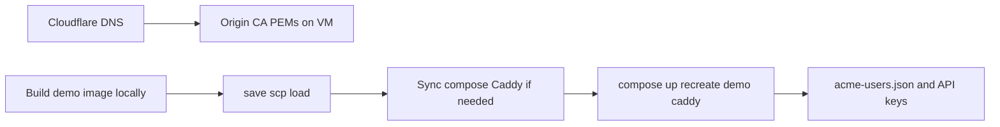

> **Plan status:** Completed. Location: `.cursor/plans/archived/2026-04/`. All frontmatter todos below are `completed`.

# Progressive introduction of ACME demo on experimental Lightsail

## What the codebase already provides

- **[`experimental-hybrid/lightsail/docker-compose.yml`](experimental-hybrid/lightsail/docker-compose.yml)** — `demo-app-acme` service (`ezkey-demo-app-acme:latest`), volumes `demo-app-acme-data` / `demo-app-acme-config`, `EZKEY_ADMIN_API_URL: http://admin-api:9080`, secure session cookie. **Caddy** `depends_on` `demo-app-acme` with `service_healthy` (Caddy will not start until the demo is healthy).
- **[`experimental-hybrid/lightsail/Caddyfile`](experimental-hybrid/lightsail/Caddyfile)** — site block `exp1-demo-acme.ezkey.org` → `reverse_proxy demo-app-acme:8082` (TLS 1.3, same Origin CA pattern as the APIs).
- **Image build** — multi-stage target in root [`docker/Dockerfile`](docker/Dockerfile) (`--target demo-app-acme` → tag `ezkey-demo-app-acme:latest`).

**Correction to “Dockerfile on LightSail”:** the documented Lightsail path is **build (or `compose build`) on the dev machine → `docker save` → `scp` → on-VM `docker load`**, not a rebuild of the main Dockerfile *on* the instance (unless you deliberately clone and build on the VM). your described flow matches **save / scp / load** + **updating** `docker-compose.yml` / `Caddyfile` on the VM if they lag the repo.

## Repo work (agreed): `--include-demo-acme` on the export script

**Goal:** One flag on [`experimental-hybrid/scripts/export-backend-images-to-lightsail.sh`](experimental-hybrid/scripts/export-backend-images-to-lightsail.sh) so operators can include the demo in the same **save → scp → load** loop as the backends.

**Behavior (spec for implementation):**

- New CLI flag: **`--include-demo-acme`** (opt-in; default unchanged so existing automation is not surprised by a larger tar or a missing local image).
- When set, append **`ezkey-demo-app-acme:latest`** / **`ezkey-demo-app-acme.tar`** to the same `IMAGES` / `TARS` arrays used for the loop (order: after the three API tars, or after migration if migration is included — pick one consistent order and document it; e.g. migration, three APIs, then demo last).
- **Prerequisite:** Image must exist locally; if not, fail with a clear message pointing to build from repo root, e.g. `docker build -f docker/Dockerfile --target demo-app-acme -t ezkey-demo-app-acme:latest .` (align the exact line with [`experimental-hybrid/README.md`](experimental-hybrid/README.md) / main Dockerfile target name).
- Update the script header comment and **`usage()`** block to list the new flag alongside `--apis-only`, `--clean-start`, etc.
- **[`experimental-hybrid/README.md`](experimental-hybrid/README.md)** or **[`experimental-hybrid/DEPLOYMENT_PLAYBOOK.md`](experimental-hybrid/DEPLOYMENT_PLAYBOOK.md)** — one short sentence where export is mentioned: optional `--include-demo-acme` for the ACME demo image.

**Companion doc:** **[`experimental-hybrid/BACKEND_ROLLING_UPDATE.md`](experimental-hybrid/BACKEND_ROLLING_UPDATE.md)** — add a table row for Compose service `demo-app-acme`, build target `demo-app-acme`, image `ezkey-demo-app-acme:latest`, and the `docker compose up -d --no-deps --force-recreate demo-app-acme` note (and that Caddy may need recreate if only Caddyfile/certs changed — not required for image-only demo updates).

## Progressive rollout (preserve existing stack and DB)

Avoid **`clean-start.sh`**, **`--clean-start`** on the export script, and **`docker compose down -v`** — those wipe volumes and destroy data ([`DEPLOYMENT_PLAYBOOK.md`](experimental-hybrid/DEPLOYMENT_PLAYBOOK.md) calls this out for `clean-start`).

Recommended sequence:

1. **Cloudflare DNS** — Add a public name for the demo, consistent with the Caddyfile (e.g. `exp1-demo-acme.ezkey.org`). The playbook uses **A records** to the Lightsail public IP for `exp1-*` hosts ([`DEPLOYMENT_PLAYBOOK.md` §0d/1b](experimental-hybrid/DEPLOYMENT_PLAYBOOK.md)); a **CNAME** to another hostname that already points to that same instance is also valid. Enable **proxied (orange)** like the other exp hosts.
2. **Cloudflare Origin certificate (critical)** — The playbook currently illustrates Origin CA for the **three API** FQDNs. Caddy uses **one** pair `origin.pem` / `origin-key.pem` for all site blocks. You must **create or re-issue** the Origin certificate so its **SAN list includes** `exp1-demo-acme.ezkey.org` (in addition to the API hostnames), then **replace the PEMs** on the VM under `~/ezkey/experimental-hybrid/lightsail/caddy-certs/` and **recreate Caddy** so TLS from Cloudflare → origin succeeds. Skipping this step typically breaks HTTPS for the new hostname only.
3. **Build and transfer image** — From repo root, build the demo image, then either run **`./experimental-hybrid/scripts/export-backend-images-to-lightsail.sh --include-demo-acme`** (after the script change) or the equivalent manual `docker save` / `scp` / `docker load` ([`BACKEND_ROLLING_UPDATE.md`](experimental-hybrid/BACKEND_ROLLING_UPDATE.md) pattern; **do not** rely on `docker compose restart` alone after `load` — use `up -d --force-recreate` for the affected service).
4. **Sync operator files on the VM (if the instance predates the demo)** — Copy current [`lightsail/docker-compose.yml`](experimental-hybrid/lightsail/docker-compose.yml) and [`lightsail/Caddyfile`](experimental-hybrid/lightsail/Caddyfile) to `~/ezkey/experimental-hybrid/lightsail/` (e.g. `scp` as in the playbook *VM initialization*). This does not touch Postgres or existing named volumes if you do not run `clean-start`.
5. **Bring up / recreate services without wiping data** — From `~/ezkey/experimental-hybrid/lightsail/`: e.g. `docker compose up -d` to create **new** `demo-app-acme-*` volumes and start the demo, then ensure **Caddy** is recreated to pick up Caddyfile / cert changes: `docker compose up -d --force-recreate caddy` (or a single `up -d` if everything is new). `postgres-data` and other existing volumes stay intact.
6. **Application-level configuration (not automatic on Lightsail unlike local `docker/start.sh`)** — The demo needs **`acme-users.json`** under `/app/data` (volume `demo-app-acme-data`) and **API key** credentials to the Admin API (env `EZKEY_INTEGRATION_KEY` / `EZKEY_SECRET_KEY` and/or [`/app/config/application.properties`](ezkey-demo-app-acme/config/application.properties.example) via the `demo-app-acme-config` volume, or the **Configure API Key** UI for session-scoped tests). Plan IP whitelist for the integration key so the `demo-app-acme` container IP (or your policy) is allowed — see [`ezkey-demo-app-acme/AGENTS.md`](ezkey-demo-app-acme/AGENTS.md) (401 / whitelist section).
7. **Trusted proxies for the demo (recommended behind Caddy + Cloudflare)** — The ACME app supports `ezkey.trusted-proxies.cidrs` ([`application.properties.example`](ezkey-demo-app-acme/config/application.properties.example)). The Lightsail compose snippet does not yet mirror `EZKEY_TRUSTED_PROXIES_CIDRS` for the demo; set the same CIDRs as the APIs (or via config file) so client IP / rate limits behave correctly with `CF-Connecting-IP` / `X-Forwarded-For`.
8. **End-to-end auth** — A full public login still requires a **device approval** path (e.g. demo device or real device) matching your Auth API / QR URLs; that is an operational/product concern beyond Caddy + container bring-up.

## Summary alignment with your list

| Your step | Accurate? |
|-----------|-----------|
| CNAME (or A) in Cloudflare for naming | Yes — add DNS; playbook favors **A** to Lightsail IP; CNAME to an existing `exp1-*` host is an alternative. |
| Include demo in “Dockerfile on LightSail” | Interpret as: **image built from** [`docker/Dockerfile`](docker/Dockerfile) **`demo-app-acme` target**, delivered to the host via **tar + load** (and compose service definition on the VM). |
| scp + load + update compose + complete deployment | Yes — match [`BACKEND_ROLLING_UPDATE.md`](experimental-hybrid/BACKEND_ROLLING_UPDATE.md); use export script with **`--include-demo-acme`** once implemented. |
| Caddy “routing” | Yes — **Caddy** (not KDE) is already configured; ensure Origin CA and DNS include the demo hostname, then reload/recreate Caddy. |

**Additional must-have:** re-issue **Origin CA** to include the demo FQDN — easy to miss if only the three API names were on the cert.
