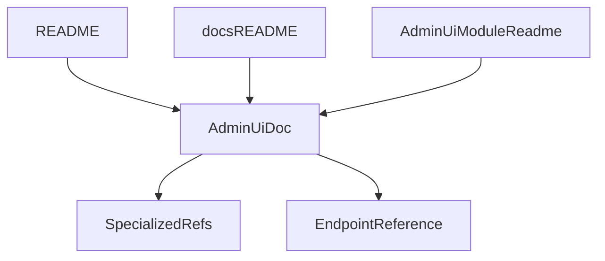

# Admin UI Documentation Balance

## Goal

Create a lean, durable documentation layer for the EZKey Admin UI that sits between product philosophy and low-level technical reference.

The documentation should explain:

- what the Admin UI is for,
- who it is for,
- what capabilities it covers,
- how it relates to the Admin API and operational docs,
- which operator workflows matter most.

It should not become a screen-by-screen manual or a duplicate of `[c:\github\ezkey\docs\ENDPOINT.md](c:\github\ezkey\docs\ENDPOINT.md)`.

## What The Repo Already Tells Us

Existing docs already establish the right foundation:

- `[c:\github\ezkey\PRD.md](c:\github\ezkey\PRD.md)` and `[c:\github\ezkey\docs\PROJECT_POSITIONING.md](c:\github\ezkey\docs\PROJECT_POSITIONING.md)` frame the Admin UI as the primary human administration surface, while keeping trust in the backend.
- `[c:\github\ezkey\README.md](c:\github\ezkey\README.md)` and `[c:\github\ezkey\docs\ARCHITECTURE.md](c:\github\ezkey\docs\ARCHITECTURE.md)` already describe the Global Admin vs Tenant Admin split.
- `[c:\github\ezkey\ezkey-admin-ui\README.md](c:\github\ezkey\ezkey-admin-ui\README.md)` is currently more developer/setup-oriented than operator-oriented.
- `[c:\github\ezkey\docs\admin-ui-security.md](c:\github\ezkey\docs\admin-ui-security.md)`, `[c:\github\ezkey\docs\ADMIN_UI_RECOVERY.md](c:\github\ezkey\docs\ADMIN_UI_RECOVERY.md)`, and `[c:\github\ezkey\docs\REENCRYPTION_OPERATIONS.md](c:\github\ezkey\docs\REENCRYPTION_OPERATIONS.md)` already cover focused deep topics that should be linked, not re-explained.
- `[c:\github\ezkey\ezkey-admin-ui\src\routes.tsx](c:\github\ezkey\ezkey-admin-ui\src\routes.tsx)` shows the real UI capability map: login, dashboard, tenants, integrations, enrollments, admins, auth attempts, audit logs, API keys, and encryption keys.

## Comparable Project Pattern

Comparable OSS admin/security consoles such as Keycloak, Authentik, Vault UI, ZITADEL, NetBird, and Ory typically converge on a small documentation core:

- short positioning for the console,
- roles and concepts,
- task-oriented operator workflows,
- explicit UI boundaries and links to API/ops docs,
- minimal duplication of field-level or endpoint-level detail.

That is the right target here.

## Recommended Documentation Shape

Keep the Admin UI documentation to one canonical operator-facing page plus a few navigation updates.

### 1. Add one canonical Admin UI document

Add a new document such as `[c:\github\ezkey\docs\ADMIN_UI.md](c:\github\ezkey\docs\ADMIN_UI.md)` with these sections:

- Purpose of the Admin UI in EZKey
- Audience and role split: Global Admin vs Tenant Admin
- Capability map by area: platform, tenant, integrations, enrollments, admins, API keys, audit, encryption
- UI/API/operations boundary: what the UI covers vs what belongs in API reference or operational docs
- Core operator workflows: login, tenant setup, integration setup, enrollment management, admin onboarding, recovery, audit review, key management
- Design philosophy: pragmatic, backend-first, self-hosted, not a decorative console
- Links to deeper docs for security, recovery, re-encryption, and endpoints

### 2. Tighten entry points so the new page is discoverable

Update:

- `[c:\github\ezkey\README.md](c:\github\ezkey\README.md)`
- `[c:\github\ezkey\docs\README.md](c:\github\ezkey\docs\README.md)`
- `[c:\github\ezkey\ezkey-admin-ui\README.md](c:\github\ezkey\ezkey-admin-ui\README.md)`

Intent:

- root README: mention the new Admin UI background doc as the main human-admin reference,
- docs index: route operators and contributors to it early,
- module README: stay focused on dev/setup/security and link outward for operator/product context.

### 3. Preserve deep-dive docs as specialized references

Do not fold focused docs into the new page. Instead, link out to:

- `[c:\github\ezkey\docs\admin-ui-security.md](c:\github\ezkey\docs\admin-ui-security.md)`
- `[c:\github\ezkey\docs\ADMIN_UI_RECOVERY.md](c:\github\ezkey\docs\ADMIN_UI_RECOVERY.md)`
- `[c:\github\ezkey\docs\REENCRYPTION_OPERATIONS.md](c:\github\ezkey\docs\REENCRYPTION_OPERATIONS.md)`
- `[c:\github\ezkey\docs\ENDPOINT.md](c:\github\ezkey\docs\ENDPOINT.md)`

This keeps one source of truth per concern.

## Scope Boundaries

Include:

- product and operator framing,
- role-based capability overview,
- high-value workflows,
- doc routing between UI, API, and ops.

Exclude:

- exhaustive screen-by-screen descriptions,
- full field documentation already present in API docs,
- repeated security implementation detail already covered elsewhere,
- screenshot-heavy maintenance burden unless later justified.

## Proposed Information Architecture

## Expected Outcome

After this work, the repo should offer a clear middle layer:

- philosophy and product framing remain in existing top-level docs,
- the Admin UI gets one understandable background/reference page for operators and contributors,
- API and security deep dives remain specialized,
- the documentation becomes easier to navigate without creating a parallel manual for every screen.

