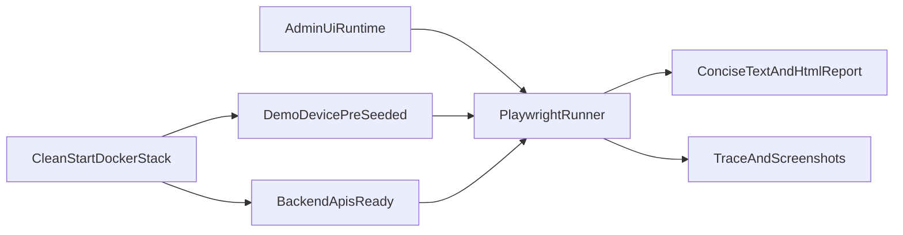

# Admin UI Browser Tests Plan

## Final Status

- Status: completed
- Implementation: implemented
- Validation: tested

## Recommendation

- Use **Playwright Test in TypeScript** inside `[ezkey-admin-ui](ezkey-admin-ui)`, not Playwright Java/JUnit.
- Reuse the **existing testing philosophy and taxonomy** from `[ezkey-tests/pom.xml](ezkey-tests/pom.xml)` and `[ezkey-tests/src/test/java/org/ezkey/tests/tags/TestTags.java](ezkey-tests/src/test/java/org/ezkey/tests/tags/TestTags.java)`, but do **not** force the browser suite into Maven/JUnit just for uniformity.
- Target the already-established **stable clean-start stack**, explicitly including the **pre-seeded Demo Device** as part of the validation environment.
- Prefer **true Admin UI ↔ Demo Device end-to-end scenarios** over seeded-session shortcuts whenever the Demo Device already makes the protocol flow practical to automate.

## Why This Fits EZKey

- `[ezkey-admin-ui/package.json](ezkey-admin-ui/package.json)` is already a Vite/React/TypeScript toolchain, so Playwright fits the frontend stack naturally and keeps selectors, fixtures, and debug artifacts close to the UI code.
- `[ezkey-admin-ui/start.sh](ezkey-admin-ui/start.sh)` already provides the **Docker-first QA path** for the built SPA, which is the right target for browser smoke tests.
- `[docker/README.md](docker/README.md)` documents that the Docker stack includes the Demo Device on `8083` and that `bootstrap-init` pre-seeds it for immediate authentication flows.
- `[ezkey-demo-device/plan_demo_device.md](ezkey-demo-device/plan_demo_device.md)` shows that the Demo Device implements the real bind/verify and pending/respond protocol flows, which gives the browser strategy unusually strong end-to-end realism.
- `[ezkey-tests/README.md](ezkey-tests/README.md)` still remains relevant as the place where the clean-start and broader test philosophy are already framed.

```140:178:docker/README.md
### Demo Device (demo-device)
- **Port**: `8083`
- **Purpose**: Simulated mobile device for testing enrollment and authentication flows
- **Bootstrap**: Pre-seeded with global admin enrollment on first startup

### Bootstrap Init (bootstrap-init)
- **Purpose**: Automatically performs enrollment bind+verify and seeds demo-device

## Bootstrap and Initialization
1. **Admin API** creates the global admin enrollment and exports bootstrap credentials to a file
2. **Bootstrap Init** container reads the credentials, performs bind+verify, and seeds demo-device
3. **Demo-device** is immediately ready for authentication flows
```

```116:123:ezkey-demo-device/plan_demo_device.md
- `GET /phone/ezkey` - Ezkey app home page
- `GET /phone/ezkey/enrollment/new` - New enrollment
- `POST /phone/ezkey/enrollment/bind` - Binding process
- `POST /phone/ezkey/enrollment/verify` - Verification process
- `GET /phone/ezkey/enrollments/{enrollmentId}/auth` - Authentication page
- `POST /phone/ezkey/enrollments/{enrollmentId}/auth/respond` - Authentication response
```

## Target Shape




## Phase 0: Positioning For Testability

- Add a **small number** of stable hooks in the Admin UI where role/label selectors will be brittle because of i18n, repeated controls, or role-based rendering.
- Expect the same need on the Demo Device side if its Thymeleaf templates do not already expose selectors stable enough for Playwright.
- Prefer accessible selectors first; add `data-testid` only for critical anchors such as:
  - login form root and primary submit
  - sidebar/nav container and a few role-sensitive links
  - one representative list/table root
  - one representative detail-page action zone
  - Demo Device approval and rejection controls for pending auth attempts
- Candidate files for this positioning work:
  - `[ezkey-admin-ui/src/pages/login.tsx](ezkey-admin-ui/src/pages/login.tsx)`
  - `[ezkey-admin-ui/src/routes.tsx](ezkey-admin-ui/src/routes.tsx)`
  - `[ezkey-admin-ui/src/components/layout/sidebar.tsx](ezkey-admin-ui/src/components/layout/sidebar.tsx)`
  - `[ezkey-admin-ui/src/components/layout/app-shell.tsx](ezkey-admin-ui/src/components/layout/app-shell.tsx)`
  - `ezkey-demo-device/src/main/resources/templates/`**
- Keep this phase intentionally small: improve testability, not redesign the component tree.

## Phase 1: First Useful Browser Suite

- Add Playwright under `[ezkey-admin-ui](ezkey-admin-ui)` with a dedicated `e2e/` folder and wrapper scripts.
- Start with a **representative smoke slice**, not broad coverage:
  - unauthenticated redirect from `/` or a protected route to `/login`
  - login shell rendering, challenge toggle, and recovery entry-point
  - EN/FR language switch on the unauthenticated shell
  - help drawer access on the login page
  - not-found route behavior
  - **real global-admin passwordless login**: start login in Admin UI, approve on Demo Device, assert authenticated landing state
  - authenticated global-admin shell smoke after real approval: dashboard load, sidebar presence, logout
  - one representative post-login path after real approval, ideally a stable admin-console path such as `admins`, `integrations`, or `api-keys`
  - optional first negative path: reject authentication on Demo Device and assert Admin UI failure handling
- Keep phase 1 deliberately narrow even with Demo Device available; do not try to automate every operator workflow immediately.

## Exact Phase 1 Scenarios

- `smoke-public-shell`
  - Open Admin UI
  - Assert redirect or protected-route behavior toward `/login`
  - Assert login shell renders correctly
  - Assert language switch and help entry-point are functional
- `smoke-login-approve`
  - Start passwordless login from Admin UI
  - Open or reuse Demo Device page
  - Reach the pending authentication view on Demo Device
  - Approve the authentication
  - Assert Admin UI lands in an authenticated state
- `smoke-post-login-shell`
  - Starting from a real approved login, assert dashboard shell, key navigation, and logout
- `smoke-one-representative-workflow`
  - Starting from a real approved login, navigate to one stable screen
  - Favor one low-friction, high-signal page such as `admins`, `integrations`, or `api-keys`
  - Assert page load, one core list or detail element, and basic operator comprehension
- `elective-login-reject`
  - Start passwordless login
  - Reject on Demo Device
  - Assert Admin UI error or retry state

## Recommended Implementation Order

1. Add minimal stable selectors on both browser surfaces where accessibility selectors alone are too fragile.
2. Add Playwright config, folder structure, and the simplest public-shell smoke test.
3. Add shared fixtures for base URLs, browser pages, and waiting helpers for the two-surface flow.
4. Implement the real happy-path login with Demo Device approval.
5. Add one authenticated shell smoke after the real login succeeds.
6. Add one representative post-login workflow only after the login path is stable.
7. Add the rejection path as the first elective extension, not before the happy path is solid.
8. Add Docker-first wrapper scripts and concise output/report handling once the core scenarios are proven manually.

## Out Of Scope For Phase 1

- Full browser automation of fresh enrollment bind and verify flows beyond what clean-start already seeds
- Broad CRUD coverage across all admin screens
- Tenant matrix coverage across Global Admin and Tenant Admin in the first iteration
- Long-running browser churn or browser-side operational loops
- HA-specific browser coverage
- Browser validation of every edge-case auth outcome
- Heavy instrumentation or mock endpoints as a default path
- Video capture enabled by default
- Turning the Admin UI into a mandatory service inside the main clean-start flow unless that becomes a separate deliberate project decision

## Authentication Strategy

- Treat the **Demo Device as the primary authentication partner** for browser scenarios, not as an optional side tool.
- Use the clean-start assumption that the Demo Device is already seeded and ready for approval flows.
- Run Playwright against **two browser surfaces** in the same scenario:
  - Admin UI
  - Demo Device at `http://localhost:8083`
- The default happy-path login test should validate the real sequence:
  - initiate passwordless login in Admin UI
  - reach the pending approval state on Demo Device
  - approve or reject on Demo Device
  - assert the resulting Admin UI state
- Keep the seeded-session or token-injection approach only as a **fallback helper** for later focused post-login scenarios, not as the foundation of the strategy.

## Environment Assumptions

- The clean-start stack is the canonical baseline and includes:
  - Admin API
  - Auth API
  - Crypto API
  - Demo Device
  - bootstrap-init seeding
- The Admin UI itself is still a separate runtime concern and must be started either with:
  - `npm run dev` for developer iteration
  - `[ezkey-admin-ui/start.sh](ezkey-admin-ui/start.sh)` for QA/prod-like browser testing
- Browser docs and scripts must clearly distinguish these two realities:
  - clean-start gives the backend and device side
  - Admin UI start remains explicit unless the team later decides to compose it into the broader Docker flow

## Controlled Instrumentation Option

- Add a **narrow, explicit instrumentation layer** only for flows that are otherwise too costly or too nondeterministic even with the Demo Device available.
- The main candidates move away from the default login flow and toward rarer or harder-to-stage states.
- Prefer **backend-served canned scenarios** over ad-hoc frontend-only mocking when the goal is to exercise the real UI against realistic API shapes and timing.
- Typical scenarios that could justify this layer:
  - very specific timeout or edge failure paths
  - enrollment-related UI states that are difficult to reach deterministically from the browser alone
  - rare protocol or error branches that would be expensive to manufacture repeatedly in real end-to-end runs
- This layer should be:
  - explicitly enabled only in a dedicated test mode
  - isolated behind clearly named endpoints or flags
  - unavailable in normal clean-start production-safe usage
  - documented as browser-test support infrastructure, not product behavior

## Instrumentation Red Line

- Do **not** broadly mock the Admin API from inside Playwright for ordinary UI tests.
- Do **not** replace core backend behavior with frontend fixtures in a way that merely proves that React can render static JSON.
- Do **not** use instrumentation to bypass role boundaries, session semantics, pagination, or error handling that the browser suite should validate against the real system.
- Keep the default browser suite anchored in the **real Docker stack** and real API behavior wherever possible.
- Use canned/mock endpoints only where they preserve test value by making an otherwise impractical path deterministic.

## Recommended Hybrid Model

- Split the browser strategy into two clearly distinct modes:
  - **Real-system device-backed smoke**: default mode, running against the real clean-start stack with Admin UI plus Demo Device
  - **Instrumented scenario tests**: elective mode, using a minimal test-only backend seam for hard-to-reach auth or enrollment states
- This preserves the "eat your own dog food" spirit much more strongly than a seeded-session-first approach.
- In practice, this means phase 1 should focus on real-system device-backed smoke, while instrumentation is deferred and secondary.

## Execution Model

- **Default mode:** headless.
  - Best for repeatability, speed, and Docker-first usage.
  - Best default for QA and coding-agent validation.
- **Debug mode:** headed.
  - Keep as an explicit local option for human diagnosis and UI observation.
  - Do not make headed mode the default, especially for Docker-only execution.
- Recommended commands to expose through scripts/package scripts:
  - local dev against `npm run dev`
  - local prod-like against `[ezkey-admin-ui/start.sh](ezkey-admin-ui/start.sh)`
  - Docker-only runner for QA with a single Bash entrypoint
- For real device-backed scenarios, Playwright should manage at least two pages or contexts:
  - one for Admin UI
  - one for Demo Device

## Tags, Scope, And Suite Shape

- Mirror the intent of the existing taxonomy with a **small** browser tag set, for example:
  - `@smoke` for default representative checks
  - `@device-backed` for scenarios that require Demo Device interaction
  - `@elective` for deeper but non-default UI scenarios
  - `@post-login-helper` for any future storage-state shortcut tests, if they are ever added
  - `@instrumented` for explicit canned-scenario tests
  - optional `@debug-artifacts` only if later needed
- Keep browser tags semantically aligned with `[TestTags](ezkey-tests/src/test/java/org/ezkey/tests/tags/TestTags.java)`, but do not recreate every backend tag in the UI layer.
- Do **not** introduce a browser equivalent of operational churn in phase 1. If needed later, make it an opt-in companion that runs alongside existing operational churn rather than replacing it.

## Reporting And Debug Artifacts

- Produce a short, easily readable summary file in a mounted output directory for humans and agents.
- Keep Playwright’s richer artifacts available for failure analysis:
  - screenshot on failure
  - trace on failure
  - HTML report directory
- Keep **video disabled by default**.
  - It is useful for debugging and occasional storytelling/demo support.
  - It is usually too heavy as the default artifact policy for a pragmatic first phase.
- Add an explicit debug flag or separate script to enable video when needed.

## Docker-First Delivery

- Add a single QA-friendly Bash entrypoint that hides the mechanics.
- Likely files to introduce or update:
  - `[ezkey-admin-ui/package.json](ezkey-admin-ui/package.json)`
  - `ezkey-admin-ui/playwright.config.ts`
  - `ezkey-admin-ui/e2e/`
  - `ezkey-admin-ui/scripts/run-ui-tests.sh`
  - `ezkey-admin-ui/scripts/run-ui-tests-docker.sh`
  - `ezkey-admin-ui/docker/` test-runner Docker assets
  - brief operator docs in `docs/` or `ezkey-admin-ui/README.md`
- Document both execution paths clearly:
  - developer path with Node available
  - QA path with Docker as the only host dependency
- Include explicit base URLs for both browser surfaces:
  - Admin UI URL
  - Demo Device URL
- Correct or avoid any stale references that still imply Demo Device is on `8082`; the current Docker baseline is `8083`.

## Discoverability For Coding Agents

- Add a short, visible note in `[AGENTS.md](AGENTS.md)` and/or `[ezkey-admin-ui/AGENTS.md](ezkey-admin-ui/AGENTS.md)` so agents learn the right reflex:
  - use clean start for a stable stack
  - consider UI browser smoke tests when a change materially affects admin UI behavior or the Admin UI ↔ Demo Device interaction
  - avoid running them systematically for trivial UI tweaks
- The guidance should frame browser tests as an **available validation tool**, not a mandatory reflex on every UI edit.

## Phased Outcome

- **Phase 0** gives EZKey better browser-test ergonomics with minimal code churn.
- **Phase 1** gives a small but meaningful browser suite that exercises the real Admin UI plus Demo Device approval loop.
- **Phase 2** can add a second real end-to-end flow such as rejection and one or two representative post-login operator workflows.
- **Phase 3** can add elective instrumented scenarios only if specific edge cases still remain too expensive to reach through the real stack.

## Key Trade-Offs

- Choosing Playwright TypeScript over Playwright Java/JUnit sacrifices toolchain uniformity, but it materially reduces accidental complexity in the UI layer and improves Docker/browser ergonomics, reporting, and maintenance.
- Making the Demo Device a first-class participant increases end-to-end realism and preserves the spirit of EZKey validating itself through its own protocol surfaces.
- The cost is more orchestration and more timing sensitivity because the suite now spans two browser surfaces and a real async approval flow.
- Adding a small test-only instrumentation seam is acceptable if it stays narrow, explicit, and elective; the risk is not the seam itself, but letting it grow until browser tests stop exercising the real EZKey system.
- Keeping traces and screenshots by default, but video only on demand, preserves useful diagnostics without turning the suite into a storage-heavy debug system on day one.

