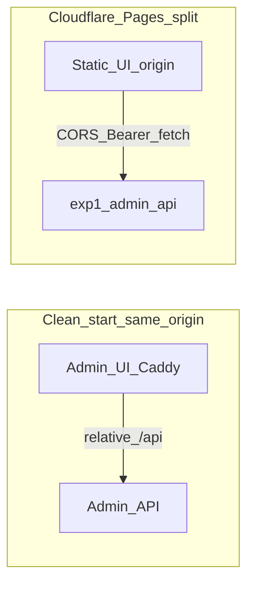

# Configurable CORS for Admin API

**Implementation status:** **Completed.** Code: [`AdminCorsProperties`](../../../../ezkey-admin-api/src/main/java/org/ezkey/admin/config/AdminCorsProperties.java), [`AdminCorsConfig`](../../../../ezkey-admin-api/src/main/java/org/ezkey/admin/config/AdminCorsConfig.java), [`SecurityConfig`](../../../../ezkey-admin-api/src/main/java/org/ezkey/admin/config/SecurityConfig.java); tests under [`ezkey-admin-api/.../config/`](../../../../ezkey-admin-api/src/test/java/org/ezkey/admin/config/). Docs: [`ezkey-admin-api/CONFIGURATION.md`](../../../../ezkey-admin-api/CONFIGURATION.md) §11, [`docs/configuration/README.md`](../../../../docs/configuration/README.md), [`docs/admin-ui-security.md`](../../../../docs/admin-ui-security.md). **Validation:** clean-start functional tests (`clean-start.sh` path) passed after implementation (April 2026). This file is the archived copy under `.cursor/plans/archived/2026-04/`.

**Out of scope (confirmed):** CORS on Auth API and Integration API remains **not** pursued — mobile and machine-to-machine clients do not need browser CORS.

---

## Context (clarification)

The pasted requirement is **CORS** (browser cross-origin `fetch` to the Admin API), not “course.” Today the SPA uses **Bearer tokens** in `Authorization` and default `fetch` credentials (not cookie `credentials: 'include'`), so **`Access-Control-Allow-Credentials` is not required** for the current client; still allow configuring it for a future cookie/BFF model if desired.

## Current state (at plan time)

- [`SecurityConfig.java`](../../../../ezkey-admin-api/src/main/java/org/ezkey/admin/config/SecurityConfig.java): `csrf` disabled, **no `http.cors(...)`** — browsers on a different origin than the API get failed preflights / missing `Access-Control-Allow-*`.
- Local **clean-start**: Admin UI via Caddy uses **same-origin** `/api/*` ([`ezkey-admin-ui/docker/Caddyfile`](../../../../ezkey-admin-ui/docker/Caddyfile)); **no CORS needed** when `VITE_API_BASE_URL` is empty.
- **Configuration conventions**: `@ConfigurationProperties` classes (e.g. [`TrustedProxyProperties`](../../../../ezkey-admin-api/src/main/java/org/ezkey/admin/config/TrustedProxyProperties.java)), tables in [`ezkey-admin-api/CONFIGURATION.md`](../../../../ezkey-admin-api/CONFIGURATION.md), prefix index in [`docs/configuration/README.md`](../../../../docs/configuration/README.md), Docker env vars documented in the same index.

## Design

1. **New properties bean** (e.g. `AdminCorsProperties`) under prefix **`ezkey.admin.cors`**:
   - **`allowed-origins`**: `List<String>`, default **empty**.
   - **Optional** (sensible defaults, document in CONFIGURATION.md):
     - `allowed-methods` — default `GET,POST,PUT,PATCH,DELETE,OPTIONS` (match REST usage).
     - `allowed-headers` — include at least `Authorization`, `Content-Type`, `Accept`, and common preflight headers (or `*` for headers if you want minimal friction; document security trade-off: origins remain the gate).
     - `allow-credentials` — default **`false`** (matches current [`api-client.ts`](../../../../ezkey-admin-ui/src/lib/api-client.ts) behavior).
   - **Semantics**: if **`allowed-origins` is empty**, treat CORS as **off** (see below). Optionally add **`enabled`** boolean default `true` only if you want an explicit kill-switch without clearing the list — usually unnecessary if empty list = off.

2. **`CorsConfigurationSource` `@Bean`** that:
   - Returns **`null`** from `getCorsConfiguration` when CORS is “off” (empty origins). This matches Spring’s contract: **no CORS processing**, behavior identical to today for tests and same-origin Docker.
   - When origins are set, builds a `CorsConfiguration` with the above methods/headers and registers allowed origins (use **`setAllowedOrigins`** with exact URLs for `https://...` — avoid `*` when `allow-credentials` is true).

3. **`SecurityConfig`**: add **`http.cors(Customizer.withDefaults())`** so Spring Security uses the `CorsConfigurationSource` bean. No change to `authorizeHttpRequests` rules needed for typical setups: **CorsFilter** handles **OPTIONS** preflight before authorization (verify with one test).

4. **Documentation**
   - [`ezkey-admin-api/CONFIGURATION.md`](../../../../ezkey-admin-api/CONFIGURATION.md): new subsection **Admin CORS** with obligation **optionnel** (empty default; **requis** only for split-origin production like Pages → API).
   - [`docs/configuration/README.md`](../../../../docs/configuration/README.md): add `ezkey.admin.cors` to the prefix registry and **Key Docker Environment Variables** (e.g. `EZKEY_ADMIN_CORS_ALLOWED_ORIGINS` → comma-separated list, Spring relaxed binding).
   - Short cross-link in [`docs/admin-ui-security.md`](../../../../docs/admin-ui-security.md) § split deployment (CORS is now implemented server-side; CSP `connect-src` remains edge/UI deployment).

5. **Docker / clean-start**
   - **Do not** require new env vars for [`docker/docker-compose.yml`](../../../../docker/docker-compose.yml) defaults: leave **unset** so local stacks behave as today.
   - Optional: comment or documented example in [`docker/README.md`](../../../../docker/README.md) if it lists admin-api tuning — only if that file already patterns env examples.

6. **Tests (targeted)**
   - **`@SpringBootTest` + `@AutoConfigureMockMvc`** (or `WebTestClient`) small test class:
     - With **no** allowed origins: `OPTIONS` to a representative path with `Origin` + `Access-Control-Request-Method` → **no** broad CORS allowance (or no `Access-Control-Allow-Origin` for that origin).
     - With **test property** `ezkey.admin.cors.allowed-origins=https://ui.example` → preflight returns **200** with expected `Access-Control-Allow-Origin` / methods / headers.
   - Keeps **unit tests** (controller Mockito tests) unchanged; they do not load full security.

7. **Out of scope (deployment / edge)**

   - **Cloudflare CSP `connect-src`**: remains operator/UI build config when `VITE_API_BASE_URL` points at the API host — already described in [`docs/admin-ui-security.md`](../../../../docs/admin-ui-security.md).
   - **Auth API**: only add if you later expose browser calls to Auth API from the same Pages origin; this plan targets **Admin API** only per your note.

## Risk / test impact summary

| Area | Impact |
|------|--------|
| Local Docker / Caddy same-origin | **None** if `allowed-origins` stays empty |
| `ezkey-tests` / clean-start | **None** without setting CORS env |
| Unit tests (mocked controllers) | **None** |
| New integration-style test | Small addition to lock CORS behavior |

