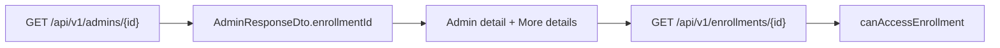

# Expose admin `enrollmentId` (API + Admin UI)

## Implementation status

**Completed** (April 2026). Delivered: `AdminResponseDto.enrollmentId`, `AdminProvisioningController.toAdminResponseDto`, `AdminProvisioningService` association loading for list/get/update, `docs/ENDPOINT.md`, `AdminProvisioningControllerTest` coverage, OpenAPI alignment for Orval, and Admin UI (`admins.tsx` + i18n) with enrollment id and “More details” link to the enrollment screen.

## Why it was missing (not a security policy)

- **Domain model already has it:** [`EzkeyAdmin`](ezkey-core/src/main/java/org/ezkey/integration/domain/entity/EzkeyAdmin.java) has `@ManyToOne` `enrollment` → `enrollment_id` in `ezkey_admin`.
- **`AdminResponseDto` never included it:** The record in [`AdminResponseDto.java`](ezkey-admin-api/src/main/java/org/ezkey/admin/dto/response/AdminResponseDto.java) lists profile fields and explicitly excludes *secrets* (recovery codes, proof tokens). An **enrollment primary key is not a credential**; it is the same class of identifier as `adminId`.
- **Create flow already exposes it:** [`AdminProvisioningResponseDto`](ezkey-admin-api/src/main/java/org/ezkey/admin/dto/response/AdminProvisioningResponseDto.java) already has `enrollmentId` with schema text explaining it is the enrollment used for passwordless auth. So omitting it on GET/PATCH/list was **inconsistent**, not deliberate redaction.
- **Authorization is unchanged:** Enrollment reads still go through [`AccessControlService.canAccessEnrollment`](ezkey-admin-api/src/main/java/org/ezkey/admin/security/AccessControlService.java) (Global Admin: any enrollment; Tenant Admin: enrollments whose integration belongs to their tenant). Returning an id does not bypass that gate on `GET /api/v1/enrollments/{id}`.

## Backend

1. **Extend `AdminResponseDto`** with a nullable `Integer enrollmentId` (last field or grouped with scope fields). Update class-level Javadoc and `@Schema` (`nullable = true`) — some edge paths could theoretically have no enrollment row.
2. **Map in one place to avoid drift:** Prefer a small private helper on [`AdminProvisioningController`](ezkey-admin-api/src/main/java/org/ezkey/admin/controller/AdminProvisioningController.java) e.g. `toAdminResponseDto(EzkeyAdmin admin)` used by `listAdmins`, `getAdminById`, and `updateAdmin` (three `new AdminResponseDto(...)` sites today).
3. **Force-load lazy enrollment inside the read transaction:** In [`AdminProvisioningService.getAdminById`](ezkey-admin-api/src/main/java/org/ezkey/admin/service/AdminProvisioningService.java), after existing `admin.getTenant()` / `getLastLoginAt()` touches, resolve enrollment id safely, e.g. `admin.getEnrollment() != null ? admin.getEnrollment().getEnrollmentId() : null`, so the association is initialized before the `@Transactional` method returns (same pattern as avoiding lazy issues elsewhere). Apply the same touch for **list** if list responses must include `enrollmentId`: `Page.map` runs in the controller **after** the service returns, so either move mapping into a `@Transactional(readOnly)` service method that returns `Page<AdminResponseDto>`, or document that list must load enrollment in `listAdmins` before returning entities. **Recommendation:** add a transactional `toResponsePage` or load enrollment ids inside `listAdmins` service (e.g. iterate `content` and touch enrollment) to avoid `LazyInitializationException` when OSIV is disabled.
4. **Tests:** Update [`AdminProvisioningControllerTest`](ezkey-admin-api/src/test/java/org/ezkey/admin/controller/AdminProvisioningControllerTest.java) if assertions need the new field; add or adjust a focused test that `enrollmentId` is populated when the mocked `EzkeyAdmin` has an `Enrollment` with an id. Run `mvn test -pl 'ezkey-admin-api,!ezkey-tests'` after the full Maven baseline per repo rules.
5. **Docs:** Update [`docs/ENDPOINT.md`](docs/ENDPOINT.md) sections for `GET /api/v1/admins`, `GET /api/v1/admins/{id}`, and PATCH response to document `enrollmentId` (align wording with provisioning DTO).
6. **OpenAPI:** Do not hand-edit `specs/**`. Implement Java + Springdoc; maintainer runs `scripts/update-specs.sh` after clean start.

## Admin UI

1. **Regenerate Orval client** after spec update so `AdminResponseDto` includes `enrollmentId` (project workflow).
2. **[`admins.tsx`](ezkey-admin-ui/src/pages/admins.tsx) — `AdminDetailDialog`:**
   - Pass `enrollmentId: adm.enrollmentId ?? undefined` into [`useExpandableRelatedDetails`](ezkey-admin-ui/src/hooks/use-expandable-related-details.ts) alongside `tenantId`. **Today**, only `tenantId` is passed, so for **Global Admins** `hasAnyFk` is false and **"More details" never appears** — this change fixes that.
   - When `relatedDetails.isExpanded && relatedDetails.enrollment` (or when `enrollmentId` is known), render a row with a `Link` to `/enrollments/{enrollmentId}` using existing copy keys such as `common:detail.relatedEnrollment` (see [`common.json`](ezkey-admin-ui/src/locales/en/common.json)).
   - Optionally add a primary `InfoRow` for enrollment ID (monospace) when `enrollmentId != null` so operators see the id without expanding; keep **list table columns** unchanged per your preference.

## Normative / UX note

- **Tenant Admin** viewing another admin in their tenant: enrollment should remain in-tenant; `canAccessEnrollment` already matches that. **Tenant Admin** cannot list Global Admins (`listAdmins` scopes to tenant), so cross-tenant global-admin enrollment is not a concern from that screen.

## Verification

- Manual: create global admin → open admin detail → confirm enrollment id and link → enrollment detail loads.
- Browser tests: informational/navigation only; **not** mandatory unless you want a thin Playwright check (optional).

