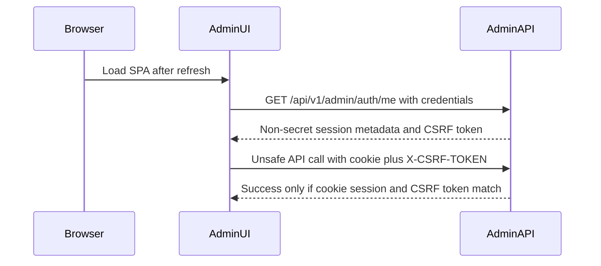

# Admin UI Session Hardening Plan

## Design Position

The current completed plan moved the browser secret from `sessionStorage` into a host-only HttpOnly cookie for split HTTPS deployments. This follow-up is primarily an `ezkey-admin-ui` session and browser-workflow hardening effort, with Admin API changes where the protocol requires server support. Two deliberate backlog items remain: session rehydration after a hard refresh, and explicit CSRF protection for the cookie transport.

The recommended design is to keep Bearer support for tools and recovery flows, but treat the browser cookie path as a first-class security mode:

## Pre-Implementation UI Simplification

The Admin UI is already reasonably well positioned for this hardening: API traffic is centralized through [`c:/github/ezkey/ezkey-admin-ui/src/lib/api-client.ts`](c:/github/ezkey/ezkey-admin-ui/src/lib/api-client.ts), generated Orval calls delegate through [`c:/github/ezkey/ezkey-admin-ui/src/lib/orval-mutator.ts`](c:/github/ezkey/ezkey-admin-ui/src/lib/orval-mutator.ts), and login already tolerates cookie mode where the token is omitted from JSON.

There is one worthwhile quick win before implementing `/me` and CSRF: make the existing auth and transport boundaries a little more explicit, without a broad refactor.

- Keep `fetchApi` as the only place that decides browser credentials, bearer headers, CSRF headers, and 401 handling.
- Keep `auth.ts` as the only place that validates and persists non-secret session metadata.
- Add small helper functions only where they remove ambiguity, for example `isUnsafeHttpMethod`, `shouldUseBrowserCredentials`, or a session-metadata normalization helper used by login and future `/me`.
- Avoid moving auth logic into pages. `login.tsx`, `routes.tsx`, and layout components should consume auth state, not interpret transport rules.
- Do not introduce a new state-management library, BFF abstraction, or large auth framework. Comparable React/TanStack Query SPAs usually get the best reliability here from a central API client, an auth provider with an explicit loading state, and route guards that wait for session bootstrap before redirecting.

This quick win should be a short preparatory pass, not an independent refactor. Its purpose is to reduce fragility before adding asynchronous session rehydration and CSRF injection.

## Rehydration Scope

- Add an authenticated `GET /api/v1/admin/auth/me` endpoint in [`c:/github/ezkey/ezkey-admin-api/src/main/java/org/ezkey/admin/controller/AdminAuthController.java`](c:/github/ezkey/ezkey-admin-api/src/main/java/org/ezkey/admin/controller/AdminAuthController.java), or a small adjacent controller if cleaner.
- Return only non-secret session metadata already used by [`c:/github/ezkey/ezkey-admin-ui/src/lib/auth.ts`](c:/github/ezkey/ezkey-admin-ui/src/lib/auth.ts): `username`, `adminType`, `expiresAt`, `adminId`, and `tenantId`. Do not return the opaque bearer token in cookie mode.
- Narrow Admin auth security in [`c:/github/ezkey/ezkey-admin-api/src/main/java/org/ezkey/admin/config/SecurityConfig.java`](c:/github/ezkey/ezkey-admin-api/src/main/java/org/ezkey/admin/config/SecurityConfig.java) from broad `/api/v1/admin/auth/** permitAll` to explicit public endpoints, so `/me` is clearly authenticated.
- Update [`c:/github/ezkey/ezkey-admin-ui/src/context/auth-context.tsx`](c:/github/ezkey/ezkey-admin-ui/src/context/auth-context.tsx) and route guarding in [`c:/github/ezkey/ezkey-admin-ui/src/routes.tsx`](c:/github/ezkey/ezkey-admin-ui/src/routes.tsx) so cookie builds can start in a short `checking session` state, call `/me`, then either restore the session or redirect to login.
- Keep the existing `sessionStorage` metadata as a fast local hint, but let `/me` be the source of truth after refresh, tab reopen, or stale metadata.

## CSRF Hardening Scope

- Change the browser session cookie emitted by [`c:/github/ezkey/ezkey-admin-api/src/main/java/org/ezkey/admin/security/AdminSessionCookieService.java`](c:/github/ezkey/ezkey-admin-api/src/main/java/org/ezkey/admin/security/AdminSessionCookieService.java) from `SameSite=Lax` to configurable `SameSite=Strict` for the production cookie mode, keeping host-only, `Secure`, `HttpOnly`, and `Path=/`.
- Add a cookie-mode CSRF token service in the Admin API using a signed double-submit pattern:
  - issue a non-secret CSRF token alongside login/passwordless-wait and `/me`;
  - keep the session cookie HttpOnly;
  - expose the CSRF token to the UI via a readable CSRF cookie and/or `/me` response field;
  - require `X-CSRF-TOKEN` on unsafe methods when authentication came from the browser session cookie;
  - skip CSRF for explicit `Authorization: Bearer` calls, public login/recovery/activation flows, safe methods, and actuator/API-docs endpoints.
- Have [`c:/github/ezkey/ezkey-admin-api/src/main/java/org/ezkey/admin/security/AdminTokenAuthenticationFilter.java`](c:/github/ezkey/ezkey-admin-api/src/main/java/org/ezkey/admin/security/AdminTokenAuthenticationFilter.java) mark whether the request authenticated by Bearer or by cookie, so the CSRF filter can apply only to cookie-authenticated browser requests.
- Update [`c:/github/ezkey/ezkey-admin-ui/src/lib/api-client.ts`](c:/github/ezkey/ezkey-admin-ui/src/lib/api-client.ts) and [`c:/github/ezkey/ezkey-admin-ui/src/lib/orval-mutator.ts`](c:/github/ezkey/ezkey-admin-ui/src/lib/orval-mutator.ts) behavior through `fetchApi`: read the CSRF token in cookie builds and add `X-CSRF-TOKEN` for `POST`, `PUT`, `PATCH`, and `DELETE` requests.
- Update Admin API CORS configuration and docs so `X-CSRF-TOKEN` is allowed for credentialed cross-origin requests.

## Documentation And Contracts

- Update [`c:/github/ezkey/docs/admin-ui-security.md`](c:/github/ezkey/docs/admin-ui-security.md), [`c:/github/ezkey/docs/cloudflare/admin-ui-pages.md`](c:/github/ezkey/docs/cloudflare/admin-ui-pages.md), and [`c:/github/ezkey/ezkey-admin-api/CONFIGURATION.md`](c:/github/ezkey/ezkey-admin-api/CONFIGURATION.md) with the new model: `/me` rehydration, `SameSite=Strict`, signed double-submit CSRF, CORS headers, and Bearer exception behavior.
- Update Java OpenAPI annotations and DTOs only; do not edit generated `specs/**` files by hand.
- Review impacted Postman collection entries for login/logout/session behavior if endpoint contracts change.

## Validation

- Add focused Admin API tests for `/me`, cookie-only session restoration, missing/invalid CSRF rejection on unsafe cookie-authenticated requests, Bearer requests bypassing CSRF, logout clearing both session and CSRF cookies, and `SameSite=Strict` cookie attributes.
- Add Admin UI unit tests around `fetchApi` credentials plus `X-CSRF-TOKEN`, `/me` rehydration success, and `/me` 401 redirect behavior.
- Because this changes login/session/refresh/logout behavior, pause after the protocol hardening is in place and run the existing Playwright browser path from [`c:/github/ezkey/ezkey-admin-ui/e2e`](c:/github/ezkey/ezkey-admin-ui/e2e) against the clean-start stack and Demo Device.
- Treat Playwright as a minimum continuity checkpoint, not a broad new test campaign in this plan: keep the existing real passwordless login, authenticated shell, navigation, hard refresh, and logout coverage working; add only a small targeted scenario if the new `/me` or CSRF behavior leaves an obvious gap.
- Record any Playwright follow-up as a future growth item if it is not needed to keep the current smoke path functional.
- After implementation, validate Java changes with the repository baseline from Windows using `scripts/build-local.cmd`, then run targeted Admin UI tests from `ezkey-admin-ui`.

## Future Phase — exp1 Cloudflare Rollout Check

Before deploying this hardened browser-session model to `exp1`, perform a targeted Cloudflare/Admin API configuration review. The code path is considered ready, but the split UI/API deployment relies on runtime and edge configuration:

- Admin UI Pages build variables:
  - `VITE_API_BASE_URL=https://exp1-admin-api.ezkey.org`
  - `VITE_ADMIN_AUTH_USE_HTTP_ONLY_SESSION_COOKIE=true`
  - optional CSRF name overrides only if API defaults are changed.
- Admin API runtime variables:
  - `EZKEY_ADMIN_AUTH_BROWSER_SESSION_COOKIE_ENABLED=true`
  - `EZKEY_ADMIN_CORS_ALLOW_CREDENTIALS=true`
  - `EZKEY_ADMIN_CORS_ALLOWED_ORIGINS=https://exp1-admin-ui.ezkey.org`
  - keep `SameSite=Strict` unless a browser test proves a deployment-specific need to relax it.
- Cloudflare / edge headers:
  - CSP `connect-src` must include `https://exp1-admin-api.ezkey.org`.
  - Do not strip the `X-CSRF-TOKEN` request header.
  - `index.html` should not be cached aggressively; use no-cache/no-store or strict revalidation.
  - hashed `/assets/*` files may be cached long-term with immutable semantics.
- Cookie posture:
  - API must be served over HTTPS so the `Secure` cookie is accepted.
  - Keep the session cookie host-only on `exp1-admin-api.ezkey.org`; do not widen to `Domain=.ezkey.org` without a specific reason.

This review is configuration-focused, not a new implementation phase. It should be done immediately before the first `exp1` deploy and again whenever the UI/API hostnames or Cloudflare Pages project setup changes.

## Addendum — Security Posture And Decision Rationale

This addendum captures the pre-implementation discussion that followed the first version of the plan. The goal is to preserve the reasoning behind the chosen balance, because these post-planning and pre-build conversations often contain important product and credibility context that can otherwise be lost in chat history.

### Credibility Context

Ezkey is a security product with a deliberately original protocol and a backend-first positioning. That creates a natural credibility challenge:

- the project is solo-developed and AI-first;
- the protocol is not yet proven by broad deployment;
- the product proposes a solution in a conservative domain where new security ideas are judged skeptically by default;
- the Admin UI is a supporting surface for a security-sensitive system, even if the product thesis is backend-first.

For that reason, the session model should not merely be "good enough for a prototype." It should be conservative, explainable, and recognizable to external reviewers as a serious browser-session design. The objective is not to invent a novel browser security pattern. The objective is to show that Ezkey applies established hardening practices where the browser participates in administrator workflows.

### Why This Hardening Is Justified

The planned posture is a positive credibility signal:

- browser session secrets are not stored in JavaScript-accessible storage;
- the Admin API uses a host-only `HttpOnly` `Secure` cookie for the browser session;
- `SameSite=Strict` is preferred for the production split UI/API deployment when the domain layout supports it;
- `/me` restores only non-secret session metadata after refresh or tab reopen;
- cookie-authenticated unsafe requests require explicit CSRF proof;
- Bearer remains available for Postman, scripts, recovery flows, and non-browser clients;
- the minimal Playwright path remains functional so the browser workflow can keep growing from a real end-to-end baseline.

This gives a concise and defensible external message:

> The Admin UI does not store browser session secrets in JavaScript. Browser sessions use host-only `HttpOnly` `Secure` cookies, strict same-site policy where applicable, explicit CSRF validation for cookie-authenticated state-changing requests, and a `/me` endpoint that returns only non-secret session metadata.

That message is materially stronger than relying on `sessionStorage` alone. `sessionStorage` is preferable to `localStorage` for lifetime reasons, but both are readable by injected JavaScript. Moving the opaque session secret to an `HttpOnly` cookie reduces direct token theft from XSS. It does not make XSS harmless, so CSP, React-safe rendering, and conservative UI behavior remain necessary, but it improves a high-value risk boundary.

### Complexity Boundary

This hardening is acceptable only if it stays narrowly scoped. The intended implementation should remain contained in:

- the Admin UI session bootstrap and route guard behavior;
- the shared Admin UI fetch layer and Orval mutator path;
- the Admin API auth/session controller surface;
- the Admin API token-auth and CSRF validation filters;
- cookie/session configuration and focused tests.

The plan should avoid drifting into a broader or more fragile browser-security architecture. In particular, this plan does not require:

- a BFF or Cloudflare Worker layer;
- a full Spring server-side browser session model;
- CSRF rotation on every request;
- per-tab CSRF state;
- broad Playwright expansion beyond the minimum workflow checkpoint;
- removal of the Bearer path for non-browser clients.

Those could be revisited later if the deployment model or threat review requires them, but adding them now would likely create diminishing returns and operational complexity.

### Decision

Proceed with the hardening, but keep the design conservative and bounded:

- implement `/me` for cookie-mode session rehydration;
- use `SameSite=Strict` where the production UI/API domain layout supports it;
- implement explicit CSRF validation only for cookie-authenticated unsafe browser requests;
- keep Bearer as the non-browser and exceptional-flow path;
- validate with focused backend tests, Admin UI unit tests, and the existing Playwright smoke path.

This is not excessive for Ezkey's credibility needs. It becomes excessive only if it expands beyond the Admin UI browser-session boundary or tries to solve every possible browser security concern in this pass.
