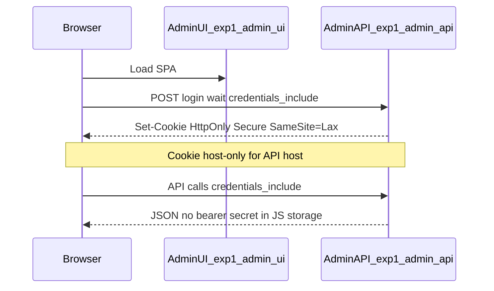

# Plan — Session Admin : Bearer → cookie HttpOnly (pragmatique)

## Statut (clôture)

| | |
|---|---|
| **Complété** | Phases **0–3** : documentation, filtre + cookie API, Admin UI `credentials` / sans secret en JS, validation sur instance (ex. exp1). Convention Pages « un projet par instance » et doc TTL cookie alignée avec le dépôt. |
| **Backlog — session future** | **`Set-Cookie` sur la réponse GET overview du Dashboard** (aligner cookie et fenêtre glissante ; voir § Complément Dashboard). **`GET /me`** (réhydratation après F5 / onglet ; voir § Complément `/me`). **Playwright** contre instance distante (optionnel, Phase 3). |

---

## Synthèse de la discussion

- **Aujourd’hui** : l’[Admin UI](ezkey-admin-ui/src/lib/auth.ts) persiste l’opaque token en **`sessionStorage`** (`ezkey_admin_auth`) ; [api-client](ezkey-admin-ui/src/lib/api-client.ts) envoie **`Authorization: Bearer`**. L’[Admin API](ezkey-admin-api/src/main/java/org/ezkey/admin/security/AdminTokenAuthenticationFilter.java) n’authentifie que via cet en-tête. Le **logout** exige encore le header ([`AdminAuthController`](ezkey-admin-api/src/main/java/org/ezkey/admin/controller/AdminAuthController.java)).
- **Risque pentest** : tout XSS dans l’origine de l’UI peut lire `sessionStorage` et exfiltrer le jeton. **`sessionStorage` vs `localStorage`** ne change pas ce risque pour XSS.
- **Cible déploiement** (simplifiée) : UI **`https://exp1-admin-ui.ezkey.org`**, API **`https://exp1-admin-api.ezkey.org`** — **même site** (`ezkey.org`), HTTPS partout. **Previews Cloudflare** hors périmètre.
- **Évolutivité multi-instance** : le même modèle se **répète** pour d’autres préfixes (ex. **`demo1-admin-ui.ezkey.org`** + **`demo1-admin-api.ezkey.org`**, futur prod, etc.). Aucun besoin de code spécifique à `exp1` : chaque déploiement fixe **(1)** l’origine UI dans **`ezkey.admin.cors.allowed-origins`** (et `allow-credentials` si cookie), **(2)** le **`VITE_API_BASE_URL`** du build Admin UI vers **son** API, **(3)** la **CSP `connect-src`** sur **cette** UI vers **cette** API. Le cookie de session reste **host-only** sur l’hôte API de l’instance → les sessions **ne se mélangent pas** entre `exp1-admin-api` et `demo1-admin-api`.
- **Repo déjà prêt pour une partie du chemin** : [CORS](ezkey-admin-api/src/main/java/org/ezkey/admin/config/AdminCorsConfig.java) supporte **`allowCredentials`** (défaut `false`) ; [CONFIGURATION.md §11](ezkey-admin-api/CONFIGURATION.md) documente déjà cookies + origines explicites. [admin-ui-security.md](docs/admin-ui-security.md) esquisse le modèle HttpOnly.
- **Contrainte explicite** : **ne pas casser** [clean-start](ezkey-tests/clean-start.sh) / démo Docker — en pratique **origine UI dev** (`http://localhost:5173`) vs API (`http://localhost:9080`) est **cross-origin** et **sans HTTPS** sur Vite : un cookie `Secure` « prod-like » est **inadapté** au flux quotidien npm. La posture pragmatique est un **basculement par configuration** (cookie en prod split ; Bearer + sessionStorage en local), ou équivalent documenté.

## Principes de design (message « sécurité par défaut »)

- **Réduire la surface XSS** : le **secret de session** n’est plus lisible par le JavaScript (cookie **HttpOnly**).
- **Rester réaliste** : **80 %** = cookie + `credentials` + CORS + attributs cookie + filtre d’auth ; **CSRF** : avec **`SameSite=Lax`** et origines CORS **strictes** (typiquement **une origine UI par instance**, ex. `https://exp1-admin-ui.ezkey.org` ou `https://demo1-admin-ui.ezkey.org`), le modèle classique « site malveillant forge une requête » est **déjà fortement limité** pour un cookie **host-only** sur l’API. Documenter ; ajouter **Spring CSRF** ou **double-submit** seulement si le modèle de menaces l’exige (complexité SPA).
- **Dual stack** : conserver le **Bearer en header** comme chemin supporté (compat API clients, recovery, transition, debug local) tout en privilégiant le **cookie** pour le navigateur en prod.
- **Documentation unique** : étendre [admin-ui-security.md](docs/admin-ui-security.md) + [admin-ui-pages.md](docs/cloudflare/admin-ui-pages.md) + [CONFIGURATION.md](ezkey-admin-api/CONFIGURATION.md) avec la vérité opérationnelle (flags, CSP, CORS).

---

## Phase 0 — Cadrage et documentation (faible risque, fondation)

- Rédiger une section **« Session navigateur (cookie HttpOnly) »** dans [docs/admin-ui-security.md](docs/admin-ui-security.md) : menaces, choix `SameSite=Lax` vs `Strict`, **host-only** sur **l’hôte API de l’instance** (ex. `exp1-admin-api` ou `demo1-admin-api`), pas de `Domain=.ezkey.org` pour le secret (éviter d’élargir la portée du cookie à tout le domaine sauf besoin clair).
- Mettre à jour [docs/cloudflare/admin-ui-pages.md](docs/cloudflare/admin-ui-pages.md) : modèle **répétable** — pour chaque instance, lister **l’origine UI** correspondante et l’API ; indiquer **`ezkey.admin.cors.allow-credentials=true`** quand le cookie est activé ; rappeler **CSP `connect-src`** = origine API **de cette** instance (exemples `exp1` et `demo1` en parallèle dans le texte, pas une règle codée en dur).
- Ajouter une courte **matrice d’environnement** (local Vite / Path B Caddy / instance cloud `exp1` / `demo1` / …) : quel mode d’auth, quelles variables.

**Livrable** : doc alignée marketing + ops (« sécuritaire par défaut sur chaque paire UI/API sous `*.ezkey.org`, pragmatique en local »).

---

## Phase 1 — Admin API : cookie de session + filtre (cœur technique)

**Objectif** : accepter le **même opaque token** qu’aujourd’hui, mais **également** depuis un cookie, sans nouveau modèle de données obligatoire (réutiliser la validation existante [AdminTokenValidationService](ezkey-admin-api/src/main/java/org/ezkey/admin/service/AdminTokenValidationService.java)).

1. **Propriété de configuration** (ex. `ezkey.admin.auth.browser-session-cookie-enabled` + nom du cookie, durée alignée sur token existant) dans [application properties](ezkey-admin-api/config/application.properties) / [CONFIGURATION.md](ezkey-admin-api/CONFIGURATION.md).
2. **`AdminTokenAuthenticationFilter`** : si pas de `Authorization: Bearer`, lire le cookie nommé (ex. `EZKEY_ADMIN_SESSION`) et valider comme aujourd’hui. Ordre : **priorité au header Bearer** si les deux sont présents (comportement prévisible).
3. **Émission du cookie** sur succès auth navigateur :
   - Endpoints concernés : réponses **`approved`** / succès avec token — au minimum [`POST .../login`](ezkey-admin-api/src/main/java/org/ezkey/admin/controller/AdminAuthController.java) (flux bloquant) et [`POST .../passwordless-wait`](ezkey-admin-api/src/main/java/org/ezkey/admin/controller/AdminAuthController.java) (flux MFA), là où le DTO contient déjà le bearer.
   - `Set-Cookie` : `HttpOnly`, `Secure` (quand cookie mode + prod), `Path=/`, `SameSite=Lax`, **pas** de durée excessive si aligné sur TTL token existant ; considérer **`Max-Age`** cohérent avec `expiresAt`.
4. **Ne plus renvoyer le token dans le corps JSON quand le cookie est activé** (ou le renvoyer **une seule fois** pendant une période de migration — préférable : **coupure nette** côté exp pour éviter double surface). Le corps peut continuer à exposer **métadonnées non secrètes** (`username`, `adminType`, `expiresAt`, `adminId`, etc.) pour l’UI.
5. **Logout** : accepter token depuis **cookie ou** `Authorization` ; après invalidation DB, renvoyer **`Set-Cookie`** d’effacement (même nom, `Max-Age=0`).
6. **CORS** : par instance, définir **`EZKEY_ADMIN_CORS_ALLOWED_ORIGINS`** = origine(s) exacte(s) de **cette** UI (ex. `https://exp1-admin-ui.ezkey.org` ou `https://demo1-admin-ui.ezkey.org` ; plusieurs valeurs séparées par virgules seulement si une même API sert plusieurs origines UI approuvées) et **`allow-credentials=true`** quand le navigateur envoie des cookies ([AdminCorsProperties](ezkey-admin-api/src/main/java/org/ezkey/admin/config/AdminCorsProperties.java) déjà prévu).
7. **Tests** : tests filtres / contrôleur (MockMvc) pour « cookie seul », « header seul », logout efface cookie.

**Résilience** : si cookie absent ou invalide, comportement identique au 401 actuel ; pas de régression pour appels **sans** navigateur (Basic/API keys autres filtres — vérifier l’ordre des filtres existants).

---

## Phase 2 — Admin UI : `credentials` + stockage sans secret

1. **[api-client.ts](ezkey-admin-ui/src/lib/api-client.ts)** : pour les requêtes authentifiées en mode « cookie », utiliser **`credentials: 'include'`** ; ne plus ajouter `Authorization` si le token n’est pas en session (ou : jamais `Authorization` en prod cookie — défini par `import.meta.env` / build mode).
2. **[auth.ts](ezkey-admin-ui/src/lib/auth.ts)** : persister uniquement un **état de session non secret** (profil + `expiresAt` pour l’horloge UI) **ou** tout charger via un endpoint **`/me`** si vous préférez une seule source de vérité (légèrement plus de travail, UX plus propre).
3. **Login / passwordless-wait** : après succès, ne plus attendre `token` dans le JSON si build cookie ; mettre à jour le contexte auth à partir des champs restants.
4. **Logout** : appeler `POST /logout` avec `credentials: 'include'` sans header Bearer.
5. **Flux exception** : enrollment recovery / jetons ponctuels qui utilisent déjà [`bearerToken` dans fetchApi](ezkey-admin-ui/src/lib/api-client.ts) — **garder le Bearer explicite** pour ces routes (pas de cookie).

**Builds** : `build:cloudflare` (ou équivalent) avec **`VITE_API_BASE_URL`** pointant vers **l’API de l’instance** (exp1, demo1, …) ; **dev local** garde l’ancien chemin (pas de `Secure` cookie cross-origin localhost) — **deux modes** documentés.

---

## Phase 3 — Validation (première instance exp1, puis copie du runbook)

- **exp1** : Cloudflare — confirmer **CSP** sur `exp1-admin-ui.ezkey.org` avec `connect-src` = `https://exp1-admin-api.ezkey.org`. VM / Lightsail — CORS + cookie pour **cette** API ; checklist MFA, navigation, refresh, logout, recovery Bearer.
- **Nouvelles instances (ex. demo1)** : répéter la même checklist avec **`demo1-admin-ui` / `demo1-admin-api`** ; pas de changement applicatif si la config par environnement est correcte.
- Mettre à jour / ajouter tests Playwright si la suite couvre une instance distante (optionnel).

---

## Phase 4 — (Optionnel, après stabilisation) Durcissements ciblés

- **Rotation / durée de session** : réutiliser les propriétés existantes (`ezkey.admin.token.expiration-hours`, rotation on login) — documenter l’effet sur le cookie.
- **CSRF additionnel** : évaluation si endpoints sensibles le justifient malgré `SameSite=Lax`.
- **Audit** : journaliser le mode d’auth (cookie vs header) en debug seulement si utile, éviter le bruit.

---

## Complément — Rafraîchissement du cookie via la requête Dashboard (backlog produit)

**Contexte :** avec le comportement livré, le `Set-Cookie` n’est émis qu’au **succès** login / passwordless-wait ; le **`Max-Age`** suit le **`expiresAt`** de ce moment. La **fenêtre glissante** prolonge le jeton en **base** sur l’activité, mais le navigateur **ne reçoit pas** un nouveau cookie sur les appels API courants — donc, côté navigateur, la session peut se terminer au bout de **`expiration-hours`** même si le serveur aurait encore étendu le jeton en base.

**Piste pragmatique (discutée, non implémentée dans ce plan) :** utiliser la **requête d’overview du Dashboard** comme ancrage opérationnel. L’Admin UI appelle déjà cet endpoint avec un **`refetchInterval` d’une minute** sur la page Dashboard (`ezkey-admin-ui/src/pages/dashboard.tsx`, `useGetOverview`, `REFRESH_INTERVAL_OVERVIEW_MS = 60_000`). Tant qu’un opérateur reste sur le Dashboard avec un onglet actif, une requête authentifiée arrive régulièrement — **candidate idéale** pour, après validation du jeton et application du **sliding** en base, renvoyer un **`Set-Cookie`** avec la **même** valeur de cookie et un **`Max-Age`** recalculé depuis le **`expiresAt` à jour** (`AdminSessionCookieService` / équivalent).

**Posture assumée :**

- Un opérateur qui **passe beaucoup de temps hors Dashboard** sans repasser par cette requête peut encore atteindre la limite du cookie initial → **nouveau login** ; jugé **acceptable** pour des actions occasionnelles.
- Un opérateur qui **laisse la console ouverte** et **revient au tableau de bord** bénéficie d’un scénario **réaliste** pour prolonger l’alignement cookie / session sans généraliser le `Set-Cookie` à **toutes** les routes API (surface réduite, intention claire).

**Limites à garder en tête :** onglet en arrière-plan / économie d’énergie peut **espacer** les refetch ; pas de garantie « minute pile » partout.

**Implémentation future (hors périmètre du plan d’origine) :** côté Admin API, sur la route **GET overview** du dashboard (celle consommée par Orval / `useGetOverview`), après authentification réussie et mise à jour du jeton, ajouter le header `Set-Cookie` si le mode cookie navigateur est actif ; tests ciblés (MockMvc ou intégration) pour vérifier la présence du cookie sur cette réponse lorsque le sliding a avancé `expiresAt`.

---

## Complément — Endpoint `GET /me` (backlog UX)

**Contexte :** après un **hard refresh** (F5) ou la réouverture d’un onglet, le **state React** est vide alors que le **cookie HttpOnly** peut encore être valide. Un endpoint dédié (souvent nommé **`/me`** ou équivalent sous le préfixe admin auth) renverrait **uniquement des métadonnées non secrètes** (profil, `expiresAt`, ids) pour **réhydrater** l’UI sans refaire tout le flux login/passwordless.

**Statut :** **non implémenté** dans ce plan — volontairement **reporté à une session future** si l’UX post-refresh doit être renforcée ; le flux actuel (re-login si besoin) reste acceptable.

**Implémentation future (esquisse) :** Admin API (contrôleur + sécurité même filtre cookie/Bearer), contrat **OpenAPI** + **Orval**, appel au **montage** de l’Admin UI en mode cookie ; tests MockMvc / intégration pour 200 avec cookie valide et 401 sans session.

---

## Clarifications utiles tôt (impact succès déploiement)

Ces points ne changent pas le modèle convenu, mais les trancher ou les documenter **avant** le premier déploiement cookie évite des surprises.

1. **CI / build par instance** : chaque paire (exp1, demo1, …) doit produire un artefact UI avec le bon **`VITE_API_BASE_URL`**. Décider si c’est **un projet Cloudflare Pages par environnement** (simple mental model, règles d’en-têtes par domaine) ou **un seul projet** avec branches / variables d’environnement — les deux marchent ; il faut que le runbook dise **lequel vous utilisez** pour ne pas publier un `dist/` pointant vers la mauvaise API.

2. **Rollback opérationnel** : garder un **flag côté API** (cookie navigateur on/off) permet de revenir au **JSON + Bearer** sans redéployer le front en urgence, ou inversement documenter « désactiver le flag + redeploy UI ancien build » — à noter dans l’ops pour le premier go-live.

3. **Alignement TTL** : `Max-Age` / `Expires` du cookie doit rester **cohérent** avec la durée de vie du token en base et avec **`rotation-on-login`** (chaque nouvelle émission de token = **re-Set-Cookie**). Sinon : session UI « valide » mais cookie expiré ou l’inverse.

4. **Outils opérateurs** : **Postman / curl / scripts** continuent de préférer le **Bearer** ; documenter explicitement que le mode cookie est **navigateur-first**, pas obligatoire pour l’automatisation.

5. **Contrat OpenAPI / Orval** : si le token disparaît du JSON en mode cookie, le type généré et le client doivent traiter **`token` comme optionnel** pour éviter des erreurs TypeScript ou des assertions fragiles.

6. **Couche devant l’API** : aujourd’hui l’API est atteinte directement (Caddy sur la VM, etc.). Si un jour l’API passe derrière **Cloudflare proxy** ou un autre edge, vérifier **`ezkey.trusted-proxies`** / en-têtes **`X-Forwarded-*`** pour IP client (rate limit, audit) — pas bloquant au premier jour si la topologie reste inchangée.

7. **Vérifications navigateur** : ajouter à la checklist **navigation privée**, **deux onglets**, **hard refresh** après login (le cookie doit persister ; le state React peut nécessiter rechargement ou endpoint `/me` selon implémentation).

8. **Pas de contenu mixte** : UI en **HTTPS** doit uniquement appeler l’API en **HTTPS** (déjà le cas pour `*.ezkey.org`).

9. **Futur Worker / route API sur le même hostname que l’UI** : si vous ajoutez un Worker sur `*-admin-ui`, veillez à ne pas casser les chemins ou les en-têtes attendus par le SPA — hors scope immédiat, mais à garder en tête.

---

## Diagnostic (causes racines) — quand ça casse

S’appuyer sur cette table **avant** de changer du code ; la plupart des incidents split UI/API sont **config réseau / navigateur**.

| Symptôme observé | Causes probables (ordre utile) | Vérifications rapides |
|------------------|--------------------------------|------------------------|
| Console : CORS bloque la requête | Origine UI absente de `ezkey.admin.cors.allowed-origins` ; typo (trailing slash, `http` vs `https`, port) | Réponse preflight : `Access-Control-Allow-Origin` doit être **l’origine exacte** de l’UI, pas `*`. |
| CORS + « credentials » | `allow-credentials=false` alors que `fetch` utilise `include` ; ou origine `*` avec credentials | `EZKEY_ADMIN_CORS_ALLOW_CREDENTIALS=true` + origines explicites. |
| Login semble OK mais **401** sur le prochain appel | `fetch` sans `credentials: 'include'` → cookie non envoyé ; ou UI et API en **origines incohérentes** (mauvais `VITE_API_BASE_URL`) | Network tab : la requête authentifiée doit avoir **Cookie** dans les en-têtes ; comparer l’hôte de l’API avec celui du `Set-Cookie`. |
| Pas de `Set-Cookie` dans la réponse login | Flag API **cookie navigateur désactivé** ; ou inspection sur une réponse erronée (4xx) | Vérifier config `ezkey.admin.auth.browser-session-cookie-enabled` et le statut HTTP 200 sur la réponse qui doit poser le cookie. |
| `Set-Cookie` présent mais cookie **jamais stocké** | Attribut **`Secure`** alors que l’API est appelée en **http** ; navigateur refuse | En prod : tout **HTTPS**. En local cookie-mode : ne pas forcer `Secure` ou rester en mode Bearer (voir matrice doc). |
| Cookie stocké mais **pas renvoyé** | Mauvais **Path** / **Domain** ; ou requête vers un **autre hôte** API que celui qui a émis le cookie | Cookie **host-only** sur `*-admin-api` : les appels doivent aller à **ce** host. |
| 401 après rotation / nouvelle session | Cookie **Max-Age** non mis à jour après rotation de token ; décalage **expiresAt** vs cookie | Vérifier que chaque émission de token refait un **Set-Cookie** cohérent avec le TTL en base. |
| Logout : encore authentifié | `Clear-Site-Data` non utilisé (optionnel) ; surtout **effacement cookie** avec mêmes `Path` / `SameSite` / **`Secure`** que le pose | Réponse logout : en-tête `Set-Cookie` avec **même nom** et `Max-Age=0` (ou `Expires` passé). |
| Postman OK, navigateur KO | Postman envoie **Bearer** ; navigateur dépend du **cookie** | Normal ; ne pas confondre les deux chemins. |

---

## Checklist Cloudflare (révision config / déploiement UI)

À refaire **par instance** (`exp1`, `demo1`, …) quand vous touchez au domaine UI ou à l’API cible.

- **Custom domain** : `*-admin-ui.ezkey.org` bien attaché au **projet Pages** concerné ; DNS (CNAME) et statut « actif » dans le dashboard.
- **SSL/TLS** : mode adapté (souvent **Full (strict)** si origine derrière TLS) ; **Minimum TLS 1.3** sur la zone si c’est la politique du projet (voir runbook).
- **En-têtes de sécurité** (Transform Rules ou équivalent) : appliquer sur les réponses **HTML** du SPA ; aligner avec [admin-ui-pages.md](docs/cloudflare/admin-ui-pages.md) (CSP, frame deny, etc.).
- **`Content-Security-Policy` → `connect-src`** : inclure **l’origine exacte** de l’API de **cette** instance (`https://exp1-admin-api.ezkey.org`, etc.) ; sinon le navigateur bloque les `fetch` **avant** CORS.
- **Pas de cache agressif sur l’API** : l’API ne passe en général **pas** par Pages ; si un jour trafic API derrière Cloudflare, éviter de **cacher** les réponses JSON authentifiées.
- **Variables de build Pages** : `VITE_API_BASE_URL` (ou mode utilisé) pointe vers **la bonne** API pour cette instance.
- **Côté VM / API** (pas Cloudflare mais couplé) : `EZKEY_ADMIN_CORS_ALLOWED_ORIGINS` = origine UI ; `allow-credentials` si cookie ; flag cookie activé si le front est buildé en mode cookie.

---

## Impacts résumés

| Zone | Impact |
|------|--------|
| Admin API | Filtre auth, login/wait/logout, config, tests |
| Admin UI | `fetchApi`, auth, login pages, env dev vs prod |
| Docs | admin-ui-security, cloudflare runbook, CONFIGURATION |
| Ops | Par instance : `EZKEY_ADMIN_CORS_*`, flags cookie, build UI avec bon `VITE_API_BASE_URL` ; cookie et CORS **isolés** par hôte API |

---

## Ce qu’on ne fait pas dans ce plan (volontairement)

- **BFF Cloudflare Worker** (même origine) — utile si un jour les contraintes cookies/CORS explosent ; pas nécessaire avec **deux sous-domaines same-site** comme tu l’as figé.
- **Previews `*.pages.dev`** — hors scope.
- **Suppression totale du Bearer** — les clients non-navigateur et flux spéciaux gardent une voie raisonnable.
