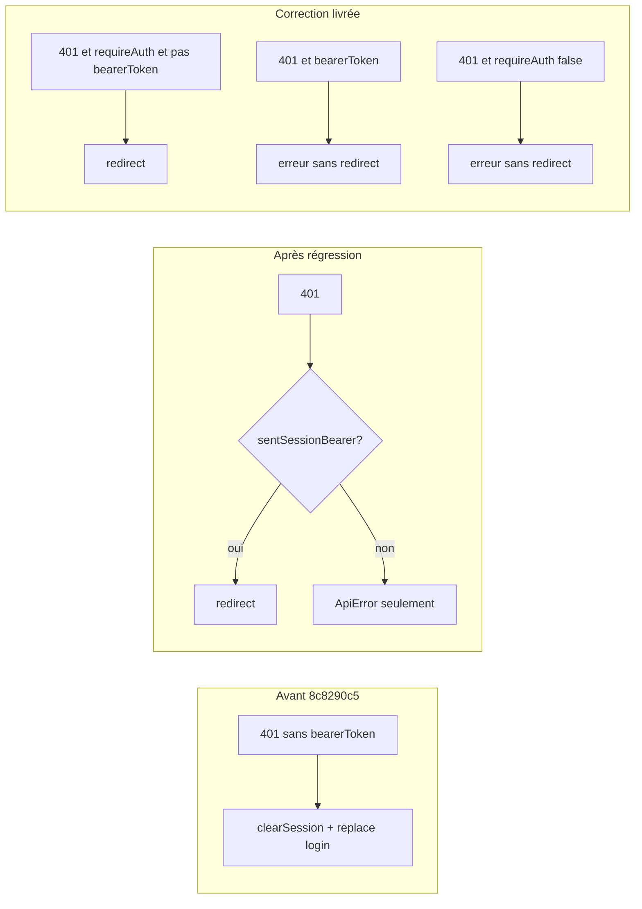

# Admin UI: 401 sans redirection vers `/login` (dashboard / overview)

**Implementation status:** **Completed.** Code: [`ezkey-admin-ui/src/lib/api-client.ts`](../../../ezkey-admin-ui/src/lib/api-client.ts), tests: [`ezkey-admin-ui/src/lib/api-client.test.ts`](../../../ezkey-admin-ui/src/lib/api-client.test.ts). This file is the archived copy under `.cursor/plans/archived/2026-04/`.

## What you are seeing

- Sur le dashboard, [`useGetOverview`](../../../ezkey-admin-ui/src/pages/dashboard.tsx) interroge l’API en boucle (`refetchInterval` 60s). Si la requête échoue avec **401**, les données ne se mettent pas à jour; la console réseau montre **401 Unauthorized** sur l’endpoint overview.
- L’écran reste sur le dashboard au lieu d’aller au login parce que **`window.location.replace('/login')` n’est pas exécuté** dans ce cas.

## Root cause (confirmed in code)

### 1. Régression introduite par le refactor i18n / RFC 9457

Dans [`api-client.ts`](../../../ezkey-admin-ui/src/lib/api-client.ts) (before fix), la redirection sur 401 était **conditionnelle** sur `sentSessionBearer` (basé sur un second appel à `getToken()`).

Avant le commit **`8c8290c5`** (*feat(i18n): implement error message internationalization strategy*, 2026-04-06), le comportement était : **tout 401 sans `bearerToken`** → `clearSession()` + `replace('/login')` (voir historique git sur ce fichier). Cela couvrait aussi les cas où aucun header Bearer n’était envoyé.

Après ce commit, la redirection ne se faisait que si **`sentSessionBearer`** était vrai — c’est **plus étroit** que l’ancien comportement.

### 2. Double appel à `getToken()` + expiration côté client

[`getToken()`](../../../ezkey-admin-ui/src/lib/auth.ts) délègue à [`getSession()`](../../../ezkey-admin-ui/src/lib/auth.ts), qui **supprime `sessionStorage`** si `expiresAt <= maintenant`.

Dans `fetchApi`, la construction des headers appelait **une première fois** `getToken()` ; la ligne `sentSessionBearer` appelait **`getToken()` une deuxième fois**. Si le premier appel avait déclenché le nettoyage (session expirée côté horloge client), le second retournait `null` → **`sentSessionBearer` était faux** alors que la requête était bien une requête “authentifiée” (`requireAuth: true`). Résultat : **401 sans redirection**, même si l’utilisateur était encore “connecté” dans React ([`AuthProvider`](../../../ezkey-admin-ui/src/context/auth-context.tsx) ne resynchronise pas automatiquement depuis `sessionStorage` à chaque fetch).

### 3. État React potentiellement désynchronisé

`ProtectedRoute` se base sur `isAuthenticated` (état React). Si le stockage est vidé ou incohérent avec l’état React, l’UI peut rester sur une route protégée pendant que les appels API partent **sans** Bearer — comportement que l’**ancienne** logique traitait encore par une redirection globale sur 401 (sans `bearerToken`).

## Was it “correct” before?

- **Oui**, dans un sens plus large : avant `8c8290c5`, toute réponse **401** sans `bearerToken` déclenchait redirection + clear (au prix d’un comportement possiblement trop agressif sur certains 401 “non session” si jamais ils existaient).
- La modification **intentionnelle** était d’éviter de traiter comme “session expirée” les cas **recovery token** (`bearerToken`) et de mieux parser le corps RFC 9457 — mais la condition **`sentSessionBearer`** + double `getToken()` a introduit une **régression** pour les cas ci-dessus.

So: **régression + lacune** (état UI vs stockage) — pas seulement un bug “nouveau” côté backend.

## What shipped (closing)

- **`fetchApi`:** Sur **401**, après la branche `bearerToken` (recovery), si **`requireAuth`** et pas de `bearerToken` → `clearSession()`, `window.location.replace('/login')`, `ApiError` session expirée (aligné sur l’intention “appel session”, sans exiger un jeton non nul au moment du check).
- **`fetchBlobUrl`:** Même traitement sur **401** pour les ressources binaires (QR, etc.).
- **Tests:** [`api-client.test.ts`](../../../ezkey-admin-ui/src/lib/api-client.test.ts) (Vitest) — 401 avec session attendue, 401 login/public, 401 recovery.

## Verification

- **Manuel:** session expirée (ou `expiresAt` passé côté client) sur `/dashboard` → prochain appel overview doit ramener à `/login`.
- **Automatisé:** `npm test` dans `ezkey-admin-ui` couvre les branches 401 ci-dessus.

---

