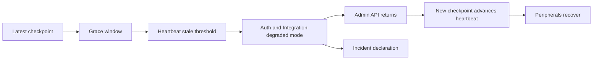

> **Plan status:** **Completed** — design, implementation, docs, and validation for this dossier are closed. UX follow-up observations live separately in [.cursor/plans/audit_integrity_operational_ux_closeout_notes.plan.md](../../audit_integrity_operational_ux_closeout_notes.plan.md).

# Audit Chain Heartbeat and Partial Outage Closure

## Context Anchors

The prior checkpoint/gap work is mainly captured in [C:/github/ezkey/.cursor/plans/archived/2026-04/audit_chain_lifecycle_b42e184a.plan.md](C:/github/ezkey/.cursor/plans/archived/2026-04/audit_chain_lifecycle_b42e184a.plan.md) and [C:/github/ezkey/.cursor/plans/archived/audit_chain_checkpoints_search_api_2580d4ef.plan.md](C:/github/ezkey/.cursor/plans/archived/audit_chain_checkpoints_search_api_2580d4ef.plan.md). The current implementation exposes checkpoint search, detected-gap focus, and human `declare-gap` from [C:/github/ezkey/ezkey-admin-ui/src/pages/audit-logs.tsx](C:/github/ezkey/ezkey-admin-ui/src/pages/audit-logs.tsx), with backend gap declaration in [C:/github/ezkey/ezkey-core/src/main/java/org/ezkey/audit/integrity/AuditLifecycleService.java](C:/github/ezkey/ezkey-core/src/main/java/org/ezkey/audit/integrity/AuditLifecycleService.java).

Current semantics are sound for total downtime with no audit entries: `GAP_DECLARATION` documents a temporal hole where no activity exists. They are intentionally not enough for partial failure, where Auth API or Integration API continued to write audit entries while Admin API and its scheduler were down.

## Product Recommendation

Keep checkpoint types cryptographic, not operational. Do not add `PARTIAL_FAILURE` or `DEGRADED` to `CheckpointType` as the main model. A checkpoint with entries created during a partial outage is still a real, verifiable checkpoint once Admin API returns, so it should remain `REGULAR` unless it is an archive seal or a no-activity gap declaration.

Introduce a separate operational concept: an audit-chain incident declaration. This declaration explains periods where the chain can be cryptographically valid but Ezkey was not fully supervised by its Admin API heartbeat.

Use two declaration families only:

- `declare-gap`: existing flow for no-activity downtime, represented by `GAP_DECLARATION` in `ezkey_audit_chain_checkpoint`.
- `declare-incident`: new flow for bounded activity or degraded service during Admin heartbeat failure, represented in a new incident table and surfaced as an overlay on the checkpoint timeline.

Recommended incident types:

- `UNSUPERVISED_ACTIVITY`: Auth/Integration continued briefly after the checkpoint heartbeat became stale but before fail-closed degraded mode started.
- `DEGRADED_SERVICE`: Auth/Integration entered fail-closed or completion-only behavior because the Admin heartbeat stayed stale.
- `CHAIN_SERVICE_UNAVAILABLE`: Admin scheduler/checkpoint service could not produce checkpoints, but this is still handled through either `UNSUPERVISED_ACTIVITY` or `DEGRADED_SERVICE` phases, not as a third operator workflow.

Root causes should be metadata, not new declaration types: `ADMIN_API_DOWN`, `SCHEDULER_FAILURE`, `DB_UNAVAILABLE`, `NETWORK_PARTITION`, `MISCONFIGURATION`, `UNKNOWN`.

## Heartbeat Rule

Treat the latest completed checkpoint as the Admin API heartbeat. Auth API and Integration API should read the latest checkpoint from the shared database and compute staleness using a small cached guard.

Default behavior should preserve the current five-minute window model:

- Window 1 is normal grace: peripherals may continue while the next checkpoint is not yet expected.
- Window 2 is the bounded risk window: peripherals continue only until a configured stop threshold.
- With `windowMinutes=5` and a one-minute safety buffer, the default fail-closed threshold is about 9 minutes since the latest checkpoint `windowEnd`.
- Enforce the invariant that heartbeat fail-closed threshold must be less than `lookbackMinutes`, so all unsupervised activity remains checkpointable after Admin API returns.

Recommended config additions near [C:/github/ezkey/ezkey-core/src/main/java/org/ezkey/audit/integrity/AuditChainProperties.java](C:/github/ezkey/ezkey-core/src/main/java/org/ezkey/audit/integrity/AuditChainProperties.java):

- `ezkey.audit.chain.heartbeat.required=true` for Auth and Integration API in production-like profiles.
- `ezkey.audit.chain.heartbeat.grace-windows=2`.
- `ezkey.audit.chain.heartbeat.stop-before-next-window=PT1M`.
- `ezkey.audit.chain.heartbeat.cache-ttl=PT5S` to avoid a database lookup per request.
- `ezkey.audit.chain.heartbeat.bootstrap-grace=PT10M` for clean-start and first-install cases before the first checkpoint exists.

## Degraded Behavior Recommendation

Integration API should fail closed for new authentication attempts once heartbeat is stale. It may continue completion and cleanup operations for already-created attempts, such as wait/cancel, because those do not expand the population of new MFA work. This change belongs around [C:/github/ezkey/ezkey-integration-api/src/main/java/org/ezkey/integration/api/controller/IntegrationApiAuthAttemptController.java](C:/github/ezkey/ezkey-integration-api/src/main/java/org/ezkey/integration/api/controller/IntegrationApiAuthAttemptController.java), preferably through a shared guard instead of controller-specific branching.

Auth API should stop new pending claims when heartbeat is stale. The cleaner contract is `503 Service Unavailable` with a stable Problem Details type and `Retry-After`, not a silent `204`, because this is a real service degradation rather than “no pending request.” If an attempt was already claimed before degraded mode, allow `respond` until the normal attempt TTL so in-flight work can finish naturally, then block new claims. This belongs around [C:/github/ezkey/ezkey-auth-api/src/main/java/org/ezkey/auth/controller/AuthAttemptController.java](C:/github/ezkey/ezkey-auth-api/src/main/java/org/ezkey/auth/controller/AuthAttemptController.java) and the shared auth-attempt service layer.

When degraded mode begins, raise a new alert type, for example `AUDIT_CHAIN_HEARTBEAT_STALE`, alongside the existing `AUDIT_CHAIN_GAP_PENDING` in [C:/github/ezkey/ezkey-core/src/main/java/org/ezkey/alert/domain/AlertType.java](C:/github/ezkey/ezkey-core/src/main/java/org/ezkey/alert/domain/AlertType.java). Auto-resolve it when a fresh checkpoint advances the heartbeat.

## Declaration and UI Model

Add a new Admin API lifecycle endpoint under the existing audit-log lifecycle surface, for example:

- `GET /api/v1/audit-logs/lifecycle/incidents` for open and historical incidents.
- `POST /api/v1/audit-logs/lifecycle/incidents/{id}/declare` for operator justification and root-cause selection.

The Admin UI should keep the current gap-focused flow intact. Add a separate “Operational incidents” section in the Integrity panel and dashboard alerts:

- Show heartbeat-stale incidents with detected start, degraded start, restored time, affected APIs/instances, and affected audit entry count.
- Show `UNSUPERVISED_ACTIVITY` as a warning overlay on the checkpoint timeline, not as an undeclared gap row.
- Show `DEGRADED_SERVICE` as a service-health overlay after the hard-stop threshold.
- Let the operator add one concise justification and root-cause category, similar to current gap declaration.

This keeps the UI intuitive: gaps mean missing coverage; incidents mean coverage exists but operational supervision was impaired.

## Edge Case Policy

Converge edge cases into the same finite patterns:

- Admin API down, DB up, peripherals up: heartbeat stale, then degraded mode, then incident declaration.
- Admin API up but scheduler disabled, stuck ShedLock, or misconfigured cron: same heartbeat-stale incident.
- DB unavailable to all APIs: service outage, no reliable audit writes; after recovery, use existing `declare-gap` if no entries exist for the period.
- DB unavailable only to Admin API while peripherals can write: heartbeat-stale incident, likely root cause `DB_UNAVAILABLE` or `NETWORK_PARTITION`.
- Peripheral API cannot reach DB: that API cannot safely operate; fail request normally, no special checkpoint type.
- Clock skew: heartbeat calculations should prefer database time or consistently UTC timestamps; document NTP as an operational prerequisite.
- First install or clean start: bootstrap grace prevents false degraded mode before the first checkpoint.

## Documentation and Postman

Update these docs after design is accepted and implementation proceeds:

- [C:/github/ezkey/docs/AUDIT_LOG_INTEGRITY.md](C:/github/ezkey/docs/AUDIT_LOG_INTEGRITY.md) with heartbeat, incident declaration, and the distinction between cryptographic gaps and degraded operation.
- [C:/github/ezkey/docs/ENDPOINT.md](C:/github/ezkey/docs/ENDPOINT.md) with new incident endpoints and `503` degraded-mode responses.
- [C:/github/ezkey/ezkey-core/CONFIGURATION.md](C:/github/ezkey/ezkey-core/CONFIGURATION.md) and [C:/github/ezkey/docs/configuration/README.md](C:/github/ezkey/docs/configuration/README.md) with heartbeat properties.
- [C:/github/ezkey/postman/collections/v2.1/EZ Key Audit Logs admin.postman_collection.json](C:/github/ezkey/postman/collections/v2.1/EZ%20Key%20Audit%20Logs%20admin.postman_collection.json) for incident listing/declaration.
- Relevant Auth API and Integration API Postman collections if their degraded responses become part of the public contract.

Do not hand-edit generated OpenAPI specs under `specs/**`; refresh them only through the approved generated-spec workflow after implementation and explicit authorization.

## Validation Strategy

Backend tests should cover the heartbeat guard, bootstrap grace, stale threshold, alert raise/touch/resolve, incident declaration, and endpoint behavior for Integration create, Auth pending, and Auth respond. UI tests should be risk-based: add a focused Admin UI test only if the incident declaration panel or timeline overlay becomes part of the implementation in this slice. Existing gap declaration tests remain valid and should not be rewritten into the incident model.
