> Status: COMPLETED - 2026-04-19

> Closure note: the initial archive-seal / gap-declaration scope was carried forward into the
> broader single-lifecycle refactoring. The resulting implementation now covers lifecycle states,
> policy-driven automation, lifecycle-only purge, export-facing service/API contracts, updated
> configuration docs, and focused unit/elective tests. External export execution and UI polish
> remain intentionally out of scope for this completed slice.

> Architectural decision note - 2026-04-19: keep the lifecycle timing contract based on
> `Period` for `ezkey.audit.archive.retention-period`, `seal-delay`, and `purge-delay`.
> A short impact review confirmed that switching to `Duration`, or duplicating the same policy in
> both `Period` and `Duration` forms, would mainly introduce accidental complexity for limited
> practical gain. The current `docker-test` profile already provides a reasonable best-effort time
> compression through scheduler cadence, which is sufficient for local exploratory testing. Longer
> lived environments remain the preferred place to validate natural lifecycle progression.

# Plan : Gestion du cycle de vie de la chaîne d'audit

## Contexte et diagnostic

La chaîne actuelle dans `[AuditChainCheckpoint](ezkey-core/src/main/java/org/ezkey/audit/integrity/AuditChainCheckpoint.java)` forme un lien `prevChainHmac → chainHmac` continu depuis GENESIS. Deux événements opérationnels rompent ce contrat aujourd'hui.

### Problème 1 : Drop d'une partition archivée

Quand la partition du 13e mois est droppée :

- Les checkpoints de cette période restent dans `ezkey_audit_chain_checkpoint` (table non partitionnée)
- `AuditChainVerificationService.computeEntriesDigest()` requête la table `ezkey_audit_log` qui ne contient plus les entrées → retourne le digest `EMPTY_WINDOW` → mismatch avec le digest stocké → **100% des checkpoints archivés signalés comme violés, à tort**

### Problème 2 : Trou de downtime > lookback

Après 48h de down, au redémarrage :

- Le scheduler crée des checkpoints vides pour les 60 dernières minutes (lookback par défaut)
- Les fenêtres de `now - 48h` à `now - 60min` n'ont aucun checkpoint = **trou non couvert, non documenté**
- Un checkpoint `GAP_DECLARATION` créé APRÈS que le scheduler ait chaîné depuis le dernier checkpoint pré-downtime créerait un conflit de chaîne (deux checkpoints revendiquant le même `prevChainHmac` à des window_start différents)

---

## Architecture du plan

```mermaid
flowchart TB
    subgraph chain [Chaîne de checkpoints - état normal]
        C1["CP-1 (REGULAR)"] --> C2["CP-2 (REGULAR)"] --> Cdot["..."] --> CL["CP-N (REGULAR)"]
    end

    subgraph archive [Après scellage d'archive]
        A1["CP-1 (ARCHIVE_SEAL)\nnotes: archivé → git"]
        A2["CP-2 (ARCHIVE_SEAL)"]
        A1 --> A2 --> Ad["..."] --> AN["CP-N (REGULAR - actif)"]
    end

    subgraph gap [Gestion trou de downtime]
        G0["CP dernière - pré-downtime"]
        G1["GAP_DECLARATION\nwindow: T0 → T1\nnotes: justification"]
        G2["CP premier - post-restart"]
        G0 -->|"chainHmac = Hg"| G1
        G1 -->|"chainHmac = Hn"| G2
    end
```




---

## Pièces à modifier / créer

### 1. Flyway V35 — Ajout des champs de lifecycle sur le checkpoint

**Nouveau fichier migration** : `ezkey-migration/src/main/resources/db/migration/V35__audit_chain_checkpoint_lifecycle.sql`

```sql
ALTER TABLE ezkey_audit_chain_checkpoint
  ADD COLUMN checkpoint_type VARCHAR(20) NOT NULL DEFAULT 'REGULAR',
  ADD COLUMN notes TEXT;
```

### 2. `[AuditChainCheckpoint.java](ezkey-core/src/main/java/org/ezkey/audit/integrity/AuditChainCheckpoint.java)`

Ajout de deux champs :

- `checkpointType` (`String`, défaut `"REGULAR"`) — valeurs : `REGULAR`, `ARCHIVE_SEAL`, `GAP_DECLARATION`
- `notes` (`String`, nullable) — justification admin

### 3. `[EventType.java](ezkey-core/src/main/java/org/ezkey/audit/domain/EventType.java)`

Nouveau groupe `// Audit lifecycle events` :

- `AUDIT_CHAIN_ARCHIVE_SEALED` — scellage d'une période archivée
- `AUDIT_CHAIN_GAP_DECLARED` — déclaration formelle d'un trou de downtime

### 4. Nouveau service : `AuditLifecycleService` (dans `ezkey-core`)

**Méthode 1 : `sealArchive(start, end, justification)`**

1. Appelle `verifyChain(start, end)` → rejette si `intact = false` (on ne scelle pas un chain brisé)
2. Met à jour tous les checkpoints de la période : `checkpointType = ARCHIVE_SEAL`, `notes = justification`
3. Crée une entrée `AuditLog` de type `AUDIT_CHAIN_ARCHIVE_SEALED` avec : période, `chainHmac` final de la période (le "sceau"), justification — cette entrée est elle-même HMAC-signée
4. Retourne `ArchiveSealResult(periodStart, periodEnd, sealChainHmac, checkpointsSealed, justification)`

**Méthode 2 : `declareGap(start, end, justification)`**

1. Valide qu'il n'existe aucune entrée audit dans la période (sinon : ce n'est pas un gap)
2. Valide qu'il n'existe aucun checkpoint (REGULAR ou autre) dans la période — **si des checkpoints existent : rejette avec message clair** ("Gap declaration must precede scheduler catchup. Declare the gap before or immediately after restart, within the lookback window.")
3. Crée UN seul checkpoint `GAP_DECLARATION` :
  - `window_start = gapStart`, `window_end = gapEnd` (granularité libre, non contrainte aux 5 min)
  - `entry_count = 0`
  - `entries_digest = HMAC("DECLARED_GAP:" + gapStart.toString() + "|" + gapEnd.toString())`
  - `prev_chain_hmac = findLatest().chainHmac` (ou null si genesis)
  - `chain_hmac = HMAC(entries_digest | prev_chain_hmac or GENESIS_MARKER)`
  - `checkpoint_type = GAP_DECLARATION`
  - `notes = justification`
4. Crée une entrée `AuditLog` de type `AUDIT_CHAIN_GAP_DECLARED` avec la période et la justification
5. Retourne `GapDeclarationResult(gapStart, gapEnd, gapCheckpointId, justification)`

### 5. `[AuditChainVerificationService.java](ezkey-core/src/main/java/org/ezkey/audit/integrity/AuditChainVerificationService.java)`

Modification de `verifyChain()` : lors du parcours des checkpoints, pour chaque checkpoint :

- Si `checkpointType = ARCHIVE_SEAL` : skip la comparaison `entries_digest` (les entrées sont archivées par design), ajouter une note informative dans le rapport (pas une violation)
- Si `checkpointType = GAP_DECLARATION` : skip la comparaison `entries_digest`, ajouter note "declared gap: [notes]"
- La vérification `chain_hmac` (étape 3) s'exécute **dans tous les cas** — elle est toujours valide

Ajouter les compteurs dans `ChainVerificationReport` : `archivedCheckpoints` et `gapDeclaredCheckpoints`.

### 6. `[AuditLogController.java](ezkey-admin-api/src/main/java/org/ezkey/admin/controller/AuditLogController.java)`

Deux nouveaux endpoints `POST` sous `/api/v1/audit-logs/lifecycle/` :

- `POST /api/v1/audit-logs/lifecycle/seal-archive` — body : `{ periodStart, periodEnd, justification }`
- `POST /api/v1/audit-logs/lifecycle/declare-gap` — body : `{ gapStart, gapEnd, justification }`

Les deux sont `@PreAuthorize("hasRole('GLOBAL_ADMIN')")`.

### 7. DTOs (dans `ezkey-core` ou `ezkey-admin-api`)

- `ArchiveSealRequest` / `ArchiveSealResult`
- `GapDeclarationRequest` / `GapDeclarationResult`

---

## Contrainte opérationnelle clé (déclaration de trou)

Le `declare-gap` doit être appelé **avant** que le scheduler ait couvert la période du trou avec des checkpoints réguliers. La règle est simple :

- Downtime prévu : appeler `declare-gap` depuis un client HTTP (Postman) **avant de redémarrer** le stack
- Downtime imprévu > lookback (60 min) : appeler `declare-gap` **dans les 5 premières minutes après restart** (avant le premier tick du scheduler)
- Si le scheduler a déjà rempli le gap avec des checkpoints REGULAR : l'endpoint rejette avec un message explicite

Note : `lookbackMinutes` est configurable. Pour des maintenances planifiées longues, l'augmenter via `ezkey.audit.chain.lookback-minutes` avant restart.

---

## Considérations sur l'export Git (idées, phase 2)

- L'export NDJSON inclut les entrées d'audit + les checkpoints de la période
- Le manifest inclut : period_start, period_end, total_entries, first/last entry_id, seal_chain_hmac (le `chainHmac` du dernier checkpoint de la période)
- La vérification hors-ligne : recalculer entries_digest fenêtre par fenêtre, vérifier chain_hmac de bout en bout, comparer avec `seal_chain_hmac` du manifest
- Autonomie totale : l'HMAC key est nécessaire → la clé publique de vérification doit accompagner l'export (ou être dans le manifest chiffré)
- Implémentation future dans `AuditArchiveService` (tâche `phase2-export` existante)

---

## Extension : Identification des périodes par Checkpoint ID (ajout v2)

### Motivation

Lors de consultations directes de la base de données, les timestamps complets (`2026-02-19T08:00:00Z`) sont plus longs à lire et à retranscrire que les identifiants entiers des checkpoints. Puisque chaque `checkpoint_id` est un entier court et directement visible dans tout résultat de requête SQL, utiliser ces IDs comme bornes de période est **plus ergonomique et moins sujet aux erreurs** que de copier des timestamps ISO-8601.

### Mode Checkpoint ID — `seal-archive`

**Champs ajoutés (optionnels, exclusifs au mode timestamp) :**
- `checkpointIdFrom` (Long, inclusif) : ID du premier checkpoint à sceller
- `checkpointIdTo` (Long, inclusif) : ID du dernier checkpoint à sceller

**Logique de résolution dans `AuditLifecycleService.sealArchive()` :**
1. Si `checkpointIdFrom` et `checkpointIdTo` sont fournis → **mode ID**
2. La liste des checkpoints est récupérée via `checkpointRepository.findByIdRange(idFrom, idTo)`
3. La période effective est dérivée : `periodStart = checkpoints[0].windowStart`, `periodEnd = checkpoints[last].windowEnd`
4. La vérification pré-vol et le scellement utilisent ensuite ces timestamps dérivés — logique identique au mode timestamp
5. Si les deux modes sont fournis simultanément → `IllegalArgumentException`
6. Si aucun checkpoint n'est trouvé dans le range ID → `IllegalArgumentException`

**Convention inclusif/inclusif :** les IDs entiers sont discrets, donc `[idFrom, idTo]` inclus des deux côtés est plus naturel et ergonomique qu'une borne exclusive.

**Subtilité importante :** les checkpoint IDs peuvent ne pas correspondre parfaitement aux frontières des partitions DB mensuelles. Un DBA doit vérifier avec une requête simple :
```sql
SELECT checkpoint_id, window_start, window_end
FROM ezkey_audit_chain_checkpoint
WHERE window_start >= '2025-01-01' AND window_end <= '2026-01-01'
ORDER BY checkpoint_id
LIMIT 1;  -- pour idFrom
-- et ORDER BY checkpoint_id DESC LIMIT 1 pour idTo
```

### Mode Anchor Checkpoint — `declare-gap`

**Particularité du gap :** par définition, un gap ne contient aucun checkpoint. Il est donc impossible d'identifier la borne de fin par ID (aucun checkpoint n'existe encore après le gap au moment de la déclaration). Seule la borne de début peut être identifiée par référence à un checkpoint existant.

**Champ ajouté (optionnel, exclusif à `gapStart`) :**
- `anchorCheckpointId` (Long) : `checkpoint_id` du dernier checkpoint enregistré **avant** la panne

**Logique de résolution dans `AuditLifecycleService.declareGap()` :**
1. Si `anchorCheckpointId` est fourni → **mode ancre**
2. Le checkpoint est chargé via `checkpointRepository.findById(anchorCheckpointId)`
3. `gapStart` est dérivé : `gapStart = anchorCheckpoint.windowEnd`
4. Le reste de la logique (`gapEnd`, validations, création du checkpoint GAP_DECLARATION) est identique au mode timestamp
5. Si `gapStart` ET `anchorCheckpointId` sont fournis → `IllegalArgumentException`
6. Si ni l'un ni l'autre n'est fourni → `IllegalArgumentException`
7. Si `anchorCheckpointId` est introuvable → `IllegalArgumentException` avec message descriptif

**`gapEnd` toujours en timestamp :** au moment de la déclaration, aucun checkpoint n'existe après le gap → référence par ID impossible pour la borne de fin. C'est une asymétrie voulue et documentée.

**Workflow ergonomique :**
```sql
-- Trouver l'ID du dernier checkpoint avant la panne :
SELECT checkpoint_id, window_end
FROM ezkey_audit_chain_checkpoint
ORDER BY checkpoint_id DESC
LIMIT 1;
-- → Ex: checkpoint_id=500, window_end='2026-02-17T10:00:00Z'

-- Appeler l'API avec :
{
  "anchorCheckpointId": 500,
  "gapEnd": "2026-02-19T08:00:00Z",
  "justification": "Panne datacenter 46h. Aucune activité pendant la période."
}
-- Le service dérive gapStart='2026-02-17T10:00:00Z' automatiquement.
```

### Compatibilité et rétrocompatibilité

Les deux modes (timestamp et ID) sont **optionnels** — les DTOs existants acceptent toujours les requêtes en timestamps purs. Les nouvelles requêtes en mode ID sont additivement compatibles. Les champs ID sont `null` par défaut et ne cassent pas les appels existants.

### Impact sur Postman

- `seal-archive` : deux modes documentés dans la description. Variables ajoutées : `archive_checkpoint_id_from`, `archive_checkpoint_id_to`. Body par défaut = mode timestamp.
- `declare-gap` : deux modes documentés. Variable ajoutée : `gap_anchor_checkpoint_id`. Body par défaut = mode timestamp (`gapStart`).
- Les variables ID sont pré-remplies avec des valeurs d'exemple et peuvent être swappées directement depuis une requête SQL sur la BD.

---

## Gestion du downtime étendu : comportement du scheduler, alerte défensive et declare-gap ergonomique (ajout v3)

### Comportement confirmé du scheduler après un long downtime

Le scheduler (`AuditChainScheduler`) traite à chaque tick les fenêtres manquantes dans `[now - lookbackMinutes, now)`. Après un downtime de 4 heures avec `lookbackMinutes = 60` :

- Il crée **12 checkpoints vides** pour `[T+3h, T+4h]` — la dernière heure, légitimement vides
- La période `[T, T+3h]` — les 3 heures de gap réel — est **complètement invisible** pour le scheduler
- Le premier nouveau checkpoint lie son `prev_chain_hmac` au dernier checkpoint pré-downtime en appelant `findLatest()`, **sautant silencieusement les 3 heures**
- La chaîne HMAC est techniquement valide, mais le gap n'est nulle part représenté → problème SOC 2

### Scheduler défensif — `AUDIT_CHAIN_GAP_PENDING`

À chaque tick du scheduler, **avant** de créer les checkpoints du lookback window, `detectPreLookbackGap(lookbackStart)` vérifie :

```
latestCheckpoint = findLatest()
if latestCheckpoint.window_end < lookbackStart :
    → gap pré-lookback détecté
    → log WARNING avec détail (gapStart, estimatedGapEnd, durée, anchorCheckpointId)
    → émettre un AuditLog de type AUDIT_CHAIN_GAP_PENDING avec les mêmes informations
    → continuer quand même la création des checkpoints de la lookback window
```

Le scheduler **ne bloque pas** la création de checkpoints : l'activité post-restart doit être signée et checkpointée. L'alerte est émise **à chaque tick** tant que le gap n'est pas déclaré.

**Champs `event_details` de `AUDIT_CHAIN_GAP_PENDING` :**
```json
{
  "gapStart": "<anchorCheckpoint.window_end>",
  "estimatedGapEnd": "<lookbackStart>",
  "estimatedGapMinutes": 180,
  "anchorCheckpointId": 42,
  "message": "Undeclared gap detected before scheduler lookback window. Admin action required: POST /lifecycle/declare-gap"
}
```

**`EventStatus` = `FAILURE`** — signal clair que quelque chose requiert une action admin.

### `gapEnd` optionnel en anchor checkpoint mode

Quand `anchorCheckpointId` est fourni et `gapEnd` est absent, le service dérive automatiquement `gapEnd` :

```
nextCheckpoint = findFirstAfter(anchor.window_end)
if nextCheckpoint exists :
    gapEnd = nextCheckpoint.window_start   ← frontière exacte entre gap et checkpoints scheduler
else :
    gapEnd = roundDownToWindow(now, windowMinutes)  ← fallback : début de la fenêtre courante
```

Cette dérivation place la frontière du gap exactement au début du premier checkpoint créé par le scheduler post-restart, évitant tout chevauchement. Si le scheduler n'a pas encore tourné, le fallback `roundDown(now)` est sûr (la validation `countEntriesInRange` rejettera si de l'activité existe dans la période).

**Workflow opérationnel recommandé après un downtime > 1 heure :**
1. Redémarrer EZKey
2. Attendre le premier tick du scheduler (~5 min) — il crée les 12 checkpoints de la dernière heure
3. Appeler `POST /lifecycle/declare-gap` avec **seulement** `anchorCheckpointId` + `justification`
4. `gapEnd` est dérivé automatiquement = `window_start` du premier nouveau checkpoint = T+3h

Si une alerte `AUDIT_CHAIN_GAP_PENDING` est visible dans les logs ou le TUI, les champs `anchorCheckpointId` et `estimatedGapEnd` sont déjà présents dans l'alerte et peuvent être utilisés directement.

### TUI — widget d'alerte (phase future, à implémenter par le mainteneur)

Le TUI dashboard doit implémenter un widget de santé qui :
1. Interroge les audit logs récents pour des entrées de type `AUDIT_CHAIN_GAP_PENDING`
2. Affiche le nombre d'occurrences, la première occurrence, la durée estimée du gap
3. Propose une action compensatoire : écran `declare-gap` pré-rempli avec :
   - `anchorCheckpointId` extrait du `event_details` de la dernière alerte
   - `gapEnd` optionnel (laissé vide pour auto-dérivation)
   - Champ libre pour la justification
4. Lance l'invocation via l'Admin API

### Fichiers modifiés (v3)

| Fichier | Changement |
|---|---|
| `EventType.java` | Ajout de `AUDIT_CHAIN_GAP_PENDING` |
| `AuditChainCheckpointRepository.java` | Ajout de `findFirstAfter(OffsetDateTime)` |
| `AuditChainScheduler.java` | Injection `AuditLogService`, ajout `detectPreLookbackGap()`, `roundDownToWindow` rendu `public static` |
| `GapDeclarationRequest.java` | `gapEnd` rendu nullable (optionnel en anchor mode) |
| `AuditLifecycleService.java` | Injection `AuditChainProperties`, ajout `deriveGapEnd()`, logique de résolution conditionnelle |
| `AuditLogController.java` | Annotation OpenAPI mise à jour pour `declare-gap` (`gapEnd` optionnel) |
| Postman | Body "anchor checkpoint mode" sans `gapEnd` ; description enrichie avec workflow recommandé |

