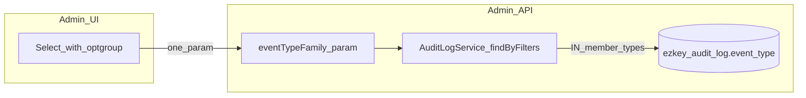

> **Implementation:** Completed. **Verification:** Manually tested (functional). Archived under `archived/2026-04/`.

# Audit logs: filter by event family (UI + API)

## Problem and goal

Operators can today filter by **one** `eventType` ([`AuditLogController.getAuditLogs`](ezkey-admin-api/src/main/java/org/ezkey/admin/controller/AuditLogController.java) + [`AuditLogService.findByFilters`](ezkey-core/src/main/java/org/ezkey/audit/service/AuditLogService.java)). There is no way to express “**all enrollment-related events**” in one selection. The goal is a **1:1 mapping** between a UI choice and a **single** query parameter that the backend translates to a **single** performant predicate.

## Clarification: stack

- **Admin UI** is **React (web)**, not React Native ([`ezkey-admin-ui/AGENTS.md`](ezkey-admin-ui/AGENTS.md)). No React Native primitives apply; use standard **HTML `<select>`** / existing [`Select`](ezkey-admin-ui/src/components/ui/select.tsx) and keep patterns consistent with [`audit-logs.tsx`](ezkey-admin-ui/src/pages/audit-logs.tsx).

## Comparable products (pattern, not implementation)

- **AWS CloudTrail**, **Azure Activity Log**, **Okta System Log**, **Google Workspace**: operators often filter by **category / resource type / product** first, then optionally narrow to a specific action. Ezkey’s “family” is the same idea: a **small curated taxonomy** backed by explicit enum membership, not free-text search.

**Recommendation:** one **family** filter parameter on the API (see below), and in the UI either:

- **Preferred (simplest):** a **single** `<select>` using **`<optgroup>`** for visual grouping. Inside each group, the **first option** is “All &lt;family&gt; events” (value = family key sent to API). Below it, each concrete `EventType` as today. Selecting “All enrollment events” sends **only** `eventTypeFamily=ENROLLMENT` (example name), not N repeated `eventType` params.

- **Alternative (two controls):** a “Scope” select (All | Family | Single type) + dependent second control — **more clicks**, only if product later needs it.

Avoid inventing a heavy tree/combobox unless accessibility and keyboard UX are explicitly required later; native `optgroup` + options is the most **regular, low-complexity** pattern.

## Backend design

### New query parameter

- Add optional `eventTypeFamily` (name can be finalized in code; e.g. `EventTypeFamily` enum in [`ezkey-core`](ezkey-core/src/main/java/org/ezkey/audit/domain/)).
- **Semantics:** restrict rows where `event_type` is **in** the set of `EventType` values for that family.
- **Mutual exclusion with existing filter:** if both `eventType` and `eventTypeFamily` are present, return **400** with a clear message (document in `@Operation` / `@Parameter`).

### Predicate

- Extend `findByFilters` to accept optional `EventTypeFamily` (or null).
- When `eventTypeFamily != null`: use `cb.in(root.get("eventType"), familyMembers)` and **do not** apply the single `eventType` equality branch.
- When `eventType != null` (legacy): unchanged `cb.equal(...)`.

This keeps **one round-trip**, **one predicate shape**, and avoids the client sending long repeated query strings.

### Source of truth for membership

- Introduce `EventTypeFamily` enum in **ezkey-core** with a single method or static mapping: `EnumSet<EventType> members()` (or `List` for stable order in docs/tests).
- Map each family to the same logical blocks already documented in [`EventType.java`](ezkey-core/src/main/java/org/ezkey/audit/domain/EventType.java) (comment sections). Proposed families (to validate during implementation against the enum):

  - **ADMIN** — all `ADMIN_*` (includes login, recovery, provisioning, profile, activation)
  - **ENROLLMENT** — all `ENROLLMENT_*`
  - **AUTH_ATTEMPT** — all `AUTH_ATTEMPT_*`
  - **API_KEY** — all `API_KEY_*`
  - **SYSTEM** — `SYSTEM_ERROR`
  - **ENCRYPTION_KEY** — `KEY_*`, `KEYSET_BACKUP_CREATED`
  - **REENCRYPTION** — all `REENCRYPTION_*`
  - **INTEGRATION** — all `INTEGRATION_*` (includes `INTEGRATION_RETIRED` in Java)
  - **TENANT** — all `TENANT_*`
  - **AUDIT_CHAIN** — all `AUDIT_CHAIN_*`

Any new `EventType` added later must be assigned to exactly one family (compile-time switch or exhaustive test).

### Index / query impact

- Today: `idx_audit_log_event_type` on `event_type` ([`V2__audit_api_keys...`](ezkey-core/src/main/resources/db/migration/V2__audit_api_keys_proof_tokens_and_admin_identity.sql)), plus composites involving `event_type` (e.g. `api_name, event_type`).
- **`WHERE event_type IN (...)`** with a modest list (each family is small) uses the same column; PostgreSQL can use **bitmap OR** over matching index entries or filter rows efficiently. **No new index is required** for typical volumes; the dominant filter remains tenant scoping + time range when present.
- If future profiling shows `tenant_id + event_type IN (...)` as hot, consider a **composite** index — **out of scope** unless metrics justify it.

### API docs and clients

- Update Springdoc annotations on the controller; **do not** hand-edit [`specs/`](specs/) — maintainer regenerates OpenAPI per [`.cursor/rules/openapi-specs.mdc`](.cursor/rules/openapi-specs.mdc).
- Regenerate Orval types for [`getAuditLogs`](ezkey-admin-ui/src/generated/) after spec refresh.
- Optional follow-up: Python CLI [`ezkey admin audit-log list`](ezkey-cli-python/) — add `--event-type-family` if desired (not blocking Admin UI).

## Admin UI design

### State and request wiring

- Replace the single `eventTypeFilter` string with either:
  - **Option A:** one string state `eventFilter` that is either empty, a concrete `EventType` key, or a **prefixed** family key (e.g. `FAMILY:ENROLLMENT`) — simple but stringly-typed; or
  - **Option B (clearer):** `eventType: string | null` and `eventTypeFamily: string | null` with invariant `!(eventType && eventTypeFamily)`.

Pass `eventType` and `eventTypeFamily` to `getAuditLogs` per Orval-generated params; update TanStack `queryKey` accordingly.

### UI structure

- Build groups from a **small config** in [`audit-event-type.ts`](ezkey-admin-ui/src/lib/audit-event-type.ts) (or adjacent `audit-event-type-family.ts`): ordered list of `{ familyKey, memberKeys: AuditEventTypeKey[] }` aligned with backend `EventTypeFamily`.
- Render `<Select>` with `<optgroup label={t('eventFamily.X')}>`; first `<option value={familyApiValue}>` = “All …”; then each member type.
- Keep “All types” at the top (`value=""`) as today.

### i18n

- Add EN/FR keys for family labels (e.g. `audit-logs:eventFamily.ENROLLMENT`) and for “All enrollment events” lines if not covered by a single pattern.

### Known drift to fix while touching this file

- [`EVENT_TYPE_KEYS`](ezkey-admin-ui/src/lib/audit-event-type.ts) is missing **`ADMIN_RECOVERY_CODES_REGENERATED`** and **`INTEGRATION_RETIRED`** present in [`EventType.java`](ezkey-core/src/main/java/org/ezkey/audit/domain/EventType.java). Add keys + translations so filters and labels stay complete.

## Testing

- **Unit:** `AuditLogService` — family filter returns only rows whose `eventType` is in the family; mutual exclusion with single `eventType` covered at controller or service test.
- **Integration/API:** `GET /api/v1/audit-logs?eventTypeFamily=ENROLLMENT` vs `...?eventType=ENROLLMENT_CREATED`; 400 when both supplied.
- **UI:** Low risk (presentation + query params); run existing Playwright smoke if audit route behavior changes materially ([`ezkey-admin-ui/AGENTS.md`](ezkey-admin-ui/AGENTS.md) judgment).

## Documentation

- Short note in [`docs/ENDPOINT.md`](docs/ENDPOINT.md) for the new parameter (if that file lists audit query params today).

