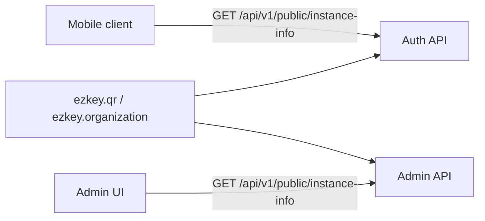

# Auth API public `instance-info` endpoint

**Archived:** April 13, 2026. **Status:** completed (implemented and validated in code; Postman collections verified by maintainer).

## Product / architecture decision (confirmed)

- **Chosen approach:** expose **`GET /api/v1/public/instance-info`** on the **Auth API** with the **same functional contract** as the Admin API (`PublicInstanceInfoResponseDto` in `ezkey-core`; was under `ezkey-admin-api` at plan time).
- **Keep bind focused:** do **not** treat `POST /api/v1/enrollments/bind` as the canonical source for instance branding; optional snapshot in bind remains a possible future optimization only.
- **Admin API** keeps its existing endpoint for the login shell and operator tooling; **no production backward-compat constraint** (per your note).

## Why centralize in `ezkey-core` (avoid drift)

At plan time, [`PublicInstanceInfoController`](ezkey-admin-api/src/main/java/org/ezkey/admin/controller/PublicInstanceInfoController.java) built the response from `QrCodeProperties` and `OrganizationProperties` in `ezkey-admin-api` (`ezkey.qr.auth-base-url`, `ezkey.organization.*`). **As implemented:** those types and [`PublicInstanceInfoResponseDto`](ezkey-core/src/main/java/org/ezkey/instance/dto/PublicInstanceInfoResponseDto.java) live in **`ezkey-core`** with [`PublicInstanceInfoService`](ezkey-core/src/main/java/org/ezkey/instance/service/PublicInstanceInfoService.java). Both [`AuthApplication`](ezkey-auth-api/src/main/java/org/ezkey/auth/AuthApplication.java) and [`AdminApplication`](ezkey-admin-api/src/main/java/org/ezkey/admin/AdminApplication.java) scan `org.ezkey.config` and `org.ezkey.instance`.

**Recommended implementation to prevent duplicate contracts:**

1. **Move** `PublicInstanceInfoResponseDto`, `QrCodeProperties`, and `OrganizationProperties` from `ezkey-admin-api` into **`ezkey-core`** under `org.ezkey.config` / a small `org.ezkey.instance` (or `org.ezkey.dto`) package — **same property prefixes** (`ezkey.qr`, `ezkey.organization`) and **same JSON field names** (unchanged for clients).
2. **Introduce a single `@Service` in `ezkey-core`** (e.g. `PublicInstanceInfoService`) that encapsulates the trimming/null-blank logic currently in the Admin controller and returns `PublicInstanceInfoResponseDto`. Both APIs call this service from thin controllers (Admin controller becomes a delegate; Auth API adds a sibling controller under `org.ezkey.auth.controller`).
3. **Update imports** in Admin (`PublicInstanceInfoController`, `QrCodePayloadService`, `AdminBootstrapService`, `BootstrapCredentialsFileExporter`, tests).

This satisfies the “duplicate surface, not duplicate truth” goal: one DTO, one property binding, one builder.

## Auth API implementation details

- **Route:** `@RequestMapping("/api/v1/public")` + `@GetMapping("/instance-info")` — **same path** as Admin so clients and docs stay symmetric.
- **Security:** [`SecurityConfig`](ezkey-auth-api/src/main/java/org/ezkey/auth/config/SecurityConfig.java) already uses `anyRequest().permitAll()`; no Security change required.
- **OpenAPI:** [`OpenApiConfig`](ezkey-auth-api/src/main/java/org/ezkey/auth/config/OpenApiConfig.java) applies a **global** `signatureAuth` requirement. Override on the new operation with **`@Operation(security = {})`** (empty security requirement list) so Swagger documents **no** signature for this GET (mirror how public endpoints should appear).
- **Tests:** Add an Auth API controller (or service) unit test parallel to [`PublicInstanceInfoControllerTest`](ezkey-admin-api/src/test/java/org/ezkey/admin/controller/PublicInstanceInfoControllerTest.java); keep/adjust Admin tests after the refactor.

## Configuration and Docker

- **Problem:** [`docker-compose.yml`](docker/docker-compose.yml) passes `EZKEY_QR_AUTH_BASE_URL` and `EZKEY_ORGANIZATION_ABOUT_URL` to **admin-api** only; **auth-api** does not receive them today. For the Auth `instance-info` to return non-null branding / public URL, **the same env-driven properties must be available to the Auth process**.
- **Plan:** add the equivalent env vars to the **`auth-api`** service (at minimum `EZKEY_QR_AUTH_BASE_URL`; include organization-related vars if you want parity with Admin for name/description/about). Align with [`docker/.env.example`](docker/.env.example) comments.
- **Operational note:** operators who only expose Auth publicly should set these on **auth-api**; if both APIs are public, set **consistently** on both to avoid mismatched metadata.

## Documentation and artifacts

- **[`docs/ENDPOINT.md`](docs/ENDPOINT.md):** Add a **Public instance metadata** subsection under **§1 Auth API** (mirror the table already documented for Admin in §2, with base URL `http://localhost:8080`). Cross-link to the Admin section for operators who still use Admin-only deployments.
- **OpenAPI JSON under `specs/`:** per repo rules, **do not edit by hand**; implement Java + annotations, then maintainer runs `scripts/update-specs.sh` after clean start.
- **Postman:** Optionally extend or add a note in [`postman/collections/`](postman/collections/) for `GET` against Auth base URL (low priority).

**Done post-plan:** [`postman/collections/v2.1/EZ Key Public auth.postman_collection.json`](postman/collections/v2.1/EZ Key Public auth.postman_collection.json) and URL fix for [`EZ Key Public admin`](postman/collections/v2.1/EZ Key Public admin.postman_collection.json) (string `url` so Postman imports correctly).

## Rate limiting: recommendation

**Current behavior:** [`RateLimitFilter`](ezkey-auth-api/src/main/java/org/ezkey/auth/config/RateLimitFilter.java) only rate-limits **POST** on pending/respond/bind/verify — **GET** requests are unaffected.

**Recommendation for v1:**

- **Do not require** a new Bucket4j bucket for `GET /api/v1/public/instance-info` initially. The payload is small, cache-friendly, and similar to discovery traffic; abuse is better handled at the **edge** (reverse proxy, WAF, CDN) in production.
- **Optional follow-up** if needed: add an **`instance-info`** profile under [`RateLimitProperties`](ezkey-auth-api/src/main/java/org/ezkey/auth/config/RateLimitProperties.java) with **per-client-IP** limits and extend `shouldApplyRateLimit` / `checkRateLimit` for `GET` on this path only — use a **high** ceiling (e.g. hundreds per minute) so legitimate app refreshes are never blocked.

## Mobile follow-up (out of scope for backend-only PR but part of the arc)

- Call **`{authBaseUrl}/api/v1/public/instance-info`** using the same base URL as bind/verify (from QR `authUrl` or configured default).
- Update [`ezkey_mobile/README.md`](ezkey_mobile/README.md) to describe Auth API `instance-info` instead of implying Admin-only discovery.

## Gaps / clarifications from the original fragment

| Topic | Resolution |
| ----- | ---------- |
| Same JSON as Admin? | Yes — single DTO in core. |
| `authApiPublicBaseUrl` when calling Auth directly | Still driven by **`ezkey.qr.auth-base-url`**; it should match the public URL used in QR. It may match the request origin in many deployments but remains **config-driven** for tunnel/proxy cases. |
| Bind enrichment | Explicitly **out of scope** as the primary design; optional later. |

## Completion summary (implementation)

- **Core:** `QrCodeProperties`, `OrganizationProperties`, `PublicInstanceInfoResponseDto`, `PublicInstanceInfoService` in `ezkey-core`; Admin and Auth controllers delegate to the service.
- **Auth API:** [`PublicInstanceInfoController`](ezkey-auth-api/src/main/java/org/ezkey/auth/controller/PublicInstanceInfoController.java) at `GET /api/v1/public/instance-info`.
- **Docker / env:** `auth-api` receives `EZKEY_QR_AUTH_BASE_URL` and `EZKEY_ORGANIZATION_ABOUT_URL` where applicable; Auth `application-docker*.properties` sets organization + QR keys.
- **Docs:** `docs/ENDPOINT.md`, `docs/OPERATIONAL.md`, `ezkey_mobile/README.md`, `ezkey-auth-api/AGENTS.md`.
- **Postman:** `EZ Key Public auth` collection; `EZ Key Public admin` request URL as string for import compatibility.

**Canonical API reference:** [`docs/ENDPOINT.md`](docs/ENDPOINT.md) — not this archived plan alone.
