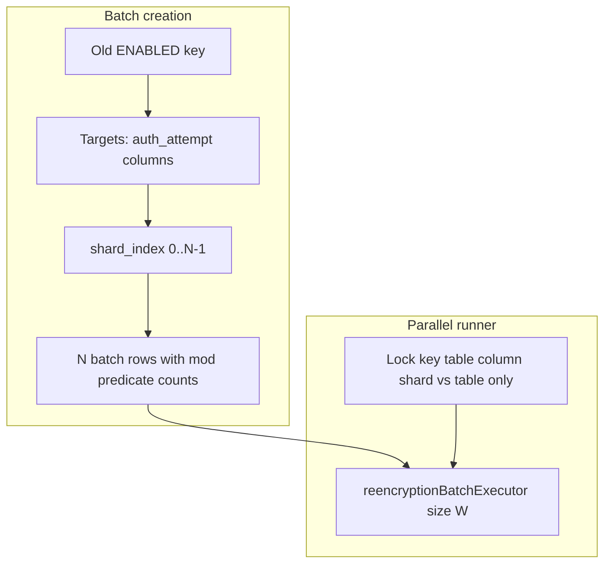

# Sharded re-encryption for `ezkey_auth_attempt`

## Context (current behavior)

- **Batch creation**: [`ReencryptionBatchCreationService.createBatchesForOldKeys()`](c:/github/ezkey/ezkey-core/src/main/java/org/ezkey/security/ReencryptionBatchCreationService.java) creates **one** `ReencryptionBatch` per `(oldKey, target table, target column)` when no active batch exists and count &gt; 0.
- **Fetch/count**: [`ReencryptionTargetQueryService`](c:/github/ezkey/ezkey-core/src/main/java/org/ezkey/security/ReencryptionTargetQueryService.java) delegates to native queries on [`AuthAttemptRepository`](c:/github/ezkey/ezkey-core/src/main/java/org/ezkey/authattempt/domain/repository/AuthAttemptRepository.java) — `LIKE ENC:{keyId}:%` plus `auth_attempt_id > :lastId` for resumable scans.
- **Parallelism**: [`ReencryptionBatchParallelRunner`](c:/github/ezkey/ezkey-core/src/main/java/org/ezkey/security/ReencryptionBatchParallelRunner.java) uses [`reencryptionBatchExecutor`](c:/github/ezkey/ezkey-core/src/main/java/org/ezkey/security/config/ReencryptionExecutorConfiguration.java) sized to `parallelBatchWorkers`, but **synchronizes on `target_table` only**, so **at most one batch touches `ezkey_auth_attempt` at a time** (including the two encrypted columns). That avoids cross-column row contention (notably for enrollment) but **caps throughput** on the large auth-attempt table.
- **Docs / prior plans**: Service split and table mutex are documented in [`.cursor/plans/archived/2026-04/lifecycle_after_reencrypt_refactor_7721f359.plan.md`](c:/github/ezkey/.cursor/plans/archived/2026-04/lifecycle_after_reencrypt_refactor_7721f359.plan.md) and [`docs/REENCRYPTION_OPERATIONS.md`](c:/github/ezkey/docs/REENCRYPTION_OPERATIONS.md).

## Design choice: persisted shard batches vs in-thread split

| Approach | Pros | Cons |
|---------|------|------|
| **A. Multiple `ReencryptionBatch` rows (one per shard)** | Reuses existing resume/progress/Admin UI; each shard has its own `last_record_id`; natural fit for existing `parallelBatchWorkers` + executor queue; clear ops visibility | Flyway migration; creation logic must split counts; more rows in batch table |
| **B. Single batch + internal multi-threaded slice processing** | One batch row | Multiple cursors, harder resume semantics, more complex failure handling, poorer observability |

**Recommendation: A** — aligns with “80/20”, minimal new moving parts, and matches how work is already parallelized (distinct batch IDs).

**Explicitly out of scope for v1**: a second thread pool dedicated to auth-attempt only. **Reuse** the existing `reencryptionBatchExecutor`; scale **pool size** via existing `parallelBatchWorkers` (and queue capacity). Sub-pools add operational and sizing complexity without a clear win if batch count × shards maps 1:1 to tasks.

## Shard criterion

Use **integer modulus on the primary key**:

`mod(auth_attempt_id, shard_count) = shard_index`

- **Even/odd** is the special case `shard_count = 2`.
- **Partition**: disjoint row sets; **no double work** and **full coverage** if `shard_index ∈ [0, shard_count)`.
- **Stability**: independent of time or tenant; safe for resume.
- **Indexes**: queries remain `LIKE` + `id` cursor + `mod` filter; the dominant cost is still scanning ciphertext with the prefix — acceptable for a **batch migration** workload. (Optional later: expression index on `(mod(id, k))` — likely **not** worth the complexity for v1.)

Add the same predicate to **count** and **fetch** native SQL for both auth-attempt columns in `AuthAttemptRepository`, and thread `shardIndex` / `shardCount` from the batch into `ReencryptionTargetQueryService.fetchRecords` / `countRecordsEncryptedWithKey` when the batch is sharded.

## Schema and batch identity

- Add nullable columns on `ezkey_reencryption_batch`, e.g. `shard_index` (nullable `SMALLINT`) and `shard_count` (nullable `SMALLINT`), with **`NULL` = legacy / non-sharded** (enrollment and existing rows).
- **Uniqueness for “active batch”**: extend the concept used by [`findActiveBatchesByTargetAndOldKey`](c:/github/ezkey/ezkey-core/src/main/java/org/ezkey/security/domain/repository/ReencryptionBatchRepository.java) so that for sharded auth-attempt batches, **only one** `PENDING`/`IN_PROGRESS` row exists per `(target_table, target_column, old_key_id, shard_index)` when `shard_count` is set. (Same pattern as today, plus shard dimension.)

## Creation rules (`ReencryptionBatchCreationService`)

- New config (see below): when `target_table == ezkey_auth_attempt` and `shard_count > 1`:
  - For each `(oldKey, column)`, **create `shard_count` batches** with `shard_index = 0..shard_count-1`.
  - **`records_total`** per batch = **exact** count with `LIKE` prefix **and** `mod` predicate (accurate progress; avoids skew assumptions).
- When `shard_count == 1` (default): **unchanged** single batch per target (preserves current behavior and **one batch per column** for auth attempts).
- **Enrollment**: never shard in v1 (ignore shard config).

## Parallel runner mutex (critical)

Today: `synchronized` on `target_table` → **serializes all** `ezkey_auth_attempt` batches.

**New rule**:

- **Enrollment** (`ezkey_enrollment`): **keep** locking on **`target_table` only** (two encrypted columns on the same row — same rationale as today).
- **`ezkey_auth_attempt` with sharding** (`shard_count > 1`): lock key = **`target_table + "|" + target_column + "|" + shard_index`** so **shards of the same column** run concurrently.
- **`ezkey_auth_attempt` without sharding** (`shard_count` null or 1): **keep** **`target_table` only** so **both columns** remain mutually exclusive (same as today).

**Cross-column safety when sharding is on**: two batches for **different columns** with the same `shard_index` could touch the **same row**; they use **different** lock keys and may run in parallel. **Mitigation**: [`ReencryptionRowPersistenceService`](c:/github/ezkey/ezkey-core/src/main/java/org/ezkey/security/ReencryptionRowPersistenceService.java) already loads with **`PESSIMISTIC_WRITE`** (`findByIdForReencryptionUpdate`). `AuthAttempt` has **no** `@Version` field (no optimistic-lock mismatch); concurrent updates to **different columns** on the same row **serialize at the database row lock**. Document a **low** deadlock risk and the reliance on consistent lock ordering (single-row `FOR UPDATE`).

## Configuration (externalized)

Extend [`TinkProperties.Reencryption`](c:/github/ezkey/ezkey-core/src/main/java/org/ezkey/config/TinkProperties.java) (and `application.yml` / Docker env docs):

- **`authAttemptShardCount`** (int, default **1**): `1` = disabled; **4 / 8 / 16** as realistic Docker targets.
- **`parallelBatchWorkers`**: should be **≥** expected concurrent shard batches you want to run (often **≥ `authAttemptShardCount`** when migrating one column; remember **two** columns doubles eligible batches). The executor already sets **core = max = `parallelBatchWorkers`** in [`ReencryptionExecutorConfiguration`](c:/github/ezkey/ezkey-core/src/main/java/org/ezkey/security/config/ReencryptionExecutorConfiguration.java).
- **`parallelBatchQueueCapacity`**: may need a bump if many shard batches queue up.
- **`maxBatchesPerRun`**: with sharding, **more** batch rows exist; operators may need a **higher** limit so the scheduler makes progress across shards in one run (document in [`REENCRYPTION_OPERATIONS.md`](c:/github/ezkey/docs/REENCRYPTION_OPERATIONS.md)).

Avoid hard-coding “32 threads”; recommend **4–8** as a sensible default range for Docker, **up to 16** when DB and CPU allow.

## Memory estimate (per worker thread)

Rough model for one slice in [`ReencryptionBatchProcessingService`](c:/github/ezkey/ezkey-core/src/main/java/org/ezkey/security/ReencryptionBatchProcessingService.java):

- Peak ≈ **`effectiveBatchSize × size_of_loaded_row`**, where the native query selects **full rows** (`SELECT *`), not a single column.
- Order of magnitude: for `effectiveBatchSize` 500–1000 and two large TEXT ciphertext fields plus metadata, **on the order of single-digit MB per slice** in the heap, plus ORM overhead — **not** one full DB page per thread indefinitely because the list is scoped to the slice and can be GC’d between iterations.
- **Per parallel batch**: **one** such slice active per thread in the steady-state loop; total ≈ **`parallelBatchWorkers × slice footprint`** (throttle sleep reduces sustained pressure).

Document this formula in ops docs so operators can relate **`batchSize` / temporal chunk sizes** to heap.

## Orchestration note

[`ReencryptionService.processReencryptionBatches`](c:/github/ezkey/ezkey-core/src/main/java/org/ezkey/security/ReencryptionService.java) collects a **bounded** list (`maxBatchesPerRun`) **before** new creations in the parallel path; shard batches increase row count — **tune `maxBatchesPerRun`** accordingly or consider a small follow-up to prioritize **oldest PENDING** (optional, only if needed).

## Testing and verification

- **Unit tests**: shard-aware count/fetch SQL (repository or `ReencryptionTargetQueryService` with mocked repos); batch creation creates **N** batches with correct totals; parallel runner uses expected lock key for sharded vs non-sharded.
- **Integration**: optional focused test that processes two shard batches without overlap (ids partition correctly).
- **Regression**: enrollment + non-sharded auth paths unchanged when `authAttemptShardCount == 1`.

## Documentation

- Update [`docs/REENCRYPTION_OPERATIONS.md`](c:/github/ezkey/docs/REENCRYPTION_OPERATIONS.md): shard batches, mutex behavior, tuning `parallelBatchWorkers`, `maxBatchesPerRun`, memory rule-of-thumb.
- Do **not** hand-edit OpenAPI specs; Java-only changes; maintainer runs `update-specs` if API/DTO surface changes (e.g. batch response shows shard fields — **additive** fields on `ReencryptionBatchResponse` if exposed).

