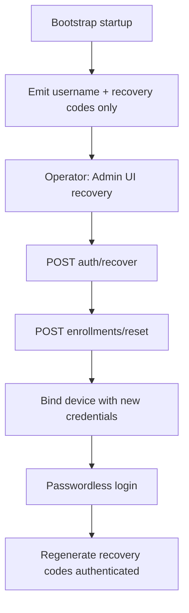

> **Plan status:** Completed — implementation delivered (bootstrap `credentials-output-mode`, Docker/bootstrap-init wiring, reset logging hygiene, log audit fixes, docs/AGENTS).

# Global admin bootstrap: security analysis and action plan

## Context (current implementation)

- **Bootstrap emission** lives in [`ezkey-admin-api/src/main/java/org/ezkey/admin/service/AdminBootstrapService.java`](ezkey-admin-api/src/main/java/org/ezkey/admin/service/AdminBootstrapService.java): on first enrollment creation it logs at **WARN** enrollment id, proof token, challenge, ASCII QR, recovery codes, and CLI hints; then calls [`BootstrapCredentialsFileExporter`](ezkey-admin-api/src/main/java/org/ezkey/admin/service/BootstrapCredentialsFileExporter.java) for Docker (JSON with `enrollmentId`, `enrollmentProofToken`, `enrollmentChallengeCode`, `username`, optional `authUrl`) — **recovery codes are intentionally excluded from the file**.
- **Recovery funnel** is already end-to-end: `POST /api/v1/admin/auth/recover` returns `recoveryToken`, `enrollmentId`, `codesRemaining` ([`AdminRecoveryResponseDto`](ezkey-admin-api/src/main/java/org/ezkey/admin/dto/response/AdminRecoveryResponseDto.java)); the Admin UI uses `enrollmentId` + recovery token for `POST /api/v1/admin/enrollments/reset` ([`login-recovery-section.tsx`](ezkey-admin-ui/src/components/feature/login-recovery-section.tsx)). So an operator with **username + one recovery code** can obtain bind material **without** ever seeing the original proof token or QR.
- **Docker `bootstrap-init`** ([`docker/bootstrap-init/bootstrap-init.sh`](docker/bootstrap-init/bootstrap-init.sh)) waits for **`/bootstrap/bootstrap-credentials.json`** and performs bind+verify; it does **not** scrape logs. Any “recovery-only bootstrap” breaks this unless the script gains a new input path (e.g. recovery code via secret/env) or prod disables automated bind.

---

## Design analysis

### 1) “Initialization last” and what is actually secret

- **Enrollment proof token + challenge** are high-value secrets for **initial bind**; once the device is bound and verified, the cryptographic binding is the real trust anchor (your point stands).
- **Recovery codes** are also high-value; they are already emitted in bootstrap logs today and are **not** in the JSON export — so logs are currently the **only** full channel for recovery codes in Docker unless operators copy from logs.
- **ASCII QR** improves mobile scanning when logs use a **monospace** channel; in proportional fonts or misaligned terminals it can be unreliable — your fragility concern is valid. The **recovery code format** (digits, normalization) is more robust for human transcription than a 2D QR rendered as text.

### 2) Recovery-only bootstrap (enrollment secrets not printed)

- **Feasible** with current APIs: recover → reset produces **new** proof token + challenge (enrollment id unchanged). The original leaked bootstrap token becomes irrelevant after reset (new token).
- **Required non-secret context**: **username** remains necessary (typically already in config / `EZKEY_ADMIN_INITIAL_USERNAME`), and **`enrollmentId`** is returned by recover — no need to print enrollment id at bootstrap for the recovery path.
- **Caveat (bug, not policy trade-off)**: [`AdminRecoveryService.resetEnrollment`](ezkey-admin-api/src/main/java/org/ezkey/admin/service/AdminRecoveryService.java) logs **new** proof token and challenge at **WARN** (lines ~357–358). These values are **already returned** to the client in the enrollment-reset HTTP response; duplicating them in server logs is an unnecessary leak into log aggregation and retention. **They should never have been logged** — remove entirely (do not merely downgrade level). Use **non-secret correlation** only (e.g. `enrollmentId`, admin username) at INFO/DEBUG if operators need traceability.

### 3) Forced invalidation / regeneration of bootstrap recovery codes after first bind

- **Intent** (remove codes that appeared in startup logs from the threat model) is sound.
- **Implementation nuance**: after bind, the operator obtains a **normal bearer session**; **`POST /api/v1/admins/{id}/recovery-codes/regenerate`** already performs **full replacement** of hashes ([`AdminRecoveryService.rotateRecoveryCodes`](ezkey-admin-api/src/main/java/org/ezkey/admin/service/AdminRecoveryService.java)). So “rotate after first successful login” is mostly a **product/gating** question:
  - **Soft recommendation**: strong **UI prompt** on first login after bootstrap until regeneration is confirmed (low risk, no new crypto).
  - **Hard recommendation**: server-side **automatic rotation** on transition to **VERIFIED** (or first successful passwordless login) with **one-time** plaintext delivery (e.g. extend login response once) — higher complexity and higher risk of operator error if codes are not shown clearly once.
- **Recommendation**: prefer **mandatory regeneration wizard** (block sensitive actions until completed) over silent auto-rotation without a clear “save now” moment, unless compliance explicitly requires server-forced invalidation without a UI step.

### 4) Count of codes at bootstrap (10 vs fewer)

- Fewer plaintext codes at bootstrap **reduce** log bulk but **do not** reduce per-code risk; operational preference should drive this (e.g. 3–5 for bootstrap printout) while keeping [`ezkey.admin.recovery.codes-count`](docs/RECOVERY_CODES_LIFECYCLE_ANALYSIS.md) as the post-provisioning norm. Any split (bootstrap subset vs stored count) adds **complexity** — only do it if log volume is a real issue.

---

## Recommendation: status quo + hardening flag vs full refactor

**Recommended approach: keep the existing “full” bootstrap for dev/demo automation and add an explicit production-oriented profile (flag) that changes *what is emitted* — not a big-bang removal of the old path.**

Reasons:

- [`bootstrap-init`](docker/bootstrap-init/bootstrap-init.sh) and [`BootstrapCredentialsFileExporter`](ezkey-admin-api/src/main/java/org/ezkey/admin/service/BootstrapCredentialsFileExporter.java) are **tightly coupled** to enrollment id + proof token + challenge for **unattended** clean-start demos.
- Production operators often **do not** rely on the same JSON file contract; they use secrets management, runbooks, or human enrollment. A **flag** maps cleanly: `docker` / `clean-start` keeps today’s behavior; `production` / `prod-safe` uses recovery-first output and disables or replaces automated bootstrap-init inputs.

**Full refactor** (delete ASCII QR + enrollment secrets everywhere) is **not** pragmatic short term because it forces **all** environments (including tests and demo automation) onto a recovery-based bootstrap-init without a clear single secret injection story.

---

## Proposed action plan (concrete)

### Phase A — Configuration and emission policy

1. Introduce a **single enum-style property** (names illustrative): `ezkey.admin.bootstrap.credentials-output-mode` with values such as:
   - **`full`** (default): current WARN block + current JSON export fields.
   - **`recovery_primary`**: WARN shows **username**, **recovery codes**, short operator instructions (recover → reset → bind in Admin UI / mobile); **omit** or **redact** proof token, challenge, and ASCII QR from logs; JSON export behavior decided in Phase B.
2. Document in [`docker/README.md`](docker/README.md) and operator docs (e.g. [`docs/OPERATIONAL.md`](docs/OPERATIONAL.md) if appropriate) when to use each mode.

### Phase B — Docker artifacts and `bootstrap-init`

3. **`recovery_primary` + unattended automation**: choose one explicit strategy:
   - **B1 (recommended for prod)**: **disable** `bootstrap-init` auto-bind (or gate behind `BOOTSTRAP_AUTOMATION_ENABLED=false`); human uses recovery flow; CI/demo stacks keep `full`.
   - **B2**: extend bootstrap to write a **second** file (e.g. `bootstrap-recovery.json`) containing **only** what automation needs (e.g. one recovery code read from env at runtime — **not** generated twice); `bootstrap-init` uses **recover → reset → bind** when that file is present. This is more work but preserves full automation under the new model.

### Phase C — Stop logging enrollment secrets on reset (mandatory)

4. **Remove** logging of `newProofToken` and `newChallenge` from [`AdminRecoveryService.resetEnrollment`](ezkey-admin-api/src/main/java/org/ezkey/admin/service/AdminRecoveryService.java). This is **unconditional** (not profile-gated): API response is the sole intended channel for those secrets after reset.

### Phase C2 — Repository-wide sensitive logging audit (small pass)

5. **Goal**: ensure the same anti-pattern does not exist elsewhere — any log line that prints **enrollment proof tokens**, **enrollment challenge values**, **plaintext recovery codes**, **bearer/recovery tokens**, or **cryptographic signatures** used as secrets.

6. **Starting points from a quick scan** (non-exhaustive — re-run grep at implementation time):
   - **Admin API**: [`AdminBootstrapService`](ezkey-admin-api/src/main/java/org/ezkey/admin/service/AdminBootstrapService.java) intentionally logs one-time bootstrap material at WARN — **treat as a single documented exception** for operator bootstrap (or later gate behind `credentials-output-mode`), not as a pattern to copy elsewhere.
   - **Admin API**: [`AdminRecoveryService.resetEnrollment`](ezkey-admin-api/src/main/java/org/ezkey/admin/service/AdminRecoveryService.java) — **remove** secret logs (Phase C).
   - **Demo device** (lower severity but review): [`EzkeyAppController`](ezkey-demo-device/src/main/java/org/ezkey/demo/device/controller/EzkeyAppController.java) logs `enrollmentProofTokenSigned` at INFO — confirm whether this is dev-only noise or should be redacted.
   - **Methodology**: ripgrep for `logger.` + variables/fields such as `ProofToken`, `enrollmentChallenge`, `recoveryCode`, `Bearer`, or string literals like `"proof token"` in `ezkey-admin-api`, `ezkey-auth-api`, `ezkey-core` enrollment paths; fix cases where production code echoes client-bound secrets to logs.

7. **Documentation**: add a one-paragraph **“Logging and secrets”** note for maintainers (e.g. in [`ezkey-admin-api/AGENTS.md`](ezkey-admin-api/AGENTS.md) or security doc): *never log enrollment proof tokens, challenge codes, or recovery codes except the deliberate bootstrap channel (if enabled).*

### Phase D — Post-bootstrap recovery code lifecycle (optional but aligned with your goal)

8. Implement **first-login** or **first-VERIFIED** gating to **force** authenticated recovery-code regeneration (UI + optional audit event). Reuse existing [`AdminProvisioningController` regenerate endpoint](ezkey-admin-api/src/main/java/org/ezkey/admin/controller/AdminProvisioningController.java) rather than inventing a parallel mechanism.

### Phase E — Validation

9. **Tests**: extend admin-api tests around bootstrap logging/export; ensure **no** test asserts that reset logs contain proof tokens/challenges; adjust any integration tests that assumed those WARN lines existed.
10. **Admin UI**: if gating is added, small Playwright coverage only if the gate blocks login shell (risk-based per [`ezkey-admin-ui/AGENTS.md`](ezkey-admin-ui/AGENTS.md)).

---

## Mermaid — target operator flow (`recovery_primary`)

---

## Key files to touch (implementation phase)

| Area | Files |
|------|--------|
| Bootstrap policy | [`AdminBootstrapService.java`](ezkey-admin-api/src/main/java/org/ezkey/admin/service/AdminBootstrapService.java), new properties class next to [`AdminMfaProperties`](ezkey-admin-api/src/main/java/org/ezkey/admin/config/AdminMfaProperties.java) |
| File export | [`BootstrapCredentialsFileExporter.java`](ezkey-admin-api/src/main/java/org/ezkey/admin/service/BootstrapCredentialsFileExporter.java), [`application-docker.properties`](ezkey-admin-api/config/application-docker.properties) |
| Reset logging + audit | [`AdminRecoveryService.java`](ezkey-admin-api/src/main/java/org/ezkey/admin/service/AdminRecoveryService.java); grep-led review across `ezkey-admin-api`, `ezkey-auth-api`, `ezkey-core` as needed |
| Maintainer note | [`ezkey-admin-api/AGENTS.md`](ezkey-admin-api/AGENTS.md) (or linked security doc) — logging rules for secrets |
| Docker | [`docker/bootstrap-init/bootstrap-init.sh`](docker/bootstrap-init/bootstrap-init.sh), [`docker-compose.yml`](docker/docker-compose.yml) env wiring |
| Optional UI gate | [`login.tsx`](ezkey-admin-ui/src/pages/login.tsx) / session bootstrap flag — only if Phase D adopted |
