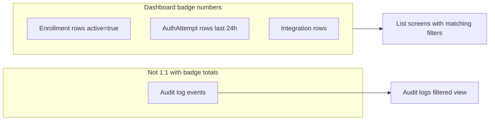

# ⚠️ ARCHIVED PLAN

**This plan has been fully implemented and archived for historical reference.**

**Completion Date:** April 14, 2026  
**Status:** ✅ Completed (implemented; validated in manual testing)

---

# Dashboard badge drill-downs — analysis and work plan

## 1. What the dashboard actually counts (source of truth)

Understanding this avoids **accidental** UX debt (users expecting row counts to match badge numbers).

| Widget | Backend source | Meaning |
|--------|----------------|---------|
| **Integrations** | [`DashboardService.buildIntegrationStats`](ezkey-admin-api/src/main/java/org/ezkey/admin/service/DashboardService.java) | Totals from integration entities (active vs inactive). |
| **Enrollments** | [`EnrollmentService.aggregateDashboardEnrollmentStats`](ezkey-core/src/main/java/org/ezkey/enrollment/service/EnrollmentService.java) via [`EnrollmentDashboardStats`](ezkey-core/src/main/java/org/ezkey/enrollment/domain/EnrollmentDashboardStats.java) | **Active** enrollments only, bucketed: verified; inProgress = CREATED+BOUND; expired; unavailable = INVALID+REVOKED. |
| **Auth attempts (24h)** + **Auth health** | [`AuthAttemptService.aggregateDashboard24h`](ezkey-core/src/main/java/org/ezkey/authattempt/service/AuthAttemptService.java) via [`AuthAttemptDashboard24hStats`](ezkey-core/src/main/java/org/ezkey/authattempt/domain/AuthAttemptDashboard24hStats.java) | **Auth attempt rows** with `createdAt` in the last 24h, grouped by `AuthAttemptStatus`. “In progress” in the UI is pending+read (see [`dashboard.tsx`](ezkey-admin-ui/src/pages/dashboard.tsx)). |

**Audit logs** are a separate trail: multiple events per lifecycle, different grain. [`DashboardService.buildRecentActivity`](ezkey-admin-api/src/main/java/org/ezkey/admin/service/DashboardService.java) uses `auditLogService.findByFilters` for the small “recent activity” sample only—not for the stat badges.

## 2. Implication for “click badge → audit logs”

- **Auth 24h / health badges**: Linking only to [`/audit-logs`](ezkey-admin-ui/src/pages/audit-logs.tsx) with `eventTypeFamily`/`eventType` + `createdAfter`/`createdBefore` gives a **useful investigation timeline**, but **list row counts will not equal** the badge (audit events ≠ auth-attempt rows). That is acceptable if copy/UX positions the page as “related audit trail,” not “same total.”
- **Better default for parity with the number shown**: Drill to **[`/auth-attempts`](ezkey-admin-ui/src/pages/auth-attempts.tsx)** using [`Search2Params`](ezkey-admin-ui/src/generated/admin-api/model/search2Params.ts): `status`, `createdAfter`, `createdBefore`. That matches how [`AuthAttemptDashboard24hStats`](ezkey-core/src/main/java/org/ezkey/authattempt/domain/AuthAttemptDashboard24hStats.java) is computed.
- **Enrollments**: Drill to **[`/enrollments`](ezkey-admin-ui/src/pages/enrollments.tsx)** with [`Search1Params`](ezkey-admin-ui/src/generated/admin-api/model/search1Params.ts): `status`, `active=true` where the bucket allows a **single** status. **Exception:** the **In progress** badge sums **CREATED + BOUND** while the API exposes a **single** `status` filter—no OR without API or UI support (see §4).
- **Integrations**: Drill to **`/integrations`** with filters aligned to active vs inactive ([`SearchParams`](ezkey-admin-ui/src/generated/admin-api/model/searchParams.ts): `active` and/or `lifecycleStatus`). The integrations list today uses local state ([`integrations.tsx`](ezkey-admin-ui/src/pages/integrations.tsx)) without URL sync—same gap as enrollments/auth-attempts for deep links.

**Recommendation:** Treat **entity-list drill-downs** as the primary behavior for “this number,” and optionally add a secondary control (“View audit trail”) where it adds value—especially for auth—without pretending counts match.

## 3. Existing URL patterns to reuse

- **Audit logs** already implement rich query sync: [`useSearchParams`](ezkey-admin-ui/src/pages/audit-logs.tsx), `source`, `createdAfter`/`createdBefore`, entity ids, context expansion (`expandEntityContext` / `restoreEntityContext`). Detail screens already navigate with `?enrollmentId=…&source=enrollment-detail` etc. ([`enrollment-detail.tsx`](ezkey-admin-ui/src/pages/enrollment-detail.tsx), [`auth-attempts.tsx`](ezkey-admin-ui/src/pages/auth-attempts.tsx) line with `authAttemptId`).
- **Gap:** [`enrollments.tsx`](ezkey-admin-ui/src/pages/enrollments.tsx) only seeds `integrationId` from the URL; **status/active are not URL-driven**. [`auth-attempts.tsx`](ezkey-admin-ui/src/pages/auth-attempts.tsx) has **no** `useSearchParams` wiring. **Integrations** list: no URL sync.

So “clickable badges” is not only [`dashboard.tsx`](ezkey-admin-ui/src/pages/dashboard.tsx): each target list must **read** (and ideally **write**) query params for a consistent deep-link story.

## 4. Concrete mapping: badge → destination (proposed)

**Auth attempts (24h) widget** — use rolling 24h ISO window (reuse the same notion as [`getLast24HoursWindow()`](ezkey-admin-ui/src/pages/audit-logs.tsx) or extract a shared helper next to [`date-range-presets`](ezkey-admin-ui/src/lib/date-range-presets.ts) to avoid drift):

| Badge | Suggested primary link | Notes |
|-------|------------------------|--------|
| In progress | `status=PENDING` + `status=READ` | **Two links** or one link + clarify “pending only” unless API adds multi-status OR composite bucket param. |
| Accepted / Rejected / Invalid / Expired | `status=ACCEPTED` etc. | Straightforward. |

**Auth health** — duplicates invalid / expired / denied (rejected): same auth-attempt links; avoid duplicating logic in JSX—centralize builders.

**Enrollments**

| Badge | Link |
|-------|------|
| Verified | `status=VERIFIED&active=true` |
| Expired | `status=EXPIRED&active=true` |
| Unavailable | **INVALID** and **REVOKED** — same “two statuses” problem as in progress |
| In progress | CREATED + BOUND — **two statuses** |

**Integrations**

| Badge | Link |
|-------|------|
| Active / Inactive | Map to existing list filters (`active` / lifecycle) per [`integrations.tsx`](ezkey-admin-ui/src/pages/integrations.tsx) semantics |

## 5. UX and accessibility (badge-as-link)

- Use **`Link`** (or `<a>`) with visible **focus** and **`cursor-pointer`**; neo-brutalist affordance can stay subtle (underline on hover) so badges remain badges, not full-width buttons.
- **`aria-label`** per badge (i18n under `dashboard` or `common`): e.g. “View auth attempts with status Expired for the last 24 hours.”
- **Zero counts:** Decide product rule: disable link + `aria-disabled`, or still navigate (empty list is valid). Recommend: **still clickable** so behavior is predictable.
- **`source=dashboard`** (or `source=dashboard-badge`) on target URLs for analytics/debug consistency with existing `source=enrollment-detail` pattern.

## 6. Phased delivery (pragmatic)

**Phase A — Auth attempts only (highest signal, clearest API fit)**

1. Add shared `buildLast24hIsoRange()` (or export from a single module).
2. Wire [`auth-attempts.tsx`](ezkey-admin-ui/src/pages/auth-attempts.tsx) to initialize filters from `useSearchParams` and sync URL on filter change (pattern: lighter subset of [`audit-logs.tsx`](ezkey-admin-ui/src/pages/audit-logs.tsx)).
3. In [`dashboard.tsx`](ezkey-admin-ui/src/pages/dashboard.tsx), wrap auth-related badges with `Link` to constructed URLs.
4. Resolve **In progress** = PENDING+READ: either **two badges** in the link target (document), or **two links** under one label, or a **small follow-up** API/UI bucket—call out as explicit scope decision.

**Phase B — Enrollments + integrations**

1. URL-init + optional sync for [`enrollments.tsx`](ezkey-admin-ui/src/pages/enrollments.tsx) and [`integrations.tsx`](ezkey-admin-ui/src/pages/integrations.tsx).
2. Dashboard links for single-status badges first; **defer** combined buckets until product chooses OR-filter vs split links.

**Phase C (optional) — Audit trail**

- From dashboard or from auth-attempts toolbar: “View related audit events” → [`/audit-logs`](ezkey-admin-ui/src/pages/audit-logs.tsx) with `eventType=AUTH_ATTEMPT` (existing overload via [`auditEventFilterToApiParams`](ezkey-admin-ui/src/lib/audit-event-type-family.ts)) + 24h window + `source=dashboard`.
- Optional: extend audit page `source` handling so `contextBaseDateRange` / contextual range behaves like entity-detail sources (today optimized for `enrollment-detail` / `auth-attempt-detail` / `integration-detail`).

## 7. Testing and validation

- **Unit / component:** URL builder functions (pure).
- **Playwright:** Optional, per repo rules—add or extend only if navigation is security- or workflow-critical; otherwise manual smoke on clean-start + demo device is enough for filter wiring.

## 8. Files likely touched (when implementing)

- [`ezkey-admin-ui/src/pages/dashboard.tsx`](ezkey-admin-ui/src/pages/dashboard.tsx) — links on badges.
- [`ezkey-admin-ui/src/pages/auth-attempts.tsx`](ezkey-admin-ui/src/pages/auth-attempts.tsx) — search params.
- [`ezkey-admin-ui/src/pages/enrollments.tsx`](ezkey-admin-ui/src/pages/enrollments.tsx), [`ezkey-admin-ui/src/pages/integrations.tsx`](ezkey-admin-ui/src/pages/integrations.tsx) — search params (Phase B).
- New small module e.g. `ezkey-admin-ui/src/lib/dashboard-drilldown-links.ts` (or under `lib/`) — URL builders + 24h window.
- [`ezkey-admin-ui/src/locales/en/dashboard.json`](ezkey-admin-ui/src/locales/en/dashboard.json) / `fr` — `aria-label` strings.
- Optionally [`ezkey-admin-ui/src/pages/audit-logs.tsx`](ezkey-admin-ui/src/pages/audit-logs.tsx) — `source=dashboard` behavior for context strip (Phase C).

No OpenAPI / Java changes are required **unless** you add a composite status/bucket filter on the backend for enrollments or auth attempts to avoid the “two-status” UX for combined buckets.

---

## What was implemented (summary)

- **Shared:** [`ezkey-admin-ui/src/lib/dashboard-drilldown-links.ts`](ezkey-admin-ui/src/lib/dashboard-drilldown-links.ts) — rolling 24h window, URL builders, audit trail helper; [`dashboard-stat-badge-link.tsx`](ezkey-admin-ui/src/components/feature/dashboard-stat-badge-link.tsx).
- **Dashboard:** clickable stat badges; separate Pending / Read drill-downs; `dashboard:drilldown.*` aria-labels (EN/FR); secondary link to auth-attempt audit events (24h).
- **Auth attempts:** `useSearchParams` merge sync; `preset=rolling24h`; rolling window applied in `fetchPage`; hints + clear preset + audit trail link.
- **Enrollments:** URL filters; `bucket=inProgress` / `bucket=unavailable` with merged lists, client pagination, truncation warning when &gt;500 per leg.
- **Integrations:** `lifecycleFilter` in query string.
