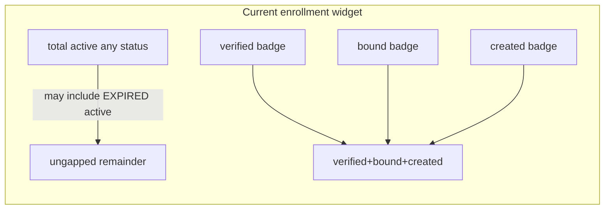

# Dashboard enrollment widget: integrity and operator story

## Problem diagnosis

Today [`DashboardService.buildEnrollmentStats`](ezkey-admin-api/src/main/java/org/ezkey/admin/service/DashboardService.java) computes:

- **`total`**: `enrollmentService.findByFilters(null, …, active=true, …)` — all **active** enrollments, **any** [`EnrollmentStatus`](ezkey-core/src/main/java/org/ezkey/enrollment/domain/EnrollmentStatus.java).
- **Badges**: three separate count queries for **CREATED**, **BOUND**, and **VERIFIED** only.

The domain defines six lifecycle statuses (`CREATED`, `BOUND`, `VERIFIED`, `INVALID`, `REVOKED`, `EXPIRED`). For **`active=true`**, the important gap is usually **`EXPIRED`**: the expired-cleanup path sets status to `EXPIRED` but does **not** clear `active` (see [`EnrollmentExpiredCleanupScheduler`](ezkey-core/src/main/java/org/ezkey/enrollment/service/EnrollmentExpiredCleanupScheduler.java)), so those rows still match the `total` query but **do not** appear in verified/bound/created. **`INVALID`** / **`REVOKED`** are typically paired with `active=false` in revocation/invalidation flows, so they often do not contribute to `active=true` totals — which can make the mismatch **intermittent** (e.g. zero expired vs. after cleanup).

This is the same class of bug that was fixed for auth attempts: **the headline `total` must be derivable as the sum of the visible buckets** (see [`AuthAttemptDashboard24hStats.fromStatusCounts`](ezkey-core/src/main/java/org/ezkey/authattempt/domain/AuthAttemptDashboard24hStats.java), where `total` is explicitly the sum of all status counts).

## Target behavior (product + UX)

**Integrity rule:** The large number at the top of the enrollments stat card must equal the **sum of the badge values shown** (same rule as auth attempts / auth health).

**Operator story (parallel to auth attempts):** Avoid one badge per raw enum value. Prefer a **small set of grouped buckets** that answer Monday-morning questions:

- **Ready for use:** enrollments that can authenticate (aligned with **`VERIFIED`** in the `active=true` scope).
- **In flight:** enrollment work not finished (**`CREATED` + `BOUND`**), i.e. onboarding pipeline.
- **Stale / unusable (time-expired):** **`EXPIRED`** rows that are still counted in the dashboard scope — this is the usual missing piece today.

**Optional fourth bucket (only if you want finer ops signal without enum sprawl):** a single **“Blocked / failed”** bucket for **`INVALID`** *if* it can appear in the same dashboard scope you choose. Today, `INVALID` is usually `active=false`, so it may be **zero** in an `active=true`-only dashboard — the design should still **partition** the chosen universe so the sum never silently drifts.

**Recommended default for the headline “total”:** keep **“active enrollments”** as the universe (current intuition), and make badges a **complete partition of `active=true` enrollments by status grouping** so the math is always true.

## Backend design

1. **Add a dedicated aggregation API** (mirror auth attempts):

   - Implement something like `EnrollmentService.aggregateDashboardEnrollmentStats(Integer tenantId)` in [`ezkey-core`](ezkey-core/src/main/java/org/ezkey/enrollment/service/EnrollmentService.java) using **one** JPA Criteria `GROUP BY status` query with the **same tenant scoping** as `findByFilters` (subquery on `Integration.tenant` — reuse the same predicate construction pattern as [`AuthAttemptService.aggregateDashboard24h`](ezkey-core/src/main/java/org/ezkey/authattempt/service/AuthAttemptService.java)).
   - Filter: **`active = true`** (unless product explicitly changes the headline definition).
   - Build counts into a small immutable record (e.g. `EnrollmentDashboardStats` in `ezkey-core`, analogous to `AuthAttemptDashboard24hStats`) that computes:
     - Per-status counts (internal).
     - **Grouped buckets** for the dashboard: `verified`, `inProgress` (= created + bound), `expired` (and optionally `invalid` if in scope).
     - **`total`** = sum of **all** statuses included in the headline universe (must equal sum of displayed buckets).

2. **Revise [`DashboardEnrollmentStatsDto`](ezkey-admin-api/src/main/java/org/ezkey/admin/dto/response/DashboardEnrollmentStatsDto.java)** to match the new contract:

   - Replace the old `verified/bound/created` triplet with **bucket fields** that the UI will render (names should be operator-oriented, not protocol dump).
   - Keep OpenAPI annotations in sync; **do not** hand-edit [`specs/`](specs/) — maintainer runs `scripts/update-specs.*` after a clean start per repo rules.

3. **Optional domain hardening (separate, but related):** consider setting **`active=false`** when marking `EXPIRED` in [`EnrollmentExpiredCleanupScheduler`](ezkey-core/src/main/java/org/ezkey/enrollment/service/EnrollmentExpiredCleanupScheduler.java) (and any other `EXPIRED` transitions) so “active” aligns with “can participate in MFA”. This changes list/filter semantics — only do it if product agrees; the dashboard partition fix should **not** depend on this.

## Admin UI

- Update [`ezkey-admin-ui/src/pages/dashboard.tsx`](ezkey-admin-ui/src/pages/dashboard.tsx) enrollments `StatCard`: render the new badges (likely **Verified**, **In progress**, **Expired**; adjust labels to match i18n).
- Update [`ezkey-admin-ui/src/types/models.ts`](ezkey-admin-ui/src/types/models.ts) `DashboardEnrollmentStats` to mirror the DTO.
- Add/adjust strings in [`ezkey-admin-ui/src/locales/en/dashboard.json`](ezkey-admin-ui/src/locales/en/dashboard.json) and [`ezkey-admin-ui/src/locales/fr/dashboard.json`](ezkey-admin-ui/src/locales/fr/dashboard.json) (strict EN/FR parity).

## Validation

- **Unit tests** in `ezkey-core` for the new aggregation + bucketing record (similar to [`AuthAttemptDashboard24hStatsTest`](ezkey-core/src/test/java/org/ezkey/authattempt/domain/AuthAttemptDashboard24hStatsTest.java)).
- **Admin API tests** if you add/change controller contract coverage for dashboard overview (today there is no `DashboardService` test grep hit — add at least one focused test if feasible).
- **Build:** follow repo baseline (`scripts/build-local.cmd` on Windows) after Java changes.
- **Browser tests:** treat as **judgment call** — this changes dashboard numbers/labels; existing Playwright smoke may suffice unless you rely on a specific dashboard assertion (per [`ezkey-admin-ui/AGENTS.md`](ezkey-admin-ui/AGENTS.md)).

## Deliverable summary

| Layer | Outcome |
|-------|--------|
| Domain | Single grouped count query; `total` equals sum of dashboard buckets for the chosen scope |
| DTO | Bucket-oriented fields; English OpenAPI descriptions |
| UI | 3–4 badges telling the enrollment health story; sum matches headline |
| Docs | Update [`docs/ENDPOINT.md`](docs/ENDPOINT.md) only if the REST field names/shape change in a user-visible way |

## Completion record

**Status:** Completed (implemented).  
**Archived in repo:** `.cursor/plans/archived/2026-04/dashboard_enrollment_widget_1aaa3560.plan.md`  
**Completion date:** 2026-04-14.

**Delivered (summary):**

- `ezkey-core`: `EnrollmentDashboardStats`, `EnrollmentService.aggregateDashboardEnrollmentStats`, unit test `EnrollmentDashboardStatsTest`.
- `ezkey-admin-api`: `DashboardEnrollmentStatsDto` bucket fields; `DashboardService` uses aggregation.
- `ezkey-admin-ui`: dashboard enrollments stat card, i18n EN/FR; generated model type updated for Orval alignment until spec regen.

## Drilldown coherence analysis (2026-04-25)

Functional test (clean-start, one CREATED enrollment not completed) revealed that clicking the "in progress" badge did show the correct enrollment, but exposed two alignment issues between dashboard aggregation and list queries. Full circuit analysis per badge:

| Badge | URL generated | List mode | Dashboard count (backend) | List query (actual) | List query (correct) | Consistent? |
|---|---|---|---|---|---|---|
| **in progress** | `?active=true&bucket=inProgress` | bucket | CREATED(any active) + BOUND(any active) | CREATED+active=true, BOUND+active=true | CREATED(any), BOUND(any) | ❌ see fixes below |
| **suspended** | `?status=VERIFIED&active=false` | normal | VERIFIED + active=false | VERIFIED + active=false | same | ✅ |
| **expired** | `?status=EXPIRED` | normal | EXPIRED (any active) | EXPIRED, no active filter | same | ✅ |
| **incidents** | `?bucket=incidents` | bucket | INVALID(any) + REVOKED(any) | INVALID(no active), REVOKED(no active) | same | ✅ |

**Corrections applied (frontend only — no backend gap):**

1. `enrollments.tsx` — removed `active: true` from CREATED and BOUND bucket queries. Dashboard aggregation uses `getAll()` (any active state); queries now match.
2. `enrollments.tsx` — `activeFilter` initialization changed from `enrollmentBucket ? 'true' : searchParams.get('active') ?? ''` to always reading from the URL. The dropdown now reflects the actual filter: "Any" for inProgress/incidents (no active param in URL), "Inactive" for suspended (`active=false` in URL).
3. `dashboard-drilldown-links.ts` — removed the `else if (options.bucket && options.bucket !== 'incidents')` branch that added `active=true` to the inProgress URL. No longer needed and was the source of the misleading filter state.

## Post-delivery correction (2026-04-25)

**Observation (functional test after clean-start):** after the session relaunch, the headline number showed a dash (—) or the incidents badge was non-zero, and the i18n hint still evoked "badges totalling this figure". Separately, the widget showed the `verified` count **twice**: once as the large headline (`<StatNum value={enrVerified}>`), and once as the first badge (variant `success`, same value). The second occurrence is entirely redundant — clicking it navigates to the same filtered list as the headline's implied scope.

**Root cause:** the `sum=total` constraint was correctly eliminated, but the design did not decide what role the headline vs. the badges would each play. The headline was repurposed as `verified` (active devices ready for MFA), which is the right KPI number. The first badge then duplicated that number with a `success` variant, adding visual clutter and no new information.

**Decision / fix:** remove the `verified` badge. The widget now has:
- **Headline (large):** VERIFIED + active=true — the single most important KPI.
- **4 operational badges (deviation from ideal):** in progress, suspended, expired, incidents.

This follows the same pattern as the integrations widget (headline = total; badges = active + inactive as deviation details). The `drilldown.enrollmentsVerified` i18n key was also removed (EN + FR) as it was only referenced by the deleted badge's `ariaLabel`.
