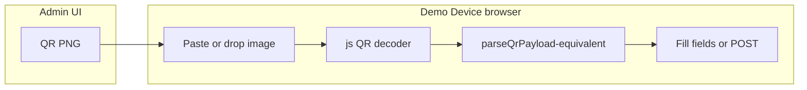

# Demo Device: QR image paste/drop for enrollment

## Implementation status (closed)

This plan is **implemented**, **validated by automated build checks**, and **complete**. Manual exploratory validation (clean-start stack, Admin UI QR screenshot → paste/drop on demo device → bind) follows the steps in **Testing and validation** below.

## Context (current state)

- **Admin QR payload** is a JSON string (PNG QR is just the visual encoding of that string), composed by `[QrCodePayloadService](ezkey-admin-api/src/main/java/org/ezkey/admin/service/QrCodePayloadService.java)`: `enrollmentId`, `enrollmentProofToken`, optional `authUrl` when `ezkey.qr.auth-base-url` is set.
- **Mobile parity** already documents the same rules in `[ezkey_mobile/.../EnrollmentWizardScreen.tsx](ezkey_mobile/app/screens/EnrollmentWizard/EnrollmentWizardScreen.tsx)` (`parseQrPayload`: JSON primary, pipe-delimited `id|token` fallback).
- **Demo device today** collects `enrollmentId` + `enrollmentProofToken` manually on `[new_enrollment.html](ezkey-demo-device/src/main/resources/templates/phone/ezkey/new_enrollment.html)` and posts to `[EzkeyAppController](ezkey-demo-device/src/main/java/org/ezkey/demo/device/controller/EzkeyAppController.java)` `/enrollment/bind` — no API change is strictly required if the UI decodes the QR **string** and fills the same form (or submits the same POST).

## Options analysis (your open questions)

| Approach                                   | Fit              | Notes                                                                                                                                                                                                 |
| ------------------------------------------ | ---------------- | ----------------------------------------------------------------------------------------------------------------------------------------------------------------------------------------------------- |
| **JavaScript in the browser + QR library** | **Best default** | QR decoding from `ImageData` is a solved problem (e.g. **jsQR**, **@zxing/browser**). No enrollment secrets leave the machine; works offline; aligns with “device decodes QR locally” like the phone. |
| **Upload to Spring Boot + ZXing (Java)**   | Possible         | Adds multipart endpoint, temp image handling, and sends credentials to the demo-device process. Useful only if you must support **very old** browsers without canvas — unlikely for a demo tool.      |
| **Online QR API / cloud vision**           | **Avoid**        | Would exfiltrate `enrollmentProofToken` to a third party — unacceptable for this flow.                                                                                                                |
| **AI / specialized vision models**         | **Unnecessary**  | QR is structured; decoders are deterministic, fast, and tiny compared to ML.                                                                                                                          |

**Difficulty (engineering, not research):** **low–medium** — mostly UI wiring (paste, drag-drop, canvas), choosing a decoder, and reusing the **same parsing rules** as mobile. The hard part is **robustness** (blurry crops, partial QR), not feasibility.

## Recommended design

1. **Keep manual entry** as today; add a second path: “Import from QR image” (drop zone + paste-from-clipboard).
2. **Decode in the browser**: draw image to canvas → `getImageData` → QR library → UTF-8 string.
3. **Parse the string** with logic equivalent to mobile:
  - Try `JSON.parse` and require `enrollmentId` + `enrollmentProofToken`.
  - Else try pipe format `enrollmentId|enrollmentProofToken` (same as mobile).
  - Optionally read `authUrl` for **display/warning only** in v1 (see below).
4. **On success**: populate `#enrollmentId` and `#enrollmentProofToken` and optionally focus “Start Enrollment” or auto-submit (prefer explicit submit to avoid surprise binds).
5. **On failure**: show a short, actionable error (“Could not read QR; try manual entry or a sharper screenshot”).

### `authUrl` and demo-device

- The real app can switch Auth API base URL using QR’s `authUrl`. The demo device uses a **fixed** `[WebClient](ezkey-demo-device/src/main/java/org/ezkey/demo/device/service/AuthApiService.java)` from `EZKEY_AUTH_API_URL` (Docker).
- **MVP**: decode `authUrl` but **do not** change the server-side client; if present and **different** from the configured base (compare normalized origin), show a non-blocking notice that the image targets another host — typical clean-start demos won’t hit this.
- **Future** (only if needed): session-scoped override of Auth API base — higher complexity; not required to unlock “paste QR screenshot” for local Docker demos.

## Implementation touchpoints

- **Primary file**: `[ezkey-demo-device/src/main/resources/templates/phone/ezkey/new_enrollment.html](ezkey-demo-device/src/main/resources/templates/phone/ezkey/new_enrollment.html)` — add drop zone, hidden file input, `paste` handler on `window` or the shell, small inline script module or separate static JS under `src/main/resources/static/` if you prefer cleanliness.
- **Dependency**: add a **WebJar** or **vendored minified** build of one QR library (team preference: WebJar for reproducible builds). Example candidates: `jsQR` (small, common) or ZXing JS (broader symbology; heavier).
- **No OpenAPI / Admin API changes** for this feature.
- **Documentation**: one short paragraph in `[ezkey-demo-device/plan_demo_device.md](ezkey-demo-device/plan_demo_device.md)` or README section describing “QR image import” and clipboard support caveats (browser permissions for `navigator.clipboard.read()` where applicable).

## Testing and validation

- **Manual** (high value for demos): clean-start → create enrollment in Admin UI → screenshot/snipping tool → paste/drop on demo device → bind succeeds.
- **Automated**: optional focused test — if the repo already runs browser tests against `http://localhost:8083`, a small scenario could paste a known QR image fixture; otherwise a **unit-level** test of the **parse** function in JS (if extracted) is enough. Per project norms, extend Playwright only if this workflow is deemed security- or regression-critical; otherwise manual exploratory summary is proportionate.

## Risks / edge cases

- **Unreadable crops**: user falls back to manual token (explicitly documented).
- **Clipboard image paste**: behavior varies by OS/browser; drag-drop file is the most reliable secondary path.
- **Large JSON in QR**: Admin already logs length warnings; extremely long tokens may need a denser QR — same constraints as mobile.

