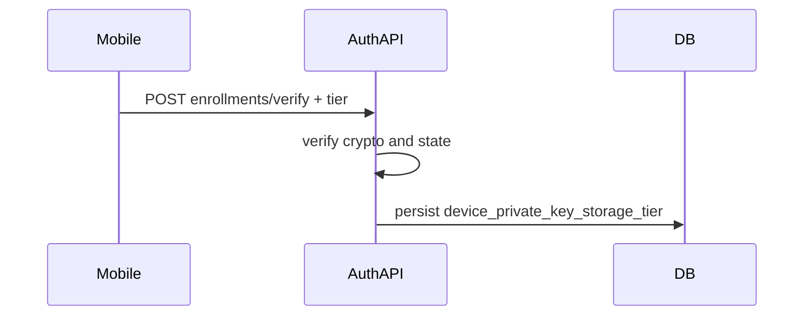

# Device private key storage security tier (Android-first)

**Archived 2026-04 — Plan completed.** Follow-up documentation on trust boundaries (client-asserted tier, signature scope vs `devicePrivateKeyStorageTier`) lives in `docs/MOBILE_DEVELOPER_GUIDE.md` and related docs.

## Overview

Introduce a three-level, per-enrollment **device private key storage tier** announced at Auth API `POST /api/v1/enrollments/verify`, persisted on `ezkey_enrollment`, exposed in Admin API/UI, Demo Device, and the mobile app—Android-first, with naming that can later map to iOS (Secure Enclave).

## Product and terminology (recommended)

Use a single enum with **stable API values** and human labels in UI/docs:

| API value | Meaning (Android) | Typical UI label |
|-----------|-------------------|------------------|
| `NONE` | Demo Device, simulators, or any client that stores the device private key **outside** hardware-backed keystore (explicit non-production posture) | e.g. “Not hardware-protected” |
| `STANDARD` | Private key in **Android Keystore** without StrongBox (TEE/software-backed as offered by the device) | e.g. “Hardware-backed” |
| `STRONG` | Private key in **StrongBox**-backed keystore (when `setIsStrongBoxBacked(true)` succeeds for that key) | e.g. “Isolated hardware (StrongBox)” |

**Why these names:** short, enum-friendly, and **platform-agnostic**—later iOS can map Secure Enclave to `STRONG` and Keychain to `STANDARD` without renaming the protocol.

**Per enrollment:** StrongBox availability is mostly stable per device, but tier can differ across enrollments (OS update, OEM edge cases). Each enrollment uses its own key generation in [`EzkeyCryptoModule.kt`](ezkey_mobile_app/android/app/src/main/java/com/ezkeymobileapp/crypto/EzkeyCryptoModule.kt); StrongBox is chosen **at key creation time**. The tier is **intrinsic to that enrollment’s key material**. Demo Device always sends `NONE` for every saved enrollment.

## Phase 1 — Backend representation

- Add a nullable column on `ezkey_enrollment` in an **existing** migration (e.g. [`ezkey-core/src/main/resources/db/migration/V7__enrollment_auth_lifecycle_admin_tokens_and_demo.sql`](ezkey-core/src/main/resources/db/migration/V7__enrollment_auth_lifecycle_admin_tokens_and_demo.sql)): `device_private_key_storage_tier` with CHECK / COMMENT as needed.
- Extend [`Enrollment.java`](ezkey-core/src/main/java/org/ezkey/enrollment/domain/entity/Enrollment.java) with a Java enum in `ezkey-core`.
- Extend [`EnrollmentVerifyRequest`](ezkey-core/src/main/java/org/ezkey/enrollment/domain/EnrollmentVerifyRequest.java); persist in [`EnrollmentVerifyService`](ezkey-core/src/main/java/org/ezkey/enrollment/service/EnrollmentVerifyService.java) after crypto checks (validate invalid enum → 400; nullable vs required policy as decided).
- Update mappers (Auth, Core, Admin).

### Testing — Phase 1 (where it fits)

- **Unit tests (appropriate):** `EnrollmentVerifyService` — successful verify persists the requested tier; invalid/unknown tier rejected if validation is implemented; mapper tests (`EnrollmentAuthMapper`, `EnrollmentAdminMapper`, `EnrollmentCoreMapper`) for the new field. Auth API `EnrollmentController` tests (MockMvc) for verify request deserialization and response when the tier is present.
- **Functional / integration tests (appropriate):** `ezkey-tests` — extend existing enrollment security or flow tests (e.g. [`EnrollmentFlowSecurityTest`](ezkey-tests/src/test/java/org/ezkey/tests/security/enrollment/EnrollmentFlowSecurityTest.java) or adjacent) so a full **bind → verify** path asserts the tier is stored on `ezkey_enrollment` (opportunistic DB check via `DatabaseHelper` per [`ezkey-core/AGENTS.md`](ezkey-core/AGENTS.md) guidance). Prefer a small number of focused scenarios.

## Phase 2 — API impact (Auth API + Admin API)

- Extend [`EnrollmentVerifyRequestDto`](ezkey-auth-api/src/main/java/org/ezkey/enrollment/dto/EnrollmentVerifyRequestDto.java) and Admin enrollment DTOs; Springdoc annotations only—**do not** hand-edit [`specs/`](specs/).
- Update [`docs/ENDPOINT.md`](docs/ENDPOINT.md) and optionally [`docs/MOBILE_DEVELOPER_GUIDE.md`](docs/MOBILE_DEVELOPER_GUIDE.md).
- **Postman:** Update collections under [`postman/collections/v2.1/`](postman/collections/v2.1/):
  - **[`EZ Key Enrollments auth.postman_collection.json`](postman/collections/v2.1/EZ Key Enrollments auth.postman_collection.json)** — verify request body includes `devicePrivateKeyStorageTier` (or final JSON field name).
  - **[`EZ Key Enrollments admin.postman_collection.json`](postman/collections/v2.1/EZ Key Enrollments admin.postman_collection.json)** — enrollment GET/list examples if responses expose the field.
- Optional: audit `event_details` on verify for SOC2-style traceability if it fits existing audit patterns.

### Testing — Phase 2

- **Unit tests:** Admin API controller or service tests if enrollment list/detail DTOs gain fields — assert JSON includes the tier when the entity is populated.
- **Functional:** If Admin API integration tests exist for enrollment CRUD/list, extend one request to assert the new field; otherwise rely on Phase 1 `ezkey-tests` plus Postman.

## Phase 3 — Demo Device and mobile (after backend stable)

- Demo Device: extend [`EnrollmentStoreService.Record`](ezkey-demo-device/src/main/java/org/ezkey/demo/device/service/EnrollmentStoreService.java), always `NONE`; enrollment info UI with explanatory copy (teaching surface for tiers).
- Mobile (Android): after `generateEnrollmentKeyPair`, derive tier (e.g. native `getEnrollmentKeyStorageTier` or boolean from generation); send on **verify**; store locally per enrollment.
- Admin UI: [`enrollments.tsx`](ezkey-admin-ui/src/pages/enrollments.tsx), [`enrollment-detail.tsx`](ezkey-admin-ui/src/pages/enrollment-detail.tsx); patterns from [`enrollment-status-badge.tsx`](ezkey-admin-ui/src/components/feature/enrollment-status-badge.tsx); tooltips; regenerate OpenAPI client after spec refresh.
- Browser tests: pragmatic judgment (workspace UI test autonomy rules).

### Testing — Phase 3

- **Unit tests:** Mobile — tier derivation isolated in a small module → unit-test mapping; else manual device/emulator.
- **Functional:** Optional Playwright for enrollment list/detail if critical-path; not mandatory for presentation-only tweaks.

## Other design considerations

- Tier is **client-asserted** unless attestation is added later—document honestly for operators.
- Bootstrap / Admin MFA flows: set tier explicitly where verify runs without production mobile ([`AdminBootstrapService`](ezkey-admin-api/src/main/java/org/ezkey/admin/service/AdminBootstrapService.java) if applicable).
- iOS later: same enum; map Keychain vs Secure Enclave into `STANDARD` / `STRONG`.

## Todos (markdown checklist)

- [x] Phase 1: DB + entity + verify persistence + mappers + **unit tests** + **`ezkey-tests` functional coverage** where appropriate
- [x] Phase 2: Auth/Admin DTOs + docs + **Postman collections** + Springdoc (no manual OpenAPI files) + **tests** (Admin/unit as appropriate)
- [x] Phase 3: Demo Device + mobile + Admin UI + **optional Playwright** if justified
