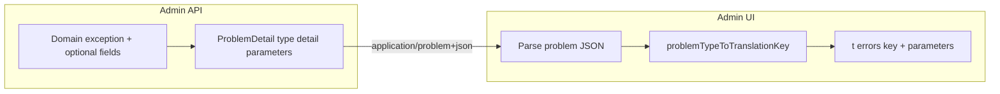

# Dynamic API error messages (FR/EN) — backend strategy and pilot scope

**Implementation status:** **Implemented** (see [Closing note — what shipped](#closing-note--what-shipped)). This file is the archived copy under `.cursor/plans/archived/2026-04/`.

## Context aligned with the codebase

- **RFC 9457** is already the single error shape; `type` is the stable machine identifier. The Admin UI derives i18n keys from `type` with **Option B** (path under `https://ezkey.io/problems/` → `errors.*` dotted keys) — see [backend_error_i18n_strategy_cf455bd9.plan.md](backend_error_i18n_strategy_cf455bd9.plan.md) and [ezkey-admin-ui/src/lib/api-error-i18n.ts](../../../ezkey-admin-ui/src/lib/api-error-i18n.ts).
- **Quick wins** (static copy only) are documented in [docs/admin-ui-admin-api-error-inventory.md](../../../docs/admin-ui-admin-api-error-inventory.md).
- **Gap:** When `detail` embeds numbers, names, or IDs, curated FR/EN needs **structured parameters** the client interpolates, or **server-localized** `detail`.

---

## Exception design: extending JDK types (`IllegalArgumentException`, `RuntimeException`, …) — viability and plan position

### What the codebase does today (compromise)

Ezkey evolved from **generic** JDK exceptions toward **named domain exceptions**, often by **subclassing** the original JDK type so that:

- Existing **HTTP semantics** stay aligned (e.g. `IllegalArgumentException` → 400 via [ValidationExceptionHandler](../../../ezkey-admin-api/src/main/java/org/ezkey/exception/ValidationExceptionHandler.java); `IllegalStateException` → 409 where mapped).
- Call sites and handlers can move to **`@ExceptionHandler(FooException.class)`** with a **specific** RFC 9457 `type` when the exception is domain-specific.

Examples: validation-style types in `ezkey-core` extend `IllegalArgumentException` (e.g. `IntegrationCreateValidationException`, `ApiKeyCreateValidationException`); many domain types extend `RuntimeException` (e.g. `AdminLimitException`, `IntegrationHasEnrollmentsException`).

### Is this viable long term?

**Yes — with discipline.** Subclassing JDK exceptions is a **standard Spring/Java pattern** and is **not** inherently bad design. It becomes a problem only when:

1. **Business rules** are still thrown as **raw** `IllegalArgumentException` / `IllegalStateException` **without** a domain subclass — then every such throw shares one generic `type` (e.g. `admin/invalid-argument`) and **hurts** stable i18n and API contracts.
2. **Handlers** key only on the superclass, so **all** IAE responses look the same to clients.

So the compromise **remains valid** if **new** work prefers **named domain exceptions** + **explicit problem `type`** (+ optional `parameters`), and raw JDK throws are reserved for **truly generic** client mistakes or internal preconditions.

### Does replacing `extends IllegalArgumentException` with a custom “Ezkey base” improve things?

A **thin** Ezkey base (e.g. `EzkeyClientException` extends `RuntimeException` with optional `problemTypeUri` + `parameters`) can **reduce duplication** in handlers **if** many exceptions share the same ProblemDetail-building logic. It does **not** by itself fix i18n: **stable `type` + `parameters` + UI keys** do.

**Verdict — balance (pragmatic, not over-engineered):**

| Approach                                                                                                        | When it helps                                                                | Risk                                                              |
| --------------------------------------------------------------------------------------------------------------- | ---------------------------------------------------------------------------- | ----------------------------------------------------------------- |
| **Keep** `extends IllegalArgumentException` / `IllegalStateException` / `RuntimeException` for domain types     | Semantics match HTTP mapping; team already reads this pattern; minimal churn | None if subclasses get **dedicated** handlers or distinct mapping |
| **Avoid** raw `throw new IllegalArgumentException("...")` for **business** errors that need a **stable** `type` | Directly supports i18n + RFC 9457 clarity                                    | —                                                                 |
| **Introduce** one **optional** thin base (e.g. `EzkeyProblemException`) carrying metadata                       | Pilot shows **repeated** `setProperty("parameters", …)` boilerplate          | **YAGNI** until 2–3 call sites repeat the same pattern            |

**Plan position:** **Do not** mandate a large exception taxonomy refactor in the same effort as dynamic i18n. **Do** use the pilot to **(1)** replace the **raw IAE** global-admin limit with a **domain exception** + **dedicated `type`** + **`parameters`**, and **(2)** document the rule: *business errors with operator-facing copy use domain types + stable `type`; raw IAE is for generic validation only.*

If, after the pilot, handler code repeats the same ProblemDetail construction, add a **single** small helper or base class — **targeted**, not a framework.

### Decision point: `EzkeyProblemException` (or similar thin base) — open options

**What it would be:** A small `RuntimeException` subclass (name illustrative) carrying optional **metadata** used when building RFC 9457: e.g. `problemTypeUri`, `httpStatus`, `parameters` map, maybe `title`. Handlers call one shared `toProblemDetail(ex, request)` or each handler reads getters instead of stringly-typed `ex.getMessage()` only.

**Why it is *not* required for the dynamic-i18n design:** The contract that matters for FR/EN is **`type` + `parameters` on the wire**. You can attach those by **(a)** dedicated `@ExceptionHandler` per exception class, **(b)** a **static helper** `ProblemDetails.withParameters(type, status, detail, params)`, or **(c)** a base exception carrying the same fields. Approaches (a)+(b) are what many Spring codebases use first; (c) is an **optional consolidation**.

| Approach                                                                                                 | Advantages                                                                                                                                                                                                                            | Disadvantages                                                                                                                                                                                                                                                         |
| -------------------------------------------------------------------------------------------------------- | ------------------------------------------------------------------------------------------------------------------------------------------------------------------------------------------------------------------------------------- | --------------------------------------------------------------------------------------------------------------------------------------------------------------------------------------------------------------------------------------------------------------------- |
| **A — No base class; domain exceptions + explicit handlers** (status quo + discipline)                   | Matches common Spring practice; each exception stays a **named type**; handler is obvious in `@RestControllerAdvice`; **no new abstraction** to learn; **no risk** of a “god” base growing many optional fields.                      | If many handlers repeat the same 5 lines (`ProblemDetail`, `setType`, `setProperty("parameters", …)`), **duplication** until you extract a helper.                                                                                                                    |
| **B — Static helper / small factory** (e.g. `AdminApiProblemDetails.limitReached(type, detail, params)`) | **DRY** without inheritance; keeps domain exceptions extending whatever fits (`RuntimeException`, `IAE`); **easy to test**; **low coupling** — exceptions stay dumb throwables.                                                       | Developers must remember to call the helper in each handler; **no compile-time** enforcement that every “problem-shaped” exception uses it.                                                                                                                           |
| **C — Thin `EzkeyProblemException` (or module-local `AdminApiProblemException`)**                        | **Single place** for `type` + `parameters` + status; handlers can **delegate** to one method; **discoverability** — “if it implements this, ProblemDetail is uniform”; can reduce copy-paste **if** many errors share the same shape. | **Extra type** in the hierarchy; risk of **feature creep** (more fields, inheritance trees); **wrong layer** if put in `ezkey-core` and used for unrelated APIs — better **per-module** if introduced at all; **not a substitute** for good `type` URIs and API docs. |

**Common industry pattern:** Start with **A + B** (explicit exceptions + shared builder for `ProblemDetail`). Introduce **C** only when duplication is **measurable** (several handlers with identical structure) or when you want **one** catch-all mapper for a family of errors — and keep the base **minimal** (few fields, one module).

**Recommended equilibrium for Ezkey (finalize plan):** **Pilot without `EzkeyProblemException`.** Implement the global-admin limit with a **named exception** + **one handler** (or existing handler branch) that sets `type`, `detail`, `parameters`. If copy-paste appears, extract **`ProblemDetail` factory methods** in the same module (`ezkey-admin-api`) first. **Revisit** a thin base class only after **2–3** similar parameterized errors exist — avoids painting the project into a framework and stays **evolutive**.

### Link to translation goals

- **Primary lever for FR/EN:** RFC 9457 **`type`** + **`parameters`** + UI `t(key, params)` — not the **parent class** of the exception.
- **Secondary lever:** Domain exception **class** gives **type-safe** handling and **one** place to attach `parameters` before mapping to ProblemDetail.

---

## Recommended API strategy (default for Ezkey Admin UI)

### Client-side templating + RFC 9457 extension properties

- **Backend:** `ProblemDetail` + `setProperty("parameters", Map)` — scalars only (string/number/boolean); **camelCase** keys aligned with DTOs.
- **Admin UI:** i18next interpolation in `errors` namespace; extend [getTranslatedApiError](../../../ezkey-admin-ui/src/lib/api-error-i18n.ts) to pass `parameters` into `t()` when present and key exists.
- **`detail`:** Keep English as **fallback** for logs and clients that ignore extensions. When a translation key exists **and** non-empty `parameters` are present, the Admin UI **prefers** localized interpolation over raw English `detail` for that response.

### Alternative (optional later)

Spring **`MessageSource`** + **`Accept-Language`** for **server-rendered** `detail` — consider only if non-SPA clients need localized bodies without sharing i18n bundles.

---

## Pilot: global admin maximum (concrete)

**Previous state (pre-implementation):** [AdminProvisioningService.createGlobalAdmin](../../../ezkey-admin-api/src/main/java/org/ezkey/admin/service/AdminProvisioningService.java) threw `IllegalArgumentException` → generic `admin/invalid-argument`.

**Delivered direction:**

1. **Domain exception:** [GlobalAdminLimitException](../../../ezkey-admin-api/src/main/java/org/ezkey/admin/exception/GlobalAdminLimitException.java).
2. **Dedicated `type` URI:** `https://ezkey.io/problems/admin-provisioning/global-admin-limit-reached`.
3. **`parameters`:** `{ "maxGlobalAdmins": <int> }`.
4. **Handler:** [AdminProvisioningExceptionHandler](../../../ezkey-admin-api/src/main/java/org/ezkey/exception/AdminProvisioningExceptionHandler.java) (`@Order(32)`).
5. **UI:** `errors.admin-provisioning.global-admin-limit-reached` in **en**/**fr**; [parseProblemParameters](../../../ezkey-admin-ui/src/lib/api-error-i18n.ts), tests.

### Initial scope: one example vs a small batch

**Recommendation for this work package:** **One vertical slice is enough** — the global-admin maximum case (dedicated `type`, `parameters`, handler, UI interpolation, en/fr, tests). That fully validates **design, contract, and integration** without scope creep.

**When to add more examples in the same PR / same plan:**

- **Not required** to prove the mechanism: a second similar error (e.g. tenant-admin per-tenant limit) is **mostly duplicate** proof — same pattern, different URI and keys.
- **Optional +1** only if the team wants extra confidence on **variation** (different parameter shapes or handler modules).

**Defer:** Broader migration of every `admin/invalid-argument` or `domain/*` dynamic `detail` — that belongs to a **later** inventory phase, not this mechanism-validation scope.

**Plan position:** Default deliverable = **single example** (global admin cap). Treat **additional** parameterized errors as **follow-up** unless a concrete second case is needed to de-risk a specific variation (string params or cross-handler).

---

## Out of scope (unchanged)

- Exhaustive migration of every dynamic `detail`.
- Global mega-enum of all problem types in `ezkey-core`.
- Manual edits to generated `specs/**` (regenerate via maintainer workflow).

---

## Architecture snapshot

---

## Closing note — what shipped

- **Backend:** `GlobalAdminLimitException`; `AdminProvisioningExceptionHandler` returns RFC 9457 with `type` `…/admin-provisioning/global-admin-limit-reached`, English `detail`, and `parameters.maxGlobalAdmins`. [AdminProvisioningService](../../../ezkey-admin-api/src/main/java/org/ezkey/admin/service/AdminProvisioningService.java) throws the dedicated exception at the cap; [AdminProvisioningController](../../../ezkey-admin-api/src/main/java/org/ezkey/admin/controller/AdminProvisioningController.java) catches it for audit failure logging; Springdoc documents the 400 shape.
- **Tests:** [AdminProvisioningExceptionHandlerTest](../../../ezkey-admin-api/src/test/java/org/ezkey/exception/AdminProvisioningExceptionHandlerTest.java).
- **Admin UI:** [ProblemDetail.parameters](../../../ezkey-admin-ui/src/lib/api-client.ts); [parseProblemParameters](../../../ezkey-admin-ui/src/lib/api-error-i18n.ts) + precedence in [getTranslatedApiError](../../../ezkey-admin-ui/src/lib/api-error-i18n.ts); locale keys under `admin-provisioning.global-admin-limit-reached`; [api-error-i18n.test.ts](../../../ezkey-admin-ui/src/lib/api-error-i18n.test.ts).
- **Docs:** [admin-ui-admin-api-error-inventory.md](../../../docs/admin-ui-admin-api-error-inventory.md) (parameterized table + convention); [ENDPOINT.md](../../../docs/ENDPOINT.md) (Admin API `parameters`); [AGENTS.md](../../../ezkey-admin-ui/AGENTS.md) (short UI note).
- **OpenAPI:** Maintainer runs [scripts/update-specs.sh](../../../scripts/update-specs.sh) / `update-specs.bat` after clean start — **do not** hand-edit `specs/**`.

---

## What this plan deliberately does **not** do

- Exhaustive migration of every dynamic `detail` across the API.
- A **single global** problem-type enum in `ezkey-core` (still discouraged; see archived plan).
- Manual edits to generated `specs/**/*.json` (regenerate via maintainer workflow after Java/Springdoc updates).
