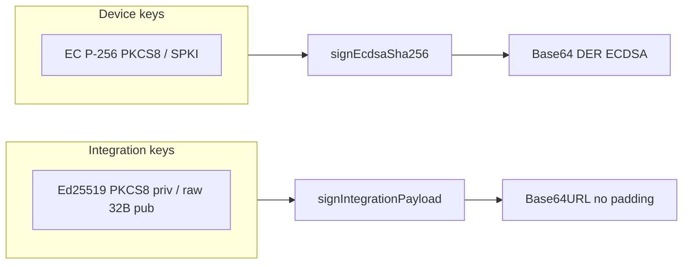

**Plan status:** Implemented (2026-04-08). Documentation and annotations were updated in the codebase; regenerating Auth API OpenAPI (`scripts/update-specs`) after a clean start remains an optional maintainer follow-up so generated `specs/` match the new `@Schema` text.

# Documentary alignment: integration Respond signature (Ed25519 / Base64URL)

## Confirmed behavior (source of truth)

Implementation is already consistent:

- `[ezkey-core/.../SignatureService.java](ezkey-core/src/main/java/org/ezkey/signature/SignatureService.java)`: `signIntegrationPayload` uses JCA `Signature.getInstance("Ed25519")` and returns **Base64URL without padding** over the **raw 64-byte** signature (see class Javadoc lines 33–36 and method lines 77–92).
- `[ezkey-core/.../AuthAttemptRespondService.java](ezkey-core/src/main/java/org/ezkey/authattempt/service/AuthAttemptRespondService.java)`: `attachRespondResultSignature` builds the canonical string via `AuthAttemptSignaturePayload.buildRespondResultPayload` and calls `signIntegrationPayload` — no documentation bug here.

The divergence is **descriptive only**: some comments still say “ECDSA” and “Base64 (padded)”, which matches **device** signing (`signEcdsaSha256` / EC P-256) but not **integration** signing.

## Scope (per your intent)

- **In scope:** Comments and annotations in code paths that describe `authAttemptProofTokenResultSignedByIntegration` (and closely related mobile typings/tests that duplicate the mistake).
- **Out of scope:** The integration guide you are writing separately; no broad doc sweep unless a line is objectively wrong (you indicated the guide is already correct).
- **OpenAPI JSON under `specs/`:** Do **not** hand-edit. Update `[AuthAttemptRespondResponseDto](ezkey-auth-api/src/main/java/org/ezkey/authattempt/dto/AuthAttemptRespondResponseDto.java)` `@Schema` text (and optional `example`) so the next `[scripts/update-specs.sh](scripts/update-specs.sh)` / `[.bat](scripts/update-specs.bat)` run (maintainer, after clean start) refreshes `[specs/auth-api/openapi-spec.json](specs/auth-api/openapi-spec.json)` and downstream copies (`[ezkey-sdk/auth-api-spec.json](ezkey-sdk/auth-api-spec.json)`, demo device, etc.).

Today’s generated property description is payload-focused and already avoids “ECDSA”; the improvement is to add **one tight sentence** on algorithm + wire encoding so Swagger/UI consumers see the same truth as `[EnrollmentBindResponseDto](ezkey-auth-api/src/main/java/org/ezkey/enrollment/dto/EnrollmentBindResponseDto.java)` (which already documents `ed25519` + Base64URL for the integration public key).

## Files to update

| Area                | File                                                                                                                              | Change                                                                                                                                                                                                                                                                                                                                                                                                                                                                                                                                            |
| ------------------- | --------------------------------------------------------------------------------------------------------------------------------- | ------------------------------------------------------------------------------------------------------------------------------------------------------------------------------------------------------------------------------------------------------------------------------------------------------------------------------------------------------------------------------------------------------------------------------------------------------------------------------------------------------------------------------------------------- |
| Auth API DTO        | `[AuthAttemptRespondResponseDto.java](ezkey-auth-api/src/main/java/org/ezkey/authattempt/dto/AuthAttemptRespondResponseDto.java)` | Replace field Javadoc “Integration ECDSA signature (Base64)…” with **Ed25519**, **Base64URL without padding**, raw 64-byte signature; extend `@Schema(description = …)` accordingly. Optional: replace `example` — current value ends with `=` ([line 68–69](ezkey-auth-api/src/main/java/org/ezkey/authattempt/dto/AuthAttemptRespondResponseDto.java)), which suggests standard Base64 padding; prefer a short placeholder consistent with URL-safe no-padding (or a truncated illustrative token) so the example does not contradict the text. |
| Core domain         | `[AuthAttemptRespondResponse.java](ezkey-core/src/main/java/org/ezkey/authattempt/domain/AuthAttemptRespondResponse.java)`        | Same correction on the field block (lines 91–96) and align getter/setter `@return` / `@param` (lines 209–220) from generic “Base64-encoded signature” to **Ed25519 + Base64URL** wording.                                                                                                                                                                                                                                                                                                                                                         |
| Mobile types        | `[ezkey_mobile/app/services/api/types.ts](ezkey_mobile/app/services/api/types.ts)`                                                | Fix line 83: **Base64URL Ed25519** (not ECDSA); keep “null when server could not sign” semantics.                                                                                                                                                                                                                                                                                                                                                                                                                                                 |
| Mobile test comment | `[ezkey_mobile/.../__tests__/authAttemptPayload.test.ts](ezkey_mobile/app/services/crypto/__tests__/authAttemptPayload.test.ts)`  | Replace “ECDSA over a real integration key” with **Ed25519** and point to `[IntegrationKeyVerifierTest](ezkey_mobile/android/app/src/test/kotlin/com/ezkeymobile/crypto/IntegrationKeyVerifierTest.kt)` (matches native reality).                                                                                                                                                                                                                                                                                                                 |
| Legacy app parity   | `[ezkey_mobile_app/.../cryptoService.ts](ezkey_mobile_app/app/services/crypto/cryptoService.ts)`                                  | The `verify()` Javadoc still describes **ECDSA** for integration verification; mirror `[ezkey_mobile/.../cryptoService.ts](ezkey_mobile/app/services/crypto/cryptoService.ts)` (already corrected to Ed25519) so the two trees do not contradict each other.                                                                                                                                                                                                                                                                                      |

**Do not change** `[ezkey_mobile/.../cryptoService.ts](ezkey_mobile/app/services/crypto/cryptoService.ts)` `sign()` docs — those correctly describe **device** ECDSA-P-256.

## Post-change validation

- **Java:** From repo root, follow project baseline (`mvn spotless:apply`, `checkstyle:check`, `clean`, `install -DskipTests`), then `mvn test -pl 'ezkey-auth-api,!ezkey-tests'` (or full suite if you prefer).
- **Mobile:** `yarn lint` / `yarn typecheck` in `[ezkey_mobile/](ezkey_mobile/)` as usual.
- **Browser tests:** Not required — comment-only alignment unless you touch runtime behavior (you will not).

## Maintainer follow-up (not agent-autonomous per repo rules)

After merging Java annotation changes, run clean Docker stack and **regenerate** OpenAPI so `specs/` and SDK copies stay in sync with the updated `@Schema` text.
