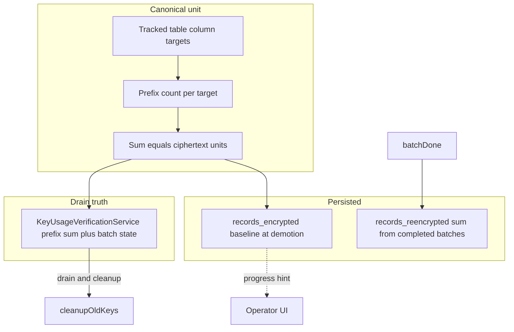

# Encryption key “Records” semantics and UI/API alignment

## Current state (verified in code)

| Piece | What it actually does |
|--------|------------------------|
| [`EncryptionKey`](c:/github/ezkey/ezkey-core/src/main/java/org/ezkey/security/domain/entity/EncryptionKey.java) `records_encrypted` | **Never updated** in production (only defaults/tests). UI always shows `0`. |
| [`ReencryptionBatchProcessingService.updateKeyStatistics`](c:/github/ezkey/ezkey-core/src/main/java/org/ezkey/security/ReencryptionBatchProcessingService.java) | On batch **COMPLETED**, adds `recordsDone` to `records_reencrypted`. `recordsDone` is the number of rows successfully re-encrypted **for that batch’s single `(table, column)` target**. |
| [`ReencryptionTargetQueryService.countRecordsEncryptedWithKey`](c:/github/ezkey/ezkey-core/src/main/java/org/ezkey/security/ReencryptionTargetQueryService.java) | Per target, counts **rows** whose ciphertext matches `ENC:{keyId}:%`. [`KeyUsageVerificationService`](c:/github/ezkey/ezkey-core/src/main/java/org/ezkey/security/KeyUsageVerificationService.java) **sums across all discovered targets** — equivalent to counting **encrypted ciphertext units** (one per tracked column still holding that prefix on a row). This matches batch semantics: each unit is migrated in one batch pass for that column. |
| [`KeyRotationService.cleanupOldKeys`](c:/github/ezkey/ezkey-core/src/main/java/org/ezkey/security/KeyRotationService.java) | Uses `records_reencrypted >= records_encrypted`. With `records_encrypted == 0`, this is effectively **`records_reencrypted >= 0`**, so the comparison does **not** encode “migration complete”. Auto-disable is effectively driven only by **ENABLED + age cutoff** (see [`findKeysEligibleForDisable`](c:/github/ezkey/ezkey-core/src/main/java/org/ezkey/security/domain/repository/EncryptionKeyRepository.java)), not by counters. This must be fixed when redefining semantics. |
| Admin UI [`encryption-keys.tsx`](c:/github/ezkey/ezkey-admin-ui/src/pages/encryption-keys.tsx) | **Lifecycle** column shows a second line (`remainingRowsShort`) when `remainingRecords > 0`. **Records** column shows `recordsEncrypted` (always 0 today). Detail panel repeats `remainingRecords` / `remainingTargets` and the two counters. |

The archived plan already recorded this tension: [lifecycle_after_reencrypt_refactor_7721f359.plan.md](c:/github/ezkey/.cursor/plans/archived/2026-04/lifecycle_after_reencrypt_refactor_7721f359.plan.md) (discussion recap § `records_encrypted` vs derived counts). [SPEC_ENCRYPTION_KEY_LIFECYCLE_STRATEGY.md](c:/github/ezkey/docs/SPEC_ENCRYPTION_KEY_LIFECYCLE_STRATEGY.md) §2.2 states that **prefix-based verification** is the trustworthy signal for drain, and historical counters alone are insufficient for irreversible decisions — consistent with your direction.

---

## Recommendation: one canonical unit — **encrypted ciphertext units** (targets)

**Definition (Ezkey today):** For each tracked `(table, column)` in the same inventory as [`ReencryptionBatchCreationService.discoverReencryptableTargets()`](c:/github/ezkey/ezkey-core/src/main/java/org/ezkey/security/ReencryptionBatchCreationService.java), count rows where the column still uses `ENC:{keyId}:%`. **Total remaining** = sum over targets. This is **not** “PostgreSQL rows” globally; it is **sum of per-column row counts**, which matches **re-encryption work** (and generalizes if you later have multiple keys affecting different columns).

- **Why not raw ROW count only:** One logical row with multiple encrypted columns still using the old key contributes **multiple units** — closer to “work” and to future multi-key layouts.
- **Why this matches `records_reencrypted`:** Each completed batch adds the number of row-level ciphertext updates for **one** column target; summing batches for a key aggregates the same kind of **unit** (row × column for tracked fields).

Use the same vocabulary everywhere: **ciphertext units** (or “encrypted targets”) in JavaDoc, API `@Schema` text, operator help, and DB comments — **not** ambiguous “records” without definition.

---

## Persisted columns: pragmatic semantics (no per-write counter)

**Abandon** the original idea of incrementing `records_encrypted` on every encrypt — high coupling, hot-row risk, and low value ([archived plan follow-up](c:/github/ezkey/.cursor/plans/archived/2026-04/lifecycle_after_reencrypt_refactor_7721f359.plan.md)).

### `records_encrypted` (suggested semantic name in docs: **migration scope baseline**)

- **When to set / refresh:** At the **moment the key leaves PRIMARY** (demotion to `ENABLED`) — run the same **sum of `countRecordsEncryptedWithKey` over all targets** as [`KeyUsageVerificationService.computeEnabledSnapshot`](c:/github/ezkey/ezkey-core/src/main/java/org/ezkey/security/KeyUsageVerificationService.java) and persist it once (transaction with status transition).
- **Meaning:** **Order-of-magnitude scope** of ciphertext still using that key **at demotion** (stock to migrate). Not a live gauge while the key is PRIMARY (your point: PRIMARY would only ever be a stale snapshot on refresh).
- **No legacy backfill path required** for this repo’s current posture (no production data; operators use clean-start). Baseline is set in application code at demotion; empty DB always reflects the updated foundational migration.

### `records_reencrypted`

- **Keep** the current accumulation from completed batches (`recordsDone`), with documentation that each unit is **one ciphertext updated** for a tracked column (same as batch row processing today).
- **Sanity check:** Ensure no double-count path exists when batches are retried/recreated (review batch completion idempotency — only if tests or code show gaps).

### Relationship between baseline, reencrypted, and “remaining”

- **Authoritative “remaining work”** for operators and for **drain** should remain **derived**: prefix sum + batch-state guards (already in `KeyUsageVerificationService`). Baseline vs reencrypted is a **progress / health** indicator (e.g. “how much of the estimated scope we have processed”), not the sole drain signal.
- **Optional UI/API:** Expose `remainingApprox = max(0, baseline - reencrypted)` **only as secondary** when baseline is set, with copy that **derived remaining** (prefix) wins for drain — or omit ratio entirely and rely on lifecycle + `remainingRecords` to avoid confusion.

---

## Critical fix: `cleanupOldKeys` must not rely on broken counters

Replace or supplement `records_reencrypted >= records_encrypted` with logic aligned to the spec:

- **Primary rule:** Reuse the same “drained” conditions as the operator-facing lifecycle: **zero prefix sum** across targets **and** no non-completed batches for that old key (same inputs as `KeyUsageVerificationService` for `ENABLED` → `DRAINED`).
- **Counters:** Use **only** as supplementary logging or secondary guard after baseline exists — not as the only gate.

This aligns product behavior with [SPEC_ENCRYPTION_KEY_LIFECYCLE_STRATEGY.md](c:/github/ezkey/docs/SPEC_ENCRYPTION_KEY_LIFECYCLE_STRATEGY.md) (“explicit zero remaining records verification model, not historical counters alone”).

---

## Admin API contract ([`EncryptionKeyController.EncryptionKeyResponse`](c:/github/ezkey/ezkey-admin-api/src/main/java/org/ezkey/admin/controller/EncryptionKeyController.java))

1. **Clarify `@Schema` / Javadoc** for:
   - `recordsEncrypted` → baseline ciphertext units at demotion (nullable or `0` with explicit “not set” policy — pick one and document).
   - `recordsReencrypted` → cumulative ciphertext units migrated off this key (completed batches).
   - `remainingRecords` → **derived** prefix sum for `ENABLED` keys; `null` when not applicable (unchanged behavior, **rename in docs only** if desired — e.g. `remainingCiphertextUnits` would be a breaking JSON rename; prefer clearer descriptions first unless you accept a versioned DTO change).

2. **Optional:** Add a small enum or string `recordsBaselineState` (`NOT_SET`, `SET`) if the UI needs to distinguish backfilled vs legacy rows without overloading `0`.

3. **OpenAPI:** Update Java annotations only; maintainer regenerates `specs/` per repo workflow (agents do not hand-edit specs).

4. **Tests:** Update [`EncryptionKeyControllerTest`](c:/github/ezkey/ezkey-admin-api/src/test/java/org/ezkey/admin/controller/EncryptionKeyControllerTest.java) and [`KeyUsageVerificationServiceTest`](c:/github/ezkey/ezkey-core/src/test/java/org/ezkey/security/KeyUsageVerificationServiceTest.java) expectations if response shape or semantics change.

---

## Admin UI ([`encryption-keys.tsx`](c:/github/ezkey/ezkey-admin-ui/src/pages/encryption-keys.tsx), i18n)

1. **Remove** the extra line under the lifecycle badge (`remainingRowsShort` block in the lifecycle column, ~1021–1026) — eliminates duplication with the Records column.
2. **Records column** (and detail labels):
   - **PRIMARY / PENDING / DISABLED:** Show **em dash** or short “not applicable” — **do not** show misleading `0` for “encrypted so far”.
   - **ENABLED:** Show **derived remaining** (`remainingRecords`) as the main number for “work left” (order-of-magnitude health), with header tooltip/help updated to match **ciphertext units** wording.
3. **Optional:** Second line or tooltip for `records_reencrypted / records_encrypted` **only when baseline is set**, labeled as “progress vs baseline at demotion”.
4. **Detail panel:** Trim redundancy if the list already shows the same; keep `remainingTargets` if useful for imbalance across tables/columns (optional).
5. **i18n:** Update [`en`/`fr` encryption-keys strings](c:/github/ezkey/ezkey-admin-ui/src/locales) for column headers/tooltips (`headerTooltipRecords`, `remainingRowsShort` usage removal or repurposing).

**Browser tests:** Risk-based — layout/labels change on encryption keys list/detail; run Playwright only if you touch critical navigation; otherwise manual spot-check is enough per project autonomy rules.

---

## Database (Flyway — treat as first release)

**Constraint from product context:** There is **no production fleet**, **no need to preserve Flyway checksum history**, and validation uses **clean-start / fresh DB** each cycle. Use that freedom deliberately:

- **Edit the foundational migration(s) in place** where `ezkey_encryption_key` is created (today this lives in the consolidated migration that defines the table, e.g. [`V3__encryption_keyset_and_audit_jsonb_indexes.sql`](c:/github/ezkey/ezkey-core/src/main/resources/db/migration/V3__encryption_keyset_and_audit_jsonb_indexes.sql) — verify exact file in repo when implementing): column types, defaults, and **`COMMENT ON COLUMN`** should read as if the columns were **designed for this semantics from day one**.
- **Prefer not** to add a follow-up migration solely to “fix” comments or defaults unless it improves readability of the migration *story*; the default should be **one coherent definition** in the creating script.
- If clearer **physical names** are chosen (optional `RENAME COLUMN`), apply them in that same foundational definition so new databases never see the old names — again, no additive migration required for this initiative.
- Optionally **restructure or consolidate** the migration set for clarity (as a “v1.0” layout), still respecting Flyway ordering rules — only where it reduces confusion without inventing fake history.

This replaces the earlier plan note about “new Flyway migration + backfill.”

---

## Documentation

- [`docs/SPEC_ENCRYPTION_KEY_LIFECYCLE_STRATEGY.md`](c:/github/ezkey/docs/SPEC_ENCRYPTION_KEY_LIFECYCLE_STRATEGY.md): short subsection tying **baseline counters** to **prefix verification** (counters = planning/progress; verification = drain).
- [`docs/ENDPOINT.md`](c:/github/ezkey/docs/ENDPOINT.md): encryption key list/detail fields when you change descriptions (if documented there).
- [`docs/REENCRYPTION_OPERATIONS.md`](c:/github/ezkey/docs/REENCRYPTION_OPERATIONS.md): operator-facing sentence on what “Records” means.

---

## Implementation order (suggested)

1. Core: demotion hook to set `records_encrypted` baseline + fix `cleanupOldKeys` drain logic; align foundational Flyway + entity in parallel.
2. Admin API: Javadoc/`@Schema` + `toResponse` behavior if any field becomes nullable for PRIMARY.
3. Admin UI: column + detail + i18n; remove lifecycle sub-badge line.
4. Tests: `KeyRotationService` / integration tests that assumed `setRecordsEncrypted` manually; `KeyUsageVerificationServiceTest`; controller tests.

---

## Completion summary (2026-04)

This initiative is **closed**. Implementation matches the plan and the complementary decisions (greenfield Flyway edits, no live write counter, drain as source of truth for auto-disable).

### What shipped

| Area | Outcome |
|------|---------|
| **Canonical unit** | Ciphertext units = sum over tracked `(table, column)` of rows matching `ENC:{keyId}:%`, aligned with batch creation and `KeyUsageVerificationService`. |
| **Baseline** | New [`EncryptionKeyMigrationScopeService`](c:/github/ezkey/ezkey-core/src/main/java/org/ezkey/security/EncryptionKeyMigrationScopeService.java): `applyDemotionBaseline` sets `records_encrypted` from that sum and resets `records_reencrypted` to 0 on every PRIMARY→ENABLED path in [`KeyRotationService`](c:/github/ezkey/ezkey-core/src/main/java/org/ezkey/security/KeyRotationService.java) (promotion, keyset sync, metadata sync, `ensureSinglePrimaryKey`, new ENABLED rows). |
| **Auto-disable** | [`cleanupOldKeys`](c:/github/ezkey/ezkey-core/src/main/java/org/ezkey/security/KeyRotationService.java) gates on **`KeyUsageVerificationService` → `DRAINED`** (prefix zero + batch state), not `records_reencrypted >= records_encrypted`. Audit adds `lifecycle_stage`. |
| **Crypto API** | [`CryptoApplication`](c:/github/ezkey/ezkey-crypto-api/src/main/java/org/ezkey/crypto/CryptoApplication.java) excludes `EncryptionKeyMigrationScopeService` from component scan (depends on excluded re-encryption beans). |
| **Persistence / docs** | [`V3__encryption_keyset_and_audit_jsonb_indexes.sql`](c:/github/ezkey/ezkey-core/src/main/resources/db/migration/V3__encryption_keyset_and_audit_jsonb_indexes.sql) comments + [`EncryptionKey`](c:/github/ezkey/ezkey-core/src/main/java/org/ezkey/security/domain/entity/EncryptionKey.java) Javadoc. |
| **Admin API** | [`EncryptionKeyResponse`](c:/github/ezkey/ezkey-admin-api/src/main/java/org/ezkey/admin/controller/EncryptionKeyController.java) `@Schema` / Javadoc for baseline, cumulative re-encrypted, derived `remainingRecords`. |
| **Admin UI** | [`encryption-keys.tsx`](c:/github/ezkey/ezkey-admin-ui/src/pages/encryption-keys.tsx): lifecycle badge **without** sub-line; **Remaining** column shows `remainingRecords` for ENABLED, em dash otherwise; detail shows migration baseline sensibly for PRIMARY/PENDING. EN/FR i18n updated. |
| **Product docs** | [`SPEC_ENCRYPTION_KEY_LIFECYCLE_STRATEGY.md`](c:/github/ezkey/docs/SPEC_ENCRYPTION_KEY_LIFECYCLE_STRATEGY.md), [`ENDPOINT.md`](c:/github/ezkey/docs/ENDPOINT.md), [`REENCRYPTION_OPERATIONS.md`](c:/github/ezkey/docs/REENCRYPTION_OPERATIONS.md). |

### Complementary decisions (captured)

- **Flyway:** Edited the **foundational** migration in place (no additive migration for comments/backfill); consistent with no production fleet and clean-start validation.
- **No `recordsBaselineState` DTO** and **no optional “progress vs baseline” second line** in the UI (plan optional items; avoided scope creep).
- **OpenAPI JSON** under `specs/` is **not** hand-edited; regenerate via `scripts/update-specs.sh` / `.bat` after a clean stack run.

### Testing

- **Automated:** `mvn spotless:apply` and `mvn test -pl ezkey-core,ezkey-admin-api -am` **passed** after implementation.
- **Admin UI build:** `npm run build` may still report **pre-existing** TypeScript issues in `api-error-i18n.test.ts` (unrelated to encryption-keys changes); encryption-keys page changes are structurally sound.
- **Browser / Playwright:** Not extended (risk-based; labels/layout only).

### Historical note

The “Current state” table at the top of this document describes the **pre-implementation** situation for traceability; behavior after delivery is described in the completion table above.
