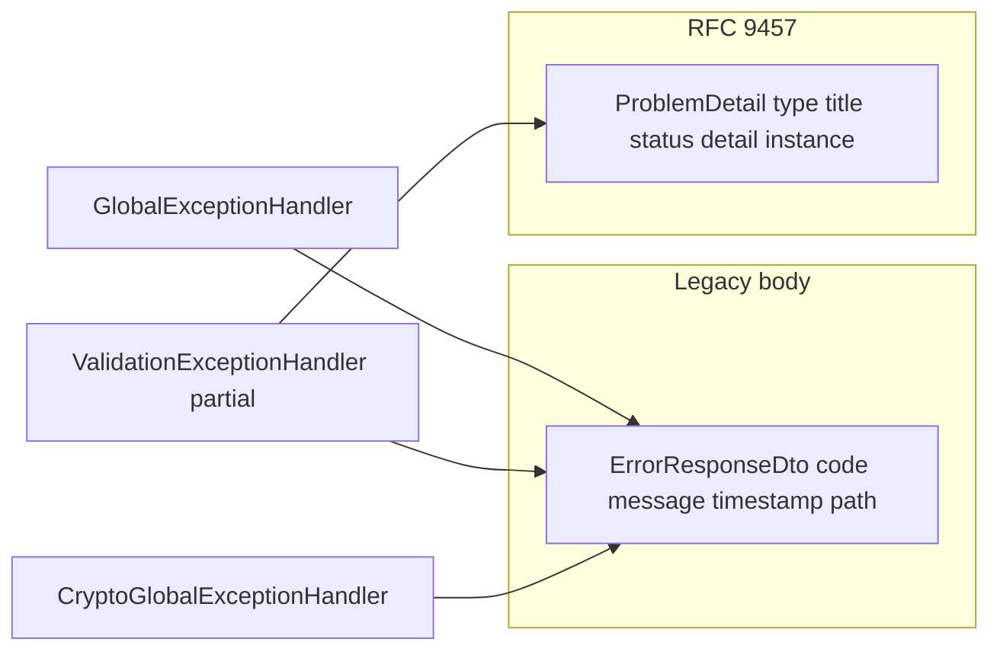

# Plan: suppression de `ErrorResponseDto` au profit de RFC 9457 (`ProblemDetail`)

## Implementation status (completed)

**Fully implemented** (April 2026). All four waves were delivered in code; unit and functional validation were run by the maintainer (including clean start, `update-specs`, and `ezkey-tests`).

| Wave | Outcome |
|------|---------|
| 1 | `GlobalExceptionHandler` migrated to `ProblemDetail`; `AdminApiProblemCatalog`; `GlobalExceptionHandlerSystemTenantTest` updated |
| 2 | `ValidationExceptionHandler` legacy handlers → RFC 9457; `IntegrationController` Springdoc uses `ProblemDetail`; `AuditReasonJustificationTest` asserts `type`/`detail`; `ErrorResponseDto` removed from `AdminNativeConfiguration` |
| 3 | `CryptoGlobalExceptionHandler` + `CryptoApiProblemCatalog`; `CryptoControllerTest` uses `application/problem+json` and `$.type` |
| 4 | `ezkey-core/.../ErrorResponseDto.java` deleted; no remaining `ErrorResponseDto` references in `*.java`; CLI comment adjusted; `ezkey-admin-api/NATIVE_BUILD.md` updated |

**Optional follow-up:** Historical analysis markdown or OpenAPI `*.backup` copies may still mention `ErrorResponseDto`; safe to ignore or prune opportunistically.

---

## 1) Inventaire exhaustif (état actuel)

### Code Java (source de vérité runtime)

| Zone                                      | Fichiers                                                                                                                                                 | Rôle                                                                                                                                                                                                                                                                                                                     |
| ----------------------------------------- | -------------------------------------------------------------------------------------------------------------------------------------------------------- | ------------------------------------------------------------------------------------------------------------------------------------------------------------------------------------------------------------------------------------------------------------------------------------------------------------------------ |
| Définition                                | `[ezkey-core/src/main/java/org/ezkey/dto/ErrorResponseDto.java](ezkey-core/src/main/java/org/ezkey/dto/ErrorResponseDto.java)`                           | DTO legacy: `code`, `message`, `timestamp`, `path`                                                                                                                                                                                                                                                                       |
| Admin API — handlers                      | `[ezkey-admin-api/.../GlobalExceptionHandler.java](ezkey-admin-api/src/main/java/org/ezkey/exception/GlobalExceptionHandler.java)`                       | 5 handlers encore en `ErrorResponseDto`: `SystemTenantNotConfigured`, `RateLimitExceeded`, `ResourceNotFound`, `RuntimeException`, `Exception`                                                                                                                                                                           |
| Admin API — handlers                      | `[ezkey-admin-api/.../ValidationExceptionHandler.java](ezkey-admin-api/src/main/java/org/ezkey/exception/ValidationExceptionHandler.java)`               | **Coexistence**: plusieurs chemins déjà en `ResponseEntity<ProblemDetail>` (vagues domaine précédentes), **9 handlers** encore en `ErrorResponseDto`: `MethodArgumentNotValid`, `IllegalArgument`, `IllegalState`, `OptimisticLockingFailure`, `HttpMessageNotReadable`, `DataIntegrityViolation`, `ConstraintViolation` |
| Admin API — config native (hors priorité) | `[ezkey-admin-api/.../AdminNativeConfiguration.java](ezkey-admin-api/src/main/java/org/ezkey/admin/config/AdminNativeConfiguration.java)`                | Enregistrements réflexion / Jackson (historique GraalVM). **Ne pas traiter comme contrainte** pour cette migration — voir § « Compilation native » ci-dessous.                                                                                                                                                           |
| Admin API — Springdoc                     | `[ezkey-admin-api/.../IntegrationController.java](ezkey-admin-api/src/main/java/org/ezkey/admin/controller/IntegrationController.java)`                  | Seul contrôleur avec `@Schema(implementation = ErrorResponseDto.class)` sur réponses d’erreur (réponses 4xx liées intégrations / clés)                                                                                                                                                                                   |
| Crypto API                                | `[ezkey-crypto-api/.../CryptoGlobalExceptionHandler.java](ezkey-crypto-api/src/main/java/org/ezkey/crypto/controller/CryptoGlobalExceptionHandler.java)` | Tous les handlers en `ErrorResponseDto`                                                                                                                                                                                                                                                                                  |

**Hors périmètre Java `ErrorResponseDto`**: `[ezkey-auth-api/.../GlobalExceptionHandler.java](ezkey-auth-api/src/main/java/org/ezkey/exception/GlobalExceptionHandler.java)` et `[ezkey-integration-api/.../GlobalExceptionHandler.java](ezkey-integration-api/src/main/java/org/ezkey/integration/api/exception/GlobalExceptionHandler.java)` utilisent déjà `ProblemDetail` (pas d’import `ErrorResponseDto`).

### Tests unitaires qui codent encore le format legacy

- `[ezkey-admin-api/.../GlobalExceptionHandlerSystemTenantTest.java](ezkey-admin-api/src/test/java/org/ezkey/exception/GlobalExceptionHandlerSystemTenantTest.java)` — assert sur `body.getCode()` → `"SYSTEM_NOT_CONFIGURED"`.
- `[ezkey-crypto-api/.../CryptoControllerTest.java](ezkey-crypto-api/src/test/java/org/ezkey/crypto/controller/CryptoControllerTest.java)` — `jsonPath("$.code")` → `"VALIDATION_ERROR"` (plusieurs occurrences).

La majorité des tests Admin API ciblant les handlers RFC 9457 (`ValidationExceptionHandlerWave7Test`, `DomainExceptionHandler*`, etc.) utilisent déjà `ProblemDetail`.

### Tests fonctionnels (`ezkey-tests`)

- `[ezkey-tests/.../AuditReasonJustificationTest.java](ezkey-tests/src/test/java/org/ezkey/tests/security/audit/AuditReasonJustificationTest.java)` — seul grep fonctionnel sur `response.jsonPath().getString("code")` == `"VALIDATION_ERROR"` pour un 400 Admin API (révocation clé API avec raison trop courte).

### Artefacts générés et consommateurs

- **OpenAPI** (`[specs/admin-api/openapi-spec.json](specs/admin-api/openapi-spec.json)`, copies `[ezkey-sdk/admin-api-spec.json](ezkey-sdk/admin-api-spec.json)`, `[ezkey-admin-ui/openapi-spec.json](ezkey-admin-ui/openapi-spec.json)`, etc.): schéma `ErrorResponseDto` et références — **ne pas éditer à la main**; régénération après clean start via `[scripts/update-specs.sh](scripts/update-specs.sh)` / `.bat` (mainteneur).
- **Auth OpenAPI** peut encore mentionner `ErrorResponseDto` dans des specs copiées alors que le code Auth est en `ProblemDetail` — traiter comme **dette de spec**, résolue par régénération.
- **Admin UI** (`[ezkey-admin-ui/AGENTS.md](ezkey-admin-ui/AGENTS.md)`): le client attend déjà RFC 9457 (`getApiErrorMessage` sur `detail`/`title`) — aligner le backend réduit le risque de messages génériques.
- **CLI Python** (`[ezkey-cli-python/ezkey_cli/utils/http_client.py](ezkey-cli-python/ezkey_cli/utils/http_client.py)`): priorité à `detail`/`title`, repli legacy — compatible sans changement obligatoire.

---

## 2) Stratégie transverse (avant les vagues)

1. **Catalogue de `type` URIs** — Réutiliser la convention existante `https://ezkey.io/problems/...` (déjà utilisée dans `[ValidationExceptionHandler](ezkey-admin-api/src/main/java/org/ezkey/exception/ValidationExceptionHandler.java)`, `[DomainExceptionHandler](ezkey-admin-api/src/main/java/org/ezkey/exception/DomainExceptionHandler.java)`, `[EnrollmentExceptionHandler](ezkey-admin-api/src/main/java/org/ezkey/exception/EnrollmentExceptionHandler.java)`). Introduire ou étendre une classe du style `**AdminApiProblemCatalog`** (miroir de `[AuthApiProblemCatalog](ezkey-auth-api/src/main/java/org/ezkey/exception/AuthApiProblemCatalog.java)`) pour les cas “génériques” (validation Bean, JSON illisible, contrainte DB, 404, 429, 500) afin d’éviter des chaînes en dur dispersées et de stabiliser les assertions de tests.
2. **Mappage sémantique** — Ancien `code` (ex. `VALIDATION_ERROR`, `RESOURCE_NOT_FOUND`) → `**type` URI** + `title` stable + `detail` sûr (ne pas exposer des messages bruts pour les 500). Pour la validation, le détail peut rester proche du message actuel tant qu’il est déjà jugé acceptable.
3. **Réponses** — `ResponseEntity<ProblemDetail>` avec statuts inchangés par rapport aux handlers actuels (principe: **changement de forme du corps**, pas de sémantique HTTP sauf décision explicite).
4. **OpenAPI** — Mettre à jour les annotations Springdoc sur les contrôleurs en même temps que les handlers qu’ils documentent (ex. `ProblemDetail` à la place de `ErrorResponseDto`). Puis **régénération des specs** par le mainteneur après clean start.

### Compilation native (GraalVM / AOT) — hors objectif release 1

- La **compilation native a été laissée de côté** et pourrait **être retirée entièrement** à moyen terme. Ce n’est **pas un objectif à compléter** pour finaliser cette migration RFC 9457.
- **Release 1** : ne pas bloquer ou alourdir le travail sur des hints AOT, validation d’image native, ou symétrie `ProblemDetail` vs `ErrorResponseDto` dans `AdminNativeConfiguration`. On peut être **agressif** : supprimer les références mortes à `ErrorResponseDto` dans cette config si ça simplifie le grep / le ménage, **sans** obligation de re-tester une build native.
- Le coût éventuel de rattraper ou supprimer la chaîne native reste une **décision à moyen terme**, distincte de la livraison des APIs standardisées.

---

## 3) Vagues proposées (scope, tests unitaires, tests fonctionnels)

Hypothèse de travail convenue: **Docker arrêté** → baseline Maven complète avec tests unitaires (le repo exclut `ezkey-tests` du script `[scripts/build.sh](scripts/build.sh)` ligne 66: `mvn test -pl '!ezkey-tests'` — pour une validation “complète” incluant fonctionnel, lancer explicitement `ezkey-tests` après clean start). **Clean start** → exécution ciblée ou complète de `ezkey-tests` et analyse des logs.

### Vague 1 — Admin API: `GlobalExceptionHandler` (faible surface, pas de validation métier)

- **Scope**: Migrer les 5 méthodes de `[GlobalExceptionHandler.java](ezkey-admin-api/src/main/java/org/ezkey/exception/GlobalExceptionHandler.java)` vers `ProblemDetail`; ajuster javadoc; s’appuyer sur `AdminApiProblemCatalog` pour `type`/`title`/`detail` sanitizés.
- **Tests unitaires**: `[GlobalExceptionHandlerSystemTenantTest.java](ezkey-admin-api/src/test/java/org/ezkey/exception/GlobalExceptionHandlerSystemTenantTest.java)` — remplacer assertions sur `getCode()` par assertions RFC (`getType()`, `getStatus()`, `getDetail()` ou équivalent). Ajouter des tests ciblés si d’autres branches (404/429) ne sont pas couvertes.
- **Tests fonctionnels**: Impact direct limité (erreurs génériques / 404). Recommandation: exécuter au minimum les tests Admin qui déclenchent 404/500 contrôlés si présents; sinon smoke `ezkey-tests` sur un sous-ensemble security lié admin, ou suite P0 selon temps.
- **Livrable**: plus aucune référence `ErrorResponseDto` dans ce fichier. Pas d’exigence de toucher `AdminNativeConfiguration` tant que le DTO existe encore ailleurs (nettoyage optionnel en vague 4, sans validation native).

### Vague 2 — Admin API: handlers legacy dans `ValidationExceptionHandler`

- **Scope**: Migrer les 9 handlers `ErrorResponseDto` vers `ProblemDetail`, en réutilisant le même style que les handlers `ProblemDetail` déjà présents dans le même fichier (URI sous `https://ezkey.io/problems/validation/...` ou sous-arborescence `standard/` si vous préférez séparer “validation nommée” vs “validation générique”).
- **Tests unitaires**: Étendre ou ajouter des tests MockMvc / handler unitaires pour au moins un cas par famille (400 Bean Validation, JSON mal formé, contrainte, optimistic lock, etc.) — aujourd’hui la couverte est surtout sur les exceptions **nommées** (`ValidationExceptionHandlerWave7Test`, etc.). Compléter la couverture là où des régressions seraient difficiles à diagnostiquer sans test ciblé.
- **Tests fonctionnels**: Mettre à jour `[AuditReasonJustificationTest](ezkey-tests/src/test/java/org/ezkey/tests/security/audit/AuditReasonJustificationTest.java)` pour assert RFC 9457 (`type` ou `detail` / `title`) au lieu de `code`. Envisager une recherche globale dans `ezkey-tests` sur `"code"` et `VALIDATION_ERROR` après implémentation pour confirmer qu’aucun autre cas n’a été oublié.
- **Springdoc**: Remplacer dans `[IntegrationController.java](ezkey-admin-api/src/main/java/org/ezkey/admin/controller/IntegrationController.java)` les `ErrorResponseDto` par `ProblemDetail` pour les réponses d’erreur documentées.

### Vague 3 — Crypto API

- **Scope**: `[CryptoGlobalExceptionHandler.java](ezkey-crypto-api/src/main/java/org/ezkey/crypto/controller/CryptoGlobalExceptionHandler.java)` → `ProblemDetail`; aligner les codes sémantiques avec le catalogue Admin ou un `**CryptoApiProblemCatalog`** minimal si les `type` doivent être distincts.
- **Tests unitaires**: `[CryptoControllerTest.java](ezkey-crypto-api/src/test/java/org/ezkey/crypto/controller/CryptoControllerTest.java)` — remplacer `jsonPath("$.code")` par assertions sur `type`/`detail`/`title`/`status`.
- **Tests fonctionnels**: Si des tests HTTP dans `ezkey-tests` appellent la Crypto API et assertent l’ancien format, les mettre à jour (grep `crypto` / port dans `ezkey-tests`).

### Vague 4 — Suppression du DTO et nettoyage final

- **Scope**: Supprimer `[ErrorResponseDto.java](ezkey-core/src/main/java/org/ezkey/dto/ErrorResponseDto.java)`; `grep` global sur `ErrorResponseDto` doit être vide pour `*.java`. **Optionnel** : retirer les hints devenus inutiles dans `[AdminNativeConfiguration.java](ezkey-admin-api/src/main/java/org/ezkey/admin/config/AdminNativeConfiguration.java)` (cohérence du code, pas de contrainte native — voir § « Compilation native »). Vérifier qu’aucune doc générée / exemple ne référence l’ancien schéma de manière contradictoire (docs non générées: seulement si nécessaire au fil du projet).
- **Tests unitaires**: Build reactor complet + tous les modules touchés.
- **Tests fonctionnels**: Campagne `ezkey-tests` plus large (ou complète) pour valider qu’aucun client HTTP ne dépendait encore de `code`/`message` legacy.
- **OpenAPI / SDK**: Régénération des specs et propagation aux artefacts (`specs/`, `ezkey-sdk`, etc.) **par le mainteneur** après clean start (`[.cursor/rules/openapi-specs.mdc](.cursor/rules/openapi-specs.mdc)`).

---

## 4) Boucle d’autonomie par vague (opérationnelle)

Pour chaque vague, enchaîner:

1. **Arrêt Docker** (comme convenu).
2. **Baseline Maven** depuis la racine: `mvn spotless:apply`, `mvn checkstyle:check`, `mvn clean`, `mvn install -DskipTests`, puis `mvn test -pl '!ezkey-tests'` (ou modules ciblés une fois le baseline vert).
3. **Clean start** du stack, puis `mvn test -pl ezkey-tests` (ou `-Dtest=...` pour un sous-ensemble lié à la vague).
4. **Feedback**: analyser échecs (corps de réponse, `Content-Type`, assertions RestAssured) et itérer.

Note: le script `[scripts/build.sh](scripts/build.sh)` exclut déjà `ezkey-tests` des tests — prévoir explicitement l’étape **ezkey-tests** après Docker pour ne pas confondre “build vert” et “migration API complète”.

---

## 5) Jugement tests navigateur (Admin UI)

La migration change surtout la **forme JSON** des erreurs; l’[Admin UI](ezkey-admin-ui/AGENTS.md) consomme déjà RFC 9457. **Pas d’extension Playwright obligatoire** sauf si une régression apparaît sur l’affichage des messages d’erreur (mutation/login). Sinon, s’en tenir aux tests unitaires Admin + `ezkey-tests`.
