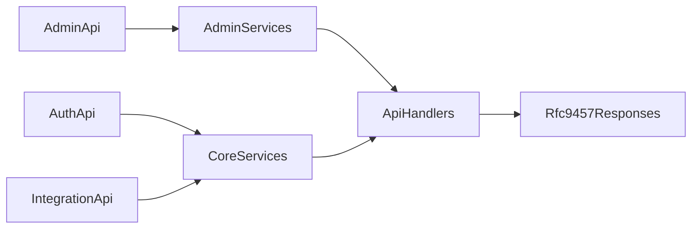

# Exception Inventory And Migration Plan

## Scope

Analyse only production business code for:

- [ezkey-admin-api/src/main/java](ezkey-admin-api/src/main/java)
- [ezkey-auth-api/src/main/java](ezkey-auth-api/src/main/java)
- [ezkey-integration-api/src/main/java](ezkey-integration-api/src/main/java)
- [ezkey-core/src/main/java](ezkey-core/src/main/java) for shared service/domain flows used by those APIs

Explicitly exclude:

- crypto-support-only surfaces
- demo apps
- migration tooling
- tests and generated specs

## Working Model

The analysis should treat the API modules and `ezkey-core` as one exception flow surface:

Key files already identified as structural hotspots:

- [ezkey-admin-api/src/main/java/org/ezkey/admin/service/AdminProvisioningService.java](ezkey-admin-api/src/main/java/org/ezkey/admin/service/AdminProvisioningService.java)
- [ezkey-admin-api/src/main/java/org/ezkey/admin/service/AdminAuthService.java](ezkey-admin-api/src/main/java/org/ezkey/admin/service/AdminAuthService.java)
- [ezkey-core/src/main/java/org/ezkey/integration/service/IntegrationService.java](ezkey-core/src/main/java/org/ezkey/integration/service/IntegrationService.java)
- [ezkey-core/src/main/java/org/ezkey/integration/service/ApiKeyService.java](ezkey-core/src/main/java/org/ezkey/integration/service/ApiKeyService.java)
- [ezkey-core/src/main/java/org/ezkey/enrollment/service/EnrollmentService.java](ezkey-core/src/main/java/org/ezkey/enrollment/service/EnrollmentService.java)
- [ezkey-core/src/main/java/org/ezkey/authattempt/service/AuthAttemptService.java](ezkey-core/src/main/java/org/ezkey/authattempt/service/AuthAttemptService.java)
- [ezkey-core/src/main/java/org/ezkey/authattempt/service/AuthAttemptRespondService.java](ezkey-core/src/main/java/org/ezkey/authattempt/service/AuthAttemptRespondService.java)
- [ezkey-core/src/main/java/org/ezkey/authattempt/service/AuthAttemptWaitService.java](ezkey-core/src/main/java/org/ezkey/authattempt/service/AuthAttemptWaitService.java)
- [ezkey-auth-api/src/main/java/org/ezkey/exception/GlobalExceptionHandler.java](ezkey-auth-api/src/main/java/org/ezkey/exception/GlobalExceptionHandler.java)
- [ezkey-integration-api/src/main/java/org/ezkey/integration/api/exception/GlobalExceptionHandler.java](ezkey-integration-api/src/main/java/org/ezkey/integration/api/exception/GlobalExceptionHandler.java)
- [ezkey-admin-api/src/main/java/org/ezkey/exception/ValidationExceptionHandler.java](ezkey-admin-api/src/main/java/org/ezkey/exception/ValidationExceptionHandler.java)

## Phase 1: Build The Inventory

Produce a module-by-module inventory of non-named exceptions in service or service-adjacent business code, especially:

- `IllegalArgumentException`
- `IllegalStateException`
- `RuntimeException`
- broad `catch (Exception)` used for business fallback, masking, or reclassification

For each occurrence, capture:

- file and method
- current exception type
- throw or catch context
- whether the exception is business-facing, invariant-related, validation-related, authorization-related, or technical
- which API surface ultimately exposes or consumes it

## Phase 2: Add Mini-Analysis Per Occurrence

For each inventory row, do a short contextual analysis so the future named exception is precise rather than vague:

- what exact situation is happening in business terms
- whether it is really a validation error, a state conflict, an authorization denial, a not-found case, or an internal invariant failure
- whether the current generic type is semantically wrong but tolerated today by an API handler
- what the likely target named exception family should be

This is especially important for current hotspots where the same generic type covers multiple meanings:

- `AdminProvisioningService` mixes authorization, duplicate data, limits, and not-found-like conditions
- `EnrollmentService` mixes validation, reserved-system rules, lifecycle rules, and tenant state rules
- `IntegrationService` and `ApiKeyService` mix caller-context issues, tenant lifecycle, and quota rules
- `AuthAttemptRespondService` currently converts `IllegalArgumentException` into a success-body `FAILED` result, which risks masking programming errors

Create a companion analysis document in the repository so the observations remain reusable after the first migration passes. That document should preserve:

- the inventory rows
- the mini-analysis notes
- the intended named exception direction
- any unresolved questions or follow-up items discovered during later validation

## Phase 3: Map Current API Behavior

Document how each API currently translates those generic exceptions:

- Admin API still routes many generic validation/state cases through legacy `ErrorResponseDto` handling in [ezkey-admin-api/src/main/java/org/ezkey/exception/ValidationExceptionHandler.java](ezkey-admin-api/src/main/java/org/ezkey/exception/ValidationExceptionHandler.java)
- Auth API already has stronger RFC 9457 named-exception handling, but still keeps legacy `IllegalArgumentException` and `IllegalStateException` fallbacks in [ezkey-auth-api/src/main/java/org/ezkey/exception/GlobalExceptionHandler.java](ezkey-auth-api/src/main/java/org/ezkey/exception/GlobalExceptionHandler.java)
- Integration API has an important gap: it handles `IllegalArgumentException`, but not `IllegalStateException`, so some core service failures likely collapse to generic `500` responses in [ezkey-integration-api/src/main/java/org/ezkey/integration/api/exception/GlobalExceptionHandler.java](ezkey-integration-api/src/main/java/org/ezkey/integration/api/exception/GlobalExceptionHandler.java)

Deliverable from this phase:

- a cross-API matrix from `generic exception -> current HTTP behavior -> current payload shape -> desired named exception / RFC 9457 target`

## Phase 4: Prioritize Migration Waves

Sequence the transition in small, safe waves rather than a repo-wide big bang.

The migration should be optimized for short feedback loops. Each wave should contain a limited, coherent cluster of adjustments so validation remains fast and root-cause analysis stays tractable when a functional test breaks.

Recommended order:

1. High-risk semantic mismatches that currently produce the wrong HTTP meaning.
2. Shared `ezkey-core` services that affect more than one API.
3. Admin API service hotspots with many mixed meanings in the same class.
4. Technical/invariant exceptions that should become explicit internal named exceptions.
5. Residual broad `catch (Exception)` cases that should either stay clearly technical or be narrowed.

Recommended clustering principles:

- group by business flow or exception family, not by arbitrary file count
- keep each wave small enough that unit tests, clean start, and selective functional churn can be run comfortably by the maintainer
- avoid mixing unrelated API surfaces in the same first-pass wave unless they share the same core exception path
- prefer one semantic objective per wave, for example lifecycle conflicts, authorization/not-found distinctions, or auth-attempt terminal-state errors

Recommended validation loop per wave:

1. Implement the selected cluster of exception changes.
2. Run unit tests.
3. Run a clean start.
4. Run selective functional tests focused on the affected operational churn.
5. Use the feedback to adjust before opening the next wave.

This loop is part of the plan, not an afterthought. The wave size should be chosen specifically so that this validation sequence remains quick and diagnostically useful.

Suggested first-wave candidates:

- `ezkey-core` integration and enrollment lifecycle rules
- `ezkey-core` auth-attempt state errors
- Integration API handler gaps for state conflicts
- Admin provisioning and admin auth service hotspots

Possible wave shape:

1. Shared core lifecycle and state-conflict paths that currently leak wrong semantics across APIs.
2. Integration API alignment for those shared core paths, especially handler gaps and wrong 500 fallbacks.
3. Admin provisioning and admin authentication hotspots with dense mixed semantics.
4. Residual broad catch-and-mask patterns, including cases that currently collapse programming faults into business-level failures.

## Phase 5: Define The Target Exception Taxonomy

Before implementation, define a lightweight taxonomy to keep the migration coherent:

- validation/input exceptions
- not-found exceptions
- authorization/access exceptions
- lifecycle/state-conflict exceptions
- invariant/internal consistency exceptions
- technical operation exceptions that should stay internal and map to `500`

Each future named exception should have:

- one precise business meaning
- one intended HTTP status family
- one stable RFC 9457 problem `type`
- one safe operator/client-facing `title` and `detail` strategy

## Expected Output Of The Analysis

The analysis should end with:

- a complete inventory table for the in-scope APIs and shared core services
- a mini-analysis note for each generic exception occurrence
- a repository analysis document that can serve as a stable reference during later migration passes and regression investigations
- a prioritized migration backlog grouped by implementation wave
- a wave-by-wave execution strategy sized for quick maintainer feedback cycles
- a short list of handler-level gaps and incompatibilities to resolve while standardizing on RFC 9457

## Constraints

Keep the work focused on business-domain production code. Do not widen the effort to crypto-only support, demos, migration tooling, or generated OpenAPI artifacts.

## Current Planning Artifacts

The first concrete analysis artifact for implementation preparation is now:

- [docs/analysis/EXCEPTION_MAPPING_WAVE_1_ANALYSIS.md](C:/github/ezkey/docs/analysis/EXCEPTION_MAPPING_WAVE_1_ANALYSIS.md)

This Wave 1 document currently contains:

- the first narrow migration cluster
- the detailed inventory for that cluster
- the current API exposure and mapping observations
- the technical implementation breakdown
- the future validation focus

It should serve as the execution reference for the first implementation pass.

---

## Implementation status (plan conclusion)

**This plan is concluded as a milestone, not as a 100% final state.**

The staged migration described above was executed in multiple waves through **Wave 7** (April 2026). Core enrollment and auth-attempt flows, Admin and Integration API handler alignment, enrollment-create semantics (including indirect reference IDs vs path resources), audit foreign-key safety for integration/enrollment IDs, and **integration + API key** service-layer naming with Admin API RFC 9457 mapping are in place. Functional validation followed the agreed loop (unit tests, clean Docker start, targeted security/operational churn).

**Brief wave-oriented summary (high level):**

- **Early waves:** Tighten shared-core semantics for enrollment and auth-attempt lifecycle; align Integration API handling where generic types previously collapsed to wrong status families; introduce named domain exceptions and dedicated `@ExceptionHandler` methods where gaps existed.
- **Mid waves (e.g. enrollment-focused):** Replace generic validation throws with named types (`EnrollmentCreateValidationException`, related domain exceptions); map to Problem Detail where appropriate; preserve HTTP semantics (e.g. 400 vs 404 for body vs path references).
- **Supporting hardening:** Audit logging writes only FK-backed IDs when rows exist; reduces DB constraint noise and aligns with “validate before the database is the last line of defense.”
- **Wave 7:** `IntegrationService` and `ApiKeyService` — named validation/infrastructure exceptions (`IntegrationCreateValidationException`, `ApiKeyCreateValidationException`, `ApiKeyUpdateValidationException`, `ApiKeyIpWhitelistValidationException`, `SystemTenantNotConfiguredException`); `ResourceNotFoundException` for missing integration on retire/delete in core; Admin `ValidationExceptionHandler` / `GlobalExceptionHandler` updated accordingly.

**Current state of the codebase (honest):**

- **Significant functional surfaces** no longer rely on anonymous `IllegalArgumentException` / `IllegalStateException` for those flows; handlers can distinguish types and return stable problem types where implemented.
- **Residual generics remain** in `ezkey-core` and Admin services (e.g. crypto/key management, audit integrity internals, phone utilities, provisioning hotspots, some `RuntimeException` wrappers). That is expected: the plan always scoped **business-facing** migration first; not every throw site needs a named public domain type.
- **Future sessions** should reuse this plan as a **baseline inventory mindset** (classify meaning → status → payload → problem type) rather than assuming every file is done.

---

## Design note: named exceptions extending `IllegalArgumentException` (and similar)

**Question:** If we designed “create integration” greenfield today, would best practice be `IntegrationCreateValidationException extends IllegalArgumentException`?

**Honest answer: that inheritance is a deliberate migration compromise, not the single “textbook ideal” for a brand-new domain model.**

- **Why we did it (pragmatic, valid):** The codebase already routed many client-correctable failures through `IllegalArgumentException` (`ValidationExceptionHandler`, controller `catch (IllegalArgumentException)`, and similar). Subtyping preserves **backward-compatible dispatch**: subclasses are still caught by those handlers and catch blocks unless a **more specific** handler is registered first. That limits churn and risk during incremental refactors.
- **What greenfield purists often prefer:** A **small domain base** (e.g. `EzkeyDomainException extends RuntimeException`) or **per-case types that extend `RuntimeException` only**, with **explicit** `@ExceptionHandler` registration for each family — decoupling domain meaning from JDK type names. RFC 9457 cares about **HTTP status, problem `type`, and safe `detail`**, not about extending `IllegalArgumentException`.
- **Downside of extending JDK types:** Any other `IllegalArgumentException` (including from libraries) can match the same broad handler; you rely on **handler ordering** and specific handlers for named types. That is manageable but is coupling to a JDK semantic (“illegal argument to a method”) that is not always the same as “business rule validation.”

**Verdict for future work:** Treat **`extends IllegalArgumentException` / `extends IllegalStateException`** as an **intentional compatibility bridge** chosen for this migration. It is **defensible and production-appropriate** for Ezkey’s context. It is **not** claimed to be the only “clean architecture” choice if we were rewriting the exception layer from scratch; a shared domain base + explicit handlers would be equally or more pure at the cost of more mechanical changes. **Future refactors may gradually introduce a domain base class** and stop extending JDK types where the maintenance benefit outweighs the effort — without contradicting what was shipped in these waves.

**In plain letters (for the next session):** We optimized for **safe, incremental improvement** and **handler compatibility**. That is **good engineering**, not a claim of theoretical perfection. Remaining generics and optional future normalization of the inheritance hierarchy are **explicitly in scope** for later phases if the team wants a stricter domain-only tree.
