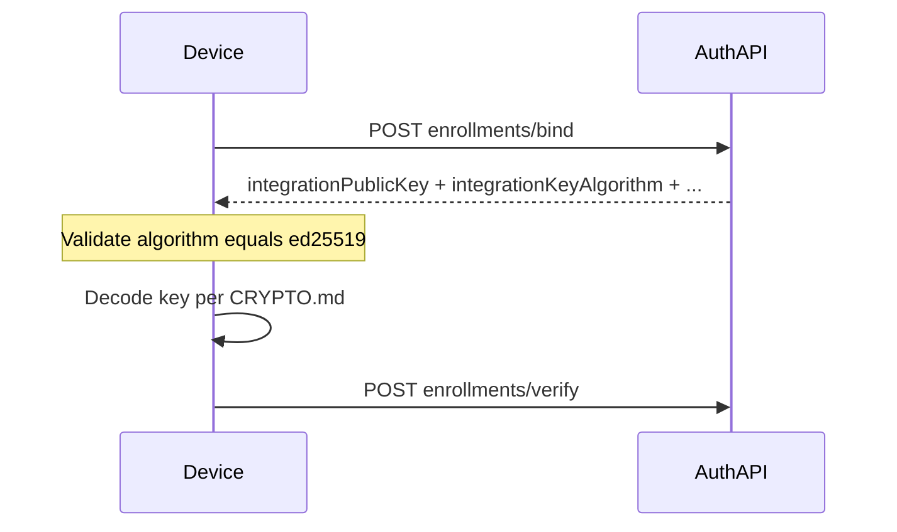

# Plan: `integrationKeyAlgorithm` — contract, validation posture, and alignment

## What is true today (verified in-repo)

| Layer | `integrationKeyAlgorithm` |
|--------|---------------------------|
| **Auth API DTO** | Present and **required** on [`EnrollmentBindResponseDto`](ezkey-auth-api/src/main/java/org/ezkey/enrollment/dto/EnrollmentBindResponseDto.java) (`@Schema(requiredMode = RequiredMode.REQUIRED)`). |
| **OpenAPI** | Listed under `EnrollmentBindResponseDto.required` together with `integrationPublicKey`, `enrollmentProofToken`, `enrollmentId` in [`specs/auth-api/openapi-spec.json`](specs/auth-api/openapi-spec.json) (generated artifact; do not edit by hand). |
| **Server behavior** | Always set to the literal `"ed25519"` in [`EnrollmentBindService.buildBindResponse`](ezkey-core/src/main/java/org/ezkey/enrollment/service/EnrollmentBindService.java) (line ~330). No branching to other algorithms in the current code path. |
| **Canonical docs** | [`docs/ENDPOINT.md`](docs/ENDPOINT.md) and [`docs/CRYPTO.md`](docs/CRYPTO.md) state Ed25519 wire format and that `integrationKeyAlgorithm` is `ed25519` for that format. |
| **Reference RN apps** | [`BindEnrollmentResponse`](ezkey_mobile/app/services/api/types.ts) (and the parallel copy in [`ezkey_mobile_app`](ezkey_mobile_app/app/services/api/types.ts)) **omit** the field from TypeScript types. Runtime JSON from Axios still includes it; the app uses `integrationPublicKey` in [`buildDraft`](ezkey_mobile/app/screens/EnrollmentWizard/EnrollmentWizardScreen.tsx) without reading or checking the algorithm field. |

**Conclusion:** Backend and primary product docs are aligned. The gap is **only** the reference client’s **TypeScript contract** (and therefore discoverability for integrators who copy those types). The external `MOBILE_DEVELOPER_GUIDE.md` you cited is **not** in this repository; any change there is a separate doc asset to update in the same spirit as below.

---

## Design advice: strict vs flexible for phase 1

**Recommendation: be strict on the client for unknown or mismatched values; do not treat silence as compatibility.**

- **Why strict fits Ezkey phase 1:** For enrollment bind, the integration public key material and verification code paths are **Ed25519-specific** (raw 32-byte key, Base64URL, etc.—see [`docs/CRYPTO.md`](docs/CRYPTO.md)). There is **no** negotiated algorithm switch in this phase. If `integrationKeyAlgorithm` were ever not `ed25519`, proceeding as if it were Ed25519 would be **unsafe**; stopping enrollment with a clear error is the correct **fail-closed** posture.
- **When flexibility is a false friend:** Ignoring the field “because the app already assumes Ed25519” hides version skew, proxy bugs, or a future server change until crypto fails opaquely later. For **third-party integrators**, explicit validation makes the protocol **auditable** and supportable.
- **When the server must stay strict:** The field is already **required** in the API contract. If a broken intermediary stripped the field, the response would violate the contract; clients that validate presence catch that early.

**Practical rule to document and implement in the reference app:**

1. After a successful bind, require `integrationKeyAlgorithm === "ed25519"` (exact string as emitted today; document **case sensitivity**—do not accept `ED25519` unless you explicitly decide to normalize).
2. If missing or not equal: **abort enrollment** with a user-safe message and enough detail for developers (e.g. “Unsupported integration key algorithm” + received value in dev logs only).

This matches the existing security stance called out in [`ezkey-auth-api/AGENTS.md`](ezkey-auth-api/AGENTS.md) (strict validation on auth-attempt respond). Enrollment bind is the natural place to fail fast for **wire-format** mismatches.

**Backend change for phase 1:** Not required for correctness—the value is set in one place and is always `"ed25519"`. Optional hardening (only if you want defense-in-depth in the mapper) would be asserting the algorithm in the MapStruct layer; low priority while the domain only ever sets `ed25519`.

---

## End-to-end clarity (what integrators should “see”)

Integrators should treat **`integrationKeyAlgorithm` as part of the cryptographic contract** alongside `integrationPublicKey`, not as decorative metadata.

---

## Implementation steps (after plan approval)

1. **TypeScript contracts (reference apps)**
   - Add `integrationKeyAlgorithm: 'ed25519'` (or a narrow string literal union if you want a single future extension point) to `BindEnrollmentResponse` in [`ezkey_mobile/app/services/api/types.ts`](ezkey_mobile/app/services/api/types.ts) and [`ezkey_mobile_app/app/services/api/types.ts`](ezkey_mobile_app/app/services/api/types.ts).
   - Update [`ezkey_mobile/app/services/api/__tests__/enrollments.test.ts`](ezkey_mobile/app/services/api/__tests__/enrollments.test.ts) mock payloads to include the field.

2. **Runtime validation (reference app — minimal, user-visible failure)**
   - Immediately after bind in [`EnrollmentWizardScreen`](ezkey_mobile/app/screens/EnrollmentWizard/EnrollmentWizardScreen.tsx) (or a small helper used by `performBinding`), if `integrationKeyAlgorithm` is not `"ed25519"`, set bind error and do not build draft. Keeps behavior consistent with the integration guide without relying on implicit assumptions.

3. **Documentation (in-repo)**
   - Tighten [`docs/ENDPOINT.md`](docs/ENDPOINT.md) / [`docs/CRYPTO.md`](docs/CRYPTO.md) with one short subsection: **required field**, **expected value for phase 1**, **clients must validate before interpreting `integrationPublicKey`**, and **fail closed** on mismatch.
   - For your separate **`MOBILE_DEVELOPER_GUIDE.md`**: either mirror that wording or add a single sentence that the reference RN types now include the field and perform the check—so the guide is not “stricter” than the reference app anymore.

4. **OpenAPI**
   - No manual edits under `specs/`; after Java/doc changes, the maintainer regenerates specs via the usual clean-start + `update-specs` workflow when convenient.

5. **Browser / Playwright**
   - Not applicable (mobile-only contract). No Admin UI change.

---

## Success criteria

- Reference RN types reflect the real Auth API response; `yarn typecheck` / tests pass.
- Bind flow fails early with a clear error if `integrationKeyAlgorithm` is wrong or absent (defensive check even though the compliant server always sends `ed25519`).
- Docs state one coherent story: **required**, **phase-1 value**, **validate before crypto**.

---

## Closure

**Completed.** Implementation verified by maintainer testing (`verifiedAt` in frontmatter). No further work tracked under this plan.
