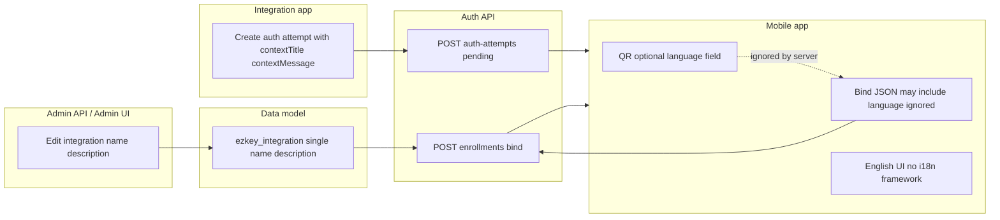

**Plan status:** Completed. Implementation and documentation alignment for bind `language` were delivered; this file is archived under `.cursor/plans/archived/2026-04/`.

# Bind `language`: consolidation alignment (completed)

## Decision (revised)

- **Now:** Documentation and clients match **what is implemented**: `POST /api/v1/enrollments/bind` accepts only `enrollmentId` and `enrollmentProofToken`. Integration display strings come from scalar `integration_name` / `integration_description` (post–V7 flatten); there is **no** server-side locale negotiation on bind.
- **Later:** A **future iteration** may reintroduce locale-aware behavior end-to-end. That is **out of scope** for this consolidation. Until then, **do not** add `language` to DTOs, OpenAPI annotations, or “reserved for future use” fields—those create the exact drift and over-engineering risk you want to avoid.

The original technical analysis in sections 1–6 below remains **accurate**; only the **recommended course of action** narrows to alignment, not partial protocol extension.

### Java DTOs: no `language` field to delete

**Clarification for the consolidation:** The Auth API bind **request** DTO ([`EnrollmentBindRequestDto`](ezkey-auth-api/src/main/java/org/ezkey/enrollment/dto/EnrollmentBindRequestDto.java)) and **response** DTO ([`EnrollmentBindResponseDto`](ezkey-auth-api/src/main/java/org/ezkey/enrollment/dto/EnrollmentBindResponseDto.java)) do **not** define a `language` property. The wire contract generated from the code is already two-field request / integration metadata response—there is **nothing to remove** from those DTOs as part of this alignment.

What drifts from reality is **elsewhere**: documentation and examples that still show `language` in the JSON body, **client** code that adds optional `language` to the POST body (ignored by Jackson), and **stale Javadoc** on controller/domain/mapper that still talk about bind-time language. The alignment work is **those** surfaces—not deleting a phantom field from `EnrollmentBindRequestDto`.

---

## Anti-goals (explicit)

- No **half-implementations**: e.g. documenting `language` as “ignored” while keeping it in normative examples everywhere.
- No **placeholder API fields** “for a future phase” on `EnrollmentBindRequestDto` or domain requests without a committed design.
- No **scope creep** into multi-locale data model or Admin UI translation matrices under the guise of “small follow-ups.”

---

## What stays pertinent from the earlier analysis

- **DTO / service:** Still only `enrollmentId` + `enrollmentProofToken`; bind builds `integrationName` / `integrationDescription` from [`Integration`](ezkey-core/src/main/java/org/ezkey/integration/domain/entity/Integration.java) scalars—see [`EnrollmentBindService`](ezkey-core/src/main/java/org/ezkey/enrollment/service/EnrollmentBindService.java).
- **History:** `ezkey_integration_i18n` was removed in V7; a bind `language` parameter no longer maps to stored variants.
- **Clients:** Mobile and CLI still send `language` in some paths; Jackson drops unknown properties—behavior is **no-op**, but **documentation and examples** still mislead integrators.

---

## Consolidation deliverables (recommended)

1. **Documentation:** Update [`docs/ENDPOINT.md`](docs/ENDPOINT.md), [`docs/MOBILE_DEVELOPER_GUIDE.md`](docs/MOBILE_DEVELOPER_GUIDE.md), and any other bind examples so the **normative** request body has two fields only. Fix Javadoc on [`EnrollmentController`](ezkey-auth-api/src/main/java/org/ezkey/auth/controller/EnrollmentController.java), [`EnrollmentBindResponse`](ezkey-core/src/main/java/org/ezkey/enrollment/domain/EnrollmentBindResponse.java), and [`EnrollmentAuthMapper`](ezkey-auth-api/src/main/java/org/ezkey/enrollment/mapper/EnrollmentAuthMapper.java) that still describe bind-time localization. Optionally add a **single** non-normative sentence in a “Future considerations” or product note that locale-aware bind is **not** part of the current contract (without specifying wire shape).
2. **Clients:** Prefer **removing** `language` from bind payloads and related QR/wizard/CLI plumbing so the codebase matches the wire contract—stronger integrity than “we send it but the server ignores it.”
3. **Postman collections (when relevant):** Whenever documented Auth API request/response examples or field lists change, review the matching collections under [`postman/collections/`](postman/collections/) (e.g. [`v2.1/EZ Key Enrollments auth.postman_collection.json`](postman/collections/v2.1/EZ%20Key%20Enrollments%20auth.postman_collection.json)). Align **request `raw` JSON**, item **descriptions** (body field bullets), and collection-level notes with [`docs/ENDPOINT.md`](docs/ENDPOINT.md) so integrators do not see obsolete fields such as `language` on bind. *This consolidation updated the Enrollments auth collection accordingly.*
4. **Future epic:** Record multi-locale product work separately (product + schema + API + admin + mobile). **Cancelled** as a todo in this plan—only tracked as deferred intent.

---

## 1. Refaire le constat (vérifié dans le repo)

**Contrat bind (Auth API)**

- [`EnrollmentBindRequestDto`](ezkey-auth-api/src/main/java/org/ezkey/enrollment/dto/EnrollmentBindRequestDto.java) exposes only `enrollmentId` and `enrollmentProofToken` (no `language`).
- Domain [`EnrollmentBindRequest`](ezkey-core/src/main/java/org/ezkey/enrollment/domain/EnrollmentBindRequest.java) matches: no language field.
- [`EnrollmentBindService`](ezkey-core/src/main/java/org/ezkey/enrollment/service/EnrollmentBindService.java) builds the bind response from `Integration.getName()` / `getDescription()` only; there is **no** branch on locale or request language.

**Comportement runtime avec un JSON contenant `language`**

- Spring/Jackson typically **ignores** unknown properties unless `FAIL_ON_UNKNOWN_PROPERTIES` is enabled (no project-wide override found). So mobile/CLI can send `language` without error; it is **dropped** and has **no effect**.

**Documentation et commentaires (dérive)**

- [`docs/ENDPOINT.md`](docs/ENDPOINT.md) (around the bind example) still shows `"language": "en"` in the request body.
- [`EnrollmentController#bind`](ezkey-auth-api/src/main/java/org/ezkey/auth/controller/EnrollmentController.java) Javadoc still refers to “language preference”.
- [`EnrollmentBindResponse`](ezkey-core/src/main/java/org/ezkey/enrollment/domain/EnrollmentBindResponse.java) and [`EnrollmentAuthMapper`](ezkey-auth-api/src/main/java/org/ezkey/enrollment/mapper/EnrollmentAuthMapper.java) Javadoc still describe localization “based on the language specified in the binding request” — **not** what the code does today.

**Clients qui envoient encore `language`**

- Mobile: [`ezkey_mobile/app/services/api/enrollments.ts`](ezkey_mobile/app/services/api/enrollments.ts) adds `language` to the body when set; [`EnrollmentWizardScreen.tsx`](ezkey_mobile/app/screens/EnrollmentWizard/EnrollmentWizardScreen.tsx) parses optional `language` from JSON QR payloads and carries it in wizard state.
- CLI: [`ezkey-cli-python/ezkey_cli/commands/auth.py`](ezkey-cli-python/ezkey_cli/commands/auth.py) sets `language` in the JSON body **and** `Accept-Language`, with a comment about “backward compatibility” — but **Auth API does not read `Accept-Language`** (grep shows no usage in `ezkey-auth-api`).

[`docs/MOBILE_DEVELOPER_GUIDE.md`](docs/MOBILE_DEVELOPER_GUIDE.md) and [`ezkey_mobile/docs/MOBILE_ARCHITECTURE.md`](ezkey_mobile/docs/MOBILE_ARCHITECTURE.md) should be checked for the same bind/QR language narrative (“API payloads accept locale overrides”).

---

## 2. Pourquoi `language` ressemble à un vrai élément du protocole

Historiquement, le schéma prévoyait une **internationalisation des intégrations** via une table dédiée (`ezkey_integration_i18n` dans [`V1__core_domain_and_multi_tenant.sql`](ezkey-core/src/main/resources/db/migration/V1__core_domain_and_multi_tenant.sql)). La migration [`V7__enrollment_auth_lifecycle_admin_tokens_and_demo.sql`](ezkey-core/src/main/resources/db/migration/V7__enrollment_auth_lifecycle_admin_tokens_and_demo.sql) **aplatit** le modèle: colonnes `integration_name` / `integration_description` sur `ezkey_integration`, backfill depuis i18n, puis **DROP** de `ezkey_integration_i18n`.

Conséquence produit: **il n’y a plus de sélection de variante linguistique côté serveur** pour le nom/description d’intégration. Un paramètre `language` au bind ne peut plus choisir une ligne i18n — la capacité données a été retirée.

L’entité [`Integration`](ezkey-core/src/main/java/org/ezkey/integration/domain/entity/Integration.java) aujourd’hui: `name` et `description` scalar uniquement.

---

## 3. Flux bout à bout (rôle réel de la “langue” aujourd’hui)

| Zone | Qui contrôle le texte “métier” affiché | Langue |
|------|----------------------------------------|--------|
| **Bind** (`integrationName` / `integrationDescription`) | Valeurs stockées sur l’intégration | Une seule chaîne chacune; pas de négociation |
| **Auth pending** (`contextTitle` / `contextMessage`) | Application intégrée lors de la création de la tentative | Quelle que soit la langue choisie par l’intégrateur |
| **UI mobile** | Code React Native | Pas de bibliothèque i18n dans [`package.json`](ezkey_mobile/package.json); expérience effectivement **monolingue** côté chrome UI |
| **Admin UI** | Opérateurs | i18n **admin** (`en`/`fr`) stocké en localStorage — **indépendant** des libellés bind/pending |

---

## 4. Rôle probable voulu pour le code langue (alors vs maintenant)

| Rôle plausible | Statut |
|----------------|--------|
| **Sélectionner nom/description d’intégration selon la langue** | **Obsolète** après flatten V7; le backend ne peut plus honorer ça sans réintroduire des données multi-locale |
| **Préférence utilisateur persistée** (pour UI mobile ou messages serveur futurs) | **Non implémentée**: aucune colonne enrollment/device “preferredLanguage” trouvée dans l’analyse ciblée |
| **Métadonnée QR** pour un futur client ou pour alignement marketing/docs | **Orpheline**: transmise par le client mais ignorée par l’API |

---

## 5. Impact intégration / enrollment / authentification

- **Enrollment bind**: impact **nul** sur la sécurité (preuve = `enrollmentId` + `enrollmentProofToken`). Impact **produit** uniquement: texte d’affichage d’intégration.
- **Enrollment verify**: pas de champ langue.
- **Auth attempts (pending/respond)**: pas de paramètre de langue; le texte contextuel est **déjà** dans la langue que l’intégration a mise dans `contextTitle` / `contextMessage`.

---

## 6. Capacités Admin UI

- Les admins **éditent déjà** le nom et la description d’intégration (une variante). Il n’existe pas, dans le modèle actuel, de **plusieurs** jeux de libellés par langue à maintenir dans l’UI.
- Une “préférence de langue utilisateur final” par enrollment **n’est pas** un concept exposé dans l’admin — et ne serait utile que si le mobile ou le serveur consommaient cette préférence.

---

## 7. (Deferred) Fonctionnel multi-locale “complet”

Référence pour une **future phase** uniquement—not actionable under this consolidation:

1. Données multi-locale pour les libellés d’intégration (ou politique de fallback).
2. API bind (ou autre) **conçue** pour la négociation de langue, avec tests et générateur OpenAPI.
3. Admin UI pour maintenir les variantes.
4. Mobile i18n si le produit l’exige.

**Do not** add DTO fields or “reserved” semantics until that epic is approved.

---

## 8. Synthèse (révisée)

- Le plan d’origine reste **techniquement pertinent**; l’orientation produit est maintenant **alignement + intégrité**, avec **locale serveur** explicitement **future**.
- **Livrable:** docs + commentaires + clients **sans** champ `language` sur le bind, sauf mention narrative optionnelle d’un futur travail **sans** figer de contrat.
- **Évité:** demi-protocole, champs fantômes, et sur-ingénierie sous prétexte de préparer l’avenir.
