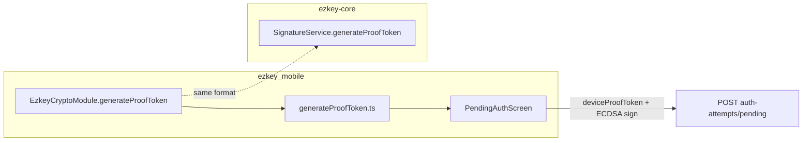

# Mobile `deviceProofToken`: align with `SignatureService.generateProofToken()`

## Implementation status

**Fully implemented and verified** — manual test of the pending flow succeeded on device after native rebuild.

**Final architecture (differs from the original polyfill sketch):** `deviceProofToken` randomness is produced in **`EzkeyCryptoModule.generateProofToken()`** (Android `SecureRandom`, iOS `SecRandomCopyBytes`), not via `react-native-get-random-values` / `RNGetRandomValues` (that path was removed after the native module was missing from the binary). [`ezkey_mobile/app/utils/generateProofToken.ts`](../../../../ezkey_mobile/app/utils/generateProofToken.ts) is a thin async delegate to native code.

## Scope

- **In scope:** `[ezkey_mobile](ezkey_mobile/)` only (reference mobile app).
- **Out of scope for now:** `[ezkey_mobile_app](ezkey_mobile_app/)` — new tree, not yet stabilized; copy the same `generateProofToken` pattern there in a **future** change once `ezkey_mobile` is the agreed baseline.

## Problem

`[ezkey_mobile/app/screens/PendingAuth/PendingAuthScreen.tsx](ezkey_mobile/app/screens/PendingAuth/PendingAuthScreen.tsx)` builds `deviceProofToken` with `Date.now().toString()`, which is predictable and contradicts `[docs/CRYPTO.md](docs/CRYPTO.md)` and the backend reference in `[ezkey-core/.../SignatureService.java](ezkey-core/src/main/java/org/ezkey/signature/SignatureService.java)` (`PROOF_TOKEN_RANDOM_BYTES = 32`, `PROOF_TOKEN_SALT_BYTES = 16`, URL-safe Base64 **without padding**, `randomPart + "." + saltPart`).

The Auth API does not parse token shape; it verifies ECDSA over the string and enforces hash uniqueness on claim (`[AuthAttemptPendingService#validateDeviceSignature](ezkey-core/src/main/java/org/ezkey/authattempt/service/AuthAttemptPendingService.java)`). Switching wire format is **backward-compatible** for the server.

## Canonical implementation (single reference)

Introduce **one** shared helper used everywhere a device proof token is needed in `ezkey_mobile`:

| Aspect       | Match Java                              |
| ------------ | --------------------------------------- |
| Random bytes | 32 + 16 (`Uint8Array`)                  |
| Encoding     | Base64 **URL** alphabet, **no padding** |
| Separator    | `.` between parts                       |

**Implementation approach (pragmatic, auditable):**

1. ~~Add dependency `**react-native-get-random-values`**~~ **Superseded:** random bytes are generated in **`EzkeyCryptoModule.generateProofToken()`** (platform CSPRNG).
2. `[ezkey_mobile/app/utils/generateProofToken.ts](ezkey_mobile/app/utils/generateProofToken.ts)` exports **`generateProofToken(): Promise<string>`** delegating to native; Javadoc points to `[docs/CRYPTO.md](docs/CRYPTO.md)`.

**Do not** add a second parallel API on `CryptoService` unless you explicitly want a facade; a single exported `generateProofToken` avoids “two ways” to generate tokens.

## Code changes (ezkey_mobile only)

1. New: `app/utils/generateProofToken.ts` (+ `__tests__/generateProofToken.test.ts`).
2. Update `[PendingAuthScreen.tsx](ezkey_mobile/app/screens/PendingAuth/PendingAuthScreen.tsx)`: replace `Date.now().toString()` with `await generateProofToken()`; adjust screen comments.
3. ~~`[index.js](ezkey_mobile/index.js)`: polyfill import~~ **Not used** — no `react-native-get-random-values` import.

**Out of scope for this token:** `[DiagnosticsScreen.tsx](ezkey_mobile/app/screens/Diagnostics/DiagnosticsScreen.tsx)` uses `Date.now()` inside a diagnostic payload (`TEST_PHRASE:...`) — different purpose; leave unless you want a follow-up to normalize diagnostic freshness separately.

## Tests

- **Unit tests** for `generateProofToken`: mock `NativeModules.EzkeyCryptoModule.generateProofToken`.
- **Jest setup:** stub `EzkeyCryptoModule` including `generateProofToken`.

`[authAttempts.test.ts](ezkey_mobile/app/services/api/__tests__/authAttempts.test.ts)` can stay unchanged (still passes opaque strings).

## Documentation (internal)

| File                                                                                           | Update                                                                                                                                                                                      |
| ---------------------------------------------------------------------------------------------- | ------------------------------------------------------------------------------------------------------------------------------------------------------------------------------------------- |
| `[docs/CRYPTO.md](docs/CRYPTO.md)`                                                             | Clarify under “Proof tokens” that **mobile** must call the same logical algorithm as `SignatureService.generateProofToken()` and reference the TS module path as the implementation anchor. |
| `[ezkey_mobile/docs/MOBILE_CRYPTO_REFERENCE.md](ezkey_mobile/docs/MOBILE_CRYPTO_REFERENCE.md)` | Device proof token: native `EzkeyCryptoModule` + TS wrapper.                                                                                                                               |
| `[ezkey_mobile/AGENTS.md](ezkey_mobile/AGENTS.md)`                                             | One bullet: pending flow uses `generateProofToken()` from `app/utils/` — do not invent alternate generators.                                                                                |

No edits to generated OpenAPI specs under `specs/` (string field unchanged).

## Validation

- `yarn lint`, `yarn typecheck`, `yarn test` from `[ezkey_mobile](ezkey_mobile/)` only.
- Manual smoke: pending flow — **done (success).**

## Summary diagram

## Follow-up (later)

When `ezkey_mobile_app` is ready, port the same `generateProofToken` utility and `PendingAuthScreen` wiring so both apps converge; until then, **`ezkey_mobile` is the sole reference implementation** for this algorithm.
