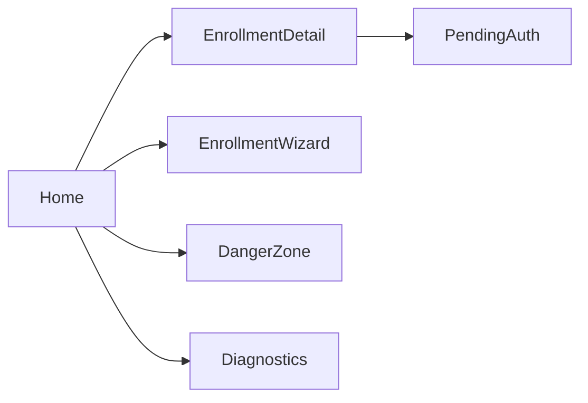

# Ezkey Mobile: UX alignment with publication-style Android patterns

## Context: what the app does today ([ezkey_mobile](ezkey_mobile/))

Core flows (unchanged in intent):

- **Home**: lists enrollments by tenant (`SectionList`), entry to detail, **Add** opens enrollment.
- **Enrollment**: `[EnrollmentWizardScreen.tsx](ezkey_mobile/app/screens/EnrollmentWizard/EnrollmentWizardScreen.tsx)` — guided multi-step “wizard” (QR → bind → challenge → verify → persist). Documented in `[ezkey_mobile/docs/MOBILE_ARCHITECTURE.md](ezkey_mobile/docs/MOBILE_ARCHITECTURE.md)`.
- **Enrollment detail / Pending auth**: user-initiated polling and approve/deny (pull model per `AUTH_SECURITY`).
- **Manage / Danger Zone**: `[DangerZoneScreen.tsx](ezkey_mobile/app/screens/DangerZone/DangerZoneScreen.tsx)` — per-enrollment delete with confirmations.
- **Diagnostics**: `[DiagnosticsScreen.tsx](ezkey_mobile/app/screens/Diagnostics/DiagnosticsScreen.tsx)` — native crypto smoke tests, build timestamp, enrollment list, and **Clear all data** (overlaps administratively with danger-zone-style cleanup).

Reference architecture (layer diagram): UI → hooks → React Query / Zustand → API + crypto + storage — see MOBILE_ARCHITECTURE.

## Is this feasible without “breaking everything”?

**Yes, if you separate shell UX from protocol logic.**

| Change type                                                         | Risk       | Notes                                                                                                                                        |
| ------------------------------------------------------------------- | ---------- | -------------------------------------------------------------------------------------------------------------------------------------------- |
| Theme tokens, spacing, app bar, FAB, Settings hub                   | **Low**    | No API/crypto contract changes.                                                                                                              |
| Navigation IA (replace header “Manage + Diagnostics” with Settings) | **Low**    | Map-only changes in `[AppNavigator.tsx](ezkey_mobile/app/navigation/AppNavigator.tsx)` + `[types.ts](ezkey_mobile/app/navigation/types.ts)`. |
| Remove or gate Diagnostics                                          | **Low**    | Delete screen or hide behind `__DEV__` / hidden gesture; move any **must-have** ops (e.g. “clear all”) into Danger Zone.                     |
| Reshape enrollment **UI** only (same `bind` / `verify` sequence)    | **Medium** | Keep call order identical to today; add regression tests around hooks/services.                                                              |
| Full merge with [ezkey_mobile_app](ezkey_mobile_app/)               | **High**   | Two trees diverged; not required for UX goals — **prefer porting patterns** (theme, Settings layout, FAB) into `ezkey_mobile`.               |

`[ezkey_mobile_app](ezkey_mobile_app/)` already demonstrates closer-to-store patterns: `[theme.ts](ezkey_mobile_app/app/config/theme.ts)`, gear → `[SettingsScreen](ezkey_mobile_app/app/screens/Settings/SettingsScreen.tsx)`, FAB on `[HomeScreen](ezkey_mobile_app/app/screens/Home/HomeScreen.tsx)`, simpler `[EnrollmentFlowScreen](ezkey_mobile_app/app/screens/EnrollmentFlow/EnrollmentFlowScreen.tsx)`. Palette is already aligned with `ezkey_mobile` (same dark base colors).

## What “Google Play–compatible UX” means here (scope)

- **In scope (UX/product)**: Predictable **Authenticator-like** IA — clear app title, one obvious **primary action** (add enrollment), **secondary** actions under **Settings** (about, licenses, danger zone), Material-appropriate touch targets, less “internal lab” chrome. This matches common published MFA apps’ mental model.
- **Out of scope for this UX plan (but real for listing)**: Play Console **policy** artifacts (privacy policy URL, Data safety form, content rating), **edge-to-edge** / Predictive back polish, screenshot/store listing — track as separate checklist items when you target production release.

## Recommended phased approach (all work in `ezkey_mobile`)

### Phase 1 — Design system shell (low risk)

- Add `[ezkey_mobile_app`-style](ezkey_mobile_app/app/config/theme.ts) `app/config/theme.ts` in `ezkey_mobile` (colors, spacing, typography, radii).
- Refactor `[HomeScreen](ezkey_mobile/app/screens/Home/HomeScreen.tsx)` to consume tokens; align header title with product name (e.g. “Ezkey Authenticator” or chosen store name).
- Optionally adopt **FAB** for “Add enrollment” (pattern from `ezkey_mobile_app`) and reduce duplicate titling (“Your Enrollments” vs inline “Enrollments”) for a cleaner hierarchy.

**Validation**: `yarn lint`, `yarn typecheck`, `yarn test`; manual smoke on Android (list, add, pending auth).

### Phase 2 — Settings hub and navigation cleanup (low risk)

- Introduce a **Settings** screen (port structure from `[ezkey_mobile_app` Settings](ezkey_mobile_app/app/screens/Settings/SettingsScreen.tsx)): rows for **Danger Zone**, **About**, **Open-source licenses** (minimal About/Licenses if not present in `ezkey_mobile` today — can be thin placeholders wired to existing license tooling if any).
- Replace Home header actions **Manage** + **Diagnostics** with a single **Settings** entry (icon or text) per `[AppNavigator](ezkey_mobile/app/navigation/AppNavigator.tsx)`.
- Update `[RootStackParamList](ezkey_mobile/app/navigation/types.ts)` accordingly.

**Validation**: navigation deep-links unchanged for core flows; Danger Zone still reachable.

### Phase 3 — Diagnostics vs Danger Zone (your simplification)

- **Default recommendation**: Remove **Diagnostics** from production navigation; if something is still needed for engineering, keep it only in `__DEV`__ or a hidden activation path.
- Move **“Clear all app data”** from `[DiagnosticsScreen](ezkey_mobile/app/screens/Diagnostics/DiagnosticsScreen.tsx)` into `[DangerZoneScreen](ezkey_mobile/app/screens/DangerZone/DangerZoneScreen.tsx)` (or a subsection) so **destructive actions stay one place**, with the same confirmation severity as deletes.
- If native crypto self-tests are still valuable occasionally, consider a single **“Run crypto self-test”** button under Settings → Advanced (optional, dev-only).

**Validation**: confirm no duplicate destructive entry points; run through delete-one vs clear-all once.

### Phase 4 (optional) — Enrollment experience: “wizard” → “flow”

- Only after Phases 1–3 are stable: refactor **presentation** of enrollment so it feels like a **single coherent flow** (similar to `[EnrollmentFlowScreen](ezkey_mobile_app/app/screens/EnrollmentFlow/EnrollmentFlowScreen.tsx)`) while **preserving** the same sequence: QR → `bind` → key ensure → challenge → `verify` → persist (per MOBILE_ARCHITECTURE).
- Keep shared logic in hooks/services; avoid duplicating `generateProofToken` / API clients.

**Validation**: extend or add Jest coverage for any extracted helpers; manual full enrollment on a clean device.

## What not to do (for this phase)

- **Do not** treat `[ezkey_mobile_app](ezkey_mobile_app/)` as the branch for protocol/crypto updates — it will drift again.
- **Do not** hand-edit OpenAPI specs in the main repo for mobile (N/A here; mobile consumes Auth API only).
- **Avoid** a big-bang UI rewrite in one PR; ship phase by phase.

## Success criteria

- Home matches a **standard authenticator** IA: list + primary add + settings.
- No competing “lab” entry points in the main chrome; Diagnostics gone or dev-gated.
- Danger Zone remains the **canonical** place for destructive operations, including optional clear-all.
- No regression in enrollment, pending auth, or storage semantics (verified by tests + manual Android pass).

## Completion record

This plan is **fully implemented** and **tested**. All phased todos in the frontmatter are `completed`. Verification included automated checks in `ezkey_mobile` (`yarn lint`, `yarn typecheck`, `yarn test`) and a manual Android pass on the primary flows aligned with the success criteria above.

