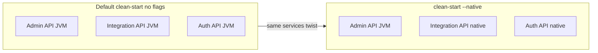

## Archive note - 2026-04-15

This plan was executed as a bounded spike and is archived for historical reference, not as an
active implementation target.

Outcome summary:

- Cleanup and rationalization work completed: Admin native support removed from the active strategy,
  Integration native parity added, native compose flow updated, Maven baseline revalidated.
- Auth API native image builds, but Docker runtime remains blocked in Hibernate/JPA bootstrap after
  advancing through `ObjectMapper`, Caffeine, and JBoss Logging gaps.
- Integration API native image builds, but Docker runtime remains blocked during
  `entityManagerFactory` creation with a Hikari/JPA startup failure.
- A final rebuild of Integration with `docker,native` active during AOT/build-image did not change
  the runtime result.

Decision:

- Treat native compilation as experimental only for the current stack.
- Use JVM for Admin API, Auth API, and Integration API in operational workflows.

Canonical reference:

- See `docs/NATIVE_INITIATIVE_STATUS_2026-04.md` for the April 2026 closure note and restart
  guidance.

# Native compilation: strategy and technical reset (Spring Boot 4)

## 1. Strategic framing (what is in / out)

**Non-goals (explicit):**

- **Admin API** ([`ezkey-admin-api`](ezkey-admin-api/pom.xml)): **Native compilation is a non-objective.** Do not leave partial native support in tree (no `*NativeConfiguration*`, no `META-INF/native-image` for admin, no compose entries or scripts advertising admin native images). That avoids signaling “admin might be native-ready” when the team has decided otherwise. A **hypothetical future** native path for admin is not a reason to keep dead scaffolding today—revisit only if requirements change.
- **Support / dev paths**: [`ezkey-migration`](ezkey-migration), [`ezkey-crypto-api`](ezkey-crypto-api) (and similar tooling) — **not** targets for native compilation unless a future requirement appears.
- **Chasing native for every module** — rejected as accidental complexity.

**Priority targets (aligned with your intent):**

- **Integration API** ([`ezkey-integration-api`](ezkey-integration-api/pom.xml)): M2M, API-key auth, high leverage for **serverless / small instances** and steady request paths.
- **Auth API** ([`ezkey-auth-api`](ezkey-auth-api/pom.xml)): Mobile-facing, high churn, same operational profile.

**Conclusion:** Your split (Integration + Auth = worth investment; **Admin = JVM only, no native artifacts**; tooling = non-target) is **sound and pragmatic** for **RSS reduction and cold-start density**, provided you accept that **JPA + Hibernate in native** remains the main technical risk (historically your blocker).

**Parity rule:** **Integration API** and **Auth API** should be brought to **the same native-compilation posture** — Maven profile, AOT steps, buildpack/native-plugin wiring, and hint strategy — with **Auth API** as the **template** Integration must match (module-specific `RuntimeHints` content will differ, but structure and tooling **must not** diverge ad hoc).

**Operational alignment (single native stack):**  
- **Native surfaces:** **Auth API** (authorization / mobile-auth) + **Integration API** + the **`docker-compose.native.yml`** definition — **one** native-oriented compose variant in the repo (no duplicate “native-lite” or alternate compose for the same role).  
- **Equivalence:** `./ezkey-tests/clean-start.sh --native` should behave as the **same functional stack** as `./ezkey-tests/clean-start.sh` **without** extra flags (same participating services, no HA, same operational posture), except **Auth + Integration** use pre-built **native** images instead of JVM.  
- **Confirm** pragmatic objectives already agreed: memory efficiency where it matters, minimal divergence between “default” and “native” developer paths.

---

## 2. Native vs AOT — clarify terms (and confirm your mental model)

| Concept | What it is | Role in Ezkey |
|--------|------------|----------------|
| **GraalVM `native-image`** | Compiles the app to a **native binary** | Primary lever for **lower baseline memory** vs JVM heap + metaspace |
| **Spring `process-aot` / Spring AOT** | Generates **Spring-specific** bytecode and context optimizations **before** `native-image` | Improves **startup**, **reachability**, and **compatibility** with Spring; often **required** for reliable native images with Spring Boot |
| **Paketo `BP_NATIVE_IMAGE`** | Tells the Java buildpack to run **`native-image`** in the build container | Preferred **CI/reproducible** path (no local Graal install) |

**Your understanding is directionally correct:** the **big win** for Ezkey’s goals is usually **RSS / footprint** from running a **native binary**, not raw request throughput. **Spring AOT** is not optional “nice to have” for Spring Boot native in practice—it is how Spring Boot **feeds** `native-image` with correct bean wiring and reflection metadata. What you can still **phase** is how much you rely on **custom** hints vs upstream metadata and how hard you push **Hibernate-specific** workarounds.

**Repo cleanup:** Remove [`scripts/build-native-admin.sh`](scripts/build-native-admin.sh) and any **admin** native build instructions. [`ezkey-auth-api/pom.xml`](ezkey-auth-api/pom.xml) and [`ezkey-integration-api/pom.xml`](ezkey-integration-api/pom.xml) (once updated) are the **paired** modules for **`process-aot` / `process-test-aot`** under `-Pnative`, kept at **parity**.

---

## 3. Java configuration (`RuntimeHints`) vs JSON vs `native-image.properties`

**Are they in competition?** Only if **the same** reflection/resource rules are duplicated. Technically they are **layers**:

- **[`RuntimeHintsRegistrar`](https://docs.spring.io/spring-framework/docs/current/javadoc-api/org/springframework/aot/hint/RuntimeHintsRegistrar.html) (Java)** — Spring’s **preferred** place for **application** reflection, resources, serialization, proxies. Type-safe, refactor-friendly, lives in code reviewed with the app (e.g. [`AuthNativeConfiguration`](ezkey-auth-api/src/main/java/org/ezkey/auth/config/AuthNativeConfiguration.java); **`IntegrationNativeConfiguration`** should follow the **same patterns** for integration-specific controllers/DTOs; **Admin API will not ship native hints** per §1).
- **`META-INF/native-image/**` JSON** — GraalVM **reachability metadata** format; still valid for **third-party** gaps, quick patches, or tooling-generated files.
- **`native-image.properties`** — **GraalVM build arguments** and flags **not expressible** via `RuntimeHints` (your own [`AuthNativeConfiguration`](ezkey-auth-api/src/main/java/org/ezkey/auth/config/AuthNativeConfiguration.java) Javadoc and [`native-image.properties`](ezkey-auth-api/src/main/resources/META-INF/native-image/org.ezkey/ezkey-auth-api/native-image.properties) already state this).

**Complementary?** **Yes:** Java hints for **what** to include; `native-image.properties` for **how** GraalVM builds (e.g. `--initialize-at-run-time`). JSON is **complementary** when you need vendor metadata or to avoid huge Java lists.

**Admin API:** **Delete** the entire native hint surface (Java + `META-INF` JSON under admin) as part of execution—no merge or dedupe; **removal** is the decision.

**Auth API:** JSON files exist as **`.disabled`** — hints live mainly in **Java** + **`native-image.properties`**; validate scripts like [`scripts/test-native-build.sh`](scripts/test-native-build.sh) still reference non-disabled JSON paths (stale expectations).

**Prioritization recommendation for this codebase:**

- **Prioritize Java `RuntimeHints`** for app and `ezkey-core`-visible types used in controllers/DTOs/mappers.
- **Keep `native-image.properties`** for Graal flags only.
- **Use JSON** sparingly: generated reachability from dependencies, or temporary until moved into Java.

---

## 4. Industry / “similar projects” snapshot (for decisions, not dogma)

- **Spring Boot + GraalVM native image** remains the **mainstream** path for existing Spring apps; **Paketo** + **`spring-boot:build-image`** is the **default** team story for **reproducible** builds without installing Graal locally.
- **Quarkus / Micronaut** optimize more aggressively for native, but **migrating Ezkey** would be a **different product effort**—only note as an **exit ramp** if Spring native + JPA proves unbounded cost (your “don’t over-invest” rule).
- **GraalVM reachability metadata repository** (already **enabled** in auth’s `native-maven-plugin` in [`ezkey-auth-api/pom.xml`](ezkey-auth-api/pom.xml)) reduces hand-written JSON for **libraries** — enable the **same** in Integration’s `native-maven-plugin` when adding its profile (**parity**).

---

## 5. State of the art in *this* repository (audit checklist)

| Area | Finding |
|------|--------|
| **Spring Boot** | [`pom.xml`](pom.xml) uses **`spring-boot.version` 4.0.5** (BOM). Child modules pin **`spring-boot-starter-security-test`** etc. to **4.0.5** where needed — aligned with the upgrade. |
| **Parent `native` profile** | Still sets Paketo builder, `BP_NATIVE_IMAGE`, and **`native.maven.plugin.version` 0.10.3** ([`pom.xml`](pom.xml) ~434–442). **Not** bumped by the general dependency modernization — **explicitly validate** against Native Build Tools release notes for Spring Boot **4.0.5** (bump if required). |
| **Related bumps (non-native-specific)** | Examples from current [`pom.xml`](pom.xml): **springdoc 3.0.3**, **bucket4j 8.18.0**, **license-maven-plugin 2.7.1**. These affect Auth/Integration stacks (OpenAPI UI, rate limiting); after native image work, **smoke-test** those paths — they may shift transitive reflection reachability slightly, but usually no new hand-written hints unless something fails at runtime. |
| **Auth API** | Full **`-Pnative`**: `process-aot`, `process-test-aot`, `native-maven-plugin` (with **`skip=true`** for local `native:compile` by default — buildpack path preferred). |
| **Admin API** | **Remove** all native-related sources: [`AdminNativeConfiguration`](ezkey-admin-api/src/main/java/org/ezkey/admin/config/AdminNativeConfiguration.java), [`META-INF/native-image/.../ezkey-admin-api/`](ezkey-admin-api/src/main/resources/META-INF/native-image/org.ezkey/ezkey-admin-api/), [`build-native-admin.sh`](scripts/build-native-admin.sh), and **admin native** service from [`docker-compose.native.yml`](docker/docker-compose.native.yml). Ensure nothing imports `@ImportRuntimeHints` for admin. |
| **Integration API** | **Today:** no native profile, no `*NativeConfiguration*`, not in native compose. **Target:** **parity with Auth API** for native (see §7.3 and todo `integration-native-profile`). |
| **Native compose** | **Single file:** [`docker-compose.native.yml`](docker/docker-compose.native.yml) — **edit in place**; do **not** introduce `docker-compose.native-integration-auth.yml` or similar. Target: **same** service graph as [`docker-compose.yml`](docker/docker-compose.yml); **JVM** admin (and other non-target services); **native** pre-built images for **Auth + Integration** only. |
| **Clean start** | [`ezkey-tests/clean-start.sh`](ezkey-tests/clean-start.sh) `--native` uses that **one** compose file; messaging should describe **Integration + Auth** native (not admin). Optional `--with-proxy` unchanged; same **functional** baseline as default clean-start aside from native **Auth + Integration**. |
| **Tests** | [`BootstrapCredentialsExtractor`](ezkey-tests/src/test/java/org/ezkey/tests/util/BootstrapCredentialsExtractor.java) mentions **`ezkey-admin-api-native`** — will need **revisit** if admin stays JVM in native mode. |

**Implications of the recent POM modernization (for this plan):**

- **Spring Boot 4.0.5** is now the **runtime baseline** for Hibernate, Spring Framework, and `spring-boot-maven-plugin` behavior during **`process-aot`** — you may get **different** small AOT/native outcomes vs 4.0.3/4.0.4; treat the next **`spring-boot:build-image -Pnative`** smoke as a **regression check**, not only a memory exercise.
- **General dependency work is largely done**; the plan’s **`pom-native-refresh`** todo is **narrowed** to **native-tooling** alignment (Graal NBT version, duplicate `buildArgs`, Paketo builder), not re-bumping the whole BOM.
- **Risk:** If **`native.maven.plugin.version`** lags behind what Spring Boot 4.0.5’s docs or Paketo’s native buildpack expect, local **`native:compile`** or metadata resolution can drift — **verify** when touching the profile.
- **No change** to strategic choices: Admin removal, Integration+Auth focus, compose parity — **unchanged**.

---

## 6. Buildpacks vs alternatives (pragmatic default)

- **Default for Ezkey:** stay on **`spring-boot:build-image`** + **Paketo** (`paketobuildpacks/builder-jammy-tiny` as today) with **`BP_NATIVE_IMAGE=true`**. This matches **CI**, **repeatability**, and **no Graal install** on developer machines.
- **Challengers:** local `native-maven-plugin` / GraalVM JDK for **debugging**; **Dockerfile + native-image** for exotic pipelines — use only if buildpack blocks you (rare with Spring Boot 4).
- **Action:** document this as the **canonical** path in [`docker/README.md`](docker/README.md) / [`ezkey-tests/README.md`](ezkey-tests/README.md) after profile cleanup.

---

## 7. POM / profile work plan

1. **Parent [`pom.xml`](pom.xml)**  
   - **Spring Boot BOM is already at 4.0.5** — no need to repeat a broad “upgrade Boot” step in this track.  
   - Reconcile **`native.maven.plugin.version`** (currently **0.10.3**) with the **Native Build Tools** version matrix for **Spring Boot 4.0.5** (bump if needed).  
   - Confirm **Paketo builder** tag still recommended (or pin to a known-good digest if you need stricter reproducibility).

2. **Auth API** ([`ezkey-auth-api/pom.xml`](ezkey-auth-api/pom.xml))
   - Review **`requiredVersion` 22.3** vs Graal version implied by buildpacks.
   - Re-evaluate **buildArgs** duplicated between POM and [`native-image.properties`](ezkey-auth-api/src/main/resources/META-INF/native-image/org.ezkey/ezkey-auth-api/native-image.properties) (single source of truth).
   - Align **`spring-boot-maven-plugin`** executions with the chosen **AOT strategy** (see §8).

3. **Integration API — parity with Auth API (required)**  
   - **Reference:** [`ezkey-auth-api/pom.xml`](ezkey-auth-api/pom.xml) `-Pnative` block (JUnit launcher test dep, `spring-boot-maven-plugin` executions for `process-aot` / `process-test-aot`, image `builder` + `BP_NATIVE_IMAGE`, `native-maven-plugin` version + `metadataRepository` + `skip` defaults + executions).  
   - **Match** that structure in [`ezkey-integration-api/pom.xml`](ezkey-integration-api/pom.xml); adjust only what Integration uniquely needs (e.g. security-test scope).  
   - Add **`IntegrationNativeConfiguration`** (`@ImportRuntimeHints`) for integration controllers/DTOs/mappers; reuse **shared** `ezkey-core` patterns consistently with Auth hints where types overlap.  
   - Add **`META-INF/native-image/.../native-image.properties`** for Integration **only** if Graal flags are required that Java cannot express (same rule as Auth).  
   - Optional: **`scripts/build-native-integration.sh`** mirroring [`build-native-aot.sh`](scripts/build-native-aot.sh) (core install → compile → process-aot) if MapStruct ordering issues appear.  

4. **Admin API**
   - **Complete removal** of native-image support (see §5 table and todo `remove-admin-native`): code, resources, Docker, scripts, docs, and test utilities that reference **`ezkey-admin-api-native`**. No retained “optional” profile—**JVM only** until a future explicit decision.

---

## 8. Phased technical approach (memory first, AOT second — with a cap)

**Phase A — Baseline native binary (goal: RSS)**
- Target **Integration + Auth** with Paketo native image, with **identical native toolchain posture** between the two APIs (§7.3 parity).
- Prefer **Spring `process-aot`** because Spring Boot **expects** it for native; measure **image size, RSS at idle, cold start**.

**Phase B — Spring AOT + JPA “good enough”**
- Time-box (e.g. **N days**). Track **build failures** and **runtime-only** `MissingReflectionConfig` classes.
- Use **reachability metadata** + **minimal** `native-image.properties` tweaks.
- If Hibernate/JPA issues dominate: **do not** expand scope to “fix everything”; fall back to **JVM** for that module or reduce Hibernate surface in native (larger refactor).

**Phase C — Optional experimental track (only if Phase B stalls)**
- Evaluate **newer Graal flags**, **Hibernate 7 / Spring Boot 4** behavior changes, or **community recipes**—not a framework rewrite unless product direction changes.

---

## 9. Docker / clean-start alignment (single compose, functional equivalence)

**Principle:** There is **one** native Docker Compose definition — [`docker/docker-compose.native.yml`](docker/docker-compose.native.yml). **Do not** add a second compose file for “native integration/auth” (e.g. no `docker-compose.native-integration-auth.yml`). All native-stack work **updates this file** so the project presents a **single, clear** operational story.

**Today:** [`docker-compose.native.yml`](docker/docker-compose.native.yml) is **not** yet equivalent to [`docker-compose.yml`](docker/docker-compose.yml) (e.g. missing **integration-api**; historically **admin** native — to be removed per §1).

**Target:** **`./clean-start.sh`** (no flags) and **`./clean-start.sh --native`** differ **only** where native images replace JVM for **Auth API** and **Integration API**; same overall stack (services, dependencies, no HA), aligned with **pragmatic operational** goals.

**Target architecture:**

**Concrete deliverables:**

- **Evolve** [`docker/docker-compose.native.yml`](docker/docker-compose.native.yml) **only** until it matches the **default** [`docker-compose.yml`](docker/docker-compose.yml) service set and wiring (including integration-api, admin-ui, bootstrap-init, caddy when `--with-proxy`, etc., as in the default file); **only** `auth-api` and `integration-api` reference **`...-native:latest`** (or equivalent) images; **admin-api** and other services use the **same JVM build targets** as the default compose.
- Update [`docker/start.sh`](docker/start.sh) and [`ezkey-tests/clean-start.sh`](ezkey-tests/clean-start.sh) help text, echo lines, and **build image** examples to reflect **Auth + Integration** native only — **no** admin native.
- Update [`BootstrapCredentialsExtractor`](ezkey-tests/src/test/java/org/ezkey/tests/util/BootstrapCredentialsExtractor.java) and any tests that assume **`ezkey-admin-api-native`** container names.

**Clean-start:** **`--native`** means “use [`docker-compose.native.yml`](docker/docker-compose.native.yml)” — **one** flag, **one** native compose variant, **functionally** the default stack with **native Auth + Integration**.

---

## 10. Validation

- **Maven:** root baseline per [`AGENTS.md`](AGENTS.md) after POM edits (`spotless:apply`, `checkstyle:check`, `clean`, `install -DskipTests`), then targeted **`mvn test`** for touched modules. Because the repo already moved to **Spring Boot 4.0.5**, any **native-profile** or **AOT** change should be validated on that baseline (not an older 4.0.x).
- **Native image smoke:** build images, run **`./ezkey-tests/clean-start.sh --native --with-proxy`**, hit health endpoints and one **integration + auth** flow (manual or a **small** smoke test).
- **Measure:** reuse [`scripts/measure-native-memory.sh`](scripts/measure-native-memory.sh) / document **before/after** RSS for JVM vs native for **Integration + Auth** only.

---

## 11. Documentation (minimal, high-signal)

- One short section (existing doc preferred, e.g. [`docs/OPERATIONAL.md`](docs/OPERATIONAL.md) or [`docker/README.md`](docker/README.md)): **non-goals** (Admin API = JVM), **native scope** (single [`docker-compose.native.yml`](docker/docker-compose.native.yml); Auth + Integration native only), **equivalence** to default clean-start, **build commands**, **AOT/JPA risk**, **when to stop investing**.

---

## 12. Admin API removal — scope reminder (execution checklist)

When implementing `remove-admin-native`, verify and adjust:

- **Spring wiring:** remove `@ImportRuntimeHints` / `AdminNativeConfiguration` from the admin application entrypoint if present.
- **Repo-wide grep:** `admin-api-native`, `ezkey-admin-api-native`, `AdminNativeConfiguration`, `build-native-admin`.
- **Memory scripts:** [`scripts/measure-native-memory.sh`](scripts/measure-native-memory.sh) / [`.ps1`](scripts/measure-native-memory.ps1) if they target admin.
