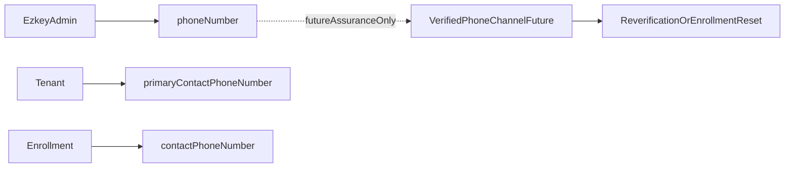

# Phone Number Management Plan

> Status note: This plan has been implemented.

## Objective

Add phone number support in Ezkey without making a false security claim that a stored phone number is already a verified possession factor. The immediate target is **contact data management** plus **clear operator UX copy**; any future use of phone as a security-assurance channel must remain a separate, stricter workflow.

## Current State

- Admin onboarding UI already shows a technology-preview note under the blue alert in `[ezkey-admin-ui/src/pages/admins.tsx](ezkey-admin-ui/src/pages/admins.tsx)`, before the proof token.
- Recovery UI uses the same visual pattern in `[ezkey-admin-ui/src/components/feature/login-recovery-section.tsx](ezkey-admin-ui/src/components/feature/login-recovery-section.tsx)`.
- That preview note placement still matches the current workflows: it remains a framing note around manual operator handling, not part of the future phone-number data model itself.
- The data model currently exposes email but no phone number for admins, tenant contacts, or enrollment contacts.
- Admins already support partial profile update through `[ezkey-admin-api/src/main/java/org/ezkey/admin/dto/request/AdminUpdateRequestDto.java](ezkey-admin-api/src/main/java/org/ezkey/admin/dto/request/AdminUpdateRequestDto.java)` and the matching controller/service flow.
- Enrollments already support contact metadata (`contactEmail`, `userIdentifier`) through `[ezkey-admin-api/src/main/java/org/ezkey/enrollment/dto/EnrollmentCreateRequestDto.java](ezkey-admin-api/src/main/java/org/ezkey/enrollment/dto/EnrollmentCreateRequestDto.java)` and `[ezkey-admin-api/src/main/java/org/ezkey/admin/dto/request/EnrollmentUpdateRequestDto.java](ezkey-admin-api/src/main/java/org/ezkey/admin/dto/request/EnrollmentUpdateRequestDto.java)`.
- Workflow clarification now confirmed:
  - **Admin MFA device replacement** uses recovery code + recovery token + `POST /api/v1/admin/enrollments/reset`.
  - **Non-admin enrollment device replacement** is not a reset flow; the product rule is **revoke the enrollment, then create a new one**.
- Initial binding does **not** need phone capture. It is acceptable to keep bootstrap and first binding unchanged, then let operators add or update phone numbers later through normal edit flows once the instance is running.

## Domain Recommendation

Use **three contact-phone fields**, each with a different purpose:

- `ezkey_admin.phone_number`: phone of the administrator as a person/operator; used for onboarding operations and future admin comms.
- `ezkey_enrollment.contact_phone_number`: phone of the end-user or device owner represented by the enrollment; symmetrical with existing `contact_email`.
- `ezkey_tenant.primary_contact_phone_number`: operational phone for the tenant’s primary contact.

Do **not** put a phone field on `auth_attempt` or in the QR payload.

Do **not** treat these new fields as proof that Ezkey has validated possession of that phone. They are contact coordinates only.

## Security Boundary

The key design rule is to avoid overloading one field with two meanings:

- **Contact phone**: editable metadata, useful for operators and future integrations.
- **Verified phone for assurance**: future security artifact, only valid if a dedicated verification flow exists.

Recommended policy for this work:

- Allow phone create/update/delete as normal metadata on admins, tenants, and enrollments.
- Audit every change with actor, target, timestamp, and masked before/after values.
- Keep the current enrollment-binding trust model unchanged: QR or proof token plus separate challenge plus device key verification.
- Explicitly document that if SMS later becomes part of the assurance model, changing the verified phone must require a controlled workflow, not a plain PATCH:
  - for **admin MFA**, align with the existing recovery/reset model or a future current-device-approved reverification flow;
  - for **general enrollments**, align with the current product rule: revoke the existing enrollment and create a new enrollment, rather than mutating cryptographic binding in place.
- Do **not** make phone mandatory for initial global admin bootstrap, first-run binding, or normal enrollment creation in this change. From a SOC 2 perspective, email and administrator identity remain the accountability anchor; phone is additive operational metadata.

## Data Format And Validation

Adopt one canonical storage format everywhere:

- Persist phone numbers as normalized **E.164** strings, for example `+15145551234`.
- Do not store spaces, parentheses, or local formatting in the database.
- Use nullable, non-unique columns.
- Display formatting can remain a UI concern later; persistence stays canonical.

Recommended DB rule for each new column:

- Type: `VARCHAR(20)`
- Constraint: `CHECK (phone_number IS NULL OR phone_number ~ '^\+[1-9][0-9]{7,14}$')`

Recommended application rule:

- Accept user input with common separators.
- Normalize to canonical E.164 before persistence.
- Reject values that cannot be normalized safely.

## Database Plan

Because the repository is still in full development mode, with no production installation and clean Docker restarts as the normal operating model, the database work should **edit the consolidated Flyway files in place** so they continue to represent the clean initial Ezkey schema.

### In-place migration edits

- Add `phone_number` to `[ezkey-core/src/main/resources/db/migration/V2__audit_api_keys_proof_tokens_and_admin_identity.sql](ezkey-core/src/main/resources/db/migration/V2__audit_api_keys_proof_tokens_and_admin_identity.sql)` beside the existing admin identity/contact fields.
- Add `primary_contact_phone_number` and `contact_phone_number` to `[ezkey-core/src/main/resources/db/migration/V5__operations_tenant_integration_enrollment.sql](ezkey-core/src/main/resources/db/migration/V5__operations_tenant_integration_enrollment.sql)` beside the existing tenant/enrollment contact fields.
- Add column comments and E.164 `CHECK` constraints in the same logical sections.
- Do not add indexes in the first pass unless list filtering/search by phone is part of the scope; there is no current evidence that indexing is needed.
- Keep the current migration découpage intact and enrich the existing logical sections instead of appending a new Flyway version for this feature.

## Backend Scope

### Entity and persistence layer

Update the contact model in:

- `[ezkey-core/src/main/java/org/ezkey/integration/domain/entity/EzkeyAdmin.java](ezkey-core/src/main/java/org/ezkey/integration/domain/entity/EzkeyAdmin.java)`
- `[ezkey-core/src/main/java/org/ezkey/integration/domain/entity/Tenant.java](ezkey-core/src/main/java/org/ezkey/integration/domain/entity/Tenant.java)`
- `[ezkey-core/src/main/java/org/ezkey/enrollment/domain/entity/Enrollment.java](ezkey-core/src/main/java/org/ezkey/enrollment/domain/entity/Enrollment.java)`

### API contract and validation

Extend create/read/update DTOs and OpenAPI annotations in:

- `[ezkey-admin-api/src/main/java/org/ezkey/admin/dto/request/AdminCreateRequestDto.java](ezkey-admin-api/src/main/java/org/ezkey/admin/dto/request/AdminCreateRequestDto.java)`
- `[ezkey-admin-api/src/main/java/org/ezkey/admin/dto/request/AdminUpdateRequestDto.java](ezkey-admin-api/src/main/java/org/ezkey/admin/dto/request/AdminUpdateRequestDto.java)`
- `[ezkey-admin-api/src/main/java/org/ezkey/admin/dto/response/AdminResponseDto.java](ezkey-admin-api/src/main/java/org/ezkey/admin/dto/response/AdminResponseDto.java)`
- `[ezkey-admin-api/src/main/java/org/ezkey/admin/dto/request/TenantCreateRequestDto.java](ezkey-admin-api/src/main/java/org/ezkey/admin/dto/request/TenantCreateRequestDto.java)`
- `[ezkey-admin-api/src/main/java/org/ezkey/admin/dto/request/TenantUpdateRequestDto.java](ezkey-admin-api/src/main/java/org/ezkey/admin/dto/request/TenantUpdateRequestDto.java)`
- Tenant response DTOs in the same package
- `[ezkey-admin-api/src/main/java/org/ezkey/enrollment/dto/EnrollmentCreateRequestDto.java](ezkey-admin-api/src/main/java/org/ezkey/enrollment/dto/EnrollmentCreateRequestDto.java)`
- `[ezkey-admin-api/src/main/java/org/ezkey/admin/dto/request/EnrollmentUpdateRequestDto.java](ezkey-admin-api/src/main/java/org/ezkey/admin/dto/request/EnrollmentUpdateRequestDto.java)`
- Enrollment response DTOs and mappers used by list/detail APIs

### Service/controller behavior

Update normalization and write paths in:

- `[ezkey-admin-api/src/main/java/org/ezkey/admin/service/AdminProvisioningService.java](ezkey-admin-api/src/main/java/org/ezkey/admin/service/AdminProvisioningService.java)`
- Admin provisioning/update controller methods in `[ezkey-admin-api/src/main/java/org/ezkey/admin/controller/AdminProvisioningController.java](ezkey-admin-api/src/main/java/org/ezkey/admin/controller/AdminProvisioningController.java)`
- Tenant service/controller flow
- Enrollment service/controller flow

## Audit And Compliance

Phone changes are security-relevant operationally even if they are not yet authentication factors. The plan should therefore tighten audit behavior.

Recommended audit rule:

- Keep full phone values in the business tables.
- In audit `event_details`, store only masked values, for example `+1******1234`.
- Record field-level diffs for create/update flows where practical.

### Pragmatic SOC 2 alignment

The minimal normative posture for this change should be:

- **No false assurance claim**: storing a phone number must not be described as proving possession of that device or phone line.
- **Least necessary data**: keep the field optional and scoped to the entities that already own contact metadata.
- **Auditability**: log who changed the phone number, when, and for which entity, with masked values only.
- **Access control**: phone visibility and edit rights should follow the same RBAC and tenant scoping already used for admin, tenant, and enrollment contact data.
- **No accidental secret sprawl**: do not copy full phone numbers into audit logs, error messages, QR payloads, or transient security artifacts.
- **No accidental workflow coupling**: do not bind phone edits to cryptographic enrollment state in this phase.

With those guardrails, there is no strong SOC 2 concern that would require making phone mandatory at bootstrap or introducing a heavier reverification workflow now.

Concrete work:

- Extend `[ezkey-admin-api/src/main/java/org/ezkey/admin/constants/AdminAuditConstants.java](ezkey-admin-api/src/main/java/org/ezkey/admin/constants/AdminAuditConstants.java)` usage so admin and tenant updates include structured details, not only a generic message.
- Preserve the existing structured `changes` pattern already described for enrollment updates in `[docs/ENDPOINT.md](docs/ENDPOINT.md)`.
- Ensure phone updates remain visible in the audit log for SOC 2 review without leaking unnecessary PII into logs.

## Admin UI Scope

### Immediate copy/UI adjustment

Update `[ezkey-admin-ui/src/pages/admins.tsx](ezkey-admin-ui/src/pages/admins.tsx)`:

- Keep the note directly under the blue `alertShare` box and before the proof token.
- Use the same visual treatment as recovery: `text-xs`, left border, subdued explanatory copy.
- Adjust EN/FR copy in:
  - `[ezkey-admin-ui/src/locales/en/admins.json](ezkey-admin-ui/src/locales/en/admins.json)`
  - `[ezkey-admin-ui/src/locales/fr/admins.json](ezkey-admin-ui/src/locales/fr/admins.json)`
  - `[ezkey-admin-ui/src/locales/en/login.json](ezkey-admin-ui/src/locales/en/login.json)`
  - `[ezkey-admin-ui/src/locales/fr/login.json](ezkey-admin-ui/src/locales/fr/login.json)`

The copy should say that Ezkey does **not** already have the phone number in this flow; operators must send the binding challenge by SMS through their usual channel. This remains a wording correction and does not change the broader phone-number implementation plan.

### Data capture and modification

Expose phone data where it is already natural in the UI:

- Admin create/detail/edit in `[ezkey-admin-ui/src/pages/admins.tsx](ezkey-admin-ui/src/pages/admins.tsx)`
- Tenant create/edit/detail in `[ezkey-admin-ui/src/pages/tenants.tsx](ezkey-admin-ui/src/pages/tenants.tsx)` and `[ezkey-admin-ui/src/pages/tenant-detail.tsx](ezkey-admin-ui/src/pages/tenant-detail.tsx)`
- Enrollment create/edit/detail in `[ezkey-admin-ui/src/pages/enrollments.tsx](ezkey-admin-ui/src/pages/enrollments.tsx)` and `[ezkey-admin-ui/src/pages/enrollment-detail.tsx](ezkey-admin-ui/src/pages/enrollment-detail.tsx)`

UI validation should mirror backend normalization rules and keep full EN/FR parity.

## Delivery Strategy

### Phase 1

- Keep onboarding/recovery preview copy accurate, but treat it as a small wording adjustment rather than a driver of the phone-number architecture.
- Add admin phone number end to end.
- Add masked audit details for admin phone changes.
- Keep bootstrap and initial binding unchanged; first phone capture happens through standard edit/create flows after startup.

### Phase 2

- Add tenant primary contact phone and enrollment contact phone end to end.
- Update list/detail/create/edit screens where those entities already expose contact metadata.

### Phase 3

- Document the future verified-phone path explicitly: once SMS is an assurance factor, phone replacement must become a controlled workflow aligned with enrollment reset or device-approved re-verification.

## Verification

Use focused validation rather than broad churn:

- Backend tests for normalization, invalid format rejection, optimistic locking, and authorization on update.
- Audit assertions that masked phone diffs appear and full values do not leak into logs.
- UI checks for create/display/edit paths and onboarding note placement.
- Lint/typecheck for touched admin UI files.

## Out Of Scope For This Change

- Automated email or SMS delivery integrations.
- Using the stored phone number as a verified possession factor.
- Changing QR payloads or auth/enrollment cryptographic protocol.
- Editing generated OpenAPI spec files under `specs/`; only Java DTOs/annotations should change.

