# Postman enrollment collection revision (cryptographic chaining)

## Problem statement

The current [EZ Key Enrollments auth](postman/collections/v2.1/EZ%20Key%20Enrollments%20auth.postman_collection.json) sequence fails after the enrollment hardening because **step 3** signs only the raw `enrollmentProofToken` via `POST /api/v1/crypto/sign`. The Auth API now validates `enrollmentProofTokenSigned` as **ECDSA-SHA256 over the canonical verify-device string** (UTF-8):

`{enrollmentProofToken}|{enrollmentId}|{challengeResponse}|{devicePublicKey}`

per [docs/ENROLLMENT_SIGNATURE_PAYLOAD.md](docs/ENROLLMENT_SIGNATURE_PAYLOAD.md) and [docs/MOBILE_DEVELOPER_GUIDE.md](docs/MOBILE_DEVELOPER_GUIDE.md) (see “Signature scope (verify)” and verify section).

The collection is also **missing** the integration signature checks that the mobile protocol requires:

- After **bind**: verify `enrollmentBindPayloadSignedByIntegration` (Ed25519) over the canonical bind payload before trusting the response ([EnrollmentBindResponse.java](ezkey-core/src/main/java/org/ezkey/enrollment/domain/EnrollmentBindResponse.java)).
- After **verify**: verify `enrollmentVerifyPayloadSignedByIntegration` over the canonical verify-result payload ([EnrollmentVerifyResponseDto](ezkey-auth-api/src/main/java/org/ezkey/enrollment/dto/EnrollmentVerifyResponseDto.java)).

Reference pattern: [EZ Key Auth Attempts auth](postman/collections/v2.1/EZ%20Key%20Auth%20Attempts%20auth.postman_collection.json) uses **payload-helper → verify-ed25519 → device sign → Auth API → payload-helper → verify-ed25519**.

## Gap in Crypto API

[`CryptoController.buildPayload`](ezkey-crypto-api/src/main/java/org/ezkey/crypto/controller/CryptoController.java) only handles `pending`, `respond`, and `respond-result`. There is **no** helper for enrollment payloads, while the canonical rules already exist in [`EnrollmentSignaturePayload`](ezkey-core/src/main/java/org/ezkey/enrollment/service/EnrollmentSignaturePayload.java). `ezkey-crypto-api` already depends on `ezkey-core`, so delegating to that class avoids duplicating NFC and pipe rules in Postman JavaScript.

```mermaid
flowchart LR
  bind[1_bind]
  bindPayload[2_build_bind_payload]
  bindVerify[3_verify_bind_ed25519]
  keypair[4_keypair]
  devPayload[5_build_verify_device_payload]
  devSign[6_sign_verify_device]
  verify[7_auth_verify]
  resPayload[8_build_verify_result_payload]
  resVerify[9_verify_result_ed25519]
  bind --> bindPayload --> bindVerify --> keypair --> devPayload --> devSign --> verify --> resPayload --> resVerify
```

## Implementation plan

### 1. Extend Crypto API `payload-helper` for enrollment

- Update [`PayloadHelperRequestDto`](ezkey-crypto-api/src/main/java/org/ezkey/crypto/dto/PayloadHelperRequestDto.java) with optional fields needed for enrollment builders (e.g. `enrollmentId`, `challengeResponse`, `devicePublicKey`, integration/tenant text fields, `verifyOutcome` / `verifyMessage` as appropriate). Keep backward compatibility for existing `pending`/`respond`/`respond-result` requests.
- In `CryptoController.buildPayload`, add `switch` cases (names to align with docs, e.g. `enrollment-bind`, `enrollment-verify-device`, `enrollment-verify-result`) that call:
  - `EnrollmentSignaturePayload.buildBindPayload(...)`
  - `EnrollmentSignaturePayload.buildVerifyDevicePayload(...)`
  - `EnrollmentSignaturePayload.buildVerifyResultPayload(...)` (map outcome string to `EnrollmentVerificationOutcome`)
- Add/adjust unit tests in [`CryptoControllerTest`](ezkey-crypto-api/src/test/java/org/ezkey/crypto/controller/CryptoControllerTest.java) for the three new types (happy path + validation errors for missing fields).
- Update Crypto API README/AGENTS notes only if they document `payload-helper` types (minimal delta).

### 2. Revise Postman collection `EZ Key Enrollments auth`

Renumber requests so folder order matches execution order (leading digit + space, same style as Auth Attempts):

| Step | Request | Purpose |
|------|---------|---------|
| 1 | `bind` | Auth API; **test script**: persist all fields required for bind-payload build and Ed25519 verification (`enrollmentBindPayloadSignedByIntegration`, `integrationPublicKey`, tenant/integration display fields, `enrollmentProofToken`, `enrollmentId`, etc.) |
| 2 | `crypto build enrollment bind payload` | `POST payload-helper` with `type: enrollment-bind` → env e.g. `enrollmentBindPayload` |
| 3 | `crypto validate enrollment bind by integration` | `POST verify-ed25519` with `data` = `enrollmentBindPayload`, `signature` = `enrollmentBindPayloadSignedByIntegration`, `publicKey` = `integrationPublicKey` |
| 4 | `crypto generate device keypair` | Same as today; sets `device_privateKey` / `device_publicKey` |
| 5 | `crypto build enrollment verify device payload` | `payload-helper` `type: enrollment-verify-device` using `enrollmentProofToken`, `enrollmentId`, `enrollmentChallenge` (env), `device_publicKey` → env `enrollmentVerifyDevicePayload` |
| 6 | `crypto sign enrollment verify device payload` | `POST /sign` with `data: {{enrollmentVerifyDevicePayload}}` (not raw token) → env for `enrollmentProofTokenSigned` |
| 7 | `verify` | Auth API; body uses canonical signature from step 6; optional `devicePrivateKeyStorageTier` unchanged |
| 8 | `crypto build enrollment verify result payload` | `payload-helper` `type: enrollment-verify-result` using proof token, `enrollmentId`, outcome `VERIFIED`, `enrollmentVerifyMessage` from step 7 response → env `enrollmentVerifyResultPayload` |
| 9 | `crypto validate enrollment verify result by integration` | `verify-ed25519` on result payload vs `enrollmentVerifyPayloadSignedByIntegration` |

**Scripts and ergonomics** (match Auth Attempts patterns):

- **Prerequest** guards where needed (e.g. step 3 requires `enrollmentBindPayload` from step 2; step 9 requires step 8), similar to “Run step 3b first” in Auth Attempts.
- **Environment variables**: introduce stable names (`enrollmentBindPayload`, `enrollmentVerifyDevicePayload`, `enrollmentVerifyResultPayload`, signatures) and deprecate/remove the misleading `enrollment_proofkey_signature` naming.
- **Collection `info.description`**: Replace the obsolete “Sign Token: sign only enrollment proof token” narrative with pointers to [ENROLLMENT_SIGNATURE_PAYLOAD.md](docs/ENROLLMENT_SIGNATURE_PAYLOAD.md) and the parallel Auth Attempts collection.

**Prerequisite**: `enrollmentChallenge` (and existing `enrollmentId` / `enrollmentProofToken` from Admin enrollment creation) must be present in the Postman environment before running the flow—document this in the bind/verify request descriptions.

### 3. Validation

- Manual: import updated collection + local environment with `base_url` / `base_url_crypto_api`; run steps 1–9 against a clean-start stack; confirm 200 on bind/verify and `valid: true` on both Ed25519 checks.
- Automated: `mvn test -pl ezkey-crypto-api` after payload-helper changes.

### 4. Remove legacy Postman testing plan document

- Delete [docs/testing/POSTMAN_COLLECTIONS_UPDATE_PLAN.md](docs/testing/POSTMAN_COLLECTIONS_UPDATE_PLAN.md) (superseded legacy multi-tenancy Postman notes; the enrollment work is covered by this plan and the updated collection itself).
- Search the repository for references to that path or filename; remove or replace links (e.g. in `README.md`, `docs/`, or internal indexes) so nothing points to a removed file.

## Out of scope

- Editing generated OpenAPI files under `specs/` (maintainer runs `update-specs` after API changes).
