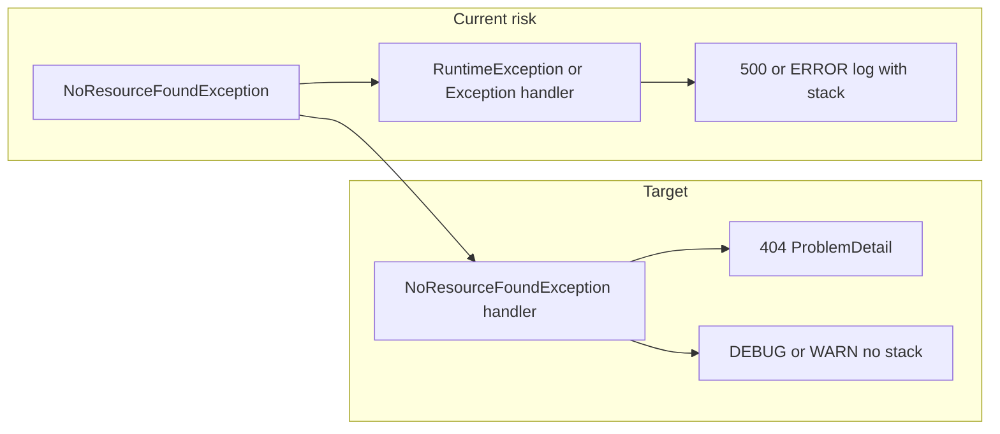

# Quiet handling for missing routes (404) without ERROR noise

**Implementation status:** **Completed** (2026-04-18). Canonical archived copy: `.cursor/plans/archived/2026-04/quiet_404_exception_handling_08a688b4.plan.md`.

## Completion summary (what shipped)

- **`ezkey-admin-api`:** [`GlobalExceptionHandler`](../../../../ezkey-admin-api/src/main/java/org/ezkey/exception/GlobalExceptionHandler.java) handles `NoResourceFoundException` and `NoHandlerFoundException` → 404 `ProblemDetail`; DEBUG-only logging; [`AdminApiProblemCatalog.DETAIL_NOT_FOUND`](../../../../ezkey-admin-api/src/main/java/org/ezkey/exception/AdminApiProblemCatalog.java). Unit tests: [`GlobalExceptionHandlerNotFoundMvcTest`](../../../../ezkey-admin-api/src/test/java/org/ezkey/exception/GlobalExceptionHandlerNotFoundMvcTest.java).
- **`ezkey-auth-api`:** [`GlobalExceptionHandler`](../../../../ezkey-auth-api/src/main/java/org/ezkey/exception/GlobalExceptionHandler.java) same pattern with [`AuthApiProblemCatalog`](../../../../ezkey-auth-api/src/main/java/org/ezkey/exception/AuthApiProblemCatalog.java). Tests: [`GlobalExceptionHandlerNotFoundMvcTest`](../../../../ezkey-auth-api/src/test/java/org/ezkey/exception/GlobalExceptionHandlerNotFoundMvcTest.java).
- **`ezkey-integration-api`:** [`GlobalExceptionHandler`](../../../../ezkey-integration-api/src/main/java/org/ezkey/integration/api/exception/GlobalExceptionHandler.java); avoids catch-all `Exception` logging these at ERROR. Tests: [`GlobalExceptionHandlerNotFoundMvcTest`](../../../../ezkey-integration-api/src/test/java/org/ezkey/integration/api/exception/GlobalExceptionHandlerNotFoundMvcTest.java).
- **Demo apps:** [`QuietNotFoundExceptionHandler`](../../../../ezkey-demo-app-acme/src/main/java/org/ezkey/demo/acme/exception/QuietNotFoundExceptionHandler.java) (Acme), same class under `ezkey-demo-device`; tests [`QuietNotFoundExceptionHandlerTest`](../../../../ezkey-demo-app-acme/src/test/java/org/ezkey/demo/acme/exception/QuietNotFoundExceptionHandlerTest.java) / device equivalent.
- **`ezkey-crypto-api`:** Explicitly out of scope (internal dev tool).

No new configuration properties or `CONFIGURATION.md` tables (hard-coded behavior; operators may tune `logging.level.*` globally).

---

## Problem statement

Internet scanners hit non-existent paths (`/wp-admin`, `/.env`, random probes). On Spring Boot 3+/4+ with MVC, unknown static/resource paths often surface as [`NoResourceFoundException`](https://docs.spring.io/spring-framework/docs/current/javadoc-api/org/springframework/web/servlet/resource/NoResourceFoundException.html) (extends `RuntimeException`). If the app only has broad handlers such as `@ExceptionHandler(RuntimeException.class)` or `@ExceptionHandler(Exception.class)` that log with the throwable (full stack) at **ERROR**, those harmless probes pollute logs and paging.

Pre-implementation baseline (historical context):

- There was **no** `NoResourceFoundException` / `NoHandlerFoundException` handling in Java (addressed by the completion summary above).
- **[`ezkey-integration-api/.../GlobalExceptionHandler.java`](c:/github/ezkey/ezkey-integration-api/src/main/java/org/ezkey/integration/api/exception/GlobalExceptionHandler.java)** catch-all `Exception` logs `logger.error("Unhandled exception...", ex)` — any unhandled `NoResourceFoundException` would produce **ERROR + stack**.
- **[`ezkey-auth-api/.../GlobalExceptionHandler.java`](c:/github/ezkey/ezkey-auth-api/src/main/java/org/ezkey/exception/GlobalExceptionHandler.java)** `RuntimeException` / `Exception` handlers log **ERROR** with the throwable (unless path is `/actuator/`).
- **[`ezkey-admin-api/.../GlobalExceptionHandler.java`](c:/github/ezkey/ezkey-admin-api/src/main/java/org/ezkey/exception/GlobalExceptionHandler.java)** maps `RuntimeException` → **500** without logging — a `NoResourceFoundException` caught there would be **wrong status (500)** as well as inconsistent with REST semantics.

**Crypto API** ([`CryptoGlobalExceptionHandler`](c:/github/ezkey/ezkey-crypto-api/src/main/java/org/ezkey/crypto/controller/CryptoGlobalExceptionHandler.java)): same broad `RuntimeException`/`Exception` pattern; **exclude** from this work per product boundary (internal/dev tool).

## How similar projects usually solve this (short industry view)

| Approach | Pros | Cons |
|----------|------|------|
| **Dedicated `@ExceptionHandler(NoResourceFoundException.class)`** returning 404 + optional DEBUG/WARN | Correct HTTP status, full control, works with existing `ProblemDetail` style | Some duplication across modules (accepted; see below) |
| **Extend `ResponseEntityExceptionHandler`** | Spring-native defaults for many MVC exceptions | Ezkey does not use this pattern today; migration is wider than needed |
| **Logging config only** (e.g. tune `org.springframework.web.servlet.*` / `DispatcherServlet`) | Quick | Does not fix wrong 500 mapping; may hide useful framework diagnostics |
| **Edge/proxy rules** (block common probe paths) | Reduces load | Not a substitute for sane app-level 404 handling |

**Recommendation for Ezkey:** stay aligned with existing **RFC 9457 `ProblemDetail` + per-module `*ProblemCatalog`** pattern ([`ezkey-admin-api` handlers](c:/github/ezkey/ezkey-admin-api/src/main/java/org/ezkey/exception/), [`AuthApiProblemCatalog`](c:/github/ezkey/ezkey-auth-api), [`Integration` handler style](c:/github/ezkey/ezkey-integration-api/src/main/java/org/ezkey/integration/api/exception/GlobalExceptionHandler.java)). Add **two narrow handlers** before any `RuntimeException` / `Exception` catch-all:

1. `NoResourceFoundException` → **404**, log at a **fixed** level chosen in code (typically **DEBUG**, or a single **WARN** line without throwable — pick one convention and apply it consistently in each handler).
2. Optionally `NoHandlerFoundException` → **404**, same logging rule — **only if** you confirm it is actually thrown in your stack (depends on `spring.mvc.*` / Boot version defaults). Verify with one integration test or a manual `curl` to an unknown API path.

**Decision: no configuration / parameterization for this feature.** Do **not** add `@ConfigurationProperties`, new `application*.yml` keys, or [`CONFIGURATION.md`](c:/github/ezkey/docs/configuration/README.md) tables for log level or “quiet 404” toggles. Behavior stays **hard-coded** in the exception handlers; operators who need different verbosity already have generic tools (`logging.level.*` in Spring Boot) without Ezkey-specific knobs.

**Not masking real issues:** framework "no route" 404s are indistinguishable from a bad client calling a removed API — both are **404**. Real server bugs still surface as **5xx** via other exceptions. Optional follow-up: structured metrics (counter of 404s by path prefix) without ERROR logs — only if observability needs it.

## Scope (modules)

| Module | Action |
|--------|--------|
| [`ezkey-admin-api`](c:/github/ezkey/ezkey-admin-api) | Add handlers + reuse `AdminApiProblemCatalog` "not found" style for unknown routes |
| [`ezkey-auth-api`](c:/github/ezkey/ezkey-auth-api) | Add handlers + safe `ProblemDetail` from `AuthApiProblemCatalog` (no raw exception message to client for consistency with AGENTS.md) |
| [`ezkey-integration-api`](c:/github/ezkey/ezkey-integration-api) | Add handlers + `ProblemDetail` consistent with existing `buildProblemDetail` |
| [`ezkey-demo-app-acme`](c:/github/ezkey/ezkey-demo-app-acme), [`ezkey-demo-device`](c:/github/ezkey/ezkey-demo-device) | Add a **small** `@RestControllerAdvice` per app (duplicated ~10–20 lines; keeps tests local and simple) |
| [`ezkey-crypto-api`](c:/github/ezkey/ezkey-crypto-api) | **Out of scope** |

## Implementation sketch (per API module)

1. Import `org.springframework.web.servlet.resource.NoResourceFoundException` and optionally `org.springframework.web.servlet.NoHandlerFoundException`.
2. Add `@ExceptionHandler(NoResourceFoundException.class)` returning `ResponseEntity<ProblemDetail>` with `HttpStatus.NOT_FOUND`, `path` property set (same as existing helpers).
3. **Logging:** `LOG.debug("No resource for {} {}", request.getMethod(), path)` or `LOG.warn("Not found: {}")` **without** passing `ex` as the last argument (avoids stack). Do **not** use `LOG.error` here.
4. Repeat for `NoHandlerFoundException` if validated.
5. Ensure handler **precedence** is correct: Spring picks the most specific `@ExceptionHandler`; placing these methods in the same advice class **before** `RuntimeException`/`Exception` methods is good practice for readability (and matches resolution order).

## Decision: no shared `ezkey-core` helper (explicit duplication)

**Do not** introduce a cross-module DRY helper for this (no `HttpNotFoundAdviceSupport` in `ezkey-core`, no extra conditional wiring to keep crypto-api untouched).

**Rationale:** a little duplication is **intentional** — it keeps each module’s exception handling and tests **self-contained**, avoids new dependencies and `@ConditionalOn*` edge cases, and the savings are only ~15 lines per app. Treating this as a **premature abstraction** is not worth it here; copy the same pattern into each `GlobalExceptionHandler` / demo advice class with module-appropriate `ProblemDetail` / catalog text.

## Verification

- **Unit / slice test** (preferred placement: each module’s `src/test/java`): `MockMvc` GET to `/this-route-does-not-exist` → **404**, body `application/problem+json` where the API already uses it.
- Optional: Logback `ListAppender` asserting **no ERROR** log from your global handler for that request (fragile if other components log — use as a secondary check).
- Run the standard Maven baseline from repo root after Java changes ([`AGENTS.md`](c:/github/ezkey/AGENTS.md) / [`maven-build.mdc`](c:/github/ezkey/.cursor/rules/maven-build.mdc)).

## Documentation

- **No `CONFIGURATION.md` changes** for this work (by design: no new properties).
- Optional: one short sentence in the relevant **`AGENTS.md`** error-handling section that unknown-route 404s are handled quietly — only if it helps future maintainers; skip if redundant.

