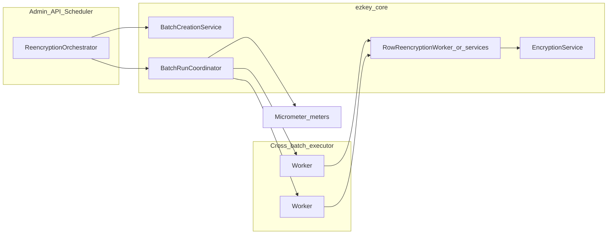

# Re-encryption pipeline: refactor, parallelism, observability

**Implementation status:** **Completed.** This file is the archived copy under [`.cursor/plans/archived/2026-04/`](.). Runtime tuning (e.g. bounded parallel workers, per-`target_table` isolation for concurrent batches, documented in `docs/REENCRYPTION_OPERATIONS.md`) was validated for acceptable performance on large row volumes.

## Goals (aligned with your framing)

- **Decompose** [`ezkey-core/.../ReencryptionService.java`](ezkey-core/src/main/java/org/ezkey/security/ReencryptionService.java): orchestration, batch creation, row work units, crypto boundaries, and persistence/locking in **separate, testable** types; eliminate **`self`** as the primary transaction boundary by moving `REQUIRES_NEW` work behind **injected collaborators** (separate `@Service` beans).
- **Parallelism (first milestone):** **cross-batch only** — you selected: never two concurrent workers on the **same** logical migration `(target_table, target_column, old_key_id)`; parallelize **distinct** batches (e.g. different columns/tables or different batch rows). This limits lock contention and reasoning complexity while still improving throughput when many batches exist.
- **Observability:** operators must infer **progress without SQL** — build on [`GET /api/v1/encryption-keys/reencryption-batches`](ezkey-admin-api/src/main/java/org/ezkey/admin/controller/EncryptionKeyController.java) and [`ezkey-admin-ui/src/pages/encryption-keys.tsx`](ezkey-admin-ui/src/pages/encryption-keys.tsx) (already shows `progressPct`, counts). Add **runtime metrics** (throughput, active workers, batch duration) and ensure UI can **poll** or **invalidate** consistently.
- **Resilience at scale** (hundreds → millions of rows): bounded queues, back-pressure, clear failure semantics per batch, no unbounded in-memory fan-out.
- **JPA/SQL:** keep transactions **short**; recognize that **ciphertext transform runs in Java** — “batch SQL UPDATE” alone cannot re-encrypt; optimizations are **JDBC batching** of updates after crypto, **fewer round-trips**, and **careful** native SQL only for **read/count/cursor** where safe. Avoid accidental “factory” complexity.

---

## Current anchors

- **Config today:** [`TinkProperties.Reencryption`](ezkey-core/src/main/java/org/ezkey/config/TinkProperties.java) — `batchSize`, `throttleMs`, `maxBatchesPerRun`, `maxDurationMinutes`, etc. Extend with **parallelism** knobs (see below), not dozens of flags.
- **UI/API today:** list batches returns [`ReencryptionBatchResponse`](ezkey-admin-api/src/main/java/org/ezkey/admin/controller/EncryptionKeyController.java) with progress fields; React Query key `['reencryption-batches']`. Gap: **no** server-side **throughput** or **worker** visibility — metrics will close that.
- **Prior planning note:** [`docs/plan/reencryption-service-design-follow-up.md`](docs/plan/reencryption-service-design-follow-up.md) — keep updated as decisions land.

---

## Target shape (conceptual)

- **`ReencryptionOrchestrator`** (new name TBD): scheduler + `triggerFullReencryption` flow — **selects which batch IDs to run**, respects `maxBatchesPerRun`, duration, and **concurrency cap**.
- **`BatchCreationService`**: `createBatchesForOldKeys` and counts — no row crypto.
- **`RowReencryption*` / `BatchProcessingService`**: current `processBatchInternal` loop split: cursor, candidate check, `REQUIRES_NEW` persist — **one place** for locking/retry policy.
- **Executor:** dedicated `ThreadPoolTaskExecutor` or `TaskExecutor` bean (bounded queue, named threads), configured via `TinkProperties.Reencryption` (e.g. `parallelBatchWorkers`, `parallelBatchQueueCapacity`). **Invariant:** schedule **distinct** `batch_id` jobs only; optional guard in coordinator to skip if another task holds `(table, column, oldKeyId)` (belt-and-suspenders).

---

## Observability plan

1. **Micrometer** (Spring Boot standard): timers/counters — `reencryption.batch.duration`, `reencryption.rows.processed`, `reencryption.batch.failures`, optional `reencryption.lock.wait` if measurable. Tag by `target_table`, `target_column`, `batch_id` (cardinality: cap or aggregate if millions of batches — use **low-cardinality** tags in hot paths).
2. **Actuator / Prometheus:** ensure Admin API exposes metrics endpoint if not already (parent BOM likely includes `spring-boot-starter-actuator`; wire explicitly if missing).
3. **API:** keep **authoritative** progress in DB (`ReencryptionBatch`); optionally add **derived** fields in `ReencryptionBatchResponse` later (e.g. `estimatedRowsPerSecond` from server cache) — **phase 2** after metrics stabilize; avoid duplicating truth.
4. **Admin UI:** increase **refresh** visibility — e.g. shorter refetch interval while any batch is `PENDING`/`IN_PROGRESS`, or manual “Refresh” already present; document operator expectation (polling vs SSE — **polling first** for simplicity).

---

## SQL / batching / concurrency (judgment you asked for)

- **Pure SQL mass `UPDATE` without Java crypto is not viable** for Ezkey’s `ENC:keyId:...` format — Tink/crypto stays in the JVM.
- **Valid levers:** (1) **JDBC batch** `addBatch`/`executeBatch` for **UPDATE** after encrypt in memory; (2) **smaller** `@Transactional` scopes; (3) **parallel distinct batches** (your chosen scope); (4) **read** queries tuned (indexes on columns used in `LIKE` / filters — already a product concern).
- **“Temporal tiering”** (hot recent rows = smaller chunks, cold old rows = larger chunks): **plausible** but adds **branching and testing** cost. Recommend **phase 3+**, behind a **feature flag** and **A/B** on staging: define thresholds (e.g. `last_used_at` or `created_at` vs “now”) and **two** `batchSize` presets only — avoid many tiers unless metrics prove ROI.

---

## Configuration (minimal, high value)

Extend [`TinkProperties.Reencryption`](ezkey-core/src/main/java/org/ezkey/config/TinkProperties.java) with something like:

- `parallelBatchWorkers` (default `1` for backward compatibility)
- `parallelBatchQueueCapacity` (bounded)
- Optional later: `temporalBatchSizingEnabled` + two integers for “recent vs stale” chunk sizes

Document in [`docs/REENCRYPTION_OPERATIONS.md`](docs/REENCRYPTION_OPERATIONS.md) and env examples.

---

## Phased delivery (actionable)

| Phase | Deliverable | Outcome |
|-------|-------------|---------|
| **0** | Baseline metrics script / manual checklist (rows, duration, churn) | Numbers before refactor |
| **1** | Extract services from `ReencryptionService`; tests green (`ezkey-core`, elective) | Clear modules, no `self` for new boundaries |
| **2** | Cross-batch executor + coordinator invariants + config | Throughput ↑ when multiple batches |
| **3** | Micrometer + dashboard doc + UI polling tweak | Ops see rate/progress without DB |
| **4** (optional) | Time-tiered chunk sizing (2 tiers max) + flag | Tune OL vs throughput if data supports it |

---

## Risks and mitigations

- **Duplicate work / double scheduling:** single coordinator + DB status transitions (`PENDING` → `IN_PROGRESS`) or **lease** pattern before parallel run.
- **Metric cardinality:** tag carefully; aggregate at high volume.
- **Regression:** keep [`ReencryptionFullTriggerConcurrentActivityElectiveTest`](ezkey-tests/src/test/java/org/ezkey/tests/security/crypto/ReencryptionFullTriggerConcurrentActivityElectiveTest.java) and unit tests in the loop.

---

## OpenAPI

After implementation, maintainer runs `update-specs` from running services per repo rules — **do not** hand-edit [`specs/`](specs/).
