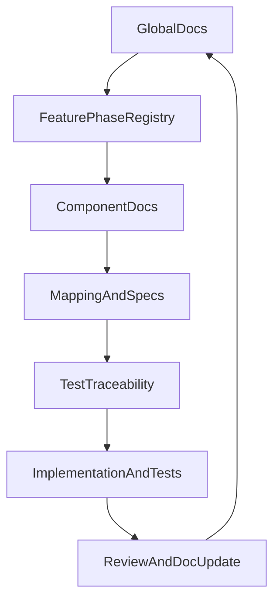

> **Plan status:** **Completed** — Phase 1 is delivered under [`product-docs/`](../../../../product-docs/README.md): full folder skeleton, 10 reusable templates, 8 global pack documents (including the PRD retrofit into [`product-docs/global/product-intent.md`](../../../../product-docs/global/product-intent.md)), and component packs for Admin UI, Admin API, and Mobile. Cross-linking between the global feature catalog and component packs is in place, along with the governance rules in [`product-docs/GOVERNANCE.md`](../../../../product-docs/GOVERNANCE.md). Phase 2 (iterative enrichment through interviews and codebase re-discovery) is deliberately scoped out of this plan and continues as standalone work.

# Ezkey Documentation System Plan

## Objective
Build a unified documentation architecture that supports human + AI collaboration with a spec-first, test-driven workflow, while staying simple enough to reuse in another monorepo.

## Baseline We Reuse
- Global product intent and scope already live in [`README.md`](README.md), [`PRD.md`](PRD.md), [`docs/ARCHITECTURE.md`](docs/ARCHITECTURE.md), and [`docs/ENDPOINT.md`](docs/ENDPOINT.md).
- Lifecycle and governance foundations already exist in [`docs/LIFECYCLE_GOVERNANCE.md`](docs/LIFECYCLE_GOVERNANCE.md).
- The mobile component already demonstrates a strong structured doc corpus in [`ezkey_mobile/docs/README.md`](ezkey_mobile/docs/README.md).

## Proposed New Documentation Root (Phase 1)
Create a new isolated root folder: [`product-docs/`](product-docs/).

This keeps the current docs untouched while allowing concrete rollout and evaluation.

### Top-Level Structure
- [`product-docs/README.md`](product-docs/README.md): entrypoint, reading order, governance rules, update workflow.
- [`product-docs/global/`](product-docs/global/): product-wide living truth.
- [`product-docs/components/`](product-docs/components/): per-entrypoint documentation packs.
- [`product-docs/templates/`](product-docs/templates/): reusable markdown templates.
- [`product-docs/glossary.md`](product-docs/glossary.md): canonical vocabulary and naming conventions.

## Global Documentation Pack
Inside [`product-docs/global/`](product-docs/global/):

- `product-intent.md` (retrofit from [`PRD.md`](PRD.md), adapted to new template).
- `roadmap.md` (major product steps and sequencing).
- `features-and-phases.md` (feature catalog, phase links, lifecycle state).
- `architecture-overview.md` (patterns, principles, key boundaries).
- `architecture-decisions.md` (decision log with rationale and constraints).
- `design-principles.md` (cross-product design principles).
- `lifecycle-model.md` (entity relationships and lifecycle rules; linked from [`docs/LIFECYCLE_GOVERNANCE.md`](docs/LIFECYCLE_GOVERNANCE.md)).
- `spec-test-traceability.md` (feature -> spec -> test mapping matrix and status).

## Component Documentation Pack (Reusable Pattern)
Create the same documentation skeleton in:
- [`product-docs/components/admin-ui/`](product-docs/components/admin-ui/)
- [`product-docs/components/admin-api/`](product-docs/components/admin-api/)
- [`product-docs/components/mobile/`](product-docs/components/mobile/)

Each component gets:
- `README.md` (scope, boundaries, links to global feature/phase entries).
- `stack-and-architecture.md`
- `functional-flows.md`
- `data-model-and-persistence.md`
- `screens-and-wireflow.md` (only for UI/mobile-facing components)
- `api-and-boundary-mappings.md`
- `exception-and-error-model.md`
- `design-decisions.md`
- `spec-test-traceability.md`

## Template Palette (Simple, Spec-First)
In [`product-docs/templates/`](product-docs/templates/), provide templates for:
- Product intent (PRD-style, concise).
- Roadmap and phase planning.
- Feature brief (intent, scope, acceptance, dependencies).
- Architecture decision record (decision, alternatives, consequences).
- Functional workflow (nominal + exception paths).
- Mapping matrix (internal model <-> API DTO <-> external contract).
- Error/exception handling matrix.
- Persistence and lifecycle model.
- Screen/wireflow (for UI/mobile).
- Spec-test traceability matrix.

All templates enforce:
- explicit intent section,
- assumptions and constraints,
- boundary mapping,
- exception/error handling,
- verifiable acceptance criteria,
- links to specs and tests.

## Linking Model (Global <-> Components <-> Tests)

## Phase 1 Execution Scope (Concrete Deliverables)
- Create `product-docs` root and full folder structure.
- Add all templates in `product-docs/templates`.
- Retrofit and duplicate current PRD content into `product-docs/global/product-intent.md`.
- Instantiate minimal but real content for:
  - Admin UI pack (seeded from [`ezkey-admin-ui/README.md`](ezkey-admin-ui/README.md) and [`docs/ADMIN_UI.md`](docs/ADMIN_UI.md)).
  - Admin API pack (seeded from [`ezkey-admin-api/README.md`](ezkey-admin-api/README.md) and [`docs/ENDPOINT.md`](docs/ENDPOINT.md)).
  - Mobile pack (seeded from [`ezkey_mobile/README.md`](ezkey_mobile/README.md) and [`ezkey_mobile/docs/README.md`](ezkey_mobile/docs/README.md)).
- Keep content intentionally lightweight in phase 1: foundation over completeness.

## Phase 2 Execution Scope (Iterative Reconstruction)
- Iteratively enrich docs through stakeholder interviews and codebase re-discovery.
- Reconstruct missing mappings, workflows, and decisions from living code and archived context.
- Validate all reconstructed decisions with product owner before marking as current truth.
- Expand spec-test traceability so each active feature has explicit acceptance + test linkage.

## Governance Rules for Healthy Human + AI Collaboration
- One canonical location per concept (avoid duplicate truths).
- Every feature entry references: intent, phase, mappings, exceptions, and tests.
- Every architecture/design decision has rationale and constraints.
- Templates stay small and opinionated; no ceremony without value.
- Documentation updates are required when behavior, contracts, or workflows change.

## Acceptance Criteria for This Plan
- New isolated `product-docs` structure exists and is navigable.
- Template palette exists and is reusable outside Ezkey.
- PRD retrofit is complete in new structure.
- Admin UI, Admin API, and Mobile each have instantiated documentation packs with minimal seeded content.
- Global-to-component linking and spec-test traceability are present and demonstrable.