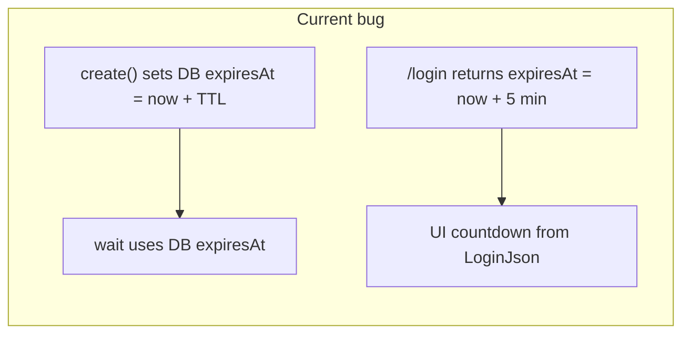

**Archive note:** This plan is **completed**: implemented in the codebase, validated by the maintainer (manual and automated tests). Moved to `.cursor/plans/archived/` as the final location.

# Admin login vs passwordless-wait: expiry alignment

## Root cause (confirmed in code)

| Layer                      | Behaviour                                                                                                                                                                                                                                                                                                                                                                                                                        |
| -------------------------- | -------------------------------------------------------------------------------------------------------------------------------------------------------------------------------------------------------------------------------------------------------------------------------------------------------------------------------------------------------------------------------------------------------------------------------- |
| **Persistence**            | `[AuthAttemptService.create](ezkey-core/src/main/java/org/ezkey/authattempt/service/AuthAttemptService.java)` sets `expiresAt = now + ttlSeconds` where `ttlSeconds` comes from `[EzkeyCoreProperties.AuthAttempt](ezkey-core/src/main/java/org/ezkey/config/EzkeyCoreProperties.java)` (`ezkey.core.auth-attempt.ttl-seconds`, **default 120**, min 30, max 600).                                                               |
| **Login pending response** | `[AdminAuthService.authenticatePasswordless](ezkey-admin-api/src/main/java/org/ezkey/admin/service/AdminAuthService.java)` builds `AdminLoginResponseDto.pendingPasswordless(..., OffsetDateTime.now().plusMinutes(5))` in **both** challenge and non-blocking branches — **ignores** the create response.                                                                                                                       |
| **Wait / polling**         | `[AuthAttemptWaitService](ezkey-core/src/main/java/org/ezkey/authattempt/service/AuthAttemptWaitService.java)` marks `EXPIRED` when `now.isAfter(authAttempt.getExpiresAt())` (DB truth). `[AdminAuthService.waitForPasswordlessAuth](ezkey-admin-api/src/main/java/org/ezkey/admin/service/AdminAuthService.java)` uses `AuthAttemptWaitRequest(300, 2)` — 300s is only a **ceiling**; expiry is detected earlier from the row. |

So the symptom you saw (countdown still showing several minutes while `/passwordless-wait` returns **Authentication Expired**) is **not** a mismatch between wait parameters and polling: it is `**expiresAt` in the `/login` JSON being wrong** relative to the stored attempt. The admin UI (`[login.tsx](ezkey-admin-ui/src/pages/login.tsx)`) correctly derives the countdown from `result.expiresAt`; it does not need a logic change once the API tells the truth.

## In scope (deliver together)

### 1. Pending `expiresAt` in `/login`

After `authAttemptTxHelper.createAuthAttempt(attemptReq)`, pass `**attemptResponse.getExpiresAt()**` into `AdminLoginResponseDto.pendingPasswordless(...)` instead of `OffsetDateTime.now().plusMinutes(5)` for:

- challenge branch (lines ~233–239)
- non-blocking branch (lines ~251–257)

`AuthAttemptCreateResponse` already exposes `[getExpiresAt()](ezkey-core/src/main/java/org/ezkey/authattempt/domain/AuthAttemptCreateResponse.java)` and `[getTimeoutSeconds()](ezkey-core/src/main/java/org/ezkey/authattempt/domain/AuthAttemptCreateResponse.java)` — aligned with the DB row.

### 2. Harmonise `AuthAttemptWaitRequest` timeout with attempt TTL (in scope)

Replace hardcoded `new AuthAttemptWaitRequest(300, 2)` with a **timeout** derived from the same attempt window:

- Use `**timeoutSeconds`** from the create response (`attemptResponse.getTimeoutSeconds()`), or an equivalent computation from `expiresAt - now` if refactoring prefers a single source.
- **Cap** at **300** seconds to satisfy `[AuthAttemptWaitService.validateWaitRequest](ezkey-core/src/main/java/org/ezkey/authattempt/service/AuthAttemptWaitService.java)` (max 300).
- Optionally add a **small slack** (e.g. +15–30s) for clock skew, still capped at 300 — keep the slack minimal so the HTTP wait does not exceed the intended window by much.

Apply in:

- **Blocking** branch of `authenticatePasswordless` (after create)
- `**waitForPasswordlessAuth`**: load the attempt or reuse `timeoutSeconds` from create — today `waitForPasswordlessAuth` only has `authAttemptId`; use `**authAttempt.getExpiresAt()`** vs `now` to compute remaining seconds, or `min(300, ttlSecondsFromRow)` so the wait ceiling tracks the persisted row without hardcoding 300.

**Note:** `waitForPasswordlessAuth` does not have `attemptResponse` in scope; compute wait timeout from the loaded `**AuthAttempt`** entity (same `expiresAt` as DB) or a small private helper `waitTimeoutSeconds(OffsetDateTime expiresAt)` shared with the blocking path.

**Edge case (document in code comment or `docs/ENDPOINT.md` snippet):** If `ezkey.core.auth-attempt.ttl-seconds` is set **above 300** (allowed up to 600), the wait service still **caps at 300s**. A client could receive **408** while the attempt remains valid in DB. Call this out explicitly so operators are not surprised.

### 3. Tests / mocks / OpenAPI

- Update any tests that assume a 5-minute pending expiry (e.g. `[AuthAttemptControllerTest](ezkey-admin-api/src/test/java/org/ezkey/admin/controller/AuthAttemptControllerTest.java)` fixtures).
- Add or extend tests so **wait timeout** behaviour is covered (e.g. helper returns `min(300, ttl)`; edge case when TTL > 300 if testable without flakiness).
- Adjust `@Schema` / Javadoc on `[AdminLoginResponseDto](ezkey-admin-api/src/main/java/org/ezkey/admin/dto/response/AdminLoginResponseDto.java)` for pending `expiresAt` (matches configured TTL, not a fixed 5 minutes).

## Out of scope for this fix (future task notes)

- **Optional per-request TTL on admin login** — not in `[AdminLoginRequestDto](ezkey-admin-api/src/main/java/org/ezkey/admin/dto/request/AdminLoginRequestDto.java)` today; `[AuthAttemptCreateRequest](ezkey-core/src/main/java/org/ezkey/authattempt/domain/AuthAttemptCreateRequest.java)` has no optional TTL. Integration API `[AuthAttemptCreateRequestDto](ezkey-integration-api/src/main/java/org/ezkey/authattempt/dto/AuthAttemptCreateRequestDto.java)` also has no client TTL — everything uses global config. A later feature would add `requestedTtlSeconds`, validate `min ≤ x ≤ max` against the same bounds as `EzkeyCoreProperties`, and thread it into `AuthAttemptService.create`.
- **Integration API parity** — create response already returns `expiresAt` / `timeoutSeconds`; no duplicate bug there. Reuse the same TTL story when adding optional client TTL.

## Verification

- Manual: `POST /api/v1/admin/auth/login` with `nonBlocking: true` — `expiresAt` should match `created + ezkey.core.auth-attempt.ttl-seconds` (check DB or compare to `timeoutSeconds` if exposed on create elsewhere).
- Unit: `mvn spotless:apply` then `mvn test` for affected modules (`ezkey-admin-api`, `ezkey-core` if touched); include coverage for **wait timeout derivation** (not only `expiresAt` JSON).
- Functional tests in `ezkey-tests` that perform admin passwordless flow should still pass once JSON and wait behaviour match reality.

