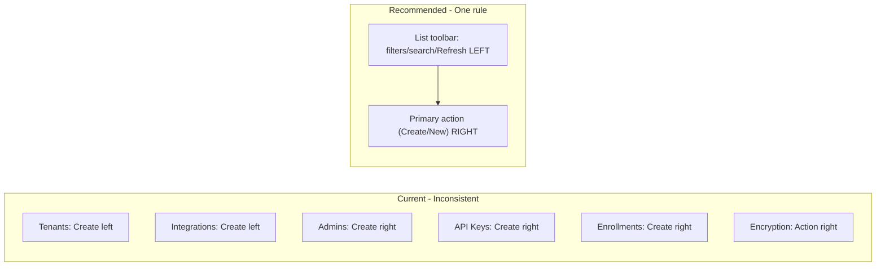

# Admin UI — Action Button Placement Consistency

## 1. Current state (inventory)

### List pages with a primary "Create / New" action

| Page                                                                | Primary action     | Position  | Implementation                                                              |
| ------------------------------------------------------------------- | ------------------ | --------- | --------------------------------------------------------------------------- |
| [tenants.tsx](ezkey-admin-ui/src/pages/tenants.tsx)                 | Create Tenant      | **Left**  | First child in `flex gap-3` toolbar (line 266)                              |
| [integrations.tsx](ezkey-admin-ui/src/pages/integrations.tsx)       | Create Integration | **Left**  | First child in `flex gap-3` toolbar (line 161)                              |
| [admins.tsx](ezkey-admin-ui/src/pages/admins.tsx)                   | New Admin          | **Right** | `justify-between`: Refresh left, New Admin right (lines 599–609)            |
| [api-keys.tsx](ezkey-admin-ui/src/pages/api-keys.tsx)               | New API Key        | **Right** | `ml-auto` on the Create button (lines 519–544)                              |
| [enrollments.tsx](ezkey-admin-ui/src/pages/enrollments.tsx)         | New Enrollment     | **Right** | `ml-auto` on the Create button (lines 377–380)                              |
| [encryption-keys.tsx](ezkey-admin-ui/src/pages/encryption-keys.tsx) | Rotate Key         | **Right** | `justify-between`: description left, Refresh + Rotate right (lines 606–618) |

### Detail / section level

| Screen                                                                    | Context                                    | Primary action | Position                                |
| ------------------------------------------------------------------------- | ------------------------------------------ | -------------- | --------------------------------------- |
| [integration-detail.tsx](ezkey-admin-ui/src/pages/integration-detail.tsx) | "Enrollments for this Integration" section | New Enrollment | **Right** (`justify-between`, line 218) |

### Read-only list pages (no create)

- **Auth Attempts**, **Audit Logs**: only filters + Refresh; Refresh uses `ml-auto` (right). No primary "create" action.

### Dialogs (form footers)

All create/edit dialogs use the same pattern: **Cancel (left) + Submit (right)** with `flex justify-end` or `flex gap-2 justify-end`. This is already consistent and matches the usual "primary on the right" pattern in modals.

---

## 2. Summary of the inconsistency

- **Left (2):** Tenants, Integrations.
- **Right (4 + 1 section):** Admins, API Keys, Enrollments, Encryption Keys, and the "New Enrollment" block on Integration detail.

So the majority of list/section toolbars already place the **primary action on the right**. The exception is Tenants and Integrations, where the Create button is on the **left**, which creates the incoherence you observed.

---

## 3. UX principles that apply

### 3.1 Consistency first

The main rule for this kind of UI is **one rule, applied everywhere**. Same type of screen (list with filters + primary action) should behave the same so admins can build a stable mental model.

### 3.2 Common patterns for list toolbars

- **Filters / context on the left**, **primary action on the right** is a common pattern: users narrow the list (filters, search), then perform the main action (Create / New). The "action" is the natural end of the flow, so placing it on the right is consistent with reading order and with many admin UIs (e.g. Material, many SaaS back offices).
- **Modals / dialogs**: Primary action (Submit / Create) on the **right** is the usual convention; your dialogs already follow this.
- **Page-level toolbars**: Aligning the main action to the **right** and keeping filters/search on the left keeps a clear separation: "refine" vs "do the main thing," and matches the majority of your current screens.

### 3.3 What to standardize

- **List pages**: One rule for "Create / New / primary action" (e.g. "always right").
- **Section headers** (e.g. Integration detail): Same rule as list pages when the section has a primary action (e.g. "New Enrollment" right).
- **Dialogs**: Keep current pattern (Cancel left, primary Submit/Create right); no change needed.

---

## 4. Recommended rule (for coherence)

**Rule:** On list and list-like toolbars (page or section), put the **primary action (Create / New / Rotate, etc.) on the right**. Keep filters, search, and secondary actions (e.g. Refresh) on the left or before the primary action.

Rationale:

1. **Aligns with the majority** of your screens (Admins, API Keys, Enrollments, Encryption Keys, Integration detail section).
2. **Aligns with dialogs**: primary on the right in modals; same idea on the page.
3. **Matches common admin UX**: filters left, main CTA right.
4. **Single, easy-to-remember rule**: "Primary action right on list toolbars."

---

## 5. Concretely: what to change

To apply the rule everywhere:

1. **Tenants** ([tenants.tsx](ezkey-admin-ui/src/pages/tenants.tsx))
  - Move "Create Tenant" from first position to the right of the toolbar.
  - Same structure as API Keys / Enrollments: filters + Refresh first, then the Create button with `ml-auto` (or use `justify-between` with a left group for filters/Refresh and the button on the right).
2. **Integrations** ([integrations.tsx](ezkey-admin-ui/src/pages/integrations.tsx))
  - Move "Create Integration" from first position to the right.
  - Same approach: search + status filter + Refresh on the left, "Create Integration" on the right (`ml-auto` or `justify-between`).

No change to: Admins, API Keys, Enrollments, Encryption Keys, Integration detail section, or dialog footers.

---

## 6. Optional: document the rule

To avoid future drift, add a short note in [AGENTS.md](ezkey-admin-ui/AGENTS.md) (or a dedicated UX/UI conventions doc), for example:

- **List toolbar:** Primary action (Create / New / main CTA) is always on the **right** (e.g. `ml-auto` or right group in `justify-between`). Filters, search, and Refresh stay left or before it.
- **Dialogs:** Cancel (or secondary) left, primary Submit/Create right (`justify-end`).

---

## 7. Diagram (current vs recommended)

**Bottom line:** The rule that best restores coherence is **"primary action always on the right"** on list (and list-like) toolbars. Apply it by moving the Create button to the right on Tenants and Integrations only; leave the other screens and all dialog footers as they are.
