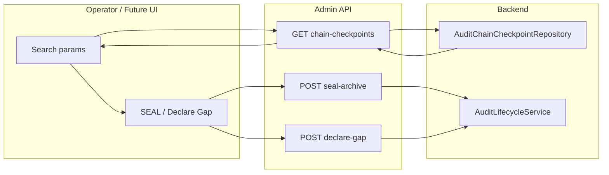

# Audit Chain Checkpoints Search API — Analysis and Design

## 1. Context and Problem

- **Current state:** Audit chain checkpoints are stored in `ezkey_audit_chain_checkpoint` and used by SEAL and Declare Gap. There is **no API** to list or search checkpoints; operators without DB access have no visibility.
- **Existing APIs:** `GET /api/v1/audit-logs/chain-integrity`, `POST .../lifecycle/seal-archive`, `POST .../lifecycle/declare-gap` already exist and are tested. SEAL supports both timestamp mode and **checkpoint ID mode** (ergonomic when IDs are known); Declare Gap supports **anchor checkpoint mode** (`anchorCheckpointId`).
- **Goal:** A **paginated search API** for checkpoints so operators can (1) see the checkpoint timeline, (2) choose ranges for SEAL, and (3) identify the last checkpoint before a gap for Declare Gap — all via the console/API.

---

## 2. Table and Entity Summary

Source: [V34__create_audit_chain_checkpoint.sql](ezkey-core/src/main/resources/db/migration/V34__create_audit_chain_checkpoint.sql), [V35__audit_chain_checkpoint_lifecycle.sql](ezkey-core/src/main/resources/db/migration/V35__audit_chain_checkpoint_lifecycle.sql), [AuditChainCheckpoint.java](ezkey-core/src/main/java/org/ezkey/audit/integrity/AuditChainCheckpoint.java).

| Column / Attribute | Type            | API relevance                                                                 |
| ------------------ | --------------- | ----------------------------------------------------------------------------- |
| `checkpoint_id`    | BIGINT PK       | **Essential** — SEAL (checkpointIdFrom/To), Declare Gap (anchorCheckpointId). |
| `window_start`     | TIMESTAMPTZ     | **Essential** — Date range filter + display; SEAL period.                     |
| `window_end`       | TIMESTAMPTZ     | **Essential** — Display; boundary for gap.                                    |
| `entry_count`      | INT             | **Essential** — Filter “empty” vs “with entries”; operability.                |
| `first_entry_id`   | BIGINT nullable | **Useful** — Span of audit log IDs in window.                                 |
| `last_entry_id`    | BIGINT nullable | **Useful** — Span of audit log IDs in window.                                 |
| `entries_digest`   | VARCHAR(88)     | **Optional** — Verification/forensics; can include in response.               |
| `prev_chain_hmac`  | VARCHAR(88)     | **Optional** — Chain linkage; include for completeness.                       |
| `chain_hmac`       | VARCHAR(88)     | **Important** — Archive manifest reference (SEAL result); include.            |
| `created_at`       | TIMESTAMPTZ     | **Useful** — When checkpoint was created; sort/filter.                        |
| `checkpoint_type`  | VARCHAR(20)     | **Essential** — REGULAR / ARCHIVE_SEAL / GAP_DECLARATION; filter + display.   |
| `notes`            | TEXT nullable   | **Essential** — Justification for lifecycle checkpoints; display.             |

**Recommendation:** Expose all fields in the response DTO. Digest/HMACs are needed for archive manifests and chain verification context; payload size is acceptable for a Global-Admin-only, paginated list.

---

## 3. Search API Design

### 3.1 Endpoint and Placement

- **Path:** `GET /api/v1/audit-logs/chain-checkpoints`
Keeps all audit/chain operations under the same resource ([AuditLogController](ezkey-admin-api/src/main/java/org/ezkey/admin/controller/AuditLogController.java)); no new top-level resource.
- **Authorization:** `@PreAuthorize("hasRole('GLOBAL_ADMIN')")` — same as chain-integrity and lifecycle endpoints. Not relevant for Tenant Admin.

### 3.2 Pagination and Sort

- **Mechanism:** Spring `Pageable` (query params `page`, `size`, `sort`), consistent with [GET /api/v1/audit-logs](ezkey-admin-api/src/main/java/org/ezkey/admin/controller/AuditLogController.java) and other list endpoints.
- **Default:** `page=0`, `size=20`, `sort=windowStart,asc` (chronological). Allow `sort=checkpointId`, `windowStart`, `windowEnd`, `entryCount`, `createdAt`, `checkpointType` with `asc`/`desc`.

### 3.3 Query Parameters (Filters)

| Parameter           | Type     | Semantics                           | Rationale                                                                |
| ------------------- | -------- | ----------------------------------- | ------------------------------------------------------------------------ |
| `windowStartAfter`  | ISO-8601 | `window_start >= value` (inclusive) | Date range: target oldest periods for SEAL.                              |
| `windowStartBefore` | ISO-8601 | `window_start < value` (exclusive)  | Align with existing `chain-integrity` (from/to).                         |
| `entryCountMin`     | int      | `entry_count >= value`              | e.g. `entryCountMin=1` ‚Üí only windows with entries.                      |
| `entryCountMax`     | int      | `entry_count <= value`              | e.g. `entryCountMax=0` ‚Üí only empty windows.                             |
| `checkpointType`    | enum     | `checkpoint_type = value`           | REGULAR, ARCHIVE_SEAL, GAP_DECLARATION. Single value (80/20).            |
| `createdAfter`      | ISO-8601 | `created_at >= value` (inclusive)   | Align with UI date presets (“yesterday”, “last week”, etc.).             |
| `createdBefore`     | ISO-8601 | `created_at < value` (exclusive)    | Same as above; consistent with other search endpoints (e.g. audit-logs). |

**Not proposed in v1:** Full-text search on `notes` (rare; 80/20 says skip).

### 3.4 Response Shape

- **Body:** `Page<AuditChainCheckpointResponseDto>` — same pattern as `Page<AuditLogResponseDto>`.
- **DTO fields:** Map 1:1 from entity for clarity and future UI:
  - `checkpointId`, `windowStart`, `windowEnd`, `entryCount`, `firstEntryId`, `lastEntryId`
  - `entriesDigest`, `prevChainHmac`, `chainHmac`
  - `createdAt`, `checkpointType`, `notes`

All timestamps in UTC with Z (per [ENDPOINT.md](docs/ENDPOINT.md)). Consider an enum for `checkpointType` in the API (e.g. `REGULAR`, `ARCHIVE_SEAL`, `GAP_DECLARATION`) for consistency with lifecycle DTOs.

---

## 4. Use Case Support

### 4.1 SEAL

- Operator needs to choose a **range of checkpoints** (e.g. by month) to seal before archiving.
- **Search:** `windowStartAfter=2025-01-01T00:00:00Z`, `windowStartBefore=2025-02-01T00:00:00Z`, `sort=windowStart,asc`.
- **Result:** Paginated checkpoints; operator reads `checkpointId` of first and last and calls seal with `checkpointIdFrom` / `checkpointIdTo`, or uses `periodStart`/`periodEnd` from `windowStart`/`windowEnd` of the first/last item.
- **Entry count filter:** Optional `entryCountMax=0` to review empty windows only; `entryCountMin=1` to focus on windows with activity.

### 4.2 Declare Gap

- Operator needs the **last checkpoint before the gap** to pass as `anchorCheckpointId` (or to know `gapStart = anchor.windowEnd`).
- **Search:** Recent checkpoints: e.g. `windowStartBefore=<now>`, `sort=windowStart,desc`, `size=50`. Operator finds the last “before the hole” (e.g. by visual timeline in future UI).
- **Gap visualization:** No dedicated “gap detection” in the API. The UI can derive gaps from consecutive checkpoints: if `checkpoint[i].windowEnd < checkpoint[i+1].windowStart`, there is a gap. So the search API only needs to return the list; the UI builds the timeline and highlights gaps. **Pragmatic and sufficient.**

---

## 5. Implementation Outline (Backend Only)

- **New DTO:** `AuditChainCheckpointResponseDto` in `ezkey-core` (audit module), with all fields above; use enum for `checkpointType` if one exists or add a small enum in the audit DTO package.
- **Mapper:** MapStruct `AuditChainCheckpoint` ‚Üí `AuditChainCheckpointResponseDto` (in `ezkey-core` or existing audit mapper package).
- **Repository:** Add a method that supports dynamic filters (e.g. `JpaSpecification` or `Query` with optional params) for `windowStartAfter`, `windowStartBefore`, `entryCountMin`, `entryCountMax`, `checkpointType`, `createdAfter`, `createdBefore`. Reuse existing indexes on `window_start`, `created_at`, and `checkpoint_type` (partial index for non-REGULAR in V35).
- **Service:** New method in a suitable service (e.g. `AuditChainCheckpointService` in `ezkey-core`) or extend existing: `findCheckpoints(..., Optional<OffsetDateTime> createdAfter, Optional<OffsetDateTime> createdBefore, Pageable pageable)` returning `Page<AuditChainCheckpoint>` (all filter params optional).
- **Controller:** New method in [AuditLogController](ezkey-admin-api/src/main/java/org/ezkey/admin/controller/AuditLogController.java): `GET /api/v1/audit-logs/chain-checkpoints` with the above query params (including `createdAfter`, `createdBefore`) and `Pageable`; return `Page<AuditChainCheckpointResponseDto>`; `@PreAuthorize("hasRole('GLOBAL_ADMIN')")`.
- **Documentation:** Update [docs/ENDPOINT.md](docs/ENDPOINT.md) and [docs/AUDIT_LOG_INTEGRITY.md](docs/AUDIT_LOG_INTEGRITY.md) with the new endpoint, params, and use cases (SEAL / Declare Gap). Do **not** edit OpenAPI JSON under `specs/` (generated).

---

## 6. Angles Morts and Opportunities

- **Gap detection in API:** Adding a computed “hasGapAfter” or a dedicated “gaps” endpoint would complicate the API. Recommandation: keep search as a simple list; let the UI compute gaps from consecutive `windowEnd` / `windowStart`. Simple and flexible.
- **Summary endpoint:** A separate `GET .../chain-checkpoints/summary` (e.g. oldest/newest window, counts by type) could help dashboards. Not in scope for this phase; can be added later if needed.
- **Sensitivity of HMACs:** Exposing `chain_hmac` / `entries_digest` is acceptable for Global Admin; they are needed for archive manifest and verification context. No change.
- **“Pilier”:** No “pilier” controller was found in the repo; all chain/audit endpoints live under Admin API’s `AuditLogController`. Plan assumes only Admin API.

---

## 7. Clarifications / DÈcisions (resolved)

1. **Path:** **Decided** — `GET /api/v1/audit-logs/chain-checkpoints` (under audit-logs) for consistency.
2. **checkpointType filter:** **Decided** — Single value (REGULAR | ARCHIVE_SEAL | GAP_DECLARATION) for v1.
3. **createdAfter / createdBefore:** **Decided** ? **Included** in v1. Aligns with the UI effort for consistent search criteria and date-range presets (e.g. yesterday, last week); same pattern as other search endpoints (e.g. audit-logs).

---

## 8. Diagram (High-Level Flow)

---

## 9. Deliverables (This Phase)

- New response DTO and mapper for audit chain checkpoints.
- Repository method(s) with optional filters (window range, entry count, type).
- Service layer for paginated search.
- New GET endpoint in AuditLogController (Global Admin only), with OpenAPI annotations.
- Unit tests for service and controller; optional integration test calling the new GET.
- Doc updates (ENDPOINT.md, AUDIT_LOG_INTEGRITY.md). No UI work; no change to OpenAPI spec files under `specs/` (maintainer runs update-specs after build).

