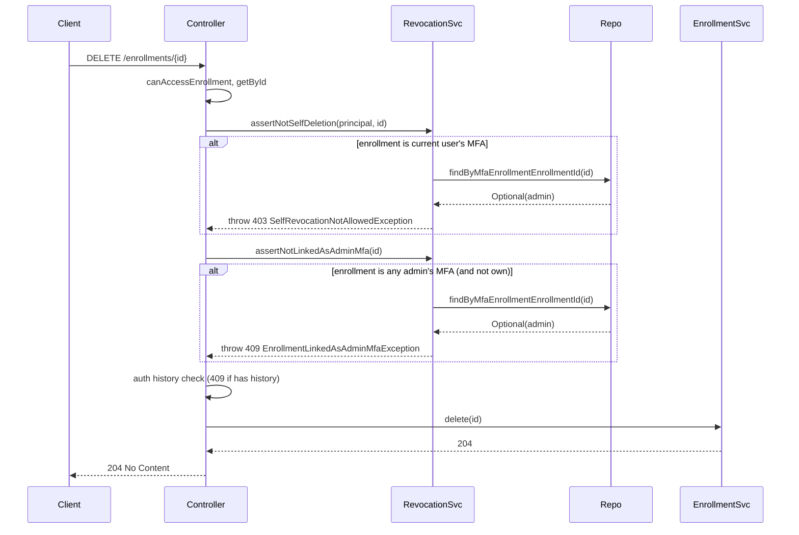

# Enrollment delete: proper API error when linked as admin MFA

## Problem

When deleting an enrollment in the Tenant UI, the user gets:

```text
org.hibernate.TransientPropertyValueException: Persistent instance of 'org.ezkey.integration.domain.entity.EzkeyAdmin' references an unsaved transient instance of 'org.ezkey.enrollment.domain.entity.Enrollment' (persist the transient instance before flushing) [org.ezkey.integration.domain.entity.EzkeyAdmin.mfaEnrollment -> org.ezkey.enrollment.domain.entity.Enrollment]
```

**Reproduction:** Create a new tenant admin (which creates an MFA enrollment for that admin), then navigate to that enrollment and click Delete (e.g. "Yes delete"). The error occurs when the **caller is not the owner** of the enrollment (e.g. a Global Admin or another admin with access deletes the newly created tenant admin's MFA enrollment).

**Root cause:** The delete flow only blocks "delete your **own** MFA enrollment" (403 via `assertNotSelfDeletion`). It does **not** block "delete an enrollment that is **another** admin's MFA". When we call `enrollmentRepository.deleteById(id)` in that case:

- The enrollment is referenced by `ezkey_admin.mfa_enrollment_id` (FK in [V2__add_multi_tenant_security.sql](ezkey-core/src/main/resources/db/migration/V2__add_multi_tenant_security.sql)).
- Either Hibernate flushes in an order that produces the TransientPropertyValueException, or the DB would raise a FK violation. In both cases the API exposes an internal error instead of a clear business rule.

## Desired behavior

- **Own MFA enrollment:** Already correct — 403 "Cannot delete your own MFA enrollment. Use the recovery flow to reset it." (no change).
- **Another admin's MFA enrollment:** Detect before delete and return **409 Conflict** with an RFC 9457 problem detail, e.g. "Enrollment cannot be deleted because it is linked as an administrator's MFA. Use the recovery flow to reset that admin's MFA first."
- No call to `enrollmentService.delete(id)` when the enrollment is any admin's `mfaEnrollment`, so the Hibernate/DB error never occurs.

## Approach

1. **Guard before delete:** After `assertNotSelfDeletion`, add a check: if this enrollment is **any** admin's MFA enrollment (using existing `EzkeyAdminRepository.findByMfaEnrollmentEnrollmentId(enrollmentId)`), throw a dedicated exception so the API returns 409 with a clear message.
2. **Exception and handler:** Either reuse [EnrollmentCannotBeDeletedException](ezkey-admin-api/src/main/java/org/ezkey/admin/exception/EnrollmentCannotBeDeletedException.java) with a different message (simplest), or introduce a new exception and problem type (e.g. `cannot-delete-linked-as-admin-mfa`) for clearer client discrimination; the plan below uses a **new exception and problem type** for a clean API contract.
3. **Order of checks in [EnrollmentController.delete()](ezkey-admin-api/src/main/java/org/ezkey/admin/controller/EnrollmentController.java):** Keep: access check → getById → assertNotSelfDeletion (403) → **new: assertNotLinkedAsAdminMfa (409)** → auth history check (409) → audit → delete.

## Key files


| File                                                                                                                       | Role                                                                                                                      |
| -------------------------------------------------------------------------------------------------------------------------- | ------------------------------------------------------------------------------------------------------------------------- |
| [EnrollmentController.java](ezkey-admin-api/src/main/java/org/ezkey/admin/controller/EnrollmentController.java)            | Add call to new guard before delete; keep existing 403/404/409 flow.                                                      |
| [EnrollmentRevocationService.java](ezkey-admin-api/src/main/java/org/ezkey/admin/service/EnrollmentRevocationService.java) | Add `assertNotLinkedAsAdminMfa(enrollmentId)` that throws if `findByMfaEnrollmentEnrollmentId(enrollmentId).isPresent()`. |
| [EzkeyAdminRepository.java](ezkey-core/src/main/java/org/ezkey/integration/domain/repository/EzkeyAdminRepository.java)    | Already has `findByMfaEnrollmentEnrollmentId`; no change.                                                                 |
| New exception (e.g. `EnrollmentLinkedAsAdminMfaException`)                                                                 | Thrown when enrollment is any admin's MFA (optional if reusing `EnrollmentCannotBeDeletedException`).                     |
| [EnrollmentExceptionHandler.java](ezkey-admin-api/src/main/java/org/ezkey/exception/EnrollmentExceptionHandler.java)       | Handle new exception with 409 and problem type `https://ezkey.io/problems/enrollment/cannot-delete-linked-as-admin-mfa`.  |


## Implementation outline

1. **EnrollmentRevocationService**
  - Add method `assertNotLinkedAsAdminMfa(Integer enrollmentId)`: if `adminRepository.findByMfaEnrollmentEnrollmentId(enrollmentId).isPresent()`, throw (e.g. `EnrollmentLinkedAsAdminMfaException` or `EnrollmentCannotBeDeletedException` with message stating the enrollment is linked as an admin's MFA and recovery flow must be used first).
  - Call it from the same place conceptually as `assertNotSelfDeletion` (guard before delete). The controller will call both: first `assertNotSelfDeletion` (403 for own), then `assertNotLinkedAsAdminMfa` (409 for any admin's MFA). So when the enrollment is the current user's MFA we still return 403; when it is another admin's MFA we return 409.
2. **EnrollmentController.delete()**
  - After `enrollmentRevocationService.assertNotSelfDeletion(principal, id);`, add `enrollmentRevocationService.assertNotLinkedAsAdminMfa(id);`. If you use a new exception, it will be thrown only when the enrollment is **another** admin's MFA (when it's the current user's, we already threw in assertNotSelfDeletion). So the new check can simply be: if any admin has this enrollment as mfaEnrollment, throw. The first check (assertNotSelfDeletion) already handles the "own" case with 403; the second check handles "other admin's" with 409.
3. **Exception and handler**
  - **Option A (recommended for clarity):** New exception `EnrollmentLinkedAsAdminMfaException` with message like "Enrollment cannot be deleted because it is linked as an administrator's MFA. Use the recovery flow to reset that admin's MFA first." New handler in `EnrollmentExceptionHandler`: 409, type `https://ezkey.io/problems/enrollment/cannot-delete-linked-as-admin-mfa`, title "Enrollment Linked as Admin MFA".
  - **Option B (simpler):** Reuse `EnrollmentCannotBeDeletedException` with the same message; keep existing handler. The response will have the same type/title as "has auth history" but a different `detail`; clients can still show the message.
4. **Tests**
  - Add or extend tests: Global Admin (or Tenant Admin with access) calls `DELETE /enrollments/{id}` for an enrollment that is **another** admin's MFA enrollment → expect 409 and problem detail (no 500, no TransientPropertyValueException).
  - Existing test that Tenant Admin cannot delete **own** MFA enrollment (403) remains unchanged.
5. **Documentation**
  - Update [docs/ENDPOINT.md](docs/ENDPOINT.md) (or equivalent) to document 409 for "enrollment linked as administrator's MFA" for `DELETE /api/v1/enrollments/{id}`. OpenAPI spec is generated from code; ensure `@ApiResponse` for 409 on the delete endpoint mentions this case in description if needed (maintainer runs update-specs after changes).

## Flow summary




## Out of scope

- Changing the DB schema or FK (e.g. ON DELETE SET NULL) for `ezkey_admin.mfa_enrollment_id`; the business rule is to **forbid** deletion of an enrollment that is an admin's MFA, not to allow it and null the reference.
- Tenant UI changes beyond possibly displaying the new 409 message; the fix is API-side so the UI can show the problem detail.

