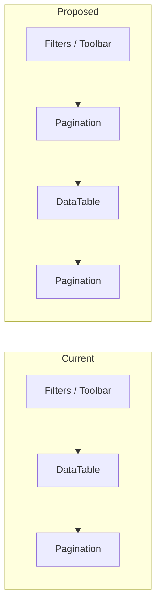

# Pagination UX Review and Improvement Plan

## 1. Current state (verified)

**Shared framework — already in place**

- A single reusable component drives all list pagination: [ezkey-admin-ui/src/components/data-table/pagination.tsx](ezkey-admin-ui/src/components/data-table/pagination.tsx).
- The hook [ezkey-admin-ui/src/hooks/use-paginated-orval.ts](ezkey-admin-ui/src/hooks/use-paginated-orval.ts) provides a consistent `pagination` object; every page passes the same props into `<Pagination>`.
- **Screens using it (uniform pattern):** Tenants, Enrollments, Admins, API Keys, Encryption Keys, Integrations, Integration detail (enrollments), Tenant detail (admins), Auth attempts, Audit logs (main list + checkpoints).

**Icons**

- The component **already uses Lucide icons**: `ChevronsLeft` (first), `ChevronLeft` (prev), `ChevronRight` (next), `ChevronsRight` (last), with **icon + translated text** on each button (e.g. icon + "Première" / "First").

**i18n**

- Pagination strings are in [ezkey-admin-ui/src/locales/en/common.json](ezkey-admin-ui/src/locales/en/common.json) and [ezkey-admin-ui/src/locales/fr/common.json](ezkey-admin-ui/src/locales/fr/common.json) under `pagination` (page, of, total, first, prev, next, last, perPage). No gap identified.

**Placement**

- Pagination is rendered **only once**, **below** the table (`<DataTable />` then `<Pagination />` inside a wrapping `
`). On long lists, the operator must scroll to the bottom to change page.

**Accessibility**

- Buttons have no `aria-label` or `title`; screen readers rely on the visible text only (fine when text is present; would be an issue if we switched to icon-only without labels).

---

## 2. Recommendations (80/20, pragmatic)

### 2.1 Icons and labels

- **Keep icon + text** for the four actions (First, Prev, Next, Last). This is a common, low-risk pattern: clear for all users and already implemented.
- **Optional refinement:** Add **tooltips** (and `aria-label` using the same i18n keys) on the four buttons so that:
  - Hover/focus shows the same label (e.g. "First page") for consistency and for any future icon-only variant.
  - Screen readers get an explicit label on the control.
- **Do not** switch to icon-only by default: it would require tooltips everywhere and more testing for little gain; icon+text is already standard and accessible.

**Conclusion:** Keep current icon+text; add `aria-label` (and optionally Tooltip) using existing `pagination.first` / `pagination.prev` / etc. so behaviour is uniform and accessible.

### 2.2 Placement: top and bottom (uniform)

- **Recommendation:** Render the **same** `<Pagination />` component **twice** on each paginated screen: once **above** the table and once **below**.
- **Rationale:** No new components, no sticky logic, no layout refactor. Same props, two mounts. Operators can change page without scrolling to the bottom; behaviour is consistent across all list screens.
- **Implementation:** In each page, change the structure from:
  - `[DataTable] [Pagination]`
  to:
  - `[Pagination] [DataTable] [Pagination]`
- **Optional encapsulation:** Introduce a small wrapper, e.g. `PaginatedTable`, that takes `columns`, `data`, `pagination`, etc. and renders exactly that (top Pagination + DataTable + bottom Pagination). All pages would use `PaginatedTable` instead of manually composing DataTable + Pagination. This reduces copy-paste and guarantees uniformity; cost is one extra component and a single place to add top+bottom rendering.

**Conclusion:** Prefer adding a **PaginatedTable** (or similar) wrapper that renders Pagination above and below the DataTable, and migrate existing list pages to use it. If you want zero new abstractions, simply duplicate `<Pagination />` above and below the table on each page.

### 2.3 What to avoid (no accidental complexity)

- **Sticky/floating pagination bar:** More layout and scroll logic, edge cases with mobile and nested scroll; not recommended for the 80/20 target.
- **Icon-only without tooltips/aria:** Worse accessibility and clarity; not recommended.
- **Different patterns per screen:** Keep a single pattern (same component, same placement rule) everywhere.

---

## 3. Implementation summary

| Change                                                                                               | Effort | Impact                                         |
| ---------------------------------------------------------------------------------------------------- | ------ | ---------------------------------------------- |
| Add `aria-label` (and optional Tooltip) to the four pagination buttons using existing i18n           | Low    | Accessibility and future-proofing              |
| Render pagination above and below the table (via wrapper or duplicate component) on all list screens | Low    | Better UX on long lists, uniform behaviour     |
| Optional: `PaginatedTable` wrapper (Pagination + DataTable + Pagination)                             | Low    | Single place for layout, guaranteed uniformity |

---

## 4. Suggested implementation order

1. **Pagination component**
  - Add `aria-label={t('pagination.first')}` (and prev/next/last) on each of the four buttons.
  - Optionally wrap each button in `<Tooltip content={t('pagination.first')}>` (or a short "First page" key) for hover/focus.
2. **Placement**
  - Either:
    - **A)** Add a wrapper component (e.g. `PaginatedTable`) that accepts table props + pagination props and renders `Pagination` + `DataTable` + `Pagination`, then refactor list pages to use it; or
    - **B)** On each list page, add a second `<Pagination ... />` above the existing `<DataTable />` (same props as the one below).
3. **i18n**
  - No change required for current labels. If you add tooltips with a phrase like "First page", add keys such as `pagination.firstPage` / `pagination.lastPage` only if you want that wording separate from the button label.
4. **Verification**
  - Smoke-check one list (e.g. Enrollments) for top/bottom pagination and keyboard/screen reader behaviour, then apply the same pattern to the other list screens.

---

## 5. Diagram (current vs proposed)

Same component, same props; only the placement (and optionally a thin wrapper) changes. Icons and i18n stay as they are; accessibility is improved with `aria-label` (and optional tooltips).
