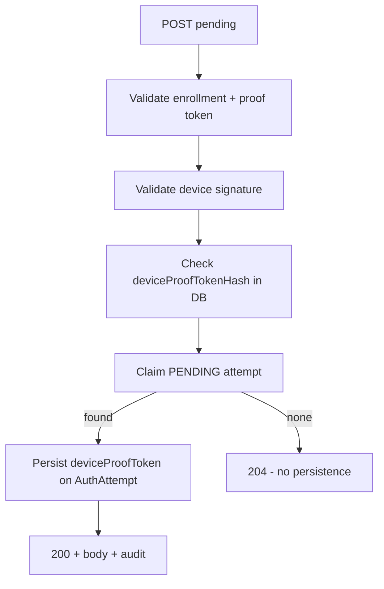

# Pending poll: reuse of signed device proof token (204 path)

**Status:** Implemented and completed. The agreed documentation/Javadoc clarification was merged (`AuthAttemptPendingService`, `AuthAttemptService`, `AuthAttemptRepository`, `docs/ENDPOINT.md`, `ezkey-auth-api/AGENTS.md`); builds/tests were run at implementation time. No product behavior change beyond accurate documentation.

## Decision (approved)

The analysis and **Recommendation** below are **accepted**. The product **keeps** the current behavior (authenticated polling without consuming device proof token uniqueness on 204). **No** Redis, rolling window, or per-poll fresh signed nonce requirement will be introduced for this concern.

**Agreed follow-up:** clarify **Javadoc** on `[AuthAttemptPendingService](c:/github/ezkey/ezkey-core/src/main/java/org/ezkey/authattempt/service/AuthAttemptPendingService.java)` (and any **internal security or API documentation** you maintain, e.g. auth protocol notes) so readers understand that **anti-replay for `deviceProofToken` is enforced when a pending attempt is claimed** (hash persisted on `AuthAttempt`), **not** when the poll returns **204** (no pending). This avoids overstating “Anti-Replay Protection” for the empty-poll path.

After this documentation pass, you can run your usual **generation** workflow (e.g. Spotless, tests, maintainer-driven OpenAPI spec extraction per project rules).

## What the code actually does

In `[AuthAttemptPendingService](c:/github/ezkey/ezkey-core/src/main/java/org/ezkey/authattempt/service/AuthAttemptPendingService.java)`, the flow is:

1. **Validate enrollment** via `enrollmentProofToken` (hash lookup) and **ID match** — this is your main **anti-enumeration** control (no guessing other enrollments by sequential ID alone).
2. **Validate device signature** (Ed25519 over `deviceProofToken` + `deviceProofTokenSigned` vs device public key).
3. **Anti-replay check**: `authAttemptRepository.existsByDeviceProofTokenHash(...)` — this queries **persisted** `[AuthAttempt](c:/github/ezkey/ezkey-core/src/main/java/org/ezkey/authattempt/domain/entity/AuthAttempt.java)` rows (`deviceProofTokenHash`).
4. **Claim**: only if a PENDING attempt is found; on success the service **sets** `deviceProofToken` on the row and moves status to READ.

If step 4 finds nothing, `[NoPendingAuthAttemptException](c:/github/ezkey/ezkey-core/src/main/java/org/ezkey/exception/NoPendingAuthAttemptException.java)` is thrown — **no row is updated**, so **no device proof token hash is stored**. Therefore the same signed `(deviceProofToken, deviceProofTokenSigned)` pair can be sent indefinitely and will keep passing steps 2–3 until a real PENDING attempt exists (then step 3 may fail if that token was already used on a **previous** successful claim elsewhere).

The controller maps “no pending” to **HTTP 204** via `[GlobalExceptionHandler](c:/github/ezkey/ezkey-auth-api/src/main/java/org/ezkey/exception/GlobalExceptionHandler.java)` (no RFC 9457 body). On that path, the **success audit block** in `[AuthAttemptController#pending](c:/github/ezkey/ezkey-auth-api/src/main/java/org/ezkey/auth/controller/AuthAttemptController.java)` does not run (exception exits first), which avoids logging every empty poll as a “found” event.

So your Postman observation is **consistent with the implementation**, not an accident.

---

## Expert opinion: is requiring a fresh signed nonce every poll “worth it”?

### Threat model (what replay would mean here)

- **204 responses carry no authentication material** (no challenge, no integration-signed payload). Replaying the same request does **not** replay a prior “approval” or leak a previous 200-body secret — there is no prior sensitive payload to replay on this branch.
- **Enumeration of other users**: already constrained by **enrollment proof token** + enrollment ID consistency checks, not by rotating the device nonce.
- **Anti-replay where it matters today**: when a PENDING attempt **exists**, claiming it **consumes** the attempt (read-once) and **records** the device proof token hash for global uniqueness across attempts — so **reusing the same device proof token after a successful claim** is meant to fail (subject to what is stored; edge cases like concurrent claims are a separate topic).

So the empty-poll behavior is best understood as: **authenticated polling** (proves possession of device key + valid enrollment binding) **without a state-changing operation** — analogous to **reusing the same OAuth access token** or **same mTLS client identity** on repeated “any new mail?” checks until something changes.

### OWASP-style mapping (pragmatic, not checklist theater)

| Concern                                           | Relevance to 204 reuse                                                                                                                                                                                      |
| ------------------------------------------------- | ----------------------------------------------------------------------------------------------------------------------------------------------------------------------------------------------------------- |
| **Broken authentication**                         | Mitigated: request is still **cryptographically authenticated** (signature + enrollment proof token).                                                                                                       |
| **Replay of a sensitive operation**               | **Low**: 204 is not a successful “get challenge” in terms of delivered secrets; the meaningful replay surface is the **200** path, which is tied to claim + stored nonce rules.                             |
| **Unrestricted resource consumption (API abuse)** | **Primary control** is **rate limiting** (per endpoint/IP/device identity as you implement it) + infrastructure (e.g. CDN/WAF). Forcing new nonces **does not** reduce request volume; it adds client work. |
| **Enumeration**                                   | Addressed by **proof token design**, not by per-poll nonce rotation.                                                                                                                                        |

### Comparable patterns

- **OAuth 2.0 Device Authorization Grant**: the client polls the token endpoint with the **same** `device_code` until authorization completes — reuse until resolution is normal.
- **Push-notification-free MFA apps** that **poll** with a stable device credential: common pattern; freshness is usually enforced on **challenge consumption** or **time-bounded session**, not on every empty poll.

### SOC 2

SOC 2 does **not** prescribe “unique signed nonce per no-op poll.” Auditors care that **logical access**, **monitoring**, and **incident** controls exist and operate; they do not grade this level of API nuance unless you claim a specific control in your policies that this would violate (you typically would not).

---

## Your Redis / rolling-window idea — cost vs benefit

**Benefit**: marginally stronger story that “every HTTPS request used a fresh random,” mostly relevant if you treat empty polls as **state-changing** (they are not in Ezkey today).

**Costs**:

- **Operational**: Redis (or equivalent), TTL tuning, failure modes, multi-region consistency if ever needed.
- **Abuse**: a compromised key can still spam **unique** nonces at the **rate limit**; storage fills with “seen” values at **rate limit × window** (your reasoning is directionally correct).
- **Client**: more CPU/battery (new key + sign every interval) for **no user-visible security gain** on an empty result.

For most products, **rate limiting + TLS + cryptographic authentication** on the poll is the proportionate bundle; **nonce rotation per empty poll** is usually **security theater** unless you have a **specific** threat (e.g. you must prove freshness to a third party, or empty polls are billable and must be non-replayable).

---

## Recommendation

1. **Accept the current behavior** as **reasonable and aligned with common practice**: anti-replay is enforced where **server state** changes (claim + persistence of device proof token hash), not on **authenticated no-op** polls. **(Approved — see [Decision](#decision-approved) above.)**
2. **Keep relying on** rate limiting + optional WAF for volume abuse; treat **compromised device keys** as a **key compromise** problem (revocation/rotation), not a nonce-store problem.
3. **Align documentation** so it does not over-claim: `[AuthAttemptPendingService](c:/github/ezkey/ezkey-core/src/main/java/org/ezkey/authattempt/service/AuthAttemptPendingService.java)` javadoc lists “Anti-Replay Protection” globally — **implement** clarification that **empty polls do not consume** the device proof token uniqueness constraint until a pending attempt is **claimed** (Javadoc + any relevant docs; **approved** as the sole engineering follow-up).

**When to revisit**: if you ever add **side effects** on the 204 path (billing per poll, strict freshness proofs for compliance, or observable differences that increase enumeration risk), re-evaluate a **short-lived poll session** or **server-issued challenge** — still prefer **time-bounded tokens** over unbounded nonce stores.

---

## No mandatory product change

This analysis does **not** require implementing Redis or per-poll unique signed tokens for normative “best practice” reasons alone; the alternative you described trades **complexity and abuse surface** for **limited** incremental assurance on a **non-state-changing** response.
